# 遥感语义分割的多模态微调统一框架
# A Unified Framework With Multimodal Fine-Tuning for Remote Sensing Semantic Segmentation

Xianping Ma , Member, IEEE, Xiaokang Zhang , Senior Member, IEEE, Man-On Pun , Senior Member, IEEE, and Bo Huang

**摘要 (Abstract)**—— 从不同传感器获取的多模态遥感数据，提供了对地球表面的全面综合视角。利用多模态融合技术，语义分割能够对地理场景进行详细准确的分析，超越了单一模态的方法。基于视觉基础模型的进步，特别是分割一切模型 (SAM)，本研究提出了一种统一框架，包含一个用于遥感语义分割的新型多模态微调网络 (MFNet)。该框架旨在与各种微调机制无缝集成，通过引入 Adapter 和低秩自适应 (LoRA) 作为代表性示例进行展示。这种可扩展性确保了框架对其他新兴微调策略的适应性，允许模型在有效利用多模态数据的同时保留 SAM 的通用知识。此外，引入了基于金字塔的深度融合模块 (DFM)，以跨多个尺度整合高级地理特征，在解码前增强特征表示。这项工作还凸显了 SAM 在数字地表模型 (DSM) 数据上强大的泛化能力，这是一种新颖的应用。在三个基准多模态遥感数据集（ISPRS Vaihingen、ISPRS Potsdam 和 MMHunan）上的广泛实验表明，所提出的 MFNet 在多模态语义分割中显著优于现有方法，在建立该领域新标准的同时，为未来的研究和应用提供了多功能的通用基础。这项工作的源代码可访问：https://github.com/sstary/SSRS 。

**索引词 (Index Terms)**—— Adapter，低秩自适应 (LoRA)，多模态微调，遥感，分割一切模型 (SAM)，语义分割。

# I. 引言 (INTRODUCTION)

多模态遥感语义分割涉及使用来自多个来源或模态的数据（如光学图像、多光谱图像、高光谱图像和激光雷达 LiDAR）对地面图像中的每个像素进行分类的过程。通过整合不同类型的信息，多模态方法提高了分割的准确性和鲁棒性，特别是在复杂环境中 [1], [2]。该技术利用不同数据类型的互补优势来改善地物识别，使其在土地利用和土地覆盖 [3], [4]、环境监测 [5] 和灾害管理 [6], [7] 等应用中至关重要。近年来，深度学习技术极大地促进了遥感领域多模态融合方法的发展。

最初，卷积神经网络 (CNNs) 是占主导地位的架构，以其通过编码器-解码器框架从不同模态中提取局部空间特征的能力而闻名 [8], [9]。这些早期的基于 CNN 的方法堆叠多模态数据并在各个阶段融合特征，以提高分割性能 [10], [11]。随着基于自注意力的 Transformer [12] 的引入，其在建模全局上下文和长范围依赖方面表现出色，许多将 Transformer 集成到基于 CNN 的方法中的混合模型应运而生。特别是，视觉 Transformer (ViT) [13] 和 Swin Transformer [14] 进一步将 Transformer 引入计算机视觉社区，极大地提高了图像特征提取的能力。将用于详细特征提取的 CNN 与用于捕捉不同数据源之间全局关系的 Transformer 相结合，标志着分割模型进入了一个新阶段 [15], [16], [17]。这种混合方法增强了跨模态和尺度融合信息的能力，从而在复杂场景中产生更准确、鲁棒的分割结果。尽管它们表现良好，但上述模型仅在范围狭窄的特定任务数据上进行训练，限制了它们获取通用视觉知识的能力。相比之下，基础模型得益于大规模且多样化的预训练数据，使其能够发展出超越单一任务限制的广泛视觉表征。

有趣的是，最近大型基础模型的出现为这一挑战提供了解决方案。特别是，分割一切模型 (SAM) [18] 是一种尖端的分割模型，旨在处理跨各种数据集的广泛分割任务。它由三个组件构成：基于 ViT 的图像编码器、提示编码器和掩码解码器。SAM 由 Meta AI 开发，得益于对海量自然图像视觉语料库的大规模训练，这使其能够有效地泛化到未见过的目标。其通用性和稳健的性能使其成为各种应用中有价值的工具 [19], [20]。然而，与自然图像相比，遥感图像由于传感器、分辨率、光谱范围等方面的差异而表现出显著的不同 [21], [22], [23]。对于多模态任务，诸如数字地表模型 (DSM) 等非光学数据进一步增加了这些差异。这提出了一个新的挑战：如何利用从海量自然视觉语料库中获得的 SAM 的能力，来增强多模态遥感任务？图 1 阐明了上面讨论的关键挑战，更为清晰地描绘了本文所要解决的问题。

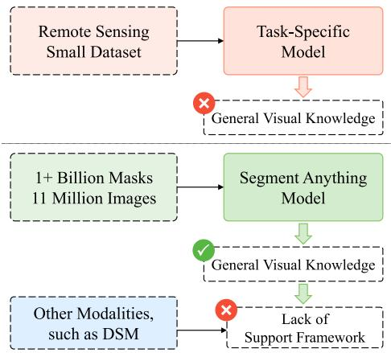  
图 1. (Fig. 1.) 关键挑战示意图：传统的特定任务遥感模型在通用视觉知识上存在局限。相比之下，SAM 包含了来自大规模自然图像语料库的通用知识，但它缺乏支持多模态遥感任务的架构。

现有的微调技术，特别是 Adapter [24], [25], [26] 和低秩自适应 (LoRA) [27], [28]，部分解决了这一挑战。相比于从头训练和全模型微调，这些方法固定了大部分参数，并使用极少的参数来学习特定任务的信息。这种方法实现了参数高效学习，并将大型基础模型成功迁移到更广泛的特定下游任务中，即使在受限的硬件环境下亦是如此。Adapter 的概念最初是在自然语言处理社区 [24] 提出的，作为微调大型预训练模型用于特定下游任务的一种方法。Adapter 核心的思想是引入一个并行的、紧凑且可扩展的自适应模块，在训练期间学习特定任务的知识，同时原始模型分支保持固定，以保留与任务无关的特征知识。类似地，LoRA [27] 引入了可训练的秩分解矩阵来学习特定任务知识。这种方法发挥了特定任务知识和任务无关知识之间的协同作用，从而实现了大型模型的高效微调。

在遥感领域，现有的微调技术大多集中在针对单模态任务调整 SAM [29], [30], [31]。例如，CWSAM [29] 和 MeSAM [30] 对 SAM 的图像编码器进行了适配，并为遥感数据引入了定制的掩码解码器。然而，通过分析 SAM 在三个尺度上的参数分布可以发现，SAM 的大部分参数都集中在其图像编码器中，这表明其绝大部分的通用知识都封装在这个组件中。因此，我们认为没有必要为遥感特定任务去修改 SAM 的提示编码器和掩码解码器，因为这种修改不仅增加了模型适配的复杂性，也阻碍了与现有分割模型的无缝结合。

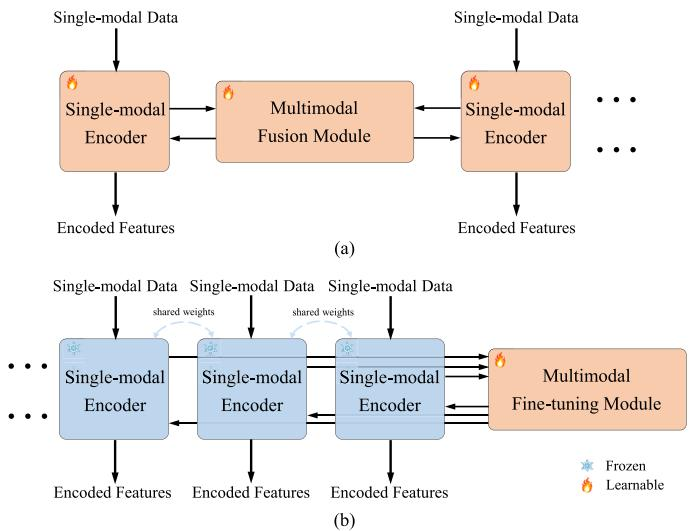  
图 2. (Fig. 2.) (a) 当前的多模态融合方法，以及 (b) 提出的统一多模态微调框架。在我们的方法中，单模态编码器用于学习通用知识并被冻结，使得多模态任务能够从视觉基础模型中受益。

为了解决微调框架面临的上述挑战，我们提出了一种用于多模态数据特征学习与融合的统一多模态微调框架。具体而言，如图 2(a) 所示，现有的多模态融合方法通常为每种模态分配独立的编码器，并通过一个多模态融合模块来执行特征融合 [32], [33], [34]。如果引入额外模态，就必须相应地增加额外的编码器。在训练期间，所有的编码器和融合模块都需要同时进行训练。相比之下，本工作提出的统一多模态微调框架彻底改变了这种结构。如图 2(b) 所示，它利用了基础模型中蕴含的通用知识，并通过多模态微调模块促进模态的学习和融合。在训练阶段，编码器保持固定不变，只需要对多模态微调模块进行优化。该方法不仅充分利用了视觉基础模型，而且在引入额外模态时具备无缝的可扩展性。

在此基础上，为了深入探讨各类微调机制在遥感领域的影响，我们引入了两种多模态微调技术——多模态 Adapter (MMAdapter) 和多模态 LoRA (MMLoRA)，以用于多模态融合的遥感任务。值得注意的是，我们的多模态微调框架代表着一种新颖的特征学习与融合策略，这套策略的运作独立于具体所选用的微调模块。基于 MMAdapter 和 MMLoRA，我们提出了一种具有多种不同图像编码器架构的新型多模态融合方法——多模态微调网络 (MFNet)。此外，MFNet 利用基于金字塔的深度融合模块 (DFM)，对来自 SAM 图像编码器的深层高阶特征执行多尺度处理和融合。对于具有复杂特性的遥感数据来说，这是一种切实有效的解决方案。不仅如此，我们还沿用了一个通用的语义分割解码器 [35]，此举避免了额外的特定任务设计工作，且易于与其他任务领域的解码器进行整合。本研究在以下四个方面做出了主要贡献：

1) 提出了一种统一多模态微调框架，以适应当中对于多模态特征的学习需要。该框架在运行上独立于特定的微调模块设计和数据模态的具体数量。
2) 提出了一种具备可扩展性的多模态融合网络——MFNet，利用 SAM 图像编码器以及提出的多模态微调框架来实行遥感图像的语义分割。这表现为一个精简而又极具适应性弹性的网络，极大地省去了 SAM 里多数冗余的组成模块。
3) 把文献当中最具代表性的两种微调架构——Adapter 同 LoRA 加以运用以验证所提出框架的有效性，并借此首度演示了 SAM 模型处于 DSM 数据上体现出来的强健泛化能力。另外借着基于三大知名的多模态遥感数据集 (ISPRS Vaihingen、ISPRS Potsdam 以及 MMHunan) 进行的大量比对实验证实，所被提出的 MFNet 于多模态语义分割上的性能展现大幅超出了迄今现有的方法，在成为该一研究领域新标杆之余，也为后续跟进的研究与实际应用铺设了多能的运作基底。
4) 据我们所知，作为在探索基于 SAM 进行多模态微调的先行者，本项工作深入地考察了在遥感此一领域内分布最广的两种微调机制的功能角色。此番探索为与其相关联的学术研究铸牢了稳固地基的同时，亦为未来的摸索标明了方向。

本文余下部分的结构安排如下：第二节回顾了多模态融合及 SAM 领域内的相关工作成果。第三节详述了统一样式的多模态微调骨架和 MFNet 的构造情况，第四节随之便围绕繁多的实验与评判进行了详细地汇报兼深度探讨。结尾则落于第五节呈上的相关论断里。

# II. 相关工作 (RELATED WORKS)

## A. 多模态遥感语义分割 (Multimodal Remote Sensing Semantic Segmentation)

语义分割是遥感图像处理中的一个关键预处理步骤，利用多模态信息通常会比依赖单一模态产生更好的结果。近年来，深度学习的出现彻底改变了包括语义分割在内的整个遥感领域。基于经典的编码器-解码器框架 [8], [9]，许多基于 CNN 和 Transformer 的多模态融合方法推动了该领域的显著进步 [15], [16], [33], [36]。ResUNet-a [32] 是一种早期的基于 CNN 的架构，它仅仅将多模态数据堆叠成四个通道。此外，vFuseNet [36] 引入了一个双分支编码器来分别提取多模态特征，通过特征级别的逐元素操作实现更深层次的多模态融合。最近，Transformer [12], [13] 的引入进一步丰富了多模态网络。例如，CMFNet [15] 使用 CNN 进行特征提取，并使用 Transformer 结构跨尺度连接多模态特征，强调了尺度在多模态融合中的重要性。类似地，MFTransNet [33] 在使用 CNN 进行特征提取的同时，利用空间和通道注意力增强了自注意力模块，以实现更好的特征融合。FTransUNet [33] 提出了一种多级融合方法，以改进浅层和深层遥感语义特征的融合。尽管它们取得了出色的性能，但我们认为现有模型缺乏足够的通用知识，这对多模态融合方法的进步构成了根本限制。

## B. SAM在遥感中的应用 (SAM in Remote Sensing)

SAM [18] 作为一种通用的图像分割模型拥有其独特的地位。这个视觉基础模型在一个非常庞大的视觉语料库上进行了训练。它赋予了 SAM 泛化到未见过的目标上的非凡能力，使其非常适合在各种场景下的应用。如今，SAM 已经应用于各个领域，如自动驾驶 [38]、医学图像处理 [39] 以及遥感 [40], [41], [42], [43]。在遥感领域，SAMRS [40] 利用 SAM 整合了许多现有的遥感数据集，使用了一种名为旋转边界框的新型提示。此外，近期的一些工作已经考虑微调 SAM 以用于遥感任务，如语义分割 [29], [30], [44] 和变化检测 [45], [46]。

对于单模态任务，CWSAM [29] 通过引入特定任务的输入模块和类别级的掩码解码器将 SAM 适配于合成孔径雷达 (SAR) 图像。MeSAM [30] 将 inception 混合器整合进 SAM 的图像编码器中以保留高频特征，并为光学图像引入了多尺度连接的掩码解码器。SAM_MLoRA [31] 则并行使用多个 LoRA 模块来增强 LoRA 的分解能力。对于多模态任务，RingMo-SAM [44] 引入了专门为多模态遥感数据量身定制的提示编码器，以及类别解耦掩码解码器。可以观察到，这些方法主要侧重于改进微调机制以及设计特定任务的提示或掩码解码器。它们已经初步探索了 SAM 在遥感任务中的泛化能力。然而，正如第一节 (Section I) 所讨论的，SAM 中的通用知识主要集中在图像编码器上。虽然这些方法成功地利用了 SAM 在遥感领域的通用知识，但其复杂的架构严重阻碍了它们对现有通用语义分割网络的适配。此外，目前还没有专门为 DSM 数据设计的基于 SAM 的多模态方法。
# III. 提出方法 (PROPOSED METHOD)

我们首先通过详细阐述 MMAdapter 和 MMLoRA 来介绍统一的多模态微调框架。具体而言，我们在第三节A（Section III-A）回顾了传统的单模态微调策略 Adapter 以及提出的 MMAdapter。

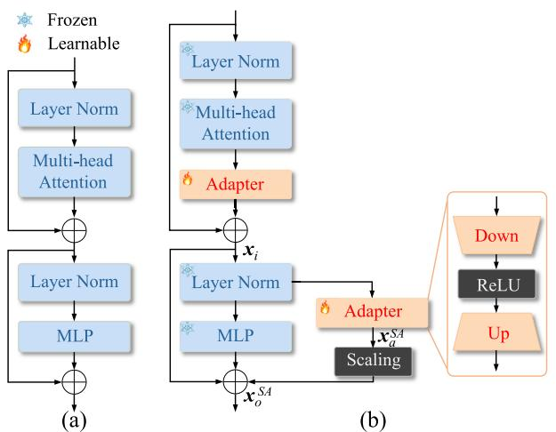

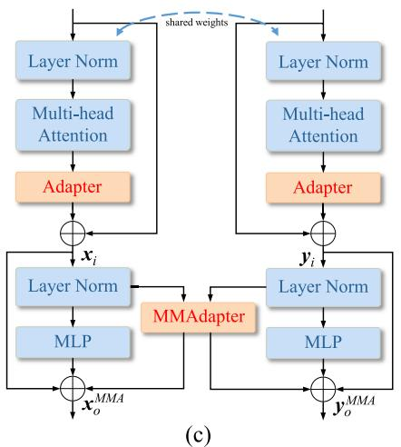

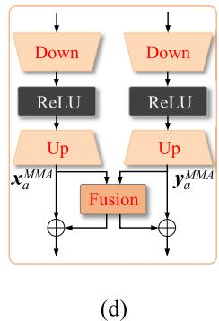  
图 3. (Fig. 3.) (a) SAM 图像编码器中不带 Adapter 的 ViT 块，(b) 配备标准 Adapter [37] 的 ViT 块，(c) 赋予所提出的 MMAdapter 的 ViT 块，以及 (d) MMAdapter 的详细结构。Adapter 促进了在特定任务中高效利用通用知识。与标准 Adapter 相比，MMAdapter 的特点是具有共享权重的双分支用于多模态特征提取。标准 Adapter 和提出的 MMAdapter 分别用于微调和融合特征。

在此之后，我们在第三节B（Section III-B）介绍了另一种经典的单模态微调策略 LoRA 以及提出的 MMLoRA。在这套多模态微调机制的基础之上，我们在第三节C（Section III-C）详细描述了本文提出的 MFNet。值得注意的是，依据在 MMAdapter 和 MMLoRA 之间的选择，MFNet 有两种不同的架构。最后，为了做出清晰的解释，我们以两种模态为例进行说明。

## A. 标准 Adapter 与提出的 MMAdapter (Standard Adapter and the Proposed MMAdapter)

具体介绍如下。

1) 标准 Adapter (Standard Adapter)：如第一节（Section I）所述，通用知识被限制在 SAM 的图像编码器中，具体来说是 ViT 块，其结构如图 3(a) 所示。在文献 [37] 中，提出使用 Adapter 通过微调来增强医学任务中 ViT 块的能力，如图 3(b) 所示。它并非调整所有参数，而是冻结预训练的 SAM 参数，同时引入两个 Adapter 模块以学习特定任务的知识。每个 Adapter 包含一个下投影（downprojection）、一个 ReLU 激活函数和一个上投影（upprojection）。下投影使用简单的 MLP 层将输入嵌入压缩到较低维度，而上投影利用另一个 MLP 层将压缩后的嵌入恢复到原始维度。对于给定的输入特征 $\pmb { x } _ { i } \in \mathbb { R } ^ { h \times w \times c }$，其中 $h$、$w$ 和 $c$ 分别代表输入特征的高度、宽度和通道数，Adapter 生成自适应特征的过程可表达为：

$$
\boldsymbol {x} _ {a} ^ {\mathrm {S A}} = \operatorname {R e L U} \left(\operatorname {L N} \left(\boldsymbol {x} _ {i}\right) \cdot \boldsymbol {W} _ {d}\right) \cdot \boldsymbol {W} _ {u} \tag {1}
$$

其中 $\pmb { W } _ { d } \in \mathbb { R } ^ { c \times \hat { c } }$ 和 $\boldsymbol { W } _ { u } \in \mathbb { R } ^ { \hat { c } \times c }$ 分别是下投影和上投影矩阵，$\hat { c } \ll c$ 是 Adapter 压缩后的中间维度。之后，自适应特征 $x _ { a }$ 以及原始 MLP 分支的输出通过残差连接与 $\boldsymbol { x } _ { i }$ 融合生成输出特征 $x _ { o }$：

$$
\boldsymbol {x} _ {o} ^ {\mathrm {S A}} = \mathcal {F} (\boldsymbol {x} _ {i}) + s \cdot \boldsymbol {x} _ {a} ^ {\mathrm {S A}} + \boldsymbol {x} _ {i} \tag {2}
$$

其中 $\mathcal { F } ( \cdot )$ 表示 MLP 操作，$s$ 是一个缩放因子，用于对特定任务知识和任务无关知识进行加权。由于 [37] 中提出的 Adapter 是专为单模态数据设计的，在下文中将其称为标准 Adapter。

2) 提出的 MMAdapter (Proposed MMAdapter)：接下来，我们将标准 Adapter 扩展到多模态任务中。提出的 MMAdapter 是我们多模态微调框架中的一个核心组件。如图 3(c) 所示，我们采用具有共享权重的双分支来处理多模态信息。多头注意力（multihead attention）之后的 Adapter 被保留以独立提取每种模态的特征，而 MLP 阶段的 Adapter 则被替换为所提出的 MMAdapter。MMAdapter 的细节展示在图 3(d) 中。在保留 Adapter 核心结构的同时，MMAdapter 通过一个融合模块实现了模态交互。值得注意的是，这种设计可以兼容任意的特征融合策略。为了突出多模态微调框架的有效性，我们采用了基于两个权重因子 $\lambda _ { 1 }$ 和 $\lambda _ { 2 }$ 的最简单的逐元素相加方法。对于两个特定的多模态输入特征 $\pmb { x } _ { i } \in \mathbb { R } ^ { h \times w \times c }$ 和 $\mathbf { y } _ { i } \in \mathbb { R } ^ { h \times w \times c }$，使用 MMAdapter 生成自适应特征的过程可描述为：

$$
\boldsymbol {x} _ {a} ^ {\mathrm {M M A}} = \operatorname {R e L U} \left(\ln \left(\boldsymbol {x} _ {i}\right) \cdot \boldsymbol {W} _ {d x}\right) \cdot \boldsymbol {W} _ {u x} \tag {3}
$$

$$
\mathbf {y} _ {a} ^ {\mathrm {M M A}} = \operatorname {R e L U} \left(\operatorname {L N} \left(\mathbf {y} _ {i}\right) \cdot \mathbf {W} _ {d y}\right) \cdot \mathbf {W} _ {u y} \tag {4}
$$

其中 $\pmb { W } _ { d x } , \pmb { W } _ { d y } \in \mathbb { R } ^ { c \times \hat { c } }$ 和 $\boldsymbol { W } _ { u x } , \boldsymbol { W } _ { u y } \in \mathbb { R } ^ { \hat { c } \times c }$ 分别是下投影和上投影矩阵。之后，利用 $\lambda _ { 1 }$ 和 $\lambda _ { 2 }$ 生成多模态输出特征 $\pmb { x } _ { o } ^ { \mathrm { M M A } }$ 和 $\mathbf { y } _ { o } ^ { \mathrm { M M A } }$ 的公式如下：

$$
\boldsymbol {x} _ {o} ^ {\mathrm {M M A}} = \mathcal {F} (\boldsymbol {x} _ {i}) + \lambda_ {1} \cdot \boldsymbol {x} _ {a} ^ {\mathrm {M M A}} + (1 - \lambda_ {1}) \cdot \boldsymbol {y} _ {a} ^ {\mathrm {M M A}} + \boldsymbol {x} _ {i} \tag {5}
$$

$$
\mathbf {y} _ {o} ^ {\mathrm {M M A}} = \mathcal {F} \left(\mathbf {y} _ {i}\right) + \lambda_ {2} \cdot \mathbf {y} _ {a} ^ {\mathrm {M M A}} + (1 - \lambda_ {2}) \cdot \mathbf {x} _ {a} ^ {\mathrm {M M A}} + \mathbf {y} _ {i}. \tag {6}
$$

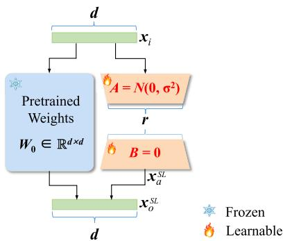

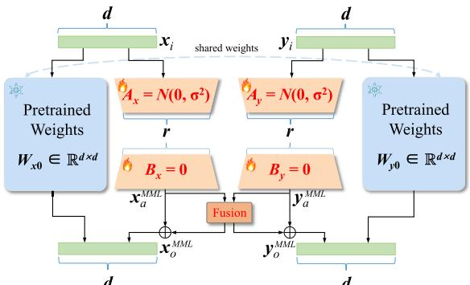  
(b)   
图 4. (Fig. 4.) (a) 标准 LoRA 的详细结构 [27] 以及 (b) 提出的 MMLoRA。可以观察到 MMLoRA 采用了 MMAdapter 的设计原则，这不仅降低了模块的复杂性，同时也突显了该策略的通用性。

在微调期间，仅优化新添加的参数，而其他参数保持固定。详细的注释已在图 3(b) 中提供，其他子图为了清晰和简洁起见隐去了这些注释。

## B. 标准 LoRA 与提出的 MMLoRA (Standard LoRA and the Proposed MMLoRA)

具体介绍如下。

1) 标准 LoRA (Standard LoRA)：基础模型由许多密集的层组成，通常采用全秩矩阵乘法。为了将这些预训练模型适配于特定任务，LoRA [27] 假设在适配过程中，权重的更新具有较低的“内在秩 (intrinsic rank)” [47]。这种机制可应用于任何线性层。对于一个预训练的权重矩阵 $W _ { 0 } \in \mathbb { R } ^ { d \times d }$，其更新可以通过低秩分解来表达：

$$
\boldsymbol {W} _ {0} + \Delta \boldsymbol {W} = \boldsymbol {W} _ {0} + \boldsymbol {B} \boldsymbol {A} \tag {7}
$$

其中 $\pmb { { B } } \in \mathbb { R } ^ { d \times r }$，$\pmb { A } \in \mathbb { R } ^ { r \times d }$，且秩 $r \ll d$。

在训练期间，$W _ { 0 }$ 保持固定且不接受梯度更新，而可训练的参数包含在 $\pmb { A }$ 和 $\pmb { B }$ 中。给定输入特征 $\boldsymbol { x } _ { i }$，适配模块的前向计算可表示为：

$$
\boldsymbol {x} _ {o} ^ {\mathrm {S L}} = \left(\boldsymbol {W} _ {0} + \Delta \boldsymbol {W}\right) \boldsymbol {x} _ {i} = \boldsymbol {W} _ {0} \boldsymbol {x} _ {i} + \boldsymbol {x} _ {a} ^ {\mathrm {S L}}. \tag {8}
$$

矩阵 $\pmb { A }$ 使用随机高斯分布进行初始化，而 $\pmb { B }$ 则被初始化为 0，从而使得在训练刚开始时 $\Delta W = 0$。LoRA 的架构如图 4(a) 所示。在整个研究中，LoRA 的单模态实现都被称作标准 LoRA。

2) 提出的 MMLoRA (Proposed MMLoRA)：类似于 MMAdapter，我们将标准 LoRA 扩展以处理多模态任务。如图 4(b) 所示，我们采用具有共享权重的双分支结构来处理多模态信息。这种设计在融合模块的辅助下，实现了在单一模态内部以及跨模态之间对特定任务知识的学习。由于给定的输入为 $\boldsymbol { x } _ { i }$ 和 $\boldsymbol { y } _ { i }$，使用 MMLoRA 生成自适应特征的过程可以描述如下：

$$
\boldsymbol {x} _ {o} ^ {\mathrm {M M L}} = \boldsymbol {W} _ {x 0} \boldsymbol {x} _ {i} + \lambda_ {1} \cdot \boldsymbol {x} _ {a} ^ {\mathrm {M M L}} + (1 - \lambda_ {1}) \boldsymbol {y} _ {a} ^ {\mathrm {M M L}} \tag {9}
$$

$$
\boldsymbol {y} _ {o} ^ {\mathrm {M M L}} = \boldsymbol {W} _ {y 0} \boldsymbol {y} _ {i} + \lambda_ {2} \cdot \boldsymbol {y} _ {a} ^ {\mathrm {M M L}} + (1 - \lambda_ {2}) \boldsymbol {x} _ {a} ^ {\mathrm {M M L}} \tag {10}
$$

其中：

$$
\boldsymbol {x} _ {a} ^ {\text {M M L}} = \boldsymbol {B} _ {x} \boldsymbol {A} _ {x} \boldsymbol {x} _ {i} \tag {11}
$$

$$
\boldsymbol {y} _ {a} ^ {\mathrm {M M L}} = \boldsymbol {B} _ {y} \boldsymbol {A} _ {y} \boldsymbol {y} _ {i}. \tag {12}
$$

最后值得一提的是，图 3 和图 4 中所示的设计可以很容易地推广到两种以上的多模态场景中。

## C. 本文提出的 MFNet (Proposed MFNet)

图 5 展示了提出的 MFNet 全貌，以及两种截然不同的多模态微调策略。MFNet 的输入首先由配备有 MMAdapter 或 MMLoRA 的 SAM 图像编码器进行处理，其负责利用多模态微调机制来提取和融合多模态的遥感特征。其输出随后被送入深度融合模块 (DFM) 中，该模块从编码器接收两个单尺度的多模态输出，并利用金字塔模块将其扩展为两组多尺度的多模态特征。这些高级抽象特征进而通过四个通道注意力 (Squeeze-and-Excitation, SE) 融合模块进行融合，生成了一组多尺度特征。最后，DFM 的输出被传递给解码器以生成分割的预测结果图。在本节中，我们将详细介绍提出的 MFNet 里的各个关键组件。

1) SAM 的图像编码器 (SAM’s Image Encoder)：我们将光学图像及其相应的 DSM 数据分别表示为 $\pmb { X } \in \mathbb { R } ^ { H \times W \times 3 }$ 和 $\textbf { \textit { Y } } \in \mathbb { R } ^ { H \times W \times 1 }$，其中 $H$ 和 $W$ 分别表示输入数据的高度和宽度。采用了非分层 ViT 主干的 SAM 图像编码器，首先将输入嵌入到大小为 $\mathbb { R } ^ { h \times w \times c }$ 的张量中，其中 $h = (H / 16)$，$w = (W / 16)$，$c$ 为嵌入维度。接着，利用堆叠的 ViT 块提取特征，该特征的尺寸在整个编码过程中得以保持不变 [48]。如图 5(a) 所示，$\pmb { X }$ 和 $\textbf { \textit { Y } }$ 均被输入至 SAM 的图像编码器。值得注意的是，相同的 SAM 编码器也被用于 DSM 数据，这证明了 SAM 完全可以被用来从非图像数据中提取特征。SAM 的图像编码器提取并融合了多模态特征，通过多模态微调模块生成了高级抽象特征 $\pmb { F } _ { x } \in \mathbb { R } ^ { h \times w \times c }$ 和 $\pmb { F } _ { y } \in \mathbb { R } ^ { h \times w \times c }$。

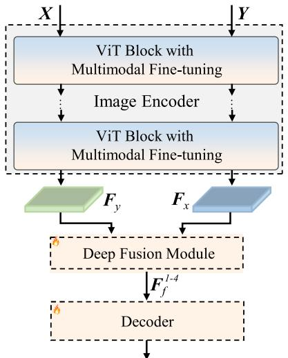  
(a)

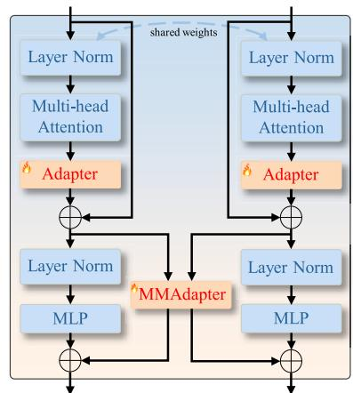  
(b)

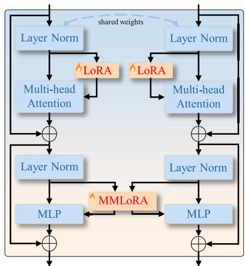  
图 5. (Fig. 5.) (a) 提出的 MFNet 总览图，其由带有强化多模态微调机制的 SAM 图像编码器、DFM（深度融合模块）以及一个通用解码器构成。(b) 附带了 MMAdapter 的 ViT 块结构，以及 (c) 附带了 MMLoRA 的 ViT 块结构。这些构成了 MFNet 的两种不同架构。

2) 带有 MMLoRA 的 ViT 块 (ViT Block With MMLoRA)：图 5(b) 描绘了 ViT 块内 MMAdapter 的架构。与之相对应的是，MMLoRA 则充当了一个与线性层并行应用的多模态微调手段。为了阐述得更为清晰，结合了 MMLoRA 的 ViT 块的结构被展现在了图 5(c) 中。在多头注意力模块中，LoRA 模块被附加在了 $q$ 和 $v$ 投影层上 [49]。在这一阶段，为了专注捕捉各自单一模态下的特定任务信息，排除了多模态的互动。到了随后的 MLP 层中，MMLoRA 模块才被施加在 MLP 的各线性层上，进而促成了多模态信息的融合。

3) 深度融合模块 (DFM)：多尺度特征在语义分割任务里扮演着至关紧要的角色，这是由于密集型预测不仅需要全局的信息，还要局部的信息。如图 6(a) 所示，两个金字塔模块被用于生成多尺度的特征图，其中每个金字塔都包含一组相互平行的卷积或是反卷积操作。若是从尺度大小为 (1/16) 的基础 ViT 特征图起算，我们采用了步长设定为 $\{ (1/4) , (1/2) , 1 , 2 \}$ 的各项卷积操作来产出尺度依次为 {(1/4), (1/8), (1/16), (1/32)} 的特征图，其中包含分数的步长代表反卷积运算 [48]。这些简易的金字塔模块生成了两组兼备多模态与多尺度的特征，将其表示为 $F _ { x } ^ { i }$ 与 $F _ { y } ^ { i }$，这里的 $i = \{ 1 , 2 , 3 , 4 \}$ 代表对应的尺度索引。随后，四个 SE 融合模块 [33] 被用来对这些多模态特征实施更深一步的交融。值得一说的是，要是配备更为高阶的融合模块，是可以取得进一步拔高效果的。

如图 6(b) 所例示的那样，SE 融合模块以聚合多模态特征中的全局信息起步。针对第 i 个融合模块，在输入通道大小为 $C _ { i }$ 的条件下，squeeze-and-excitation (通道注意力) 过程是通过两次核大小为 $1 \times 1$ 的卷积操作去执行的，紧接其后的是 ReLU 和 Sigmoid 激活函数。随后这些多模态输出被赋予相应的权重，并且在对应位置上逐元素相加合并，由此产生了代表强化的融合特征 $F _ { f } ^ { i }$。这四个 SE 融合模块输出的内容合并形成了多尺度融合特征，用 $F _ { f } ^ { I - 4 }$ 表示，它们会被送入解码器以备后续处理。本工作沿用了 UNetformer [35] 方案里的解码器，它凭借聚焦兼顾全局与局部的资讯，将抽象语义信息重新构建为了分割图像图。

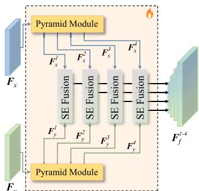

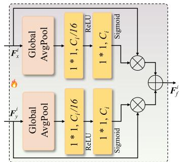  
(b)   
图 6. (Fig. 6.) (a) DFM 示意图。其中包含两个在被送入四个 SE 融合模块汇聚之前，用以将多模态特征扩大并展开成多尺度特征的金字塔组。(b) SE 融合模块结构的示意图 [33]。值得注意的是，我们只是采用了目前现有的一个简易的融合模块，而并没有专门为此设计此部位结构，这恰恰证明了我们成果的主要提升正统得益于这套基于视觉基础模型的多模态微调策略。
# IV. 实验与讨论 (EXPERIMENTS AND DISCUSSION)

## A. 数据集 (Datasets)

1) Vaihingen 数据集：该数据集包含 16 张高分辨率正射影像，每张平均大小为 $2 5 0 0 \times 2 0 0 0$ 像素。这些正射影像由三个通道组成：近红外、红色和绿色 (NIRRG)，并配有 9 厘米地面采样距离的归一化数字地表模型 (DSM)。这 16 张正射影像被划分为包含 12 个图像块的训练集以及包含 4 个图像块的测试集。为了提高大型图像块的存储和读取效率，在训练和测试阶段，采用了大小为 $2 5 6 \times 2 5 6$ 的滑动窗口进行处理，而不是直接将图像块裁剪成较小的图像，这最终产生了约 960 张训练图像和 320 张测试图像。

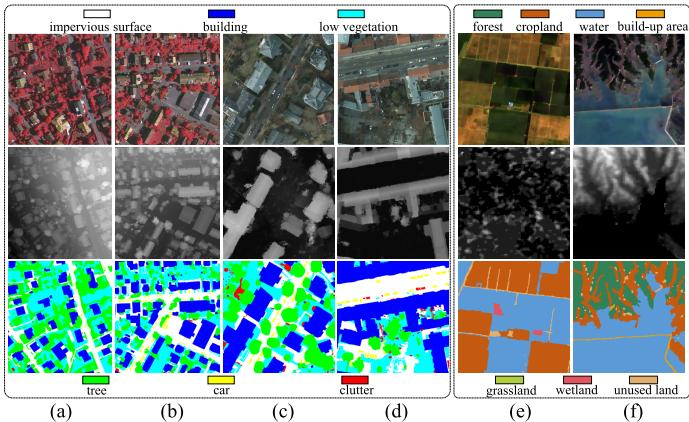  
图 7. (Fig. 7.) 在此，我们展示了 (a) 和 (b) 两个选自 Vaihingen 数据集尺寸为 $2 0 4 8 \times 2 0 4 8$ 的样本，(c) 和 (d) 两个选自 Potsdam 数据集尺寸为 $2 0 4 8 \times 2 0 4 8$ 的样本（后两列），以及 (e) 和 (f) 两个选自 MMHunan 数据集尺寸为 $2 5 6 \times 2 5 6$ 的样本。第一行分别展示了 Vaihingen 的 NIRRG 通道正射影像、Potsdam 的 RGB 通道正射影像以及 MMHunan 的 RGB 通道正射影像。第二行和第三行则展示了相应的像素级深度信息和真实标签 (ground truth)。它们展现了来自不同来源的多模态遥感数据的独立特征与互补特性。

2) Potsdam 数据集：该数据集比 Vaihingen 数据集大得多，包含 24 张高分辨率正射影像，每张尺寸为 $6 0 0 0 \times 6 0 0 0$ 像素。它包括四个多光谱波段：红外、红色、绿色和蓝色 (IRRGB)，以及 5 厘米的归一化 DSM。在此数据集中，我们使用了后三个波段 (RGB) 以增加实验的多样性。这 24 张正射影像被划分为 18 张作为训练集，6 张作为测试集。采用相同的滑动窗口方法，该数据集产生了 10368 个训练样本和 3456 个测试样本。

Vaihingen 和 Potsdam 数据集主要包含五种前景类别：建筑物 (Building/Bui.)、树木 (Tree/Tre.)、低矮植被 (Low Vegetation/Low.)、汽车 (Car) 和不透水路面 (Impervious Surface/Imp.)。此外，还有一个被标记为背景杂物 (clutter) 的类别，包含难以区分的碎片和水面。值得注意的是，用于收集训练样本的滑动窗口会以较小的步长移动，而在测试阶段，重叠区域会被平均以减少边界效应。

3) MMHunan 数据集：该数据集 [50] 在空间分辨率上与 ISPRS 数据集有显著不同，其分辨率为 10 米。它包含 500 个 Sentinel-2 图像块，每个大小为 $2 5 6 \times 2 5 6$ 像素，并附有相应的数字高程数据。我们选择了红、绿、蓝波段来构建可见光图像。该数据集包含了对七种土地覆盖类型的标注：农田 (Cropland)、森林 (Forest)、草地 (Grassland)、湿地 (Wetland)、水体 (Water)、未利用地 (Unused Land) 和建成区 (Built-up Area)。

图 7 展示了这三个数据集中的视觉示例。无论是在数据特征还是在土地覆盖类别上的显著差异，都极大地提升了我们实验的多样性。

## B. 实现细节 (Implementation Details)

所有实验均利用 PyTorch 框架在单张配备 24 GB 显存的 NVIDIA GeForce RTX 3090 GPU 上进行。我们采用随机梯度下降 (SGD) 算法对所有模型进行训练，学习率设为 0.01，动量为 0.9，权重衰减为 0.0005，批大小 (batch size) 为 10。在应用 ViT-H 骨干网络时，为满足显存限制，批大小减小至 4。所有模型总共训练了 50 个轮次 (epoch)，每个 epoch 包含 1000 个迭代批次。在使用 $2 5 6 \times 2 5 6$ 滑动窗口进行样本采集后，实施了包含随机旋转和翻转在内的基础数据增强技术。对于 MMAdapter，其下投影缩放率设为 0.25。对于 MMLoRA，我们参考 [27] 将低秩数值设定为 4。更多细节可见 https://github.com/sstary/SSRS 。

为了评估在多模态遥感数据上的语义分割性能，我们选用了总体准确率 (Overall Accuracy, OA)、平均 F1 分数 (mean F1 score, mF1) 以及平均交并比 (mean Intersection over Union, mIoU)。这些标准化指标确保了我们提出的 MFNet 与其它最先进方法比较时的公平性。具体而言，OA 评估了所有的前景类别以及背景类别，而 mF1 和 mIoU 则是专门针对五个前景类别计算的。

## C. 性能对比 (Performance Comparison)

我们将提出的 MFNet 与 15 种当前最先进的方法进行了基准测试对比，包括 PSPNet [54], MAResU-Net [51], vFuseNet [36], FuseNet [10], ESANet [52], SA-GATE [55], CMGFNet [53], TransUNet [56], CMFNet [15], UNetFormer [35], MFTransNet [16], FTransUNet [33], RS3Mamba [57], FTransDeepLab [58], 以及 MultiSenseSeg [59]，其中大部分方法是专为遥感任务设计的。在我们的实验中，PSPNet, MAResU-Net, UNetFormer, 和 $\mathsf { R } \mathsf { S } ^ { 3 }$Mamba 仅利用了光学图像，这旨在突出 DSM 数据的影响，并展示多模态方法相比单模态方法的优势。其他方法则是基于不同网络架构（涵盖 CNN, Transformer 和 Mamba）的最先进多模态模型。考虑到 SAM 提供了三种不同的骨干网络结构，结合本文提出的两种多模态微调架构，我们为每个数据集提供了六组实验结果。对比的定量结果详见表 I 和表 II。

1) 在 Vaihingen 数据集上的性能对比：如表 I 所示，与现有的分割方法相比，提出的 MFNet 在 OA, mF1, 以及 mIoU 这三项指标上均展现出了大幅提升。这些结果证实了我们的 MFNet 能够切实有效地利用 SAM 中蕴含的丰富通用知识。特别值得注意的是，MFNet 在四大具体分类（建筑物、树木、低矮植被和不透水路面）上的表现均超过了其他最先进模型。在整体性能方面，搭载 ViT-H 的 MFNet (MMAdapter) 取得了 $9 2 . 9 7 \%$ 的 OA、$9 1 . 7 1 \%$ 的 mF1 得分，以及 $8 5 . 0 3 \%$ 的 mIoU，相较于排名第二的方法 MultiSenseSeg，分别提升了 $0 . 2 4 \%$、$0 . 2 9 \%$ 和 $0 . 5 0 \%$。此外，三种 MFNet 的骨干变体也展示出独特的优势。即便使用最小的变体 (ViT-B)，也能够媲美绝大部分现有方法。这进一步验证了我们的多模态微调框架能够高效地汲取 SAM 的通用知识，以辅助多模态遥感数据的语义分割。该结果彰显了本文提出的 MFNet 结合 MMAdapter 或 MMLoRA 在向多模态遥感任务引入基础模型（如 SAM）方面的重要实用价值。另一方面我们也观察到，基于 MMLoRA 的 MFNet 表现不如基于 MMAdapter 的 MFNet，我们将在第四节F (Section IV-F) 进行详细分析。

表 I (TABLE I) Vaihingen 数据集上的定量结果。最佳结果以粗体显示。次佳结果以下划线标出 (%)

<table><tr><td rowspan="2">Method</td><td rowspan="2">Backbone</td><td colspan="6">OA</td><td rowspan="2">mF1</td><td rowspan="2">mIoU</td></tr><tr><td>Bui.</td><td>Tre.</td><td>Low.</td><td>Car</td><td>Imp.</td><td>Total</td></tr><tr><td>FuseNet [10]</td><td>VGG16</td><td>96.28</td><td>90.28</td><td>78.98</td><td>81.37</td><td>91.66</td><td>90.51</td><td>87.71</td><td>78.71</td></tr><tr><td>vFuseNet [36]</td><td>VGG16</td><td>95.92</td><td>91.36</td><td>77.64</td><td>76.06</td><td>91.85</td><td>90.49</td><td>87.89</td><td>78.92</td></tr><tr><td>MAResU-Net [51]</td><td>ResNet18</td><td>94.84</td><td>89.99</td><td>79.09</td><td>85.89</td><td>92.19</td><td>90.17</td><td>88.54</td><td>79.89</td></tr><tr><td>ESANet [52]</td><td>ResNet34</td><td>95.69</td><td>90.50</td><td>77.16</td><td>85.46</td><td>91.39</td><td>90.61</td><td>88.18</td><td>79.42</td></tr><tr><td>CMGFNet [53]</td><td>ResNet34</td><td>97.75</td><td>91.60</td><td>80.03</td><td>87.28</td><td>92.35</td><td>91.72</td><td>90.00</td><td>82.26</td></tr><tr><td>PSPNet [54]</td><td>ResNet101</td><td>94.52</td><td>90.17</td><td>78.84</td><td>79.22</td><td>92.03</td><td>89.94</td><td>86.55</td><td>76.96</td></tr><tr><td>SA-GATE [55]</td><td>ResNet101</td><td>94.84</td><td>92.56</td><td>81.29</td><td>87.79</td><td>91.69</td><td>91.10</td><td>89.81</td><td>81.27</td></tr><tr><td>CMFNet [15]</td><td>VGG16</td><td>97.17</td><td>90.82</td><td>80.37</td><td>85.47</td><td>92.36</td><td>91.40</td><td>89.48</td><td>81.44</td></tr><tr><td>UNetFormer [35]</td><td>ResNet18</td><td>96.23</td><td>91.85</td><td>79.95</td><td>86.99</td><td>91.85</td><td>91.17</td><td>89.48</td><td>81.97</td></tr><tr><td>MFTransNet [16]</td><td>ResNet34</td><td>96.41</td><td>91.48</td><td>80.09</td><td>86.52</td><td>92.11</td><td>91.22</td><td>89.62</td><td>81.61</td></tr><tr><td>TransUNet [56]</td><td>R50-ViT-B</td><td>96.48</td><td>92.77</td><td>76.14</td><td>69.56</td><td>91.66</td><td>90.96</td><td>87.34</td><td>78.26</td></tr><tr><td>FTransUNet [33]</td><td>R50-ViT-B</td><td>98.20</td><td>91.94</td><td>81.49</td><td>91.27</td><td>93.01</td><td>92.40</td><td>91.21</td><td>84.23</td></tr><tr><td>RS3Mamba [57]</td><td>R18-Mamba-T</td><td>97.40</td><td>92.14</td><td>79.56</td><td>88.15</td><td>92.19</td><td>91.64</td><td>90.34</td><td>82.78</td></tr><tr><td>FTransDeepLab [58]</td><td>ResNet101</td><td>98.11</td><td>93.45</td><td>80.35</td><td>89.98</td><td>93.23</td><td>92.61</td><td>91.00</td><td>83.87</td></tr><tr><td>MultiSenseSeg [59]</td><td>Segformer-B2</td><td>97.91</td><td>93.04</td><td>81.58</td><td>89.06</td><td>93.56</td><td>92.73</td><td>91.42</td><td>84.53</td></tr><tr><td rowspan="3">MFNet (MMLoRA)</td><td>ViT-B</td><td>97.83</td><td>94.26</td><td>77.82</td><td>85.43</td><td>91.98</td><td>91.93</td><td>89.89</td><td>82.09</td></tr><tr><td>ViT-L</td><td>96.85</td><td>92.89</td><td>81.09</td><td>89.95</td><td>93.28</td><td>92.22</td><td>91.09</td><td>83.96</td></tr><tr><td>ViT-H</td><td>97.98</td><td>92.35</td><td>82.96</td><td>90.09</td><td>93.25</td><td>92.73</td><td>91.50</td><td>84.66</td></tr><tr><td rowspan="3">MFNet (MMAdapter)</td><td>ViT-B</td><td>98.73</td><td>91.41</td><td>83.09</td><td>85.63</td><td>92.91</td><td>92.62</td><td>90.60</td><td>83.24</td></tr><tr><td>ViT-L</td><td>98.84</td><td>93.17</td><td>81.16</td><td>89.23</td><td>93.39</td><td>92.93</td><td>91.51</td><td>84.72</td></tr><tr><td>ViT-H</td><td>98.38</td><td>93.94</td><td>80.70</td><td>90.47</td><td>93.59</td><td>92.97</td><td>91.71</td><td>85.03</td></tr></table>

表 II (TABLE II) Potsdam 数据集上的定量结果。最佳结果以粗体显示。次佳结果以下划线标出 (%)

<table><tr><td rowspan="2">Method</td><td rowspan="2">Backbone</td><td colspan="6">OA</td><td rowspan="2">mF1</td><td rowspan="2">mIoU</td></tr><tr><td>Bui.</td><td>Tre.</td><td>Low.</td><td>Car</td><td>Imp.</td><td>Total</td></tr><tr><td>FuseNet [10]</td><td>VGG16</td><td>97.48</td><td>85.14</td><td>87.31</td><td>96.10</td><td>92.64</td><td>90.58</td><td>91.60</td><td>84.86</td></tr><tr><td>vFuseNet [36]</td><td>VGG16</td><td>97.23</td><td>84.29</td><td>89.03</td><td>95.49</td><td>91.62</td><td>90.22</td><td>91.26</td><td>84.26</td></tr><tr><td>MAResU-Net [51]</td><td>ResNet18</td><td>96.82</td><td>83.97</td><td>87.70</td><td>95.88</td><td>92.19</td><td>89.82</td><td>90.86</td><td>83.61</td></tr><tr><td>ESANet [52]</td><td>ResNet34</td><td>97.10</td><td>85.31</td><td>87.81</td><td>94.08</td><td>92.76</td><td>89.74</td><td>91.22</td><td>84.15</td></tr><tr><td>CMGFNet [53]</td><td>ResNet34</td><td>97.41</td><td>86.80</td><td>86.68</td><td>95.68</td><td>92.60</td><td>90.21</td><td>91.40</td><td>84.53</td></tr><tr><td>PSPNet [54]</td><td>ResNet101</td><td>97.03</td><td>83.13</td><td>85.67</td><td>88.81</td><td>90.91</td><td>88.67</td><td>88.92</td><td>80.36</td></tr><tr><td>SA-GATE [55]</td><td>ResNet101</td><td>96.54</td><td>81.18</td><td>85.35</td><td>96.63</td><td>90.77</td><td>87.91</td><td>90.26</td><td>82.53</td></tr><tr><td>CMFNet [15]</td><td>VGG16</td><td>97.63</td><td>87.40</td><td>88.00</td><td>95.68</td><td>92.84</td><td>91.16</td><td>92.10</td><td>85.63</td></tr><tr><td>UNetFormer [35]</td><td>ResNet18</td><td>97.69</td><td>86.47</td><td>87.93</td><td>95.91</td><td>92.27</td><td>90.65</td><td>91.71</td><td>85.05</td></tr><tr><td>MFTransNet [16]</td><td>ResNet34</td><td>97.37</td><td>85.71</td><td>86.92</td><td>96.05</td><td>92.45</td><td>89.96</td><td>91.11</td><td>84.04</td></tr><tr><td>TransUNet [56]</td><td>R50-ViT-B</td><td>96.63</td><td>82.65</td><td>89.98</td><td>93.17</td><td>91.93</td><td>90.01</td><td>90.97</td><td>83.74</td></tr><tr><td>FTransUNet [33]</td><td>R50-ViT-B</td><td>97.78</td><td>88.27</td><td>88.48</td><td>96.31</td><td>93.17</td><td>91.34</td><td>92.41</td><td>86.20</td></tr><tr><td>RS3Mamba [57]</td><td>R18-Mamba-T</td><td>97.70</td><td>86.11</td><td>89.53</td><td>96.23</td><td>91.36</td><td>90.49</td><td>91.69</td><td>85.01</td></tr><tr><td>FTransDeepLab [58]</td><td>ResNet101</td><td>97.58</td><td>85.87</td><td>90.08</td><td>96.94</td><td>92.81</td><td>90.97</td><td>92.08</td><td>85.62</td></tr><tr><td>MultiSenseSeg [59]</td><td>Segformer-B2</td><td>98.32</td><td>87.65</td><td>89.54</td><td>96.27</td><td>92.46</td><td>91.30</td><td>92.35</td><td>86.10</td></tr><td rowspan="3">MFNet (MMLoRA)</td><td>ViT-B</td><td>97.60</td><td>86.45</td><td>87.87</td><td>94.39</td><td>92.44</td><td>90.57</td><td>91.48</td><td>84.61</td></tr><tr><td>ViT-L</td><td>97.59</td><td>88.57</td><td>88.34</td><td>96.35</td><td>92.68</td><td>90.99</td><td>92.13</td><td>85.71</td></tr><tr><td>ViT-H</td><td>98.19</td><td>87.30</td><td>89.89</td><td>96.27</td><td>92.80</td><td>91.43</td><td>92.49</td><td>86.34</td></tr><td rowspan="3">MFNet (MMAdapter)</td><td>ViT-B</td><td>97.93</td><td>87.13</td><td>87.72</td><td>95.68</td><td>92.68</td><td>90.89</td><td>91.79</td><td>85.14</td></tr><tr><td>ViT-L</td><td>98.31</td><td>88.78</td><td>87.27</td><td>96.29</td><td>93.69</td><td>91.62</td><td>92.51</td><td>86.37</td></tr><tr><td>ViT-H</td><td>98.44</td><td>87.37</td><td>90.36</td><td>96.24</td><td>93.17</td><td>91.71</td><td>92.70</td><td>86.69</td></tr></table>

图 8 呈现了由不同方法及最佳配置的 MFNet (采用 ViT-H 和 MMAdapter) 产生结果的直观可视化对比。我们可以看到 MFNet 在生成各类地物目标（例如树木、汽车、建筑物）的清晰、精确边界方面表现出卓越性能，从而实现了更好的分割隔离。这有助于保留地物的完整性。整体来看，MFNet 生成的可视化结果展现出更干净和更加有条理的外观。我们将这些改进主要归功于 SAM 强大的特征提取能力。通过引入多模态微调机制，SAM 识别一切自然元素的能力被有效地拓展到了识别各种地表目标物上。

2) 在 Potsdam 数据集上的性能对比：在 Potsdam 数据集上的实验得出了与 Vaihingen 数据集一致的结果。如表 II 所示，搭载 ViT-H 骨干网络并结合 MMAdapter 的 MFNet 分别获得了 $9 1 . 7 1 \%$、$9 2 . 7 0 \%$，以及 $8 6 . 6 9 \%$ 的 OA、mF1 和 mIoU 分数，比 FTransUNet 分别提升了 $0 . 3 7 \%$、$0 . 2 9 \%$ 和 $0 . 4 9 \%$。值得注意的是，与其他最先进方法相比，其在建筑物、树木、低矮植被和不透水路面类别均观察到了显著的提升。采用较小骨干网络的 MFNet 同样展现出优异的性能。这种灵活性允许 MFNet 在各种应用场景中平衡硬件要求和性能需求。

图 9 给出了 Potsdam 数据集的可视化示例。我们观察到了更明确的边界和保留完好的地物表征。这些视觉上的改善与表 II 中展示的 mF1 和 mIoU 指标相吻合。毫无疑问，这进一步证实了本文提出的 MFNet 及附带的 MMAdapter/MMLoRA 的实际适用性。

此外还可以观察到，MFNet 在同时完美识别树木 (Tree) 与低矮植被 (Low Vegetation) 时仍面临挑战。出现这一情况的原因在于这两个类别都有着不规则的边界特征。同时，由于它们特征相似，且分布上交错或重叠，使得区分它们非常困难。讲 SAM 与应对此类挑战性类别的专门设计结合起来，将是一个引人关注的未来发展方向。

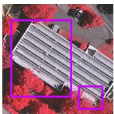

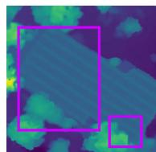

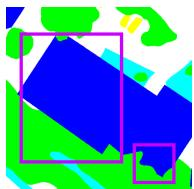

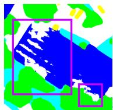

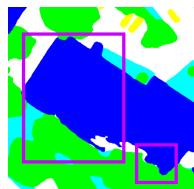

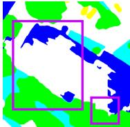  
(f)

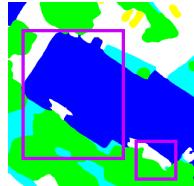  
(g1)

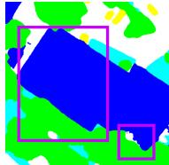  
(h)

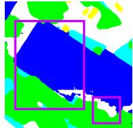  
(i)

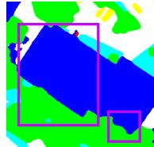  
(j)

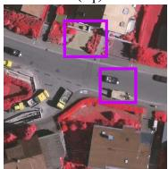

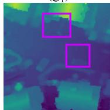

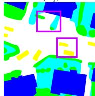

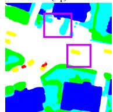

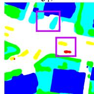

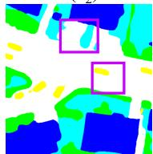  
  
building

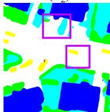

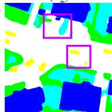

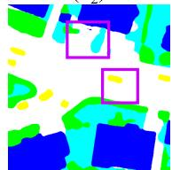

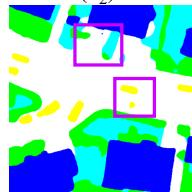  
  
图 8. (Fig. 8.) 在 Vaihingen 测试集中大小为 $5 1 2 \times 5 1 2$ 的可视化效果对比。 (a) IRRG 图像，(b) DSM，(c) 真实标签 (ground truth)，(d) CMFNet，(e) FTransUNet，(f) MFTransNet，(g) CMGFNet，(h) FTransDeepLab，(i) MultiSenseSeg，以及 (j) 提出的 MFNet。为了突出差异，在所有的子图中均添加了一些紫色方框。下标 $(= 1 , 2)$ 代表展示样本的序列编号。

表 III (TABLE III) MMHunan 数据集上的定量结果。最佳结果以粗体显示。次佳结果以下划线标出 (%)

<table><tr><td rowspan="2">Method</td><td rowspan="2">Backbone</td><td colspan="8">OA</td><td rowspan="2">mF1</td><td rowspan="2">mIoU</td></tr><tr><td>Cropland</td><td>Forest</td><td>Grassland</td><td>Wetland</td><td>Water</td><td>Unused Land</td><td>Built-up Area</td><td>Total</td></tr><tr><td>FuseNet [10]</td><td>VGG16</td><td>76.10</td><td>89.21</td><td>37.11</td><td>8.37</td><td>70.12</td><td>72.75</td><td>16.99</td><td>76.35</td><td>54.80</td><td>42.30</td></tr><tr><td>CMFNet [15]</td><td>VGG16</td><td>83.83</td><td>82.27</td><td>43.88</td><td>39.57</td><td>70.14</td><td>81.72</td><td>23.66</td><td>77.41</td><td>59.63</td><td>46.52</td></tr><tr><td>MFTransNet [16]</td><td>ResNet34</td><td>78.99</td><td>91.30</td><td>33.80</td><td>26.80</td><td>77.38</td><td>78.29</td><td>27.17</td><td>80.07</td><td>61.45</td><td>48.25</td></tr><tr><td>FTransUNet [33]</td><td>R50-ViT-B</td><td>78.75</td><td>90.54</td><td>32.13</td><td>27.51</td><td>76.64</td><td>75.59</td><td>48.63</td><td>79.47</td><td>61.95</td><td>48.78</td></tr><tr><td>CMGFNet [53]</td><td>ResNet34</td><td>82.08</td><td>87.90</td><td>37.50</td><td>26.48</td><td>79.82</td><td>74.64</td><td>41.15</td><td>79.85</td><td>62.69</td><td>49.44</td></tr><tr><td>FTTransDeepLab [58]</td><td>ResNet101</td><td>79.39</td><td>88.89</td><td>35.71</td><td>30.88</td><td>83.95</td><td>78.14</td><td>32.60</td><td>80.62</td><td>62.51</td><td>49.66</td></tr><tr><td>MultiSenseSeg [59]</td><td>Segformer-B2</td><td>78.03</td><td>90.93</td><td>40.47</td><td>38.16</td><td>80.19</td><td>81.03</td><td>38.14</td><td>80.51</td><td>63.74</td><td>50.76</td></tr><tr><td rowspan="3">MFNet (MMLoRA)</td><td>ViT-B</td><td>76.83</td><td>90.69</td><td>24.16</td><td>22.03</td><td>80.17</td><td>78.12</td><td>29.66</td><td>79.35</td><td>58.79</td><td>46.54</td></tr><tr><td>ViT-L</td><td>79.39</td><td>88.89</td><td>35.71</td><td>30.88</td><td>83.95</td><td>78.14</td><td>32.60</td><td>80.62</td><td>62.51</td><td>49.66</td></tr><tr><td>ViT-H</td><td>76.42</td><td>90.65</td><td>38.08</td><td>20.78</td><td>74.48</td><td>77.93</td><td>38.69</td><td>78.87</td><td>60.38</td><td>47.63</td></tr><tr><td rowspan="3">MFNet (MMAdapter)</td><td>ViT-B</td><td>74.81</td><td>91.47</td><td>27.59</td><td>25.00</td><td>86.47</td><td>78.92</td><td>37.46</td><td>80.68</td><td>62.10</td><td>49.20</td></tr><tr><td>ViT-L</td><td>79.19</td><td>89.52</td><td>46.07</td><td>42.23</td><td>81.15</td><td>77.58</td><td>39.65</td><td>80.93</td><td>65.33</td><td>51.82</td></tr><tr><td>ViT-H</td><td>79.66</td><td>90.06</td><td>42.61</td><td>38.81</td><td>80.31</td><td>78.92</td><td>40.04</td><td>81.07</td><td>64.13</td><td>51.08</td></tr></table>

3) 在 MMHunan 数据集上的性能对比：MMHunan 数据集的实验结果在表 III 中展示。配备 ViT-L 骨干的 MFNet (MMAdapter) 取得了 $8 0 . 9 3 \%$、$6 5 . 3 3 \%$ 和 $5 1 . 8 2 \%$ 的 OA、mF1 和 mIoU 得分，相比先前最佳的 MultiSenseSeg 分别提升了 $0 . 4 2 \%$、$1 . 5 9 \%$ 和 $1 . 0 6 \%$。

这些结果验证了我们的方法带来的稳定总体性能提升。此外，我们观察到了一个有趣的现象：在两种微调策略下，ViT-H 在这个数据集上的表现都不如 ViT-L。这表明在小型数据集场景中，较大的主干网络可能更容易发生过拟合，突显了根据不同遥感场景选择合适主干网络的重要性。图 10 给出了 MMHunan 的可视化示例。在大规模场景中，遥感图像与自然图像之间的领域鸿沟更为显著。然而，我们提出的方法成功地弥合了这一鸿沟，使得视觉基础模型的通用理解能力能够被有效地迁移到遥感任务中，从而带来了持续一致的性能提升。

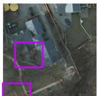

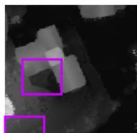

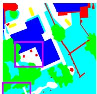

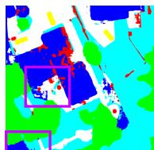

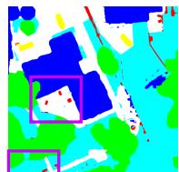  
(e1)

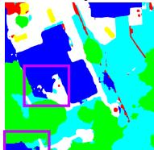

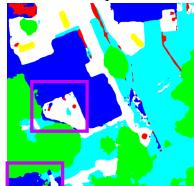

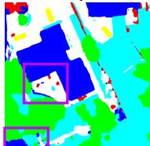

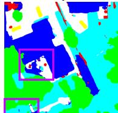

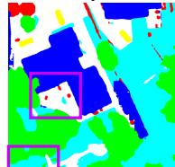

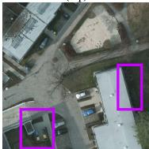

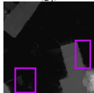

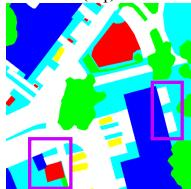

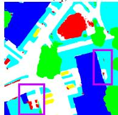

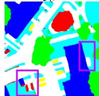

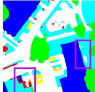  
  
building building

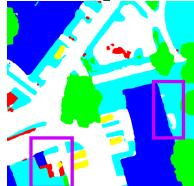

  
(i2)

  
tree   
low vegetation   
car   
impervious surface   
clutter   
图 9. (Fig. 9.) 在 Potsdam 测试集中大小为 $1 0 2 4 \times 1 0 2 4$ 的可视化效果对比。 (a) IRRG 图像，(b) DSM，(c) 真实标签 (ground truth)，(d) CMFNet，(e) FTransUNet，(f) MFTransNet，(g) CMGFNet，(h) FTransDeepLab，(i) MultiSenseSeg，以及 (j) 提出的 MFNet。为了突出差异，在所有的子图中均添加了一些紫色方框。下标 $(=1, 2)$ 代表展示样本的序列编号。

## D. 模态与微调分析 (Modality and Fine-Tuning Analysis)

为了说明多模态微调框架的必要性，我们进行了模态与微调分析，结果如表 IV 所示。在第一个实验中，我们仅使用了单模态数据并且没有应用任何微调机制，而在第二个和第五个实验中，我们应用了标准的 Adapter/LoRA 机制对 SAM 的图像编码器进行了微调。这些实验凸显了多模态信息和微调机制的重要性和必要性。在第三个和第六个实验中，SAM 的图像编码器保留了标准的 Adapter/LoRA 但排除了我们提出的 MMAdapter/MMLoRA。因此，这些实验仍可以独立地提取出遥感多模态特征，但它们在编码阶段缺乏至关重要的信息融合过程。第四和第七个实验则包含了多模态信息以及我们提出的 MMAdapter/MMLoRA。

表 IV (TABLE IV) 采用不同模态与微调机制的 Vaihingen 数据集上的定量结果 (%)

<table><tr><td rowspan="2">Modality</td><td rowspan="2">Fine-tuning</td><td colspan="6">OA</td><td rowspan="2">mF1</td><td rowspan="2">mIoU</td></tr><tr><td>Bui.</td><td>Tre.</td><td>Low.</td><td>Car</td><td>Imp.</td><td>Total</td></tr><tr><td>NIIRG</td><td>Without Adapter</td><td>94.64</td><td>89.47</td><td>71.71</td><td>76.83</td><td>89.51</td><td>88.01</td><td>85.34</td><td>75.11</td></tr><tr><td>NIIRG</td><td>Standard LoRA</td><td>96.50</td><td>93.62</td><td>80.35</td><td>86.32</td><td>92.78</td><td>92.00</td><td>90.35</td><td>82.74</td></tr><tr><td>NIIRG + DSM</td><td>Standard LoRA</td><td>97.26</td><td>92.61</td><td>81.58</td><td>86.53</td><td>91.58</td><td>91.86</td><td>89.90</td><td>82.06</td></tr><tr><td>NIIRG + DSM</td><td>MFNet with MMLoRA</td><td>96.85</td><td>92.89</td><td>81.09</td><td>89.95</td><td>93.28</td><td>92.22</td><td>91.09</td><td>83.96</td></tr><tr><td>NIIRG</td><td>Standard Adapter</td><td>96.29</td><td>93.09</td><td>80.15</td><td>89.08</td><td>92.59</td><td>92.02</td><td>90.94</td><td>83.69</td></tr><tr><td>NIIRG + DSM</td><td>Standard Adapter</td><td>99.02</td><td>91.68</td><td>83.04</td><td>89.71</td><td>92.90</td><td>92.80</td><td>91.30</td><td>84.35</td></tr><tr><td>NIIRG + DSM</td><td>MFNet with MMApapter</td><td>98.84</td><td>93.17</td><td>81.16</td><td>89.23</td><td>93.39</td><td>92.93</td><td>91.51</td><td>84.72</td></tr></table>

表 IV 首先凸显了微调机制的必要性。如果没有 Adapter 或 LoRA，SAM 很难有效地提取遥感特征，从而导致性能显著下降。此外，结果揭示了融合多模态信息的巨大优势。这一提升在建筑物和不透水路面类别中尤为明显，因为这两个类别往往具有显著且稳定的地表高程信息。随后，这种增强效果也提高了模型区分其他类别的能力。此外，我们观察到第三个实验的性能低于第二个实验。这是因为低秩分解显著降低了特定任务信息的维度空间。因此，模态之间的异质性使得在编码器之后去融合它们变得十分复杂。这指出了不当的微调方法在利用多模态信息时造成的挑战。我们的 MMLoRA 通过在图像编码器中进行的渐进特征融合方法有效地解决了这一挑战。

总的来说，多模态信息的引入提供了全方位的综合收益。引入 MMAdapter 和 MMLoRA 使得模型能够更有效地利用 DSM 信息，大幅提升了模型提取和融合多模态特征的能力。因此，遥感语义分割的性能得到了进一步的提高。

## E. 消融实验 (Ablation Study)

1) 组件消融 (Component Ablation)：提出的 MFNet 包含了两个核心组件：配备了 MMAdapter 或 MMLoRA 的 SAM 图像编码器，以及 DFM。为了验证它们的有效性，我们通过系统性地移除特定组件展开了消融实验。如表 V 所示，我们设计了两个消融实验。在第一个实验中，我们从 MFNet 中移除了 DFM，这导致网络无法对高级抽象的遥感语义特征进行深度的剖析和整合。第二个实验则采用了表 IV 中第三和第六个实验的配置。

在分析消融实验之前，需要注意的是，从 SAM 图像编码器中去掉所有的 Adapter 或 LoRA 会导致模型性能急剧下降，图 11 证实了这一点，这也同时说明了多模态微调机制的效力。观察图 11(c) 和 (d) 可以发现，如果不进行微调，SAM 就无法从遥感数据中提取出有意义的特征，使得其无法被应用于语义分割任务。然而，观察图 11(e) 和 (f) (以及 g 和 h) 可以看出，在使用 MMAdapter 或 MMLoRA 进行微调后，热力图的变化非常显著。此外，图 11(f) 和 (h) 清晰地展示了，尽管 SAM 最初是在 RGB 光学图像上训练的，但它在非光学的 DSM 数据上同样行之有效。可以观察到，DSM 能够有效地提供补充信息。因此，微调后的 SAM 图像编码器展示出了在多模态任务中有效识别和分割遥感目标的能力。

表 V (TABLE V) 所提出的 MFNet 的消融实验。最佳结果以粗体显示

<table><tr><td>MMAdapter</td><td>DFM</td><td>OA(%)</td><td>mF1(%)</td><td>mIoU(%)</td><td>MMLoRA</td><td>DFM</td><td>OA(%)</td><td>mF1(%)</td><td>mIoU(%)</td></tr><tr><td>✓</td><td></td><td>92.73</td><td>91.23</td><td>84.25</td><td>✓</td><td></td><td>92.02</td><td>90.64</td><td>83.24</td></tr><tr><td></td><td>✓</td><td>92.80</td><td>91.30</td><td>84.35</td><td></td><td>✓</td><td>91.86</td><td>89.90</td><td>82.06</td></tr><tr><td>✓</td><td>✓</td><td>92.93</td><td>91.51</td><td>84.72</td><td>✓</td><td>✓</td><td>92.22</td><td>91.09</td><td>83.96</td></tr></table>

观察表 V 表明，无论是多模态微调还是 DFM，对于提升 MFNet 模型的性能都是必不可少的。具体来讲，MMAdapter 和 MMLoRA 促进了信息的持续融合，使得在编码深度增加时多模态信息得以被提取和融合。DFM 验证了高级特征在多模态遥感数据语义分割中的重要性。在本文中，我们主要介绍了一种利用 SAM 的新框架，而不是把重点放在高级特征的融合技术上。如果将 DFM 替换为更高级的融合模型，有望获得进一步的性能提升。

  
(b)

  
(C)

  
(d)

  
(e)

  
(f)

  
(g)

  
(h)   
图 11. (Fig. 11.) 四组热力图对比。 (a) NIIRG 图像， (b) DSM， (c) 原始 SAM 模型根据 NIIRG 图像生成的热力图， (d) 原始 SAM 模型根据 DSM 生成的热力图， (e) 我们提出的 MMAdapter 根据 NIIRG 图像生成的热力图， (f) 我们提出的 MMAdapter 根据 DSM 生成的热力图， (g) 我们提出的 MMLoRA 根据 NIIRG 图像生成的热力图，以及 (h) 我们提出的 MMLoRA 根据 DSM 生成的热力图。热力图中的高响应区域代表了被模型识别为建筑物的目标。我们可以清晰地观察到我们提出的 MMAdapter 和 MMLoRA 的有效性。

  
图 12. (Fig. 12.) 训练阶段中训练数据量与模型性能之间的关系。由于模型在没有训练数据时无法生成预测，除了使用完整的训练集 $( 1 0 0 \% )$ 之外，我们还设计并执行了三组具有不同训练数据可用性水平的实验：$2 5 \%$， $50 \%$，和 $7 5 \%$。

2) 数据量消融 (Data Amount Ablation)：为了探究 SAM 在遥感任务上的微调效率，我们使用不同比例的训练数据进行了实验，以探索训练数据量与模型性能之间的关系。具体来说，我们仅使用训练集的 $2 5 \%$、$50 \%$ 和 $7 5 \%$ 对模型进行了微调，并在完整的测试集上进行评估。展示在图 12 中的结果揭示了一个现象：在 $2 5 \%$ 到 $50 \%$ 之间，数据量起着至关重要的作用，但在越过 $50 \%$ 的阈值后，性能的增长趋于饱和。这表明 SAM 能够通过微调快速掌握特定任务的知识，这使得训练数据的进一步增加对下游任务的性能提升产生了边际递减效应。这一发现为了解相关任务的数据需求提供了有价值的见解，并为高效利用训练数据提供了指导。

## F. 模型规模分析 (Model Scale Analysis)

MFNet 性能的提升在很大程度上归功于视觉基础模型 SAM 提供的通用知识。然而，SAM 也是一个大模型，与现有常规方法相比，大模型在计算复杂度或推理速度上并不具备优势。因此，我们着重报告模型的可训练参数数量和内存占用，以衡量其硬件需求。

表 VI 呈现了本研究中所有对比方法的模型规模分析结果。如表 VI 所指出的，本文提出的多模态微调技术使得大型基础模型可以在单张 GPU 上运行，同时将可训练参数的数量和内存开销控制在可管理的范围内。MFNet 的参数统计被划分为两部分：SAM 图像编码器中的微调参数 $+$ DFM 和解码器中的参数。后者的参数在不同的 MFNet 配置中保持不变。

表 VI (TABLE VI) 模型规模分析。在单张 NVIDIA GEFORCE RTX 3090 GPU 上处理一张 $2 5 6 \times 2 5 6$ 图像进行测量得出。对于不同的 MFNET 配置，参数统计为：SAM 图像编码器中的微调参数 + DFM 和解码器中的参数。MIOU 值为在 VAIHINGEN 数据集上的结果。最佳结果以粗体显示

<table><tr><td>Method</td><td>Parameter (M)</td><td>Memory (MB)</td><td>MIoU (%)</td></tr><tr><td>PSPNet [54]</td><td>46.72</td><td>3124</td><td>76.96</td></tr><tr><td>MAResU-Net [51]</td><td>26.27</td><td>1908</td><td>79.89</td></tr><tr><td>UNetFormer [35]</td><td>24.20</td><td>1980</td><td>81.97</td></tr><tr><td>RS3Mamba [57]</td><td>43.32</td><td>1548</td><td>82.78</td></tr><tr><td>TransUNet [56]</td><td>93.23</td><td>3028</td><td>78.26</td></tr><tr><td>FuseNet [10]</td><td>42.08</td><td>2284</td><td>78.71</td></tr><tr><td>vFuseNet [36]</td><td>44.17</td><td>2618</td><td>78.92</td></tr><tr><td>ESANet [52]</td><td>34.03</td><td>1914</td><td>79.42</td></tr><tr><td>SA-GATE [55]</td><td>110.85</td><td>3174</td><td>81.27</td></tr><tr><td>CMFNet [15]</td><td>123.63</td><td>4058</td><td>81.44</td></tr><tr><td>MFTransUNet [16]</td><td>43.77</td><td>1549</td><td>81.61</td></tr><tr><td>CMGFNet [53]</td><td>64.20</td><td>2463</td><td>82.26</td></tr><tr><td>FTransUNet [33]</td><td>160.88</td><td>3463</td><td>84.23</td></tr><tr><td>FTransDeepLab [58]</td><td>69.86</td><td>1624</td><td>83.87</td></tr><tr><td>MultiSenseSeg [59]</td><td>60.46</td><td>2264</td><td>84.53</td></tr><tr><td>MFNet (MMLoRA) (ViT-B)</td><td>1.03+6.22</td><td>1924</td><td>82.09</td></tr><tr><td>MFNet (MMLoRA) (ViT-L)</td><td>2.75+6.22</td><td>4158</td><td>83.96</td></tr><tr><td>MFNet (MMLoRA) (ViT-H)</td><td>4.59+6.22</td><td>6520</td><td>84.66</td></tr><tr><td>MFNet (MMAdapter) (ViT-B)</td><td>14.20+6.22</td><td>1872</td><td>83.24</td></tr><tr><td>MFNet (MMAdapter) (ViT-L)</td><td>50.45+6.22</td><td>4242</td><td>84.72</td></tr><tr><td>MFNet (MMAdapter) (ViT-H)</td><td>105.06+6.22</td><td>6854</td><td>85.03</td></tr></table>

将 MMLoRA 与 MMAdapter 进行比较可以看出，MMLoRA 通过低秩分解将数千维的空间压缩为秩为 4 的矩阵，从而显著减少了参数数量。虽然这种方法通常比较高效，但它可能导致丢失一些关键信息，特别是在处理复杂的遥感数据时尤为如此。因此，MMAdapter 在性能上优于 MMLoRA。

在我们的实验中，我们在相同的硬件环境和相同的超参数设置下成功微调了 ViT-L 骨干网络，不仅获得了超越所有现有方法的结果，同时保证了高效性。对于 ViT-H 骨干网络，由于 GPU 的显存限制，我们将批大小 (batch size) 从 10 减少到了 4。批大小的这种减少不仅没有降低模型的表现，反而进一步提升了性能。这些结果证明了大型视觉基础模型强大的特征提取和融合能力。本研究也为在受限硬件条件下利用大模型探索多模态任务提供了有价值的见解和范例。

## G. 讨论 (Discussion)

本文引入了一种统一的多模态微调框架，该框架包含两种基于 SAM 的多模态微调机制。作为该领域的早期探索，我们通过开发两种经典的微调方法（Adapter 和 LoRA），彻底调查了视觉基础模型在遥感多模态任务上的表现。我们进行了全面的分析实验来评估这些方法。此外，MFNet 提供了一个直观的多模态融合网络，为未来的研究铺展了方向。

1) 改进微调模块 (Improving Fine-Tuning Modules)：本工作采用了两种代表性的微调技术，即 LoRA 和 Adapter，来展示框架的有效性。我们鼓励未来的研究将更先进的变体（例如 [60], [61], [62] 和 [63]）应用到多样化的多模态遥感任务中。特别是，针对大规模模型的更高效的微调策略值得进一步探索，因为基础模型通常需要巨大的内存资源。

2) 改进融合模块 (Improving Fusion Modules)：本工作在特征编码阶段采用了基于自适应权重的方法进行特征融合。未来的工作可以探索专为 MMAdapter 和 MMLoRA 打造的更高级、更有效的融合策略。类似地，深层次的高级特征融合还可以利用交叉注意力 (cross-attention) 等其他机制来进一步提升性能。

3) 应对具有挑战性的类别 (Addressing Challenging Categories)：SAM 在应对挑战性类别时的表现（例如区分非常相似的树木和低矮植被，或准确检测汽车等小体型目标）仍有待进一步研究。为了提高准确性，可能需要开发专注于应对这些任务的专门的物体识别模块，这可能涉及针对特定类别的特征提取技术。

4) 探索其他遥感模态 (Exploration of Other Remote Sensing Modalities)：本研究以光学图像和 DSM 数据为例，展示了多模态微调框架的优越性，并为了解结合这两种模态的潜力提供了有价值的见解。然而，SAM 在其他遥感模态（如多光谱、LiDAR 激光雷达和 SAR 合成孔径雷达）上的表现同样值得探索。探索这些额外模态可以进一步增强 SAM 的能力，并大幅拓宽其在各种遥感任务中的适用性。

总体而言，本研究建立了一个基础性质的研究框架，并且留下了几个可以进一步发掘探索的关键领域。我们希望它能够被广泛扩展适用到其他各类多模态遥感任务中。

# V. 结论 (CONCLUSION)

在这项研究中，我们提出了一种用于遥感语义分割的统一多模态微调融合框架，利用了视觉基础模型 SAM 中蕴含的通用知识。通过使用两种具有代表性的单模态微调机制（即 Adapter 和 LoRA），我们展示了现有机制能够无缝整合进所提出的统一框架内，以提取并融合来自遥感数据的多模态特征。融合后的深层特征被基于金字塔的 DFM 进一步优化，最终重建为分割图像。在三个基准多模态数据集（ISPRS Vaihingen、ISPRS Potsdam 和 MMHunan）上展开的全面实验证实，与当前最先进的分割方法相比，MFNet 取得了更卓越的性能。这项研究首度验证了 SAM 应对 DSM 数据的可靠性，并为主流视觉基础模型应用于遥感多模态领域铺开了一条极具前景的发展门路。不仅如此，本文给出的这套框架也具备充分的潜力，有望扩展应用至其它遥感关联任务场景，当中涵盖且不限于半监督及无监督学习任务等。

# REFERENCES

[1] L. Gómez-Chova, D. Tuia, G. Moser, and G. Camps-Valls, “Multimodal classification of remote sensing images: A review and future directions,” Proc. IEEE, vol. 103, no. 9, pp. 1560–1584, Sep. 2015.   
[2] J. Li et al., “Deep learning in multimodal remote sensing data fusion: A comprehensive review,” Int. J. Appl. Earth Observ. Geoinf., vol. 112, Aug. 2022, Art. no. 102926.   
[3] J. Yao, B. Zhang, C. Li, D. Hong, and J. Chanussot, “Extended vision transformer (ExViT) for land use and land cover classification: A multimodal deep learning framework,” IEEE Trans. Geosci. Remote Sens., vol. 61, 2023, Art. no. 5514415.   
[4] D. Hong, J. Hu, J. Yao, J. Chanussot, and X. X. Zhu, “Multimodal remote sensing benchmark datasets for land cover classification with a shared and specific feature learning model,” ISPRS J. Photogramm. Remote Sens., vol. 178, pp. 68–80, Aug. 2021.   
[5] P. Karmakar, S. W. Teng, M. Murshed, S. Pang, Y. Li, and H. Lin, “Crop monitoring by multimodal remote sensing: A review,” Remote Sens. Appl., Soc. Environ., vol. 33, Jan. 2024, Art. no. 101093.   
[6] N. Algiriyage, R. Prasanna, K. Stock, E. E. H. Doyle, and D. Johnston, “Multi-source multimodal data and deep learning for disaster response: A systematic review,” Social Netw. Comput. Sci., vol. 3, no. 1, pp. 1–29, Jan. 2022.   
[7] X. Zhang, W. Yu, M.-O. Pun, and W. Shi, “Cross-domain landslide mapping from large-scale remote sensing images using prototype-guided domain-aware progressive representation learning,” ISPRS J. Photogramm. Remote Sens., vol. 197, pp. 1–17, Mar. 2023.   
[8] O. Ronneberger, P. Fischer, and T. Brox, “U-net: Convolutional networks for biomedical image segmentation,” in Proc. Int. Conf. Med. Image Comput. Comput.-Assist. Intervent., 2015, pp. 234–241.   
[9] R. Li, S. Zheng, C. Zhang, C. Duan, L. Wang, and P. M. Atkinson, “ABCNet: Attentive bilateral contextual network for efficient semantic segmentation of fine-resolution remotely sensed imagery,” ISPRS J. Photogramm. Remote Sens., vol. 181, pp. 84–98, Nov. 2021.   
[10] C. Hazirbas, L. Ma, C. Domokos, and D. Cremers, “FuseNet: Incorporating depth into semantic segmentation via fusion-based CNN architecture,” in Proc. Asian Conf. Comput. Vis., 2016, pp. 213–228.   
[11] X. Zhang, W. Yu, and M.-O. Pun, “Multilevel deformable attentionaggregated networks for change detection in bitemporal remote sensing imagery,” IEEE Trans. Geosci. Remote Sens., vol. 60, 2022, Art. no. 5621518.   
[12] A. Vaswani et al., “Attention is all you need,” in Proc. Adv. Neural Inf. Process. Syst., vol. 30, 2017, pp. 1–11.   
[13] A. Dosovitskiy et al., “An image is worth $1 6 \times 1 6$ words: Transformers for image recognition at scale,” in Proc. Int. Conf. Learn. Represent., 2021, pp. 1–22.   
[14] Z. Liu et al., “Swin transformer: Hierarchical vision transformer using shifted windows,” in Proc. IEEE/CVF Int. Conf. Comput. Vis. (ICCV), Oct. 2021, pp. 10012–10022.   
[15] X. Ma, X. Zhang, and M.-O. Pun, “A crossmodal multiscale fusion network for semantic segmentation of remote sensing data,” IEEE J. Sel. Topics Appl. Earth Observ. Remote Sens., vol. 15, pp. 3463–3474, 2022.   
[16] S. He, H. Yang, X. Zhang, and X. Li, “MFTransNet: A multi-modal fusion with CNN-transformer network for semantic segmentation of HSR remote sensing images,” Mathematics, vol. 11, no. 3, p. 722, Feb. 2023.   
[17] X. Ma, X. Zhang, X. Ding, M.-O. Pun, and S. Ma, “Decompositionbased unsupervised domain adaptation for remote sensing image semantic segmentation,” IEEE Trans. Geosci. Remote Sens., vol. 62, 2024, Art. no. 5645118.   
[18] A. Kirillov et al., “Segment anything,” in Proc. IEEE/CVF Int. Conf. Comput. Vis., Oct. 2023, pp. 4015–4026.   
[19] J. Ma, Y. He, F. Li, L. Han, C. You, and B. Wang, “Segment anything in medical images,” Nature Commun., vol. 15, no. 1, p. 654, Jan. 2024.   
[20] H. Wang et al., “SAM-CLIP: Merging vision foundation models towards semantic and spatial understanding,” in Proc. IEEE/CVF Conf. Comput. Vis. Pattern Recognit. Workshops (CVPRW), Jun. 2024, pp. 3635–3647.   
[21] Y. Li, H. Zhang, X. Xue, Y. Jiang, and Q. Shen, “Deep learning for remote sensing image classification: A survey,” Wiley Interdiscipl. Rev., Data Mining Knowl. Discovery, vol. 8, no. 6, p. e1264, May 2018.

[22] Z. Zheng, Y. Zhong, J. Wang, and A. Ma, “Foreground-aware relation network for geospatial object segmentation in high spatial resolution remote sensing imagery,” in Proc. IEEE/CVF Conf. Comput. Vis. Pattern Recognit. (CVPR), Jun. 2020, pp. 4096–4105.   
[23] X. Ma, X. Zhang, Z. Wang, and M.-O. Pun, “Unsupervised domain adaptation augmented by mutually boosted attention for semantic segmentation of VHR remote sensing images,” IEEE Trans. Geosci. Remote Sens., vol. 61, 2023, Art. no. 5400515.   
[24] N. Houlsby et al., “Parameter-efficient transfer learning for NLP,” in Proc. Int. Conf. Mach. Learn., 2019, pp. 2790–2799.   
[25] S. Chen et al., “AdaptFormer: Adapting vision transformers for scalable visual recognition,” in Proc. NIPS, vol. 35, 2022, pp. 16664–16678.   
[26] X. He, C. Li, P. Zhang, J. Yang, and X. E. Wang, “Parameter-efficient model adaptation for vision transformers,” in Proc. AAAI Conf. Artif. Intell., 2023, vol. 37, no. 1, pp. 817–825.   
[27] E. J. Hu et al., “LoRA: Low-rank adaptation of large language models,” in Proc. Int. Conf. Learn. Represent., 2022, pp. 1–20.   
[28] Q. Zhang et al., “Adaptive budget allocation for parameter-efficient finetuning,” in Proc. 11th Int. Conf. Learn. Represent., 2023, pp. 1–17.   
[29] X. Pu, H. Jia, L. Zheng, F. Wang, and F. Xu, “ClassWise-SAM-adapter: Parameter efficient fine-tuning adapts segment anything to SAR domain for semantic segmentation,” 2024, arXiv:2401.02326.   
[30] X. Zhou et al., “MeSAM: Multiscale enhanced segment anything model for optical remote sensing images,” IEEE Trans. Geosci. Remote Sens., vol. 62, 2024, Art. no. 5623515.   
[31] X. Lu and Q. Weng, “Multi-LoRA fine-tuned segment anything model for urban man-made object extraction,” IEEE Trans. Geosci. Remote Sens., vol. 62, 2024, Art. no. 5637519.   
[32] F. I. Diakogiannis, F. Waldner, P. Caccetta, and C. Wu, “ResUNeta: A deep learning framework for semantic segmentation of remotely sensed data,” ISPRS J. Photogramm. Remote Sens., vol. 162, pp. 94–114, Apr. 2020.   
[33] X. Ma, X. Zhang, M.-O. Pun, and M. Liu, “A multilevel multimodal fusion transformer for remote sensing semantic segmentation,” IEEE Trans. Geosci. Remote Sens., vol. 62, 2024, Art. no. 5403215.   
[34] P. Zhang, B. Peng, C. Lu, Q. Huang, and D. Liu, “ASANet: Asymmetric semantic aligning network for RGB and SAR image land cover classification,” ISPRS J. Photogramm. Remote Sens., vol. 218, pp. 574–587, Dec. 2024.   
[35] L. Wang et al., “UNetFormer: A UNet-like transformer for efficient semantic segmentation of remote sensing urban scene imagery,” ISPRS J. Photogramm. Remote Sens., vol. 190, pp. 196–214, Aug. 2022.   
[36] N. Audebert, B. Le Saux, and S. Lefèvre, “Beyond RGB: Very high resolution urban remote sensing with multimodal deep networks,” ISPRS J. Photogramm. Remote Sens., vol. 140, pp. 20–32, Jun. 2018.   
[37] J. Wu et al., “Medical SAM adapter: Adapting segment anything model for medical image segmentation,” 2023, arXiv:2304.12620.   
[38] D. Li et al., “FusionSAM: Visual multi-modal learning with segment anything,” 2024, arXiv:2408.13980.   
[39] M. A. Mazurowski, H. Dong, H. Gu, J. Yang, N. Konz, and Y. Zhang, “Segment anything model for medical image analysis: An experimental study,” Med. Image Anal., vol. 89, Oct. 2023, Art. no. 102918.   
[40] D. Wang et al., “SAMRS: Scaling-up remote sensing segmentation dataset with segment anything model,” in Proc. 37th Conf. Neural Inf. Process. Syst. Datasets Benchmarks Track, 2023, pp. 1–13.   
[41] Z. Qi et al., “Multi-view remote sensing image segmentation with sam priors,” in Proc. IEEE Int. Geosci. Remote Sens. Symp. (IGARSS), Jul. 2024, pp. 8446–8449.   
[42] H. Chen, J. Song, and N. Yokoya, “Change detection between optical remote sensing imagery and map data via segment anything model (SAM),” 2024, arXiv:2401.09019.   
[43] X. Ma, Q. Wu, X. Zhao, X. Zhang, M.-O. Pun, and B. Huang, “SAMassisted remote sensing imagery semantic segmentation with object and boundary constraints,” IEEE Trans. Geosci. Remote Sens., vol. 62, 2024, Art. no. 5636916.   
[44] Z. Yan et al., “RingMo-SAM: A foundation model for segment anything in multimodal remote-sensing images,” IEEE Trans. Geosci. Remote Sens., vol. 61, 2023, Art. no. 5625716.   
[45] L. Ding, K. Zhu, D. Peng, H. Tang, K. Yang, and L. Bruzzone, “Adapting segment anything model for change detection in VHR remote sensing images,” IEEE Trans. Geosci. Remote Sens., vol. 62, 2024, Art. no. 5611711.   
[46] L. Mei et al., “SCD-SAM: Adapting segment anything model for semantic change detection in remote sensing imagery,” IEEE Trans. Geosci. Remote Sens., 2024, Art. no. 5626713.

[47] A. Aghajanyan, L. Zettlemoyer, and S. Gupta, “Intrinsic dimensionality explains the effectiveness of language model fine-tuning,” 2020, arXiv:2012.13255.   
[48] Y. Li, H. Mao, R. Girshick, and K. He, “Exploring plain vision transformer backbones for object detection,” in Proc. Eur. Conf. Comput. Vis. Cham, Switzerland: Springer, 2022, pp. 280–296.   
[49] K. Zhang and D. Liu, “Customized segment anything model for medical image segmentation,” 2023, arXiv:2304.13785.   
[50] Y. Li, Y. Zhou, Y. Zhang, L. Zhong, J. Wang, and J. Chen, “DKDFN: Domain knowledge-guided deep collaborative fusion network for multimodal unitemporal remote sensing land cover classification,” ISPRS J. Photogramm. Remote Sens., vol. 186, pp. 170–189, Apr. 2022.   
[51] R. Li, S. Zheng, C. Duan, J. Su, and C. Zhang, “Multistage attention ResU-Net for semantic segmentation of fine-resolution remote sensing images,” IEEE Geosci. Remote Sens. Lett., vol. 19, pp. 1–5, 2022.   
[52] D. Seichter, M. Köhler, B. Lewandowski, T. Wengefeld, and H.-M. Gross, “Efficient RGB-D semantic segmentation for indoor scene analysis,” in Proc. IEEE Int. Conf. Robot. Autom. (ICRA), May 2021, pp. 13525–13531.   
[53] H. Hosseinpour, F. Samadzadegan, and F. D. Javan, “CMGFNet: A deep cross-modal gated fusion network for building extraction from very highresolution remote sensing images,” ISPRS J. Photogramm. Remote Sens., vol. 184, pp. 96–115, Feb. 2022.   
[54] H. Zhao, J. Shi, X. Qi, X. Wang, and J. Jia, “Pyramid scene parsing network,” in Proc. IEEE Conf. Comput. Vis. Pattern Recognit. (CVPR), Jul. 2017, pp. 2881–2890.   
[55] X. Chen et al., “Bi-directional cross-modality feature propagation with separation-and-aggregation gate for RGB-D semantic segmentation,” in Proc. Eur. Conf. Comput. Vis., 2020, pp. 561–577.   
[56] J. Chen et al., “TransUNet: Transformers make strong encoders for medical image segmentation,” 2021, arXiv:2102.04306.   
[57] X. Ma, X. Zhang, and M.-O. Pun, “RS3Mamba: Visual state space model for remote sensing image semantic segmentation,” IEEE Geosci. Remote Sens. Lett., vol. 21, pp. 1–5, 2024.   
[58] H. Feng et al., “FTransDeepLab: Multimodal fusion transformer-based DeepLabv $^ { + }$ for remote sensing semantic segmentation,” IEEE Trans. Geosci. Remote Sens., vol. 63, 2025, Art. no. 4406618.   
[59] Q. Wang, W. Chen, Z. Huang, H. Tang, and L. Yang, “MultiSenseSeg: A cost-effective unified multimodal semantic segmentation model for remote sensing,” EEE Trans. Geosci. Remote Sens., vol. 62, 2024, Art. no. 4703724.   
[60] T. Lei et al., “Conditional adapters: Parameter-efficient transfer learning with fast inference,” in Proc. Adv. Neural Inf. Process. Syst., vol. 36, 2023, pp. 8152–8172.   
[61] Y. Chen et al., “Hadamard adapter: An extreme parameter-efficient adapter tuning method for pre-trained language models,” in Proc. 32nd ACM Int. Conf. Inf. Knowl. Manage., Oct. 2023, pp. 276–285.   
[62] S.-Y. Liu et al., “DoRA: Weight-decomposed low-rank adaptation,” in Proc. 41st Int. Conf. Mach. Learn., 2024, pp. 1–22.   
[63] S. Hayou, N. Ghosh, and B. Yu, “LoRA+: Efficient low rank adaptation of large models,” 2024, arXiv:2402.12354.

Xiaokang Zhang (Senior Member, IEEE) received the Ph.D. degree in photogrammetry and remote sensing from Wuhan University, Wuhan, China, in 2018.

From 2019 to 2022, he was a Post-Doctoral Research Associate at The Hong Kong Polytechnic University, Hong Kong, and The Chinese University of Hong Kong-Shenzhen, Shenzhen, China. He is currently a specially appointed Professor with the School of Information Science and Engineering, Wuhan University of Science and Technology,

Wuhan. He has authored or co-authored more than 50 scientific publications in international journals and conferences. His research interests include remote sensing image analysis, computer vision, and machine learning.

Dr. Zhang is a reviewer for more than 40 renowned international journals and conferences.

Man-On Pun (Senior Member, IEEE) received the B.Eng. degree in electronic engineering from The Chinese University of Hong Kong (CUHK), Hong Kong, in 1996, the M.Eng. degree in computer science from the University of Tsukuba, Tsukuba, Japan, in 1999, and the Ph.D. degree in electrical engineering from the University of Southern California (USC), Los Angeles, CA, USA, in 2006.

He was a Post-Doctoral Research Associate at Princeton University, Princeton, NJ, USA, from 2006 to 2008. He is currently an Associate

Professor with the School of Science and Engineering, The Chinese University of Hong Kong-Shenzhen (CUHKSZ), Shenzhen, China. Prior to joining CUHKSZ in 2015, he held research positions at Huawei, Milford, NJ, USA; Mitsubishi Electric Research Labs (MERL), Boston, MA, USA; and Sony, Tokyo, Japan. His research interests include AI Internet of Things (AIoT) and applications of machine learning in communications and satellite remote sensing.

Prof. Pun received the Best Paper Awards from IEEE VTC’06 Fall, IEEE ICC’08, and IEEE Infocom’09. He served as an Associate Editor for IEEE TRANSACTIONS ON WIRELESS COMMUNICATIONS from 2010 to 2014. He is the Founding Chair of the IEEE Joint SPS-ComSoc Chapter, Shenzhen.

Xianping Ma (Member, IEEE) received the bachelor’s degree in geographical information science from Wuhan University, Wuhan, China, in 2019, and the Ph.D. degree in computer and information engineering from The Chinese University of Hong Kong, Shenzhen, China, in 2025.

Since 2025, he has been with the Faculty of Geosciences and Environmental Engineering, Southwest Jiaotong University, Chengdu, China, as an Assistant Professor. His research interests include remote sensing image processing, deep learning, multimodal

fusion, and unsupervised domain adaptation. He has authored or co-authored more than 20 scientific publications in international journals and conferences.

Dr. Ma serves as a reviewer for more than 30 renowned international journals, such as ISPRS Journal of Photogrammetry and Remote Sensing, Remote Sensing of Environment, IEEE TRANSACTIONS ON IMAGE PROCESSING, and IEEE TRANSACTIONS ON GEOSCIENCE AND REMOTE SENSING.

Bo Huang received the Ph.D. degree in remote sensing and mapping from the Institute of Remote Sensing Applications, Chinese Academy of Sciences, Beijing, China, in 1997.

He is currently the Chair Professor with the Department of Geography, The University of Hong Kong, Hong Kong, China. His research interests cover most aspects of GIScience, specifically the design and development of models and algorithms for unified satellite image fusion, spatiotemporal statistics and multiobjective spatial optimization, and

their applications in environmental monitoring and sustainable spatial planning.

Dr. Huang serves as an Associate Editor for International Journal of Geographical Information Science (Taylor and Francis) and was the Editorin-Chief of Comprehensive GIS (Elsevier), a three-volume GIS sourcebook.
