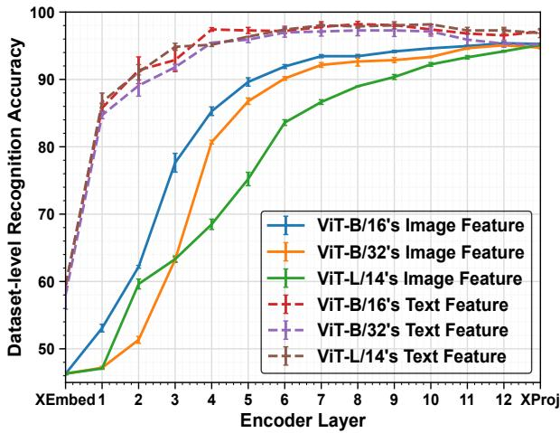
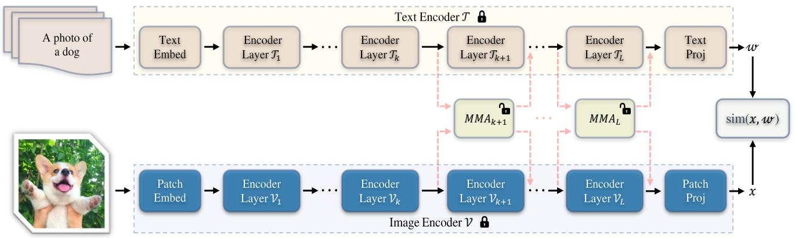
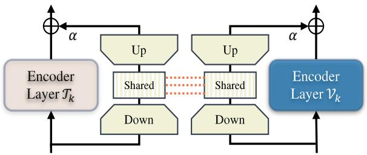
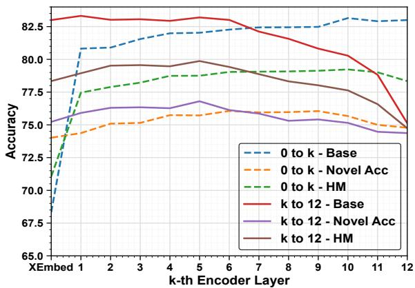

# MMA: Multi-Modal Adapter for Vision-Language Models

Lingxiao Yang1, Ru-Yuan Zhang2, Yanchen Wang3, Xiaohua Xie1* 1Sun Yat-sen University, 2Shanghai Jiao Tong University, 3Stanford University {yanglx9, xiexiaoh6}@mail.sysu.edu.cn,ruyuanzhang@gmail.com, ppwang@stanford.edu 

# Abstract

Pre-trained Vision-Language Models (VLMs) have served as excellent foundation models for transfer learning in diverse downstream tasks. However, tuning VLMs for few-shot generalization tasks faces a discrimination — generalization dilemma, i.e., general knowledge should be preserved and task-specific knowledge should be fine-tuned. How to precisely identify these two types of representations remains a challenge. In this paper, we propose a Multi-Modal Adapter (MMA) for VLMs to improve the alignment between representations from text and vision branches. MMA aggregates features from different branches into a shared feature space so that gradients can be communicated across branches. To determine how to incorporate MMA, we systematically analyze the discriminability and generalizability of features across diverse datasets in both the vision and language branches, and find that (1) higher layers contain discriminable dataset-specific knowledge, while lower layers contain more generalizable knowledge, and (2) language features are more discriminable than visual features, and there are large semantic gaps between the features of the two modalities, especially in the lower layers. Therefore, we only incorporate MMA to a few higher layers of transformers to achieve an optimal balance between discrimination and generalization. We evaluate the effectiveness of our approach on three tasks: generalization to novel classes, novel target datasets, and domain generalization. Compared to many state-of-the-art methods, our MMA achieves leading performance in all evaluations. Code is at https://github.com/ZjjConan/Multi-Modal-Adapter 

# 1. Introduction

Deep networks trained on large-scale datasets [10, 81] have greatly boosted the performance on many vision tasks, such as image classification [13, 19, 27, 37, 56, 64, 66], object detection [17, 24, 53, 54, 83], semantic segmentation [6, 42, 63, 79], and person re-identification [59, 69, 75, 76]. 

Vision-Language Models (VLMs) [1, 28, 30, 50, 68, 70, 71, 74] have recently been introduced as a class of foundation models. They adopt a holistic approach by jointly processing visual and textual information, thereby fostering a shared understanding of the complex interplay between images and language. In order to establish a cohesive representation space, where positive pairs (i.e., related images and texts) are brought together and negative pairs (i.e., unrelated instances) are separated, VLMs are often trained from extensive web-scale datasets, e.g., 400 million imagetext pairs used in Contrastive Language-Image Pretraining (CLIP) [50]. After training on such large-scale data, VLMs often show good generalization ability across diverse downstream tasks without task-specific tuning. 

Despite their effectiveness, the massive number of parameters of VLMs makes it difficult to fine-tune them for downstream tasks, especially when only a few data are available in the target domains (i.e., few-shot generalization settings). To effectively adapt these pre-trained VLMs, prompt engineering [50] has become pivotal. Prompt engineering refers to the process of crafting input queries to guide models toward desired outputs. For example, in CLIP [50], a collection of handcrafted text prompts, such as “a photo of a <category>” or “a bad photo of a <category>”, are input for the text encoder to compute category-wise embeddings. Then, these embeddings are matched with the visual embeddings encoded by the image encoder to predict the output class. However, designing good prompts requires rich expert knowledge and enormous time. To circumvent this, many researchers add learnable prompts either into the text [4, 67, 84, 85] or the image encoder [51, 61], or both of them [33]. During model training, only the prompts are optimized, while the whole pre-trained VLMs are frozen. Therefore, prompt learning has gained prominence as it offers a more practical approach to tailor pre-trained VLMs for different downstream tasks. 

Besides prompt learning, an alternative approach is to construct lightweight modules, called as adapters, to adapt large-scale pre-trained models [5, 7, 8, 16, 25, 26, 45, 58] to different downstream tasks. In contrast to prompt learning, adapters are shallow networks that enhance model generalizability via some types of feature fusion. For example, two recent methods – Clip-Adapter [16] and AdaptFormer [7], fuse features by adding the outputs from pre-trained models and the added adapters. Similar to prompt learning, only these extra adapters are optimized during the training phase to avoid overfitting. In addition, unlike prompt learning [39, 40, 84, 85], adapters operate independently of network architectures and allow easy integration into diverse networks, including ResNets [19], ViTs [13], Swins [41], Diffusion Models [45] and so on. 

Although these adapters are an efficient tool in many NLP and vision applications, they still have two limitations. First, most of existing adapters, such as LoRA [26] and AdaptFormer [7] are based on uni-modal information. For VLMs such as CLIP [50], dual-modal signals – vision and language – coexist and jointly contribute to final predictions. A simple approach is to apply an adapter independently to both modalities. However, this approach does not consider the relationship between text and image representations (before the final predictions). Therefore, direct applications of the same adapters may be insufficient to learn task-specific cues that vary across both vision and language. Second, existing methods do not consider the characteristics of text and image representations. Transfer learning in general faces the discrimination and generalization dilemma — that is, fine-tuning the features that are discriminable across tasks and preserving the features that are general across tasks. For example, AdaptFormer [7] incorporates adapters to every transformer block. This approach works well with a sufficient amount of training data, but may suffer from overfitting problem when training data is scarce. As such, it is important to consider the characteristics of features (i.e., discriminability and generalizability). 

To this end, we propose a novel Multi-Modal Adapter (MMA) architecture for VLMs such that the text and image representations can be better aligned. Our MMA contains independent projection layers to learn task-specific knowledge in both text and vision branches. To promote different modal alignment, we design a unified feature-projection layer shared by both modalities. During the fine-tuning, this unified feature space communicates gradients from both modalities to improve the alignment. In addition, we evaluate the discriminability and generalizability of features in both branches across datasets. This dataset-level feature classification identifies that higher layer features as taskspecific features should be fine-tuned, while lower layer features as pre-trained generalizable features should be frozen. Therefore, we only incorporate our adapters to higher layers. This design circumvents the issue of insufficient statistical information to understand feature characteristics due to limited number of training samples in each dataset. In summary, the main contributions are: 

• We introduce a dataset-level analysis method to systematically examine feature representations for transformerbased CLIP models. This analysis helps build more effective and efficient adapters for VLMs. 

• We propose a novel adapter that contains separate projection layers to improve feature representations for image and text encoders independently. We also introduce a shared projection to provide better alignment between vision-language representations. 

• We integrate our adapter into the well-known CLIP model and evaluate them on various few-shot generalization tasks. Experiment results show that our method achieves leading performance among all compared approaches. 

# 2. Related Work

Vision-Language Models. Recent advancements in VLMs have significantly impacted the field of computer vision, particularly in tasks that combine language with images. Representative models include but not limited to CLIP [50], ALIGN [30], FILIP [68], Florence [71], LiT [74], and Kosmos [28, 49]. These models leverage self-supervised paradigm from massive web-scale multi-modal data for training. For example, CLIP [50] and ALIGN [30] are trained with contrastive loss [47] from approximately 400 million and 1 billion image-text pairs, respectively. By collecting more number of multi-modal data [55], these models show promising performance in various downstream applications [29]. Despite their ability to learn generalized representations, efficiently adapting these pre-trained VLMs for specific downstream tasks remains a significant challenge, especially in few-shot settings. To do so, numerous studies have been proposed for different tasks such as few-shot image recognition [16, 35, 77, 84], object detection [15, 18, 72, 80, 86], and segmentation [12, 20, 82]. In contrast, this work proposes a new multi-modal adapters to effectively adapt VLMs in the few-shot generalization tasks. 

Efficient Transfer Learning for VLMs. To transfer pretrained models to downstream tasks, conventional methods [3, 11, 19] fine-tune all parameters of the pre-trained networks. However, as model sizes expanding, the traditional paradigm is inevitably constrained by the substantial computational burden. Moreover, fine-tuning such massive number of trainable parameters has introduced the risk of severe over-fitting, especially in the few-shot settings. Therefore, multiple parameter efficient methods have been introduced in NLP community [25, 26, 40], which are further extended in vision [7, 31] and VLMs communities [16, 33, 38, 73, 84, 85]. These works could be mainly categorized into the token-based prompt learning and networkbased adapting (adapter). For prompt learning in VLMs, it initially involves providing textual instructions to the language component of the VLMs. This approach enhances the model’s task comprehension and adaptability. For example, CoOp [84] improve the CLIP’s model in few-shot learning by optimizing a continuous set of prompt vectors in its language branch. CoCoOp [85] further extends CoOp by conditioning the prompts on specific image instances. Other representative works allow to capture the distribution of diverse prompts [43], reduce the risk of overfitting problem by using the pre-trained CLIP as general knowledge to regularize learning process [4, 34, 67], and construct multi-modal prompts on both image and text branches [33]. These works significantly improve alignment between vision and language representations, outperforming CoOp and CoCoOp in various aspects. For adapters, existing works often utilize uni-modal adapter for tuning. For example, Clip-Adapter [16] and Tip-Adapter [78] add an adapter layer after the image encoder. Recently, a multi-modal adapter [32] has been introduced for text-video retrieval. It is inserted after every self-attention and feed-forward MLP modules. All these developments for VLMs signify a paradigm shift from full fine-tuning [50] to partially learning-based methods. However, these methods underscore the different behaviours of different layers in leveraging the full potential of large pre-trained VLMs for diverse and challenging downstream tasks, especially for few-shot generalization tasks. 

# 3. Methods

Following most of existing studies [4, 33, 34, 38, 84, 85], we base on the pre-trained transformer-based CLIP models [50], i.e., using transformers in both text and vision encoders. In the following, we first introduce preliminary knowledge on CLIP and then present our proposed MMA. 

# 3.1. Preliminary

CLIP [50] is a fundamental Vision-Language Model (VLM) that has attracted considerable attention in natural language processing and computer vision. It consists of a text branch with an encoder $\tau$ and a vision branch with an encoder V. The two branches allow it to understand and bridge the semantic gap between textual descriptions and visual contents. The text and vision encoders are jointly pre-trained with contrastive objective [47, 50] on web-scale image-text pairs [50] to pull related image-text pairs closely, and vice versa for unrelated pairs. By this large-scale pre-training, CLIP can simultaneously encode images and text descriptions to perform a wide range of downstream tasks. Particularly, an Image I will be fed into the image encoder V to obtain the image feature x as follows: 

$$
\boldsymbol {x} _ {0} = \text { PatchEmbed } (\boldsymbol {I}) \tag {1}
$$

$$
[ \boldsymbol {c} _ {i}, \boldsymbol {x} _ {i} ] = \boldsymbol {\mathcal {V}} _ {i} ([ \boldsymbol {c} _ {i - 1}, \boldsymbol {x} _ {i - 1} ]) \quad i = 1, 2,..., L \tag {2}
$$

$$
\boldsymbol {x} = \text { PatchProj } (\boldsymbol {c} _ {L}) \tag {3}
$$

Here, P atchEmbed first splits the input image I into fixedsize patches, and then project these patches into features. After that, a learnable class token $c _ { 0 }$ is concatenated with these features $\mathbf { \Sigma } - \left[ \mathbf { c } _ { 0 } , \mathbf { x } _ { 0 } \right]$ , and the concatenated features are sequentially passed through L transformer blocks $\{ \mathcal { V } \} _ { i = 1 } ^ { L }$ Finally, a projection layer P atchP roj projects the class token $c _ { L }$ of the last transformer block $\nu _ { L }$ into the image feature x, which should lie in the common vision-language space. Similarity, a text description T will be fed into the text encoder T to obtain text feature w as follows: 

Figure 1. Dataset-level recognition accuracy of different layers in various transformer-based CLIP models. This experiment is to identify which dataset that sample belongs to. We run thee times with different seeds, and report average and standard deviation of recognition accuracy for each layer. XEmbed refers to text or image embedding layer before the transformer blocks $( i . e . ,$ selfattention and feed-forward layers [13]), while XP roj refers to text or image projection layer. Notice that, this experiment only uses training examples from all datasets for evaluation.

$$
[ \boldsymbol {w} _ {0} ^ {j} ] _ {j = 1} ^ {N} = \text { TextEmbed } (\boldsymbol {T}) \tag {4}
$$

$$
[ \boldsymbol {w} _ {i} ^ {j} ] _ {j = 1} ^ {N} = \mathcal {T} _ {i} ([ \boldsymbol {w} _ {i - 1} ^ {j} ] _ {j = 1} ^ {N}) \quad i = 1, 2,..., L \tag {5}
$$

$$
\boldsymbol {w} = \text { TextProj } (\boldsymbol {w} _ {L} ^ {N}) \tag {6}
$$

As shown, this process has three steps: a T extEmbed is used to tokenize and project the input text description into N word embeddings, a series of transformer blocks $\{ \mathcal { T } \} _ { i = 1 } ^ { L }$ is to abstract features, and a T extP roj is to project the last token $\boldsymbol { w _ { L } ^ { N } }$ of the last transformer block $\sigma _ { L }$ to the common vision-language space. Given those features, we can compute the cosine similarity scores sim(x, w) between images and text descriptions in different domains or tasks to perform task-specific predictions. 

# 3.2. MMA: Multi-Modal Adapter

Our work mainly focuses on few-shot generalization tasks [85], where the pre-trained CLIP models are firstly tuned on some base classes with limited training examples, and then directly tested to recognize unseen instances, e.g., novel classes or different types of datasets. For these tasks, it is well known that a good representation of an instance should be discriminable, and also generalizable across different types of datasets. These two properties play an important role in transfer learning. Unfortunately, it is difficult to systematically quantify these two characteristics in the few-shot scenario, i.e., a few samples can be accessed in the dataset. Inspired by the dataset bias introduced in [60], we introduce a task in which observers identify which dataset a sample belongs to, called dataset-level recognition. In other words, more discriminable features are easier to distinguish between different datasets, whereas more generalizable features are more invariant across datasets. Based on this intuition, we perform an analysis using three pretrained transformer-based CLIP models [50], i.e., ViT-B/16, ViT-B/32, and ViT-L/14, due to their superior performance [16, 51, 84, 85]. All models have similar structures in image and text encoders as shown in Eq. (1) to Eq. (6), and the number of transformer blocks L is 12. In addition, to deepen our understanding of different features, we extract features from all layers in both text and image encoders, and train linear classifiers to perform dataset-level recognition. As shown in Fig. 1, we have two observations: 

Figure 2. The proposed Multi-Modal Adapter (MMA) for the transformer-based CLIP models. Our MMA tunes both image and text encoders. Only the extra adapters are optimized, while the whole pre-trained CLIP models are frozen. In our method, only a few higher layers (≥ k) of each encoder will be tuned based on our analysis to strike a good balance between discrimination and generalization dilemma. Moreover, our MMA shares weights between image and text representations to learn shared cues from different branches. By this design, our MMA eliminates feature-wise interactions between each image-text pair [85], greatly reducing the computational cost.

Observation-1. In both pre-trained text and image encoders, higher layers contain discriminable dataset-specific representations, while lower layers contain generalizable representations across different datasets. These results suggest that it is easier to tune higher layers for downstream tasks than lower layers, and that freezing lower layers can preserve more generalizable knowledge than higher layers. 

Observation-2. In most cases, text features, as they are encoded with semantic category names, are more discriminable across datasets than visual features. In addition, there are larger gaps between text and image features in lower layers than in higher layers. Therefore, we argue that it is more difficult to align lower layers between text and image features than between higher layers, especially tuning with limited training samples. 

Based on the above two observations, we propose a new adapter-based efficient tuning framework as below. 

Macro Design. According to the observation 1, we propose a novel Multi-Modal Adapter (MMA) as shown in Fig. 2. Different from most of existing methods that add adapters or tokens to the whole network [7, 25, 26, 32] or some lower layers [33, 34, 84, 85], the new adapter A (detailed in the next) are partially added into a few higher-layers of both image and text encoders. Formally, for the image encoder V, we add our adapters $A ^ { v }$ from the k-th transformer block and modified Eq. (2) as follows: 

$$
[ \boldsymbol {c} _ {i}, \boldsymbol {x} _ {i} ] = \boldsymbol {\mathcal {V}} _ {i} ([ \boldsymbol {c} _ {i - 1}, \boldsymbol {x} _ {i - 1} ]) \quad i = 1, 2,..., k - 1 \tag {7}
$$

$$
[ \boldsymbol {c} _ {j}, \boldsymbol {x} _ {j} ] = \boldsymbol {\mathcal {V}} _ {j} ([ \boldsymbol {c} _ {j - 1}, \boldsymbol {x} _ {j - 1} ]) + \alpha \underline {{\boldsymbol {\mathcal {A}} _ {j} ^ {v} ([ \boldsymbol {c} _ {j - 1} , \boldsymbol {x} _ {j - 1} ])}}
$$

$$
j = k, k + 1,..., L. \tag {8}
$$

Here, underline indicates trainable blocks. α is a coefficient to balance between task-specific knowledge and general pre-trained knowledge. Obviously, α = 0 degrades to the original transformer block without integrating any extra knowledge. Similarly, we add adapters $\mathcal { A } ^ { t }$ to the text encoder T and modified Eq. (5) as follows: 

$$
[ \boldsymbol {w} _ {i} ^ {j} ] _ {j = 1} ^ {N} = \boldsymbol {\mathcal {T}} _ {i} ([ \boldsymbol {w} _ {i - 1} ^ {j} ] _ {j = 1} ^ {N}) \quad i = 1, 2,..., k - 1 \tag {9}
$$

$$
[ \boldsymbol {w} _ {i} ^ {j} ] _ {j = 1} ^ {N} = \boldsymbol {\mathcal {T}} _ {j} ([ \boldsymbol {w} _ {i - 1} ^ {j} ] _ {j = 1} ^ {N}) + \alpha \underline {{\boldsymbol {\mathcal {A}} _ {j} ^ {t} ([ \boldsymbol {w} _ {i - 1} ^ {j} ] _ {j = 1} ^ {N})}}
$$

$$
j = k, k + 1,..., L \tag {10}
$$

Micro Design. Currently, our method adapts adapters independently in both image and text branches to learn taskspecific knowledge. However, as our observation-2, the large semantic gap between vision and language branches will make the model hard to be aligned, especially when only a few training examples can be accessed. To bridge the representations in both branches, we propose a multimodal unit with a shared projection layer as shown in Fig. 3. This unit first uses a separate projection layer to project each branch input into features with the same dimensions. After that, a shared projection layer is employed to aggregate these dual-modal signals, followed by a separate layer to match the output dimensions from each branch. Formally, this process can be summarized as follows: 

Figure 3. The newly designed multi-modal unit. It contains separate projection layers (“Down” and “Up”) to tune different modals’ encoders, as well as a shared projection layer (“Shared”) to build a strong connection between vision and language branches.

$$
\boldsymbol {\mathcal {A}} _ {k} ^ {v} (\boldsymbol {z} _ {k}) = \boldsymbol {W} _ {k u} ^ {v} \cdot \delta (\boldsymbol {W} _ {k s} \cdot \delta (\boldsymbol {W} _ {k d} ^ {v} \cdot \boldsymbol {z} _ {k}))
$$

$$
\boldsymbol {z} _ {k} = \left[ \boldsymbol {c} _ {k}, \boldsymbol {x} _ {k} \right] \tag {11}
$$

A similar process is added to text encoder as follows: 

$$
\boldsymbol {\mathcal {A}} _ {k} ^ {t} (\boldsymbol {z} _ {k}) = \boldsymbol {W} _ {k u} ^ {t} \cdot \delta (\boldsymbol {W} _ {k s} \cdot \delta (\boldsymbol {W} _ {k d} ^ {t} \cdot \boldsymbol {z} _ {k}))
$$

$$
\boldsymbol {z} _ {k} = \left[ \boldsymbol {w} _ {k} ^ {j} \right] _ {j = 1} ^ {N} \tag {12}
$$

Here, $W _ { k u }$ and $W _ { k d }$ are the k-th “Up” and “Down” projection layers illustrated in Fig. 3, where the modality branch is highlighted by superscript. $W _ { k s }$ are the k-th projection layer, which is shared between different branches in Eq. (11) and Eq. (12). Importantly, the shared projection acts as a bridge between two modalities and allows gradients to be propagated into each other, leading to better aligning different modality signals. 

# 4. Experiments

We evaluate the performance of MMA based on previous works [33, 85], including Generalization from Base-to-Novel Classes, Cross-dataset Evaluation, and Domain Generalization. All these experiments are based on 16-shot settings, i.e., only 16 training examples per category. 

Generalization from Base-to-Novel Classes. As done in many previous studies [33, 84, 85], we evaluate our method on 11 image classification datasets, including 2 general object recognition datasets: ImageNet [10] and Caltech101 [14]; 5 fine-grained image recognition datasets: OxfordPets [48], StanfordCars [36], Flowers102 [46], Food101 [2], and FGVCAircraft [44]; scene understanding dataset: SUN397 [65]; a texture dataset: DTD [9]; a satellite-image recognition dataset: EuroSAT [21] and an action classification dataset: UCF101 [57]. These datasets cover a wide range of recognition tasks, which can show good generalization ability of a model. For this experiment, we follow the same setup in [4, 33, 43, 67, 85] that trains our model only on the base classes in a few-shot setting (16-shots), and test the trained model on both base and novel categories. 

Cross-dataset Evaluation. Similar to the Base-to-Novel experiments, we also use the aforementioned 11 datasets for cross-dataset evaluation. As suggested in CoCoOp [85], all models are trained on ImageNet with 1000 categories, each category having 16 training samples. After that, models are directly evaluated on other datasets without further tuning. 

Domain Generalization. To evaluate the robustness of models on out-of-distribution datasets, Zhou et al. [85] suggest to test the ImageNet fine-tuned models on other four variants of ImageNet datasets with different types of domain shifts. These datasets are ImageNetV2 [52], ImageNet-Sketch [62], ImageNet-A [23], and ImageNet-R [22]. We also conduct this experiment for evaluation. 

Implementation Details. Following previous works [4, 33, 43, 67, 84, 85], we conduct all experiments with the fewshot setting, i.e. 16 shots per category. We use ViT-B/16 based CLIP model in all settings of experiments. In the Base-to-Novel setting, we add the proposed multi-modal unit starting from $k = 5$ transformer block to the last one in both language and vision branches. The dimension of the shared projection layer is 32. We also use the template “a photo of a <category>” [33, 85] for the word embeddings, where “<category>” will be replaced with the class names as zero-shot recognition [50]. We train our models for 5 epochs. On the large-scale ImageNet dataset, we use a batch size of 128 for training. On the other 10 datasets, we set the batch size to 16. For the other two experiment settings, similar to MaPLe [33], we set $k = 9$ and train our models just for 1 epoch. Optimization is done by a SGD solver with a momentum of 0.9 and a weight decay of 0.0005. All our models are trained with a cosine learning rate schedule on a single GPU device with mix-precision for speeding up. We report Base and Novel class accuracies, and their harmonic mean (HM) averaged over 3 runs with 3 different seeds. For other two settings, we report class accuracy on each dataset. 

# 4.1. Main Results

Base-To-Novel Generalization. In this experiment, we compare our MMA with many state-of-the-art approaches, including the zero-shot baseline – CLIP [50], text-based prompt learners – CoOp [84], CoOpOp [85], ProDA [43], KgCoOp [67], LASP [4] and LASP-V [4], and two recently introduced multi-modal prompt learning methods: RPO [38] and MaPLe [33]. Recognition accuracy on 11 widely used datasets of base (Base) and novel (Novel) classes, as well as the trade-off between these two metrics – harmonic mean (HM), are reported in Tab. 1. 

Table 1. Comparison with state-of-the-art methods on different datasets in the Base-to-Novel Generalization setting. “Base” and “Novel” are the recognition accuracies on base and novel classes respectively. “HM” is the harmonic mean of base and new accuracy, providing the trade-off between adaption and generalization. The proposed MMA shows a good adaptation ability, while being highly effective in novel class generalization. The entries noted by grey are obtained by using novel class information during training.

<table><tr><td rowspan="2">Methods</td><td colspan="3">Average</td><td colspan="3">ImageNet</td><td colspan="3">Caltech101</td><td colspan="3">OxfordPets</td></tr><tr><td>Base</td><td>Novel</td><td>HM</td><td>Base</td><td>Novel</td><td>HM</td><td>Base</td><td>Novel</td><td>HM</td><td>Base</td><td>Novel</td><td>HM</td></tr><tr><td>CLIP [ICML2021] [50]</td><td>69.34</td><td>74.22</td><td>71.70</td><td>72.43</td><td>68.14</td><td>70.22</td><td>96.84</td><td>94.00</td><td>95.40</td><td>91.17</td><td>97.26</td><td>94.12</td></tr><tr><td>CoOp [IJCV2022] [84]</td><td>82.69</td><td>63.22</td><td>71.66</td><td>76.47</td><td>67.88</td><td>71.92</td><td>98.00</td><td>89.81</td><td>93.73</td><td>93.67</td><td>95.29</td><td>94.47</td></tr><tr><td>CoOpOp [CVPR2022] [85]</td><td>80.47</td><td>71.69</td><td>75.83</td><td>75.98</td><td>70.43</td><td>73.10</td><td>97.96</td><td>93.81</td><td>95.84</td><td>95.20</td><td>97.69</td><td>96.43</td></tr><tr><td>ProDA [CVPR2022] [43]</td><td>81.56</td><td>72.30</td><td>76.65</td><td>75.40</td><td>70.23</td><td>72.72</td><td>98.27</td><td>93.23</td><td>95.68</td><td>95.43</td><td>97.83</td><td>96.62</td></tr><tr><td>KgCoOp [CVPR2023] [67]</td><td>80.73</td><td>73.60</td><td>77.00</td><td>75.83</td><td>69.96</td><td>72.78</td><td>97.72</td><td>94.39</td><td>96.03</td><td>94.65</td><td>97.76</td><td>96.18</td></tr><tr><td>MaPLe [CVPR2023] [33]</td><td>82.28</td><td>75.14</td><td>78.55</td><td>76.66</td><td>70.54</td><td>73.47</td><td>97.74</td><td>94.36</td><td>96.02</td><td>95.43</td><td>97.76</td><td>96.58</td></tr><tr><td>LASP [CVPR2023] [4]</td><td>82.70</td><td>74.90</td><td>78.61</td><td>76.20</td><td>70.95</td><td>73.48</td><td>98.10</td><td>94.24</td><td>96.16</td><td>95.90</td><td>97.93</td><td>96.90</td></tr><tr><td>LASP-V [CVPR2023] [4]</td><td>83.18</td><td>76.11</td><td>79.48</td><td>76.25</td><td>71.17</td><td>73.62</td><td>98.17</td><td>94.33</td><td>96.43</td><td>95.73</td><td>97.87</td><td>96.79</td></tr><tr><td>RPO [ICCV2023] [38]</td><td>81.13</td><td>75.00</td><td>77.78</td><td>76.60</td><td>71.57</td><td>74.00</td><td>97.97</td><td>94.37</td><td>96.03</td><td>94.63</td><td>97.50</td><td>96.05</td></tr><tr><td>MMA [this work]</td><td>83.20</td><td>76.80</td><td>79.87</td><td>77.31</td><td>71.00</td><td>74.02</td><td>98.40</td><td>94.00</td><td>96.15</td><td>95.40</td><td>98.07</td><td>96.72</td></tr><tr><td rowspan="2">Methods</td><td colspan="3">StanfordCars</td><td colspan="3">Flowers102</td><td colspan="3">Food101</td><td colspan="3">FGVCAircraft</td></tr><tr><td>Base</td><td>Novel</td><td>HM</td><td>Base</td><td>Novel</td><td>HM</td><td>Base</td><td>Novel</td><td>HM</td><td>Base</td><td>Novel</td><td>HM</td></tr><tr><td>CLIP [ICML2021] [50]</td><td>63.37</td><td>74.89</td><td>68.65</td><td>72.08</td><td>77.80</td><td>74.83</td><td>90.10</td><td>91.22</td><td>90.66</td><td>27.19</td><td>36.29</td><td>31.09</td></tr><tr><td>CoOp [IJCV2022] [84]</td><td>78.12</td><td>60.40</td><td>68.13</td><td>97.60</td><td>59.67</td><td>74.06</td><td>88.33</td><td>82.26</td><td>85.19</td><td>40.44</td><td>22.30</td><td>28.75</td></tr><tr><td>CoOpOp [CVPR2022] [85]</td><td>70.49</td><td>73.59</td><td>72.01</td><td>94.87</td><td>71.75</td><td>81.71</td><td>90.70</td><td>91.29</td><td>90.99</td><td>33.41</td><td>23.71</td><td>27.74</td></tr><tr><td>ProDA [CVPR2022] [43]</td><td>74.70</td><td>71.20</td><td>72.91</td><td>97.70</td><td>68.68</td><td>80.66</td><td>90.30</td><td>88.57</td><td>89.43</td><td>36.90</td><td>34.13</td><td>35.46</td></tr><tr><td>KgCoOp [CVPR2022] [67]</td><td>71.76</td><td>75.04</td><td>73.36</td><td>95.00</td><td>74.73</td><td>83.65</td><td>90.50</td><td>91.70</td><td>91.09</td><td>36.21</td><td>33.55</td><td>34.83</td></tr><tr><td>MaPLe [CVPR2022] [33]</td><td>72.94</td><td>74.00</td><td>73.47</td><td>95.92</td><td>72.46</td><td>82.56</td><td>90.71</td><td>92.05</td><td>91.38</td><td>37.44</td><td>35.61</td><td>36.50</td></tr><tr><td>LASP [CVPR2022] [4]</td><td>75.17</td><td>71.60</td><td>73.34</td><td>97.00</td><td>74.00</td><td>83.95</td><td>91.20</td><td>91.70</td><td>91.44</td><td>34.53</td><td>30.57</td><td>32.43</td></tr><tr><td>LASP-V [CVPR2022] [4]</td><td>75.23</td><td>71.77</td><td>73.46</td><td>97.17</td><td>73.53</td><td>83.71</td><td>91.20</td><td>91.90</td><td>91.54</td><td>38.05</td><td>33.20</td><td>35.46</td></tr><tr><td>RPO [ICCV2023] [38]</td><td>73.87</td><td>75.53</td><td>74.69</td><td>94.13</td><td>76.67</td><td>84.50</td><td>90.33</td><td>90.83</td><td>90.58</td><td>37.33</td><td>34.20</td><td>35.70</td></tr><tr><td>MMA [this work]</td><td>78.50</td><td>73.10</td><td>75.70</td><td>97.77</td><td>75.93</td><td>85.48</td><td>90.13</td><td>91.30</td><td>90.71</td><td>40.57</td><td>36.33</td><td>38.33</td></tr><tr><td rowspan="2">Methods</td><td colspan="3">SUN397</td><td colspan="3">DTD</td><td colspan="3">EuroSAT</td><td colspan="3">UCF101</td></tr><tr><td>Base</td><td>Novel</td><td>HM</td><td>Base</td><td>Novel</td><td>HM</td><td>Base</td><td>Novel</td><td>HM</td><td>Base</td><td>Novel</td><td>HM</td></tr><tr><td>CLIP [ICML2021] [50]</td><td>69.36</td><td>75.35</td><td>72.23</td><td>53.24</td><td>59.90</td><td>56.37</td><td>56.48</td><td>64.05</td><td>60.03</td><td>70.53</td><td>77.50</td><td>73.85</td></tr><tr><td>CoOp [IJCV2022] [84]</td><td>80.60</td><td>65.89</td><td>72.51</td><td>79.44</td><td>41.18</td><td>54.24</td><td>92.19</td><td>54.74</td><td>68.69</td><td>84.69</td><td>56.05</td><td>67.46</td></tr><tr><td>CoOpOp [CVPR2022] [85]</td><td>79.74</td><td>76.86</td><td>78.27</td><td>77.01</td><td>56.00</td><td>64.85</td><td>87.49</td><td>60.04</td><td>71.21</td><td>82.33</td><td>73.45</td><td>77.64</td></tr><tr><td>ProDA [CVPR2022] [43]</td><td>78.67</td><td>76.93</td><td>77.79</td><td>80.67</td><td>56.48</td><td>66.44</td><td>83.90</td><td>66.00</td><td>73.88</td><td>85.23</td><td>71.97</td><td>78.04</td></tr><tr><td>KgCoOp [CVPR2023] [67]</td><td>80.29</td><td>76.53</td><td>78.36</td><td>77.55</td><td>54.99</td><td>64.35</td><td>85.64</td><td>64.34</td><td>73.48</td><td>82.89</td><td>76.67</td><td>79.65</td></tr><tr><td>MaPLe [CVPR2023] [33]</td><td>80.82</td><td>78.70</td><td>79.75</td><td>80.36</td><td>59.18</td><td>68.16</td><td>94.07</td><td>73.23</td><td>82.35</td><td>83.00</td><td>78.66</td><td>80.77</td></tr><tr><td>LASP [CVPR2023] [4]</td><td>80.70</td><td>78.60</td><td>79.63</td><td>81.40</td><td>58.60</td><td>68.14</td><td>94.60</td><td>77.78</td><td>85.36</td><td>84.77</td><td>78.03</td><td>81.26</td></tr><tr><td>LASP-V [CVPR2023] [4]</td><td>80.70</td><td>79.30</td><td>80.00</td><td>81.10</td><td>62.57</td><td>70.64</td><td>95.00</td><td>83.37</td><td>88.86</td><td>85.53</td><td>78.20</td><td>81.70</td></tr><tr><td>RPO [ICCV2023] [38]</td><td>80.60</td><td>77.80</td><td>79.18</td><td>76.70</td><td>62.13</td><td>68.61</td><td>86.63</td><td>68.97</td><td>76.79</td><td>83.67</td><td>75.43</td><td>79.34</td></tr><tr><td>MMA [this work]</td><td>82.27</td><td>78.57</td><td>80.38</td><td>83.20</td><td>65.63</td><td>73.38</td><td>85.46</td><td>82.34</td><td>83.87</td><td>86.23</td><td>80.03</td><td>82.20</td></tr></table>

Based on these results, we have made three main conclusions. First, the proposed MMA achieves the best average performance over 11 datasets on all evaluation met-

rics, i.e., base and novel accuracy, as well as their harmonic mean. Among all compared methods, LASP [4] introduces a text-to-text loss that maximizes the probability of the learned prompts to be correctly classified into predefined handcrafted textual prompts. This method provides the best trade-off in recognizing base and novel classes, which is further improved by training with novel class information in LASP-V. Our MMA outperforms LASP and its variant LASP-V with an average HM of 79.87 without any novel class information during training. Specifically, our MMA achieves slightly better performance on the base class (+0.02) and performs significantly better than LASP (+1.9) and LASP-V (+0.69) on novel class generalization. We believe that our method is more flexible and it is much easier to deploy our method in different unseen scenarios than LASP-V. Second, the recent multimodal prompt learning method - $\mathbf { M a P L e }$ [33] adds learnable prompts from lower to higher layers of both text and image encoders. Furthermore, MaPLe uses a couple function to improve the alignment between text and image features. Compared with MaPLe, our MMA achieves +0.92, +1.66, and +1.32 performance gains in terms of base accuracy, novel accuracy, and their harmonic mean, respectively. Third, none of these methods can obtain the leading performance on all 11 datasets in all three evaluation metrics. For example, our MMA obtains better performance on base classes on 8/11 datasets, while also performing better on novel classes on 4/11 datasets; LASP-V obtains the leading performance on $2 / 1 1$ and 3/11 datasets on base and novel classes respectively; the zero-shot classifier (denoted as CLIP) achieves superior performance on novel class on Flowers102, and also performs on par with others on Caltech101, OxfordPets, and Food101. These results indicate that the Base-to-Novel generalization is still challenging, and our MMA provides the best trade-off. 

Table 2. Comparison of MMA with state-of-the-art methods in the Cross-Dataset Evaluation setting. Overall, our MMA obtains leading average performance over 10 datasets, demonstrating the good zero-shot transferable ability.

<table><tr><td>Methods</td><td>ImageNet</td><td>Caltech101</td><td>OxfordPets</td><td>StanfordCars</td><td>Flowers101</td><td>Food101</td><td>FGVCAircraft</td><td>SUN397</td><td>DTD</td><td>EuroSAT</td><td>UCF101</td><td>Average</td></tr><tr><td>CoOp [IJCV2022] [84]</td><td>71.51</td><td>93.70</td><td>89.14</td><td>64.51</td><td>68.71</td><td>85.30</td><td>18.47</td><td>64.15</td><td>41.92</td><td>46.39</td><td>66.55</td><td>63.88</td></tr><tr><td>CoCoOp [CVPR2022] [85]</td><td>71.02</td><td>94.43</td><td>90.14</td><td>65.32</td><td>71.88</td><td>86.06</td><td>22.94</td><td>67.36</td><td>45.73</td><td>45.37</td><td>68.21</td><td>65.74</td></tr><tr><td>MaPLe [CVPR2023] [33]</td><td>70.72</td><td>93.53</td><td>90.49</td><td>65.57</td><td>72.23</td><td>86.20</td><td>24.74</td><td>67.01</td><td>46.49</td><td>48.06</td><td>68.69</td><td>66.30</td></tr><tr><td>PromptSRC [ICCV2023] [34]</td><td>71.27</td><td>93.60</td><td>90.25</td><td>65.70</td><td>70.25</td><td>86.15</td><td>23.90</td><td>67.10</td><td>46.87</td><td>45.50</td><td>68.75</td><td>65.81</td></tr><tr><td>MMA [this work]</td><td>71.00</td><td>93.80</td><td>90.30</td><td>66.13</td><td>72.07</td><td>86.12</td><td>25.33</td><td>68.17</td><td>46.57</td><td>49.24</td><td>68.32</td><td>66.61</td></tr></table>

Table 3. Comparison of MMA with state-of-the-art methods in the Domain Generalization setting. Overall, our MMA obtains the best performance in 3/4 out-of-distribution datasets, showing good robustness to domain shifts.

<table><tr><td>Methods</td><td>ImageNet</td><td>-V2</td><td>-S</td><td>-A</td><td>-R</td></tr><tr><td>CLIP [ICML2021] [50]</td><td>66.73</td><td>60.83</td><td>46.15</td><td>47.77</td><td>73.96</td></tr><tr><td>CoOp [IJCV2022] [84]</td><td>71.51</td><td>64.20</td><td>47.99</td><td>49.71</td><td>75.21</td></tr><tr><td>CoCoOp [CVPR2022] [85]</td><td>71.02</td><td>64.07</td><td>48.75</td><td>50.63</td><td>76.18</td></tr><tr><td>MaPLe [CVPR2023] [33]</td><td>70.72</td><td>64.07</td><td>49.15</td><td>50.90</td><td>76.98</td></tr><tr><td>MMA [this work]</td><td>71.00</td><td>64.33</td><td>49.13</td><td>51.12</td><td>77.32</td></tr></table>

Figure 4. Ablation studies on different choices of adding our proposed multi-modal units. We report average scores of Base, Novel and HM over 11 datasets. Results obtained by adding after k = 5 shows the best tradeoff between discrimination and generalization.

Cross-Dataset Evaluation. We also experiment with the cross-dataset setting. Our MMA is first trained on all the 1000 ImageNet categories and then directly evaluated on the other 10 datasets used in the previous experiments. Tab. 2 summarizes all results. Our MMA achieves the best average accuracy of 66.61 compared with other state-of-theart methods. Particularly, MMA surpasses the second performer – MaPLe in half of these datasets. In addition, On the trained source dataset – ImageNet, our MMA also obtains very competitive performance against CoOp and Co-CopOp. MMA is slightly better than MaPLe. These results demonstrate the good zero-shot transferability of our MMA. 

Domain Generalization. Following previous works [33, 84, 85], we directly evaluate the models tuned on ImageNet to various out-of-domain datasets and show results in Tab. 2. Our MMA obtains superior performance in 3/4 out-of-distribution datasets, demonstrating the robustness to domain shifts in the domain generalization setting. 

# 4.2. Ablation Experiments

Variants of Adding MMA. We first evaluate the choices to add our MMA to different encoder layers. These choices include two kinds of approaches: from XEmbed to k-th layers, and from k-th layers to the last one, where $k \mathbf { \Psi } =$ XEmbed, $1 , . . . , 1 2$ . All results are shown in Fig. 4. For the former method, increasing k generally improves the performance on base classes but decreases accuracy on novel classes. For the latter method, the performance on base classes is generally maintained when k is around 5. But there is a large increase in the performance on novel classes before k = 5. So the highest HM of is 79.87 at k = 5. This further demonstrates our previous findings. 

Table 4. Ablation experiments over 11 datasets used in Base-to-Novel Generalization setting.

(a) Performance with Different Model Variants

<table><tr><td>Model Variants</td><td>Base</td><td>Novel</td><td>HM</td></tr><tr><td>Only L-Adapter</td><td>80.36</td><td>75.81</td><td>78.02</td></tr><tr><td>Only V-Adapter</td><td>80.39</td><td>74.18</td><td>77.16</td></tr><tr><td>No SharedProj</td><td>82.43</td><td>76.21</td><td>79.20</td></tr><tr><td>FCAA [1]</td><td>79.11</td><td>75.64</td><td>77.34</td></tr><tr><td>MMA</td><td>83.20</td><td>76.80</td><td>79.87</td></tr></table>

(b) Dimensions of Shared Layers

<table><tr><td>Dims</td><td>Base</td><td>Novel</td><td>HM</td></tr><tr><td>8</td><td>82.66</td><td>76.17</td><td>79.28</td></tr><tr><td>16</td><td>82.80</td><td>76.48</td><td>79.52</td></tr><tr><td>32</td><td>83.20</td><td>76.80</td><td>79.87</td></tr><tr><td>64</td><td>83.41</td><td>76.17</td><td>79.63</td></tr><tr><td>128</td><td>82.98</td><td>76.54</td><td>79.58</td></tr></table>

(c) Scaling Factor α

<table><tr><td>α</td><td>Base</td><td>Novel</td><td>HM</td></tr><tr><td>0.0001</td><td>79.40</td><td>75.57</td><td>77.44</td></tr><tr><td>0.0005</td><td>81.81</td><td>76.08</td><td>78.84</td></tr><tr><td>0.001</td><td>83.20</td><td>76.80</td><td>79.87</td></tr><tr><td>0.005</td><td>83.80</td><td>75.37</td><td>79.36</td></tr><tr><td>0.01</td><td>84.27</td><td>74.32</td><td>78.98</td></tr></table>

Table 5. Comparing our MMA with the baseline by fine-tuning last few layers on 11 datasets in Base-to-Novel Generalization setting. “10→12” refers to fine-tune the last 3 layers in both branches.

<table><tr><td>Layer</td><td>12</td><td>10→12</td><td>8→12</td><td>5→12</td><td>MMA</td></tr><tr><td>Base</td><td>80.77</td><td>83.02</td><td>83.77</td><td>83.21</td><td>83.20</td></tr><tr><td>Novel</td><td>74.08</td><td>74.55</td><td>73.77</td><td>70.95</td><td>76.80</td></tr><tr><td>HM</td><td>77.28</td><td>78.56</td><td>78.45</td><td>76.59</td><td>79.87</td></tr></table>

Adapting Variant Options. We assess the efficacy of various design choices for adapters. These design alternatives encompass only uni-modal adapter added in vision (V-) or language (L-), and no shared projection layer (No SharedP roj). We replace every MMA with Flagmingostyle cross-attention [1] to test whether it can be used as efficient adapters (referred as FCAA). In Tab. 4a, we present averaged results across 11 recognition datasets. We find that uni-modal adapters perform worse than the one adding adapters to both branches. Moreover, adding the shared projection layer further increases the HM from 79.20 to 79.87, demonstrating the importance of feature alignment. 

Dimension of the Shared Layer. The dimension of shared layers in our MMA determines the number of parameters to extract relationships between the features from the two modalities. We perform an ablation study on MMA by systematically varying the dimensions of the shared layers to investigate its effects. As depicted in Tab. 4b, accuracy on base class is highest with an increment in the middle dimension, but the novel accuracy performance reaches a saturation point at approximately 32. This may be because a larger dimension of the shared layers incurs more trainable parameters, increasing the risk of overfitting. 

Scaling Factor α. Scaling factor balances the importance of the general features and the tasks task-specific features. We systematically assess the effect of the scaling factor, and the results are presented in Tab. 4c. Our MMA attains the best trade-off performance (HM) between base and novel classes with $\alpha = 0 . 0 0 1$ . A large scaling factor helps our model to quickly adapt to base classes but shows inferior performance to novel classes, while a smaller scaling factor makes the model hard to tune in downstream tasks. 

Fine-tuning last few layers. Lastly, we compare our MMA with the baseline by just fine-tuning last few layers. The results are reported in Tab. 5. Fine-tuning more layers performs good on base classes but show worse performance on novel classes. This is because fine-tuning more layers may impair the general knowledge of the pre-trained VLMs. 

# 5. Conclusion

The adaptation of large-scale VLMs, exemplified by CLIP [50], to downstream tasks presents a formidable challenge, primarily because of the extensive number of trainable parameters juxtaposed with the limited scale of available training samples. In this paper, we propose a Multi-Modal Adapter (MMA) designed for both vision and language branches to enhance alignment between their respective representations. We systematically analyze the discriminability and generalizability of features across datasets in both vision and language branches, because these two characteristics play important roles in transfer learning, especially in the few-shot settings. Based on our analysis, we selectively introduce MMA to specific higher layers of transformers to achieve an optimal balance between discrimination and generalization. We assess the effectiveness of our approach through three representative tasks: generalization to novel classes, adaptation to new target datasets, and unseen domain shifts. Comparisons against other state-of-theart methods demonstrate that our MMA achieves superior performance across all three types of assessments. 

Acknowledgments. This project is partially supported by the NSFC (62206316, 62072482, U22A2095, 32100901), the Key-Area Research and Development Program of Guangzhou (202206030003), the NSF of Guangdong (2022A1515011254), the NSF of Shanghai (21ZR1434700), and the Fundamental Research Funds for the Central Universities of SYSU (23ptpy79). 

# References

[1] Jean-Baptiste Alayrac, Jeff Donahue, Pauline Luc, Antoine Miech, Iain Barr, Yana Hasson, Karel Lenc, Arthur Mensch, Katherine Millican, Malcolm Reynolds, et al. Flamingo: a visual language model for few-shot learning. Advances in Neural Information Processing Systems, 35:23716–23736, 2022. 1, 8 

[2] Lukas Bossard, Matthieu Guillaumin, and Luc Van Gool. Food-101–mining discriminative components with random forests. In European Conference on Computer Vision, pages 446–461. Springer, 2014. 5 

[3] Tom Brown, Benjamin Mann, Nick Ryder, Melanie Subbiah, Jared D Kaplan, Prafulla Dhariwal, Arvind Neelakantan, Pranav Shyam, Girish Sastry, Amanda Askell, et al. Language models are few-shot learners. Advances in Neural Information Processing Systems, 33:1877–1901, 2020. 2 

[4] Adrian Bulat and Georgios Tzimiropoulos. Lasp: Text-totext optimization for language-aware soft prompting of vision & language models. In Proceedings of the IEEE/CVF Conference on Computer Vision and Pattern Recognition, pages 23232–23241, 2023. 1, 3, 5, 6 

[5] Han Cai, Chuang Gan, Ligeng Zhu, and Song Han. Tinytl: Reduce memory, not parameters for efficient on-device learning. Advances in Neural Information Processing Systems, 33:11285–11297, 2020. 1 

[6] Qi Chen, Lingxiao Yang, Jian-Huang Lai, and Xiaohua Xie. Self-supervised image-specific prototype exploration for weakly supervised semantic segmentation. In Proceedings of the IEEE/CVF Conference on Computer Vision and Pattern Recognition, pages 4288–4298, 2022. 1 

[7] Shoufa Chen, Chongjian Ge, Zhan Tong, Jiangliu Wang, Yibing Song, Jue Wang, and Ping Luo. Adaptformer: Adapting vision transformers for scalable visual recognition. Advances in Neural Information Processing Systems, 35:16664–16678, 2022. 1, 2, 4 

[8] Zhe Chen, Yuchen Duan, Wenhai Wang, Junjun He, Tong Lu, Jifeng Dai, and Yu Qiao. Vision transformer adapter for dense predictions. In International Conference on Learning Representations, 2022. 1 

[9] Mircea Cimpoi, Subhransu Maji, Iasonas Kokkinos, Sammy Mohamed, and Andrea Vedaldi. Describing textures in the wild. In Proceedings of the IEEE/CVF Conference on Computer Vision and Pattern Recognition, pages 3606–3613, 2014. 5 

[10] Jia Deng, Wei Dong, Richard Socher, Li-Jia Li, Kai Li, and Li Fei-Fei. Imagenet: A large-scale hierarchical image database. In Proceedings of the IEEE/CVF Conference on Computer Vision and Pattern Recognition, pages 248–255. Ieee, 2009. 1, 5 

[11] Jacob Devlin, Ming-Wei Chang, Kenton Lee, and Kristina Toutanova. Bert: Pre-training of deep bidirectional transformers for language understanding. arXiv preprint arXiv:1810.04805, 2018. 2 

[12] Jian Ding, Nan Xue, Gui-Song Xia, and Dengxin Dai. Decoupling zero-shot semantic segmentation. In Proceedings of the IEEE/CVF Conference on Computer Vision and Pattern Recognition, pages 11583–11592, 2022. 2 

[13] Alexey Dosovitskiy, Lucas Beyer, Alexander Kolesnikov, Dirk Weissenborn, Xiaohua Zhai, Thomas Unterthiner, Mostafa Dehghani, Matthias Minderer, Georg Heigold, Sylvain Gelly, et al. An image is worth 16x16 words: Transformers for image recognition at scale. In International Conference on Learning Representations, 2020. 1, 2, 3 

[14] Li Fei-Fei, Rob Fergus, and Pietro Perona. Learning generative visual models from few training examples: An incremental bayesian approach tested on 101 object categories. In Proceedings of the IEEE/CVF Conference on Computer Vision and Pattern Recognition Workshops, pages 178–178. IEEE, 2004. 5 

[15] Chengjian Feng, Yujie Zhong, Zequn Jie, Xiangxiang Chu, Haibing Ren, Xiaolin Wei, Weidi Xie, and Lin Ma. Promptdet: Towards open-vocabulary detection using uncurated images. In European Conference on Computer Vision, pages 701–717. Springer, 2022. 2 

[16] Peng Gao, Shijie Geng, Renrui Zhang, Teli Ma, Rongyao Fang, Yongfeng Zhang, Hongsheng Li, and Yu Qiao. Clip-adapter: Better vision-language models with feature adapters. International Journal of Computer Vision, pages 1–15, 2023. 1, 2, 3, 4 

[17] Ross Girshick, Jeff Donahue, Trevor Darrell, and Jitendra Malik. Rich feature hierarchies for accurate object detection and semantic segmentation. In Proceedings of the IEEE/CVF Conference on Computer Vision and Pattern Recognition, pages 580–587, 2014. 1 

[18] Xiuye Gu, Tsung-Yi Lin, Weicheng Kuo, and Yin Cui. Open-vocabulary object detection via vision and language knowledge distillation. In International Conference on Learning Representations, 2021. 2 

[19] Kaiming He, Xiangyu Zhang, Shaoqing Ren, and Jian Sun. Deep residual learning for image recognition. In Proceedings of the IEEE/CVF Conference on Computer Vision and Pattern Recognition, pages 770–778, 2016. 1, 2 

[20] Wenbin He, Suphanut Jamonnak, Liang Gou, and Liu Ren. Clip-s4: Language-guided self-supervised semantic segmentation. In Proceedings of the IEEE/CVF Conference on Computer Vision and Pattern Recognition, pages 11207–11216, 2023. 2 

[21] Patrick Helber, Benjamin Bischke, Andreas Dengel, and Damian Borth. Eurosat: A novel dataset and deep learning benchmark for land use and land cover classification. IEEE Journal of Selected Topics in Applied Earth Observations and Remote Sensing, 12(7):2217–2226, 2019. 5 

[22] Dan Hendrycks, Steven Basart, Norman Mu, Saurav Kadavath, Frank Wang, Evan Dorundo, Rahul Desai, Tyler Zhu, Samyak Parajuli, Mike Guo, et al. The many faces of robustness: A critical analysis of out-of-distribution generalization. In Proceedings of the IEEE/CVF International Conference on Computer Vision, pages 8340–8349, 2021. 5 

[23] Dan Hendrycks, Kevin Zhao, Steven Basart, Jacob Steinhardt, and Dawn Song. Natural adversarial examples. In Proceedings of the IEEE/CVF Conference on Computer Vision and Pattern Recognition, pages 15262–15271, 2021. 5 

[24] Qibin Hou, Ming-Ming Cheng, Xiaowei Hu, Ali Borji, Zhuowen Tu, and Philip HS Torr. Deeply supervised salient 

object detection with short connections. IEEE Transactions on Pattern Analysis and Machine Intelligence, 41(4):815– 828, 2019. 1 

[25] Neil Houlsby, Andrei Giurgiu, Stanislaw Jastrzebski, Bruna Morrone, Quentin De Laroussilhe, Andrea Gesmundo, Mona Attariyan, and Sylvain Gelly. Parameter-efficient transfer learning for nlp. In International Conference on Machine Learning, pages 2790–2799. PMLR, 2019. 1, 2, 4 

[26] Edward J Hu, Phillip Wallis, Zeyuan Allen-Zhu, Yuanzhi Li, Shean Wang, Lu Wang, Weizhu Chen, et al. Lora: Lowrank adaptation of large language models. In International Conference on Learning Representations, 2021. 1, 2, 4 

[27] Jie Hu, Li Shen, and Gang Sun. Squeeze-and-excitation networks. In Proceedings of the IEEE/CVF Conference on Computer Vision and Pattern Recognition, pages 7132– 7141, 2018. 1 

[28] Shaohan Huang, Li Dong, Wenhui Wang, Yaru Hao, Saksham Singhal, Shuming Ma, Tengchao Lv, Lei Cui, Owais Khan Mohammed, Qiang Liu, et al. Language is not all you need: Aligning perception with language models. arXiv preprint arXiv:2302.14045, 2023. 1, 2 

[29] Gabriel Ilharco, Mitchell Wortsman, Ross Wightman, Cade Gordon, Nicholas Carlini, Rohan Taori, Achal Dave, Vaishaal Shankar, Hongseok Namkoong, John Miller, Hannaneh Hajishirzi, Ali Farhadi, and Ludwig Schmidt. Openclip, 2021. If you use this software, please cite it as below. 2 

[30] Chao Jia, Yinfei Yang, Ye Xia, Yi-Ting Chen, Zarana Parekh, Hieu Pham, Quoc Le, Yun-Hsuan Sung, Zhen Li, and Tom Duerig. Scaling up visual and vision-language representation learning with noisy text supervision. In International Conference on Machine Learning, pages 4904–4916. PMLR, 2021. 1, 2 

[31] Menglin Jia, Luming Tang, Bor-Chun Chen, Claire Cardie, Serge Belongie, Bharath Hariharan, and Ser-Nam Lim. Visual prompt tuning. In European Conference on Computer Vision, pages 709–727. Springer, 2022. 2 

[32] Haojun Jiang, Jianke Zhang, Rui Huang, Chunjiang Ge, Zanlin Ni, Jiwen Lu, Jie Zhou, Shiji Song, and Gao Huang. Cross-modal adapter for text-video retrieval. arXiv preprint arXiv:2211.09623, 2022. 3, 4 

[33] Muhammad Uzair Khattak, Hanoona Rasheed, Muhammad Maaz, Salman Khan, and Fahad Shahbaz Khan. Maple: Multi-modal prompt learning. In Proceedings of the IEEE/CVF Conference on Computer Vision and Pattern Recognition, pages 19113–19122, 2023. 1, 2, 3, 4, 5, 6, 7 

[34] Muhammad Uzair Khattak, Syed Talal Wasim, Muzammal Naseer, Salman Khan, Ming-Hsuan Yang, and Fahad Shahbaz Khan. Self-regulating prompts: Foundational model adaptation without forgetting. In Proceedings of the IEEE/CVF International Conference on Computer Vision, pages 15190–15200, 2023. 3, 4, 7 

[35] Konwoo Kim, Michael Laskin, Igor Mordatch, and Deepak Pathak. How to adapt your large-scale vision-and-language model. 2021. 2 

[36] Jonathan Krause, Michael Stark, Jia Deng, and Li Fei-Fei. 3d object representations for fine-grained categorization. In 

Proceedings of the IEEE International Conference on Computer Vision Workshops, pages 554–561, 2013. 5 

[37] Alex Krizhevsky, Ilya Sutskever, and Geoffrey E Hinton. Imagenet classification with deep convolutional neural networks. Advances in Neural Information Processing Systems, 25, 2012. 1 

[38] Dongjun Lee, Seokwon Song, Jihee Suh, Joonmyeong Choi, Sanghyeok Lee, and Hyunwoo J. Kim. Read-only prompt optimization for vision-language few-shot learning. In Proceedings of the IEEE/CVF International Conference on Computer Vision, 2023. 2, 3, 5, 6 

[39] Brian Lester, Rami Al-Rfou, and Noah Constant. The power of scale for parameter-efficient prompt tuning. In Proceedings of the Conference on Empirical Methods in Natural Language Processing, pages 3045–3059, 2021. 2 

[40] Xiang Lisa Li and Percy Liang. Prefix-tuning: Optimizing continuous prompts for generation. 2021. 2 

[41] Ze Liu, Yutong Lin, Yue Cao, Han Hu, Yixuan Wei, Zheng Zhang, Stephen Lin, and Baining Guo. Swin transformer: Hierarchical vision transformer using shifted windows. In Proceedings of the IEEE/CVF International Conference on Computer Vision, pages 10012–10022, 2021. 2 

[42] Jonathan Long, Evan Shelhamer, and Trevor Darrell. Fully convolutional networks for semantic segmentation. In Proceedings of the IEEE/CVF Conference on Computer Vision and Pattern Recognition, pages 3431–3440, 2015. 1 

[43] Yuning Lu, Jianzhuang Liu, Yonggang Zhang, Yajing Liu, and Xinmei Tian. Prompt distribution learning. In Proceedings of the IEEE/CVF Conference on Computer Vision and Pattern Recognition, pages 5206–5215, 2022. 3, 5, 6 

[44] Subhransu Maji, Esa Rahtu, Juho Kannala, Matthew Blaschko, and Andrea Vedaldi. Fine-grained visual classification of aircraft. arXiv preprint arXiv:1306.5151, 2013. 5 

[45] Chong Mou, Xintao Wang, Liangbin Xie, Jian Zhang, Zhongang Qi, Ying Shan, and Xiaohu Qie. T2i-adapter: Learning adapters to dig out more controllable ability for text-to-image diffusion models. arXiv preprint arXiv:2302.08453, 2023. 1, 2 

[46] Maria-Elena Nilsback and Andrew Zisserman. Automated flower classification over a large number of classes. In Sixth Indian Conference on Computer Vision, Graphics & Image processing, pages 722–729. IEEE, 2008. 5 

[47] Aaron van den Oord, Yazhe Li, and Oriol Vinyals. Representation learning with contrastive predictive coding. arXiv preprint arXiv:1807.03748, 2018. 2, 3 

[48] Omkar M Parkhi, Andrea Vedaldi, Andrew Zisserman, and CV Jawahar. Cats and dogs. In Proceedings of the IEEE/CVF Conference on Computer Vision and Pattern Recognition, pages 3498–3505. IEEE, 2012. 5 

[49] Zhiliang Peng, Wenhui Wang, Li Dong, Yaru Hao, Shaohan Huang, Shuming Ma, and Furu Wei. Kosmos-2: Grounding multimodal large language models to the world. arXiv preprint arXiv:2306.14824, 2023. 2 

[50] Alec Radford, Jong Wook Kim, Chris Hallacy, Aditya Ramesh, Gabriel Goh, Sandhini Agarwal, Girish Sastry, 

Amanda Askell, Pamela Mishkin, Jack Clark, et al. Learning transferable visual models from natural language supervision. In International Conference on Machine Learning, pages 8748–8763. PMLR, 2021. 1, 2, 3, 4, 5, 6, 7, 8 

[51] Yongming Rao, Wenliang Zhao, Guangyi Chen, Yansong Tang, Zheng Zhu, Guan Huang, Jie Zhou, and Jiwen Lu. Denseclip: Language-guided dense prediction with contextaware prompting. In Proceedings of the IEEE/CVF Conference on Computer Vision and Pattern Recognition, pages 18082–18091, 2022. 1, 4 

[52] Benjamin Recht, Rebecca Roelofs, Ludwig Schmidt, and Vaishaal Shankar. Do imagenet classifiers generalize to imagenet? In International Conference on Machine Learning, pages 5389–5400. PMLR, 2019. 5 

[53] Joseph Redmon, Santosh Divvala, Ross Girshick, and Ali Farhadi. You only look once: Unified, real-time object detection. In Proceedings of the IEEE/CVF Conference on Computer Vision and Pattern Recognition, pages 779–788, 2016. 1 

[54] Shaoqing Ren, Kaiming He, Ross Girshick, and Jian Sun. Faster r-cnn: Towards real-time object detection with region proposal networks. Advances in Neural Information Processing Systems, 28, 2015. 1 

[55] Christoph Schuhmann, Romain Beaumont, Richard Vencu, Cade W Gordon, Ross Wightman, Mehdi Cherti, Theo Coombes, Aarush Katta, Clayton Mullis, Mitchell Wortsman, Patrick Schramowski, Srivatsa R Kundurthy, Katherine Crowson, Ludwig Schmidt, Robert Kaczmarczyk, and Jenia Jitsev. LAION-5b: An open large-scale dataset for training next generation image-text models. In Thirty-sixth Conference on Neural Information Processing Systems Datasets and Benchmarks Track, 2022. 2 

[56] Karen Simonyan and Andrew Zisserman. Very deep convolutional networks for large-scale image recognition. arXiv preprint arXiv:1409.1556, 2014. 1 

[57] Khurram Soomro, Amir Roshan Zamir, and Mubarak Shah. Ucf101: A dataset of 101 human actions classes from videos in the wild. arXiv preprint arXiv:1212.0402, 2012. 5 

[58] Asa Cooper Stickland and Iain Murray. Bert and pals: Projected attention layers for efficient adaptation in multi-task learning. In International Conference on Machine Learning, pages 5986–5995. PMLR, 2019. 1 

[59] Yifan Sun, Liang Zheng, Weijian Deng, and Shengjin Wang. Svdnet for pedestrian retrieval. In Proceedings of the IEEE/CVF International Conference on Computer Vision, pages 3800–3808, 2017. 1 

[60] Antonio Torralba and Alexei A Efros. Unbiased look at dataset bias. In Proceedings of the IEEE/CVF Conference on Computer Vision and Pattern Recognition, pages 1521– 1528. IEEE, 2011. 4 

[61] Maria Tsimpoukelli, Jacob L Menick, Serkan Cabi, SM Eslami, Oriol Vinyals, and Felix Hill. Multimodal few-shot learning with frozen language models. Advances in Neural Information Processing Systems, 34:200–212, 2021. 1 

[62] Haohan Wang, Songwei Ge, Zachary Lipton, and Eric P Xing. Learning robust global representations by penalizing local predictive power. In Advances in Neural Information Processing Systems, pages 10506–10518, 2019. 5 

[63] Yude Wang, Jie Zhang, Meina Kan, Shiguang Shan, and Xilin Chen. Self-supervised equivariant attention mechanism for weakly supervised semantic segmentation. In Proceedings of the IEEE/CVF Conference on Computer Vision and Pattern Recognition, pages 12275–12284, 2020. 1 

[64] Sanghyun Woo, Jongchan Park, Joon-Young Lee, and In So Kweon. Cbam: Convolutional block attention module. In Proceedings of the European Conference on Computer Vision, pages 3–19, 2018. 1 

[65] Jianxiong Xiao, James Hays, Krista A Ehinger, Aude Oliva, and Antonio Torralba. Sun database: Large-scale scene recognition from abbey to zoo. In Proceedings of the IEEE/CVF Conference on Computer Vision and Pattern Recognition, pages 3485–3492. IEEE, 2010. 5 

[66] Lingxiao Yang, Ru-Yuan Zhang, Lida Li, and Xiaohua Xie. Simam: A simple, parameter-free attention module for convolutional neural networks. In International Conference on Machine Learning, pages 11863–11874. PMLR, 2021. 1 

[67] Hantao Yao, Rui Zhang, and Changsheng Xu. Visuallanguage prompt tuning with knowledge-guided context optimization. In Proceedings of the IEEE/CVF Conference on Computer Vision and Pattern Recognition, pages 6757– 6767, 2023. 1, 3, 5, 6 

[68] Lewei Yao, Runhui Huang, Lu Hou, Guansong Lu, Minzhe Niu, Hang Xu, Xiaodan Liang, Zhenguo Li, Xin Jiang, and Chunjing Xu. Filip: Fine-grained interactive language-image pre-training. In International Conference on Learning Representations, 2021. 1, 2 

[69] Mang Ye, Jianbing Shen, Gaojie Lin, Tao Xiang, Ling Shao, and Steven CH Hoi. Deep learning for person reidentification: A survey and outlook. IEEE Transactions on Pattern Analysis and Machine Intelligence, 44(6):2872– 2893, 2021. 1 

[70] Jiahui Yu, Zirui Wang, Vijay Vasudevan, Legg Yeung, Mojtaba Seyedhosseini, and Yonghui Wu. Coca: Contrastive captioners are image-text foundation models. arXiv preprint arXiv:2205.01917, 2022. 1 

[71] Lu Yuan, Dongdong Chen, Yi-Ling Chen, Noel Codella, Xiyang Dai, Jianfeng Gao, Houdong Hu, Xuedong Huang, Boxin Li, Chunyuan Li, et al. Florence: A new foundation model for computer vision. arXiv preprint arXiv:2111.11432, 2021. 1, 2 

[72] Yuhang Zang, Wei Li, Kaiyang Zhou, Chen Huang, and Chen Change Loy. Open-vocabulary detr with conditional matching. In European Conference on Computer Vision, pages 106–122. Springer, 2022. 2 

[73] Yuhang Zang, Wei Li, Kaiyang Zhou, Chen Huang, and Chen Change Loy. Unified vision and language prompt learning. arXiv preprint arXiv:2210.07225, 2022. 2 

[74] Xiaohua Zhai, Xiao Wang, Basil Mustafa, Andreas Steiner, Daniel Keysers, Alexander Kolesnikov, and Lucas Beyer. Lit: Zero-shot transfer with locked-image text tuning. In Proceedings of the IEEE/CVF Conference on Computer Vision and Pattern Recognition, pages 18123–18133, 2022. 1, 2 

[75] Quan Zhang, Kaiheng Dang, Jian-Huang Lai, Zhanxiang Feng, and Xiaohua Xie. Modeling 3d layout for group reidentification. In Proceedings of the IEEE/CVF Conference 

on Computer Vision and Pattern Recognition (CVPR), pages 7512–7520, 2022. 1 

[76] Quan Zhang, Jianhuang Lai, Zhanxiang Feng, and Xiaohua Xie. Seeing like a human: Asynchronous learning with dynamic progressive refinement for person re-identification. IEEE Transactions on Image Processing, 31:352–365, 2022. 1 

[77] Renrui Zhang, Rongyao Fang, Wei Zhang, Peng Gao, Kunchang Li, Jifeng Dai, Yu Qiao, and Hongsheng Li. Tip-adapter: Training-free clip-adapter for better visionlanguage modeling. arXiv preprint arXiv:2111.03930, 2021. 2 

[78] Renrui Zhang, Wei Zhang, Rongyao Fang, Peng Gao, Kunchang Li, Jifeng Dai, Yu Qiao, and Hongsheng Li. Tipadapter: Training-free adaption of clip for few-shot classification. In European Conference on Computer Vision, pages 493–510. Springer, 2022. 3 

[79] Sixiao Zheng, Jiachen Lu, Hengshuang Zhao, Xiatian Zhu, Zekun Luo, Yabiao Wang, Yanwei Fu, Jianfeng Feng, Tao Xiang, Philip HS Torr, et al. Rethinking semantic segmentation from a sequence-to-sequence perspective with transformers. In Proceedings of the IEEE/CVF Conference on Computer Vision and Pattern Recognition, pages 6881– 6890, 2021. 1 

[80] Yiwu Zhong, Jianwei Yang, Pengchuan Zhang, Chunyuan Li, Noel Codella, Liunian Harold Li, Luowei Zhou, Xiyang Dai, Lu Yuan, Yin Li, et al. Regionclip: Regionbased language-image pretraining. In Proceedings of the IEEE/CVF Conference on Computer Vision and Pattern Recognition, pages 16793–16803, 2022. 2 

[81] Bolei Zhou, Agata Lapedriza, Aditya Khosla, Aude Oliva, and Antonio Torralba. Places: A 10 million image database for scene recognition. IEEE Transactions on Pattern Analysis and Machine Intelligence, 40(6):1452–1464, 2017. 1 

[82] Chong Zhou, Chen Change Loy, and Bo Dai. Extract free dense labels from clip. In European Conference on Computer Vision, pages 696–712. Springer, 2022. 2 

[83] Huajun Zhou, Yang Lin, Lingxiao Yang, Jianhuang Lai, and Xiaohua Xie. Benchmarking deep models on salient object detection. Pattern Recognition, 145:109951, 2024. 1 

[84] Kaiyang Zhou, Jingkang Yang, Chen Change Loy, and Ziwei Liu. Learning to prompt for vision-language models. International Journal of Computer Vision, 130(9):2337–2348, 2022. 1, 2, 3, 4, 5, 6, 7 

[85] Kaiyang Zhou, Jingkang Yang, Chen Change Loy, and Ziwei Liu. Conditional prompt learning for vision-language models. In Proceedings of the IEEE/CVF Conference on Computer Vision and Pattern Recognition, pages 16816–16825, 2022. 1, 2, 3, 4, 5, 6, 7 

[86] Xingyi Zhou, Rohit Girdhar, Armand Joulin, Philipp Krahenb ¨ uhl, and Ishan Misra. Detecting twenty-thousand ¨ classes using image-level supervision. In European Conference on Computer Vision, pages 350–368. Springer, 2022. 2 

