# Reference and Attention Guided Few-Shot Adaptation of Segment Anything Model for Remote Sensing Images

Xingji Wei , Nanqing Liu , Sen Lei , Member, IEEE, and Heng-Chao Li, Senior Member, IEEE

Abstract—The segment anything model (SAM) has demonstrated remarkable performance as a zero-shot segmentation framework. However, in the field of remote sensing, it faces two major challenges: 1) SAM often underperforms in remote sensing images (RSIs) with significant domain gaps and existing mainstream approaches typically rely on supervised model adaptation, which requires a large amount of annotated data and results in high costs; and 2) although SAM supports flexible geometric prompt inputs, the ambiguity arising from a single foreground point potentially corresponding to multiple objects poses a critical challenge for segmentation in RSIs. To address these issues, we propose RefAtt-SAM. Specifically, a reference image and its corresponding mask are introduced to extract foreground features, which are then fused with the input image features to generate a foreground attention map (FAM). This map guides the network to focus on foreground regions, thereby mitigating the ambiguity introduced by single-point prompts. In addition, the proposed method incorporates high-frequency adapters (HF-Adapters) into the image encoder and learnable tokens into the mask decoder. This dual integration addresses the domain gap between natural and RSIs. Experimental results demonstrate that the proposed approach significantly improves segmentation accuracy for RSIs under single-point prompt conditions. The code is available at https://github.com/WILSON10111/RefAtt-SAM

Index Terms—Few-shot learning, fine-tuning, remote sensing images (RSIs), segment anything model (SAM).

# I. INTRODUCTION

R EMOTE sensing image (RSI) segmentation plays acrucial role in land use classification, disaster monitor- crucial role in land use classification, disaster monitoring, urban planning, and other domains [1], [2], [3], yet it is challenged by complex backgrounds and densely distributed objects. To overcome these issues, many specialized neural network models, such as ResUNet-a [4] and local–global class-aware network [5], have been proposed to enhance the accuracy of segmentation. However, these models generally depend on large amounts of annotated training data, resulting in high costs. In addition, due to their limited generalization ability, such task-specific models often require retraining from

Received 22 December 2025; revised 9 February 2026; accepted 10 February 2026. Date of publication 16 February 2026; date of current version 3 March 2026. This work was supported in part by the National Natural Science Foundation of China under Grant 62271418 and in part by the Natural Science Foundation of Sichuan Province under Grant 2023NSFSC0030 and Grant 2025ZNSFSC1154. (Corresponding author: Heng-Chao Li.)

Xingji Wei, Sen Lei, and Heng-Chao Li are with the School of Information Science and Technology, Southwest Jiaotong University, Chengdu 611756, China (e-mail: wilson@my.swjtu.edu.cn; senlei@swjtu.edu.cn; lihengchao $7 8 @ 1 6 3 . \mathrm { c o m }$ ).

Nanqing Liu is with the School of Information Science and Technology, Yunnan Normal University, Kunming, Yunnan 650500, China (e-mail: lansing163@163.com).

Digital Object Identifier 10.1109/TGRS.2026.3664922

scratch when applied to new scenes, making it difficult to adapt to segmentation demands across different scenarios. Therefore, enabling models to quickly adapt to various remote sensing segmentation tasks with low-cost labeling remains a challenge in this field.

To overcome the above problem, visual foundation models have been proposed as prior knowledge for segmenting diverse remote sensing scenes. Among these, the segment anything model (SAM) [6] has emerged as a momentous leap forward in image segmentation and shown remarkable zero-shot and few-shot performance [7], [8], [9]. It stands out as a powerful visual foundation model trained on 11 million images and one billion masks. These vast amounts of training data enable SAM to achieve highly accurate segmentation of arbitrary objects via straightforward interactive prompts. Therefore, it has great potential for fine-grained mask segmentation in different downstream tasks across a variety of contexts.

While SAM is trained on large-scale natural images, it often fails to generate high-quality predictions when dealing with RSIs, because RSIs contain lots of objects of different scales with large variations, while the scale variation in objects in natural images is usually much smaller. Some studies [10], [11], [12] have attempted to fine-tune SAM by annotating a large number of target samples with masks to adapt it to remote sensing scenarios, but it significantly increases labor costs. To address this, CAT-SAM [7] proposes freezing the core modules of SAM and utilizing trainable adapters for few-shot adaptation [see Fig. 1(a)]. This approach can achieve domainspecific segmentation models through fine-tuning, but it does not deeply explore the few-shot image information, causing the model to produce ambiguous foreground–background predictions under single-point prompts. On the other hand, it also fails to consider the characteristics of densely distributed objects in RSIs.

To this end, we propose RefAtt-SAM, a single-point prompt method based on reference and foreground attention. Different from CAT-SAM, we incorporate an additional reference image and its mask into the model, using the obtained Foreground Attention Map to guide the model to focus on the foreground. As a result, it generates output masks for each instance with better performance, using only a single positive point. The entire pipeline is depicted in Fig. 1(b). Specifically, we insert an HF − Adapter between each Vision Transformer (ViT) block in the encoder and integrate the prior knowledge specific to the remote sensing domain within the adapter, enabling the model to better adapt to relevant

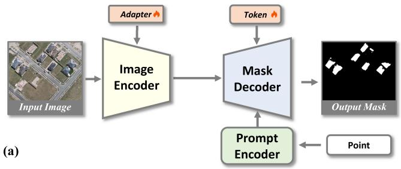

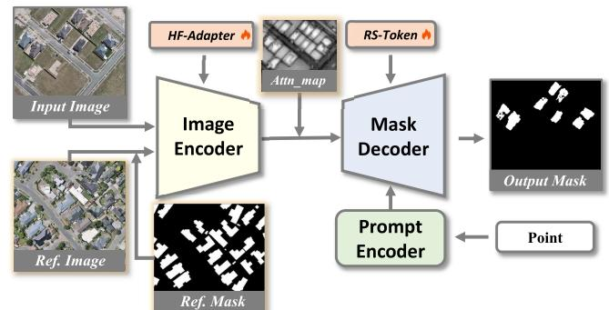  
(b）  
Fig. 1. (a) CAT-SAM. (b) Proposed RefAtt-SAM. Attn map denotes the FAM. Re f . denotes reference.

tasks. Additionally, we introduce an extra learnable token called remote sensing token $( R S \mathrm { ~ - ~ } T o k e n )$ into the mask decoder, as the original output tokens fail to capture domainspecific knowledge relevant to remote sensing adequately. The inclusion of the RS-token helps bridge the semantic gap between natural images and RSIs in the SAM. On the other hand, to address the ambiguity errors that SAM encounters under single-point prompts, especially in dense scenes, we propose the foreground attention map (FAM) and inject it into the model’s mask decoder, explicitly guiding the model to focus on foreground target regions. Meanwhile, we input target embeddings into the mask decoder to guide the enhancement of target features. After obtaining an initial mask contaminated by background noise, we apply cascaded postprocessing (CPP) to remove this noise, thereby enabling the model to achieve better segmentation performance.

The main contributions of this article are summarized as follows.

1) We present RefAtt-SAM, a foreground attention SAM model composed primarily of an FAM and a target feature enhancement (TFE). By leveraging a reference image, these components generate an FAM and features with enhanced foreground representation, effectively resolving the ambiguity that arises from single-point prompts in dense remote sensing scenes.   
2) We introduce a few-shot fine-tuning approach for the image encoder and mask decoder, which enhances model performance by adding high-frequency enhanced adapters and learnable tokens to bridge the differences between natural images and RSIs.   
3) Extensive experiments conducted on three publicly available remote sensing datasets, namely, HRSID, iSAID-airplane, and WHU, have demonstrated that

the proposed RefAtt-SAM outperforms existing models under single-point prompting conditions.

# II. RELATED WORK

# A. Segment Anything Model

SAM [6] is a prompt-based interactive vision foundation model that demonstrates exceptional zero-shot generalization capabilities. By providing points or bounding boxes as prompts, the desired instance masks can be efficiently generated. Consequently, it has become a highly adaptable foundation model that is extensively utilized in a diverse range of downstream tasks [13]. However, SAM struggles to produce accurate segmentation results when confronted with data outside its training distribution, a limitation that is particularly evident in fields such as medical and remote sensing. Recently, several approaches have been proposed to adapt SAM’s powerful segmentation capabilities to downstream domains [14], [15], [16], [17], [18]. For example, RSAM [10] introduces Adapter-Scale and Adapter-Feature, which combine high-frequency image information and image features to improve segmentation performance. HQ-SAM [19] designs a learnable high-quality output token and introduces their associated three layers of multilayer perceptron (MLP) to correct the mask errors of SAM’s output tokens. MeSAM [12] proposes a new fine-tuning approach to apply SAM to remote sensing semantic segmentation by addressing the limitations of SAM in processing high-frequency information, large-scale variation, and remote sensing-specific objects. CAT-SAM [7] proposes a conditional tuning framework that employs a prompt bridge structure to facilitate joint tuning of the lightweight adapters in the image encoder and the cat-token in the mask decoder. This design enables SAM to adapt to downstream domains with a moderate amount of annotated data, thereby improving segmentation performance across various tasks.

In this study, we adapt the model to the remote sensing domain through fine-tuning and introduce reference images to generate FAM, fully exploiting image information to further improve segmentation performance.

# B. Few-Shot Segmentation

In the realm of RSI segmentation, the conventional approaches involve training deep learning models from scratch for each specific task, thereby demanding extensive annotated datasets. Few-shot segmentation provides a more efficient alternative, allowing models to achieve strong performance with only a limited number of labeled samples. Previous few-shot segmentation methods are mainly categorized into two types, namely, the methods based on prototype matching [20], [21], [22], [23], and methods based on pixel-wise matching [24], [25], [26]. Prototype-based methods utilize the mask average pooling operation to create a prototype that serves as a global descriptor of reference features and efficiently compares the target features with the prototypes. In contrast, pixel-wise matching methods exhaustively calculate the spatial correlation between every pixel in the target and reference features. Compared to prototype-based approaches,

matching methods are specifically engineered to establish dense correspondences between query images and support annotations. They leverage pixel-level features to enrich the support context with significantly finer details. Through pixelby-pixel comparison, they accurately capture subtle variations in object boundaries, avoiding the loss of local semantics that occurs when prototype vectors compress information. In particular, there have been recent studies on integrating few-shot techniques into foundation models [7], [9]. Bridge the Points [27] proposes a graph-based few-shot segmentation method that directly addresses the challenge of prompt selection and enhances the efficiency of segmentation based on SAM. EF-SAM [28] addresses the problem of inaccurate boundaries through multiscale refinement. Moreover, it introduces error filtering SAM, which robustly excludes erroneous masks through the error filtering algorithm.

However, these methods mostly focus on segmentation within the same domain and often struggle to adapt to domain shifts. Our method introduces the foundation model SAM and fine-tunes it to effectively bridge the domain gap, thereby enhancing SAM’s segmentation performance in the remote sensing domain.

# C. RSI Segmentation

RSIs play a vital role in many applications, such as environmental surveillance [29], [30], [31], urban planning [32], [33], [34], [35], disaster response [36], and defense operations [37]. A notable challenge in working with RSIs is the significant differences in the size of objects and their dense distribution within the images. Targets can appear at different sizes and densities, making them difficult to identify and analyze accurately. This complexity requires advanced techniques and models for effective analysis. Traditional RSI segmentation techniques, including pixel-based and objectbased approaches [38], [39], face limitations in handling high-resolution images [1]. Pixel-based methods often lead to fragmented results due to ignoring the contextual relationships between adjacent pixels, while object-based approaches are constrained by subjective parameter settings and poor adaptability to diverse scene changes. To address these challenges, a range of segmentation methods has emerged [40], [41], [42]. Superpixelization [43] groups similar pixels to reduce computational complexity. Object proposal generation [44] prescreens potential target regions. The current trend is to employ powerful visual foundation models [45] and large multimodal models [46], [47], [48] to advance segmentation tasks. Among these, promptable segmentation enables flexible task adaptation through simple prompts [49], [50], [51], [52], [53], allowing rapid adjustment to different remote sensing segmentation tasks without massive retraining.

Although foundation models have achieved remarkable results in natural image processing, there is still significant room for improvement in the field of remote sensing, especially when facing issues like domain gaps and dense object distribution. In our study, SAM frequently encounters difficulties in segmenting objects that are densely aggregated, particularly when segmentation relies on point-based prompts. When the provided positive point prompt is inaccurate, the

resulting predicted mask may exhibit ambiguity with the surrounding background regions. To address this, we propose a method that incorporates an FAM to assist the model in predicting high-quality masks.

# III. METHODOLOGY

# A. Preliminary

1) Segment Anything Model: SAM [6] mainly consists of three key modules: an image encoder $\Psi _ { I }$ , a prompt encoder $\Psi _ { P }$ , and a mask decoder $\Psi _ { M }$ .

The image encoder of SAM is built on the ViT [54], pretrained with MAE [55], incorporating a $1 4 \times 1 4$ windowed attention and four global attention blocks to extract image embeddings from the input image $I \in \mathbb { R } ^ { H \times W \times C }$ , where $C$ denotes the number of channels, and $H \times W$ denotes the image size. The prompt encoder handles diverse types of prompts $P$ , such as points, boxes, and masks. It encodes prompts before inputting them into the mask decoder for the final mask prediction. The mask decoder, which is equipped with modified Transformer blocks and a dynamic prediction head, converts encoded inputs such as image embeddings and tokens into the mask $M \in \bar { \mathbb { R } } ^ { H \times W \times 1 }$ . The entire prediction process can be formalized as

$$
M = \Psi_ {M} \left\{\Psi_ {I} (I), \Psi_ {P} (P) \right\}. \tag {1}
$$

2) SAM-Adapter: The Adapter [14], [56] module introduces task-specific knowledge into the model by incorporating appropriate prompts. Specifically, the input prompt is first processed by two MLP layers and one layer of activation function. Finally, it is combined with the output of the preceding Transformer block via a residual connection, serving as the input for the next Transformer block. Thus, we have

$$
F i n _ {i + 1} = F o u t _ {i} + M _ {\text {s h a r e d}} \left\{\sigma \left[ M _ {\text {u n s h a r e d}} \left(p _ {i}\right) \right] \right\} \tag {2}
$$

where Fout represents the output of the ith Transformer block, $M _ { u n s h a r e d }$ refers to the layer-unshared MLP that processes the input prompt $p _ { i }$ of the ith layer, and $M _ { s h a r e d }$ indicates the layer-shared MLP. The activation function $\sigma$ is implemented as ReLU, and $F i n _ { i + 1 }$ σdenotes the input to the next Transformer block.

# B. Proposed RefAtt-SAM

1) Problem Formulation: We provide a definition for SAM-based referring image segmentation tasks. Formally, the inputs are a test image I, a reference image $I _ { R } \in \mathbb { R } ^ { H \times W \times \bar { C } }$ and visual prompts $P$ . The outputs are masks M for the test image. In this article, we aim to adapt SAM to the remote sensing domain using a few training samples and to obtain the mask through a single-point prompt.   
2) Overview: The overall structure of the proposed RefAtt-SAM is shown in Fig. 2. We first introduce a fine-tuning approach (see Section III-B3) to adapt SAM to the remote sensing domain. Specifically, we introduce HF-Adapter to enable the SAM model to adapt to the remote sensing domain while paying more attention to the edges of the images and incorporating a learnable RS-Token to bridge the domain gap

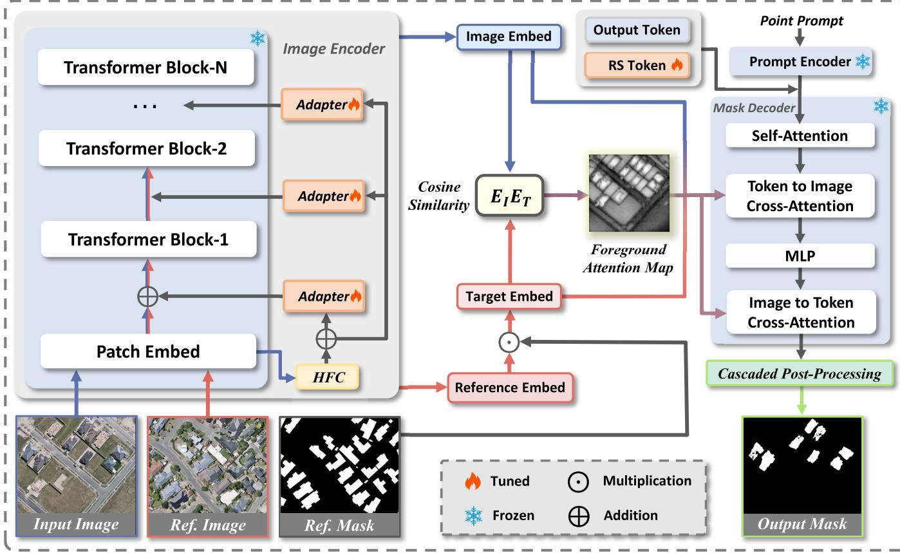  
Fig. 2. Overall structure of RefAtt-SAM. During the training stage, RefAtt-SAM keeps the original image encoder and mask decoder of SAM frozen and only adjusts the inserted Adapter and RS-Token. During the inference stage, the model obtains the target features from a reference image with a mask. Subsequently, it calculates the cosine similarity between these features and those of the test image to generate an FAM. Finally, this map is fed into the mask decoder for cross-attention, enabling the network to focus more on the foreground and thereby produce high-quality masks.

between natural images and RSIs and improve the segmentation accuracy of SAM in the remote sensing domain. On the other hand, to address the ambiguity in dense scenes under a single-point prompt, we introduce Foreground Attention Map (see Section III-B4) obtained by calculating the similarity between image embeddings and target embeddings in the mask decoder, which effectively guides the model to focus more on foreground regions rather than irrelevant background areas. Meanwhile, we introduce T arget Feature Enhancement (see Section III-B5). It inputs the target embedding obtained from the reference image and its corresponding mask into the mask decoder, enabling it to guide the model to focus more on the features of the target within the image. After obtaining the coarse mask, we propose a Cascaded Postprocessing (see Section III-B6) approach to further refine the mask, which can effectively eliminate rough edges and background noise, thereby obtaining a better segmentation mask. The input image and reference image $I , I _ { R }$ are encoded by the image encoder and subsequently mapped to the segmentation mask $M$ in the mask decoder. Thus, we have

$$
M = \Psi_ {M} \left\{\Psi_ {I} \left(I, I _ {R}\right), T, A \right\} \tag {3}
$$

where $\Psi _ { I }$ represents the image encoder, $\Psi _ { M }$ represents the mask decoder, $T$ represents the tokens input to the mask decoder, and A refers to FAM.

3) Fine-Tuning With HF-Adapter and RS-Token: In RefAtt-SAM, we introduce a high-frequency adapter (HF-Adapter) to fine-tune the SAM image encoder and an RS-Token for the mask decoder, enabling SAM to adjust to the remote sensing domain. The adapter is a lightweight subnetwork inserted into each Transformer layer and includes $M L P _ { t u n e }$ , activation functions, $M L P _ { u p }$ , and residual connections. In the model, we freeze the parameters of the image encoder and just update the parameters of the adapter during training. To better capture high-frequency features of images and enhance their adaptability to remote sensing applications, we input the highfrequency components (HFCs) of the image into the adapter. These components are obtained by transforming the image to the frequency domain using the fast Fourier transform, applying a high-pass filter to the image, and then using the inverse Fourier transform to restore the image to its original form. The reason we use HFCs is that they are more capable of representing edge information, which enables the model to achieve better segmentation performance. The structure of the HF-Adapter is shown in Fig. 3. The entire process can be represented as follows:

$$
F i n _ {i + 1} = F o u t _ {i} + M _ {u p} \left\{\sigma \left[ M _ {t u n e} \left(f _ {i}, h _ {i}\right) \right] \right\} \tag {4}
$$

where Fouti represents the output of the ith Transformer block, $M _ { t u n e }$ refers to the MLP that processes the ith image’s feature

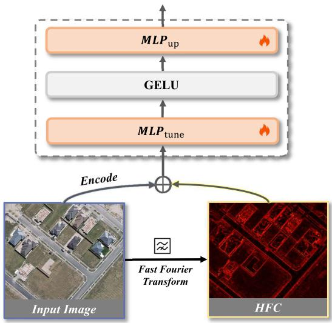  
Fig. 3. Structure of the HF-Adapter, where the HFCs capture the edge information of the image and are highlighted with red lines.

$f _ { i }$ and HFCs $h _ { i }$ , and $M _ { u p }$ indicates the MLP that adjusts the feature dimension to input into the ViT layer. The activation function $\sigma$ is implemented as GELU, and $F i n _ { i + 1 }$ denotes the σinput to the next Transformer block.

Meanwhile, standard output tokens perform well on natural images but yield suboptimal results when applied to RSIs due to the unique characteristics and complexity of remote sensing data. To address this, we introduce a learnable vector RS-Token ∈ $\mathbb { R } ^ { 1 \times 2 5 6 }$ with parameters updated during training. After passing through two decoder layers, the updated RS-Token is used to generate dynamic weights for a newly introduced three-layer MLP. Simultaneously, SAM’s mask decoder features are fused with the image features decoded by the image encoder. Finally, the fused features and the threelayer MLP are combined via dot product to generate masks.

4) Foreground Attention Map: To address the ambiguity errors that SAM encounters under single-point prompt, especially in dense scenes, we propose the FAM. In our approach, in addition to the input image I, we also incorporate a reference image $I _ { R }$ with a mask $M _ { R }$ as an additional input. These two inputs are first fed into an image encoder to extract their features. We formulate the process as

$$
E _ {I} = \Psi_ {I} (I), \quad E _ {R} = \Psi_ {I} \left(I _ {R}\right) \tag {5}
$$

where $E _ { I }$ and $E _ { R } \in \mathbb { R } ^ { H \times W \times C }$ refer to the embeddings of the input image and the reference image, respectively.

After obtaining the embeddings of the reference image, we perform spatial-wise multiplication with the reference mask $M _ { R }$ containing $n$ foreground pixels, thereby extracting target object embeddings $E _ { T } \in \mathbb { R } ^ { H \times W \times C }$ from the reference embeddings

$$
E _ {T} = M _ {R} \circ E _ {R}. \tag {6}
$$

We then extract a set of $n$ foreground-pixel target object vectors $\{ e _ { T } ^ { i } \} _ { i = 1 } ^ { n }$ where $e _ { T } \in \mathbb { R } ^ { 1 \times c }$ from $E _ { T }$ . Next, we perform ,L2 normalization on both the target object vectors $\{ e _ { T } ^ { i } \} _ { i = 1 } ^ { n }$ and input image embeddings $E _ { I }$ and compute the cosine similarity

between them to obtain $n$ similarity maps S, which can be expressed as

$$
\left\{S ^ {i} \right\} _ {i = 1} ^ {n} = \left\{E _ {I} e _ {T} ^ {n T} \right\} _ {i = 1} ^ {n} \tag {7}
$$

where $\boldsymbol { S } ~ \in ~ \mathbb { R } ^ { H \times W }$ represents the distribution of regions in the test image that are similar to the current target object embeddings.

Next, we employ average pooling to aggregate the $n$ similarity maps, yielding the FAM $A \in \mathbb { R } ^ { H \times W }$ , it can be represented as follows:

$$
A = \frac {1}{n} \sum_ {i = 1} ^ {n} S ^ {i}. \tag {8}
$$

Finally, we utilize the FAM A to guide the cross-attention layers in the decoder to focus on the foreground, which can be represented as

$$
F _ {A} = \text {C r o s s} \_ \text {A t t n} (T, E _ {I}, A) \tag {9}
$$

where $F _ { A }$ represents the features that have undergone crossattention with the FAM. It will be used for mask prediction. $T$ represents the tokens input to the mask decoder, which are formed by concatenating the tokens encoded by the prompt encoder, the original learnable token of SAM, and the RS-Token.

Through the proposed approach, the mask and prompt tokens are guided to extract more foreground visual semantics pertinent to the subject while minimizing the influence of uninformative background details. This focused attention enables more efficient feature aggregation within the attention mechanisms, thereby improving the overall accuracy of the segmentation results.

5) Target Feature Enhancement: To enable the model to further distinguish between the target foreground and the unimportant background regions, we propose TFE. Similar to the FAM, we feed the target embeddings $E _ { T }$ into the mask decoder together with the image embeddings for cross-attention. This supplies the model with high-level semantic cues, yielding an enhanced query that better guides foreground-object segmentation. The entire procedure is summarized by the following equation:

$$
F _ {T} = \text {C r o s s} \_ \text {A t t n} (T, E _ {I}, E _ {T}) \tag {10}
$$

where $F _ { T }$ represents the features that have undergone crossattention with the target embedding. These features are then upsampled and dot-producted with the mask tokens along the channel dimension, finally yielding the output masks.

Further integrating with the FAM, as shown in (9) and (10), we can express the processing flow of RefAtt-SAM’s mask decoder can be expressed as follows:

$$
M = \Psi_ {M} \{T, E _ {I}, E _ {T}, A \}. \tag {11}
$$

6) Cascaded Postprocessing: By employing the aforementioned techniques, we obtain the initial masks for the test images from the decoder of RefAtt-SAM. However, these initial masks may exhibit irregular boundaries and background noise, which could potentially impact the accuracy and reliability of the segmentation results. To enhance the quality of these masks and improve the overall segmentation

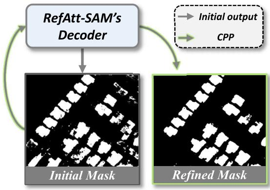  
Fig. 4. Pipeline of CPP.

performance, we introduce a CPP that reintroduces the preliminary masks into the decoding module for processing. This process involves reinputting the masks, which are characterized by irregular boundaries and sporadic background noise, as prompts into the decoder for reprocessing. Through this refined approach, we can effectively mitigate some of the noise issues, thereby obtaining more precise segmentation results. Its schematic is shown in Fig. 4.

# IV. EXPERIMENTS

# A. Datasets

To evaluate the effectiveness of our proposed method, we experiment on three widely used remote sensing instance segmentation datasets: HRSID [57], iSAID [58], and WHU [59]. The details are as follows.

HRSID dataset is a benchmark for ship detection, semantic segmentation, and instance segmentation in high-resolution SAR imagery. It consists of 16 951 annotated ship instances. The images in HRSID are cropped from 136 large-scale images with varying imaging conditions, such as incident angle, polarization, and resolution.

iSAID dataset is a large-scale remote sensing instance segmentation dataset, comprising 15 categories with a total of 655 451 annotated instances across 2806 high-resolution images. Given that our training process is based on a single image, we select the aircraft category as the experimental data. By cropping the selected images from the iSAID dataset to a size of $5 1 2 \times 5 1 2$ , we obtained 728 image patches featuring dense aircraft scenes to form the test set, while nine additional images were reserved for training and reference purposes. In this article, we refer to this subset as iSAID-airplane.

WHU dataset includes over 220 000 individual buildings. Each image is cropped to $5 1 2 ~ \times ~ 5 1 2$ pixels. We use a validation set of 1036 images to evaluate performance.

In the experimental setup, we randomly sample 1, 2, 4, and 8 images from the training set to train the model under 1-, 2-, 4-, and 8-shot conditions.

# B. Experiment Details

1) Performance Metrics: We use intersection over union (IoU) and F1-score as evaluation metrics. The IoU is calculated by determining the ratio of the intersection to the union

between the ground truth and the segmentation mask. In our experiments, we calculate the IoU for each individual image and then take the average over all images at the end. On the other hand, the F1-score is a metric that takes into account both the precision and recall of the segmentation results. The chosen baseline method is SAM, which operates in point mode during the evaluation process.

2) Implementation Details: RefAtt-SAM and its comparative models adopt ViT-L as the backbone of the image encoder, and all datasets are trained using the AdamW optimizer with a weight decay of 0.0001. The learning rate is set to 0.001. The batch sizes for the HRSID, iSAID-airplane, and WHU datasets are all set to 1. All experiments are conducted on a single NVIDIA RTX 4090D GPU using the PyTorch framework to achieve few-shot adaptation.

3) Competing Methods: To validate the effectiveness of our proposed RefAtt-SAM, we compare it against several recent representative adaptation methods based on SAM. MedSAM [60] employs extensive medical images to perform full finetuning on SAM. RSAM [10] explores SAM adaptation in the remote sensing field. HQ-SAM [19] enhances the quality of segmentation masks. ROS-SAM [11] builds upon HQ-SAM by integrating low-rank adaptation (LoRA), enabling more efficient and parameter-light tuning for downstream tasks. CAT-SAM [7] proposes a conditional tuning framework that leverages a prompt bridge structure to jointly adapt the image encoder and the mask decoder. It introduces two joint tuning strategies: CAT-SAM-T, which incorporates learnable prompt tokens into the input space, and CAT-SAM-A, which further integrates adapters for enhanced flexibility and performance across domains. In our experiments, all methods are adapted using the same set of images and evaluated under consistent conditions. Notably, all comparison methods use a single-point prompt to guide SAM’s segmentation, and all experiments are conducted within the same environment for fair comparison.

# C. Quantitative Evaluations

We conduct quantitative evaluations on three datasets: WHU, HRSID, and iSAID-airplane. All comparison methods were reproduced based on SAM [6]. The results are shown in Table I.

1) HRSID: Due to the significant difference in perspective between aerial images and natural images, a notable distribution shift occurs, which poses a challenge to the model’s performance. We can observe that the gap between our method and the SAM is over $20 \%$ . In contrast, Ours consistently achieves the highest performance compared to other methods. MedSAM is designed for medical images and has its data processing and fine-tuning methods tailored to serve medical images. Coupled with the inherent difficulty of segmenting SAR images, the few-shot fine-tuning method fails to achieve the expected results. RSAM is designed for RSIs and focuses on boosting performance under full supervision; it does not achieve good results in the few-shot scenario. The methods based on the improved mask decoder (HQ-SAM, ROS-SAM and CAT-SAM) all show different advantages and are all better than directly testing the original SAM. This demonstrates that adjusting the mask decoder is also very important.

TABLE I COMPARISON OF ADAPTIVE SEGMENTATION PERFORMANCE ON CHALLENGING REMOTE SENSING DATASETS: HRSID, ISAID-AIRPLANE, AND WHU. BASELINE IS SAM WITHOUT ADAPTATION. ALL COMPARED METHODS UTILIZE FEW-SHOT SAMPLES FOR ADAPTATION AND OPERATE UNDER A SINGLE-POINT PROMPT. BEST RESULTS ARE BOLDED, AND SECOND-BEST RESULTS ARE UNDERLINED   

<table><tr><td rowspan="3">Method</td><td colspan="6">1-shot</td><td colspan="6">2-shot</td></tr><tr><td colspan="2">HRSID</td><td colspan="2">iSAID-airplane</td><td colspan="2">WHU</td><td colspan="2">HRSID</td><td colspan="2">iSAID-airplane</td><td colspan="2">WHU</td></tr><tr><td>IoU</td><td>F1</td><td>IoU</td><td>F1</td><td>IoU</td><td>F1</td><td>IoU</td><td>F1</td><td>IoU</td><td>F1</td><td>IoU</td><td>F1</td></tr><tr><td>SAM [6]</td><td>48.27</td><td>53.86</td><td>15.63</td><td>21.77</td><td>33.26</td><td>46.46</td><td>48.27</td><td>53.86</td><td>15.63</td><td>21.77</td><td>33.26</td><td>46.46</td></tr><tr><td>MedSAM [61]</td><td>11.15</td><td>17.23</td><td>23.69</td><td>36.04</td><td>39.58</td><td>51.20</td><td>28.03</td><td>33.43</td><td>35.85</td><td>46.39</td><td>48.59</td><td>52.77</td></tr><tr><td>RSAM [10]</td><td>52.14</td><td>65.67</td><td>43.50</td><td>51.68</td><td>48.23</td><td>59.75</td><td>53.65</td><td>66.99</td><td>49.06</td><td>61.49</td><td>57.10</td><td>70.19</td></tr><tr><td>HQ-SAM [19]</td><td>60.51</td><td>73.36</td><td>53.64</td><td>66.18</td><td>56.03</td><td>69.31</td><td>68.38</td><td>79.63</td><td>56.02</td><td>70.04</td><td>55.32</td><td>69.80</td></tr><tr><td>ROS-SAM [11]</td><td>64.11</td><td>77.04</td><td>46.89</td><td>52.10</td><td>55.94</td><td>68.42</td><td>65.92</td><td>78.62</td><td>53.63</td><td>66.78</td><td>56.52</td><td>70.00</td></tr><tr><td>CAT-SAM-T [7]</td><td>64.30</td><td>77.90</td><td>58.40</td><td>71.86</td><td>53.00</td><td>67.30</td><td>70.32</td><td>81.08</td><td>56.35</td><td>70.94</td><td>57.79</td><td>72.06</td></tr><tr><td>CAT-SAM-A [7]</td><td>67.18</td><td>78.57</td><td>58.87</td><td>72.87</td><td>56.13</td><td>67.93</td><td>71.23</td><td>81.76</td><td>57.79</td><td>72.32</td><td>57.51</td><td>71.21</td></tr><tr><td>RefAtt-SAM(Ours)</td><td>68.62</td><td>80.92</td><td>60.76</td><td>74.71</td><td>56.96</td><td>70.63</td><td>74.09</td><td>84.59</td><td>61.67</td><td>74.00</td><td>58.71</td><td>72.63</td></tr><tr><td rowspan="3">Method</td><td colspan="6">4-shot</td><td colspan="6">8-shot</td></tr><tr><td colspan="2">HRSID</td><td colspan="2">iSAID-airplane</td><td colspan="2">WHU</td><td colspan="2">HRSID</td><td colspan="2">iSAID-airplane</td><td colspan="2">WHU</td></tr><tr><td>IoU</td><td>F1</td><td>IoU</td><td>F1</td><td>IoU</td><td>F1</td><td>IoU</td><td>F1</td><td>IoU</td><td>F1</td><td>IoU</td><td>F1</td></tr><tr><td>SAM [6]</td><td>48.27</td><td>53.86</td><td></td><td>15.63</td><td>21.77</td><td>33.26</td><td>46.46</td><td>48.27</td><td>53.86</td><td>15.63</td><td>21.77</td><td>33.26</td></tr><tr><td>MedSAM [61]</td><td>27.61</td><td>35.00</td><td></td><td>45.72</td><td>55.37</td><td>53.35</td><td>66.58</td><td>35.34</td><td>47.04</td><td>44.14</td><td>51.88</td><td>63.90</td></tr><tr><td>RSAM [10]</td><td>73.44</td><td>85.21</td><td></td><td>56.61</td><td>72.86</td><td>62.04</td><td>75.19</td><td>73.52</td><td>84.41</td><td>67.32</td><td>80.93</td><td>69.14</td></tr><tr><td>HQ-SAM [19]</td><td>73.50</td><td>84.69</td><td></td><td>57.98</td><td>72.37</td><td>61.38</td><td>75.74</td><td>76.11</td><td>86.13</td><td>67.23</td><td>79.48</td><td>64.26</td></tr><tr><td>ROS-SAM [11]</td><td>74.66</td><td>84.97</td><td></td><td>55.22</td><td>68.05</td><td>62.56</td><td>76.13</td><td>74.24</td><td>85.01</td><td>59.99</td><td>72.95</td><td>66.15</td></tr><tr><td>CAT-SAM-T [7]</td><td>76.78</td><td>86.38</td><td></td><td>59.67</td><td>73.61</td><td>61.92</td><td>75.91</td><td>76.50</td><td>86.28</td><td>69.26</td><td>80.63</td><td>69.69</td></tr><tr><td>CAT-SAM-A [7]</td><td>77.10</td><td>86.71</td><td></td><td>58.26</td><td>72.74</td><td>62.11</td><td>75.88</td><td>77.59</td><td>86.97</td><td>66.56</td><td>78.63</td><td>68.86</td></tr><tr><td>RefAtt-SAM(Ours)</td><td>77.30</td><td>86.73</td><td></td><td>62.43</td><td>75.60</td><td>63.09</td><td>76.63</td><td>78.19</td><td>87.49</td><td>70.93</td><td>82.23</td><td>70.13</td></tr></table>

TABLE II COMPARISON OF ADAPTIVE SEGMENTATION PERFORMANCE ON THREE DATASETS. ALL COMPARISON METHODS ARE ADAPTED USING A BOX AS THE PROMPT   

<table><tr><td rowspan="2">Method</td><td colspan="2">HRSID</td><td colspan="2">iSAID-airplane</td><td colspan="2">WHU</td></tr><tr><td>IoU</td><td>F1</td><td>IoU</td><td>F1</td><td>IoU</td><td>F1</td></tr><tr><td>SAM [6]</td><td>61.77</td><td>72.04</td><td>23.53</td><td>34.46</td><td>43.50</td><td>50.47</td></tr><tr><td>CAT-SAM-T [7]</td><td>72.74</td><td>83.83</td><td>64.92</td><td>78.00</td><td>79.76</td><td>88.47</td></tr><tr><td>CAT-SAM-A [7]</td><td>76.53</td><td>87.07</td><td>67.93</td><td>79.55</td><td>81.64</td><td>89.47</td></tr><tr><td>RefAtt-SAM(Ours)</td><td>78.58</td><td>87.78</td><td>68.06</td><td>80.35</td><td>81.88</td><td>89.82</td></tr></table>

2) iSAID-Airplane: In the iSAID dataset, airplanes vary in size and shape, and most are in dense scenes, which poses a challenge to SAM. Moreover, under single-point prompts, the model struggles to distinguish whether the segmentation is of the entire airplane or just a part of it. Ours successfully mitigates these issues and achieves the best performance. Other methods also show significant improvements, but they still have varying degrees of incorrect background segmentation when facing complex scenes.

3) WHU: Similar to the iSAID-airplane dataset, the buildings in WHU still vary in shape and size, and the scenes are dense. Direct testing of SAM yields suboptimal results. After fine-tuning, MedSAM and RSAM outperform the original SAM, yet their effectiveness remains limited in few-shot scenarios. HQ-SAM, ROS-SAM, and CAT-SAM achieve notable improvements on WHU, but none fully explore few-shot finetuning for remote sensing or make full use of limited sample information. Despite these challenges, our method accurately identifies foreground regions, consistently narrows the domain gap, and maintains superior segmentation performance.

To further validate the efficacy of our method, we conduct additional experiments using box prompts across the three

datasets. We select CAT-SAM as the comparison method, which shows excellent performance in the one-shot scenario. The experimental setup remains consistent. As shown in Table II, the use of box prompts notably mitigates the background segmentation errors typically associated with point prompts, leading to more precise segmentation outcomes across all methods. Consequently, while the segmentation results of our approach closely match those of the compared methods, it consistently achieves the highest overall performance, further confirming its robustness and adaptability under varied prompt conditions.

# D. Ablation Study

1) Impact of Different Components: In this section, we comprehensively evaluate the effectiveness of each proposed component across three datasets. As illustrated in Table III, the first row represents the baseline model, where we directly test the datasets using SAM with only a single-point prompt. By subsequently integrating the HF-Adapter and the learnable RS-Token into SAM, we effectively bridge the domain gap between natural images and remote sensing imagery, thereby significantly improving overall segmentation performance. Building on this enhanced baseline, we further introduce CPP, which refines the initially obtained mask and efficiently eliminates edge noise, yielding an additional noticeable segmentation improvement. The third row shows the model that injects target embeddings into the mask decoder. This enables the mask decoder to obtain richer target information. Compared with not adding target embeddings, adding target embeddings achieves higher IoU and F1-scores. For the model without target embeddings but with an added FAM, the map guides the model to focus on foreground

TABLE III ABLATION STUDY OF REFATT-SAM ON THE ADAPTABILITY OF EACH MODULE FOR 1-SHOT ADAPTATION ON THREE DATASETS   

<table><tr><td rowspan="2">Fine-tuning</td><td rowspan="2">CPP</td><td rowspan="2">TFE</td><td rowspan="2">FAM</td><td colspan="2">HRSID</td><td colspan="2">iSAID-airplane</td><td colspan="2">WHU</td></tr><tr><td>IoU</td><td>F1</td><td>IoU</td><td>F1</td><td>IoU</td><td>F1</td></tr><tr><td></td><td></td><td></td><td></td><td>48.27</td><td>53.86</td><td>15.63</td><td>21.77</td><td>33.26</td><td>46.46</td></tr><tr><td>✓</td><td></td><td></td><td></td><td>60.18(+11.91%)</td><td>74.02(+20.16%)</td><td>55.85(+40.22%)</td><td>68.87(+47.10%)</td><td>54.18(+20.54%)</td><td>67.00(+22.19%)</td></tr><tr><td>✓</td><td>✓</td><td></td><td></td><td>65.12(+16.85%)</td><td>78.99(+25.13%)</td><td>57.73(+42.10%)</td><td>71.93(+50.16%)</td><td>55.85(+20.92%)</td><td>68.65(+22.19%)</td></tr><tr><td>✓</td><td>✓</td><td>✓</td><td></td><td>67.56(+19.29%)</td><td>79.44(+25.58%)</td><td>57.38(+41.75%)</td><td>71.58(+49.73%)</td><td>55.87(+22.59%)</td><td>69.27(+22.81%)</td></tr><tr><td>✓</td><td>✓</td><td></td><td>✓</td><td>67.73(+19.26%)</td><td>80.19(+26.33%)</td><td>59.50(+43.87%)</td><td>73.20(+51.43%)</td><td>56.57(+23.31%)</td><td>69.85(+23.39%)</td></tr><tr><td>✓</td><td>✓</td><td>✓</td><td>✓</td><td>68.62(+20.35%)</td><td>80.92(+26.44%)</td><td>60.76(+45.13%)</td><td>74.71(+52.94%)</td><td>56.96(+23.70%)</td><td>70.63(+24.17%)</td></tr></table>

TABLE IV ABLATION STUDY ON HFCS   

<table><tr><td rowspan="2">Method</td><td colspan="2">HRSID</td><td colspan="2">iSAID-airplane</td><td colspan="2">WHU</td></tr><tr><td>IoU</td><td>F1</td><td>IoU</td><td>F1</td><td>IoU</td><td>F1</td></tr><tr><td>Adapter [14]</td><td>67.84</td><td>78.80</td><td>60.06</td><td>73.02</td><td>56.21</td><td>69.92</td></tr><tr><td>HF-Adapter</td><td>68.62</td><td>80.92</td><td>60.76</td><td>74.71</td><td>56.96</td><td>70.63</td></tr></table>

TABLE V ABLATION STUDY OF REFATT-SAM ON DIFFERENT DISTANCE METRICS   

<table><tr><td rowspan="2">Distance Metric</td><td colspan="2">HRSID</td><td colspan="2">iSAID-airplane</td><td colspan="2">WHU</td></tr><tr><td>IoU</td><td>F1</td><td>IoU</td><td>F1</td><td>IoU</td><td>F1</td></tr><tr><td>L1</td><td>68.58</td><td>80.86</td><td>60.58</td><td>74.35</td><td>55.25</td><td>69.42</td></tr><tr><td>L2</td><td>68.58</td><td>80.87</td><td>60.36</td><td>73.81</td><td>55.52</td><td>69.61</td></tr><tr><td>Cosine</td><td>68.62</td><td>80.92</td><td>60.76</td><td>74.71</td><td>56.96</td><td>70.63</td></tr></table>

regions. It also reduces ambiguities in dense scenes when using single-point prompts and correspondingly boosts segmentation performance. Finally, we integrate both target embeddings and the foreground attention map into the mask decoder, and this combined integration attains the best overall performance, delivering an improvement of more than $20 \%$ relative to the baseline.

2) Impact on HFCs: To verify the effectiveness of integrating HFCs into the adapter, we examine the performance of both adapter and HF-Adapter on the three datasets, as shown in Table IV. By incorporating high-frequency information such as image edges, the HF-adapter provides features highly beneficial for segmentation, thereby achieving better results than adapter.   
3) Alternative Distance Metrics: Table V reports the performance of cosine, L1, and L2 distance metrics on the HRSID, iSAID-airplane, and WHU datasets. We assess the effectiveness of these three distance metrics within the context of the RefAtt-SAM model. The findings demonstrate that the cosine metric consistently outperforms the other two metrics across all datasets. This superior performance is due to the cosine metric’s emphasis on direction similarity rather than absolute magnitude, highlighting the orientation of the data points in a multidimensional space, regardless of their magnitude. This feature makes it highly suitable for tasks where the direction of the data vectors is more informative than their magnitude, such as text classification or image feature matching.   
4) How About More Steps in CPP?: After obtaining the refined masks through CPP, we attempt to use their maximum bounding rectangles as prompt boxes for the model to achieve

TABLE VI STUDY OF CPP AND TWO-STEP CPP   

<table><tr><td rowspan="2">Method</td><td colspan="2">HRSID</td><td colspan="2">iSAID-airplane</td><td colspan="2">WHU</td></tr><tr><td>IoU</td><td>F1</td><td>IoU</td><td>F1</td><td>IoU</td><td>F1</td></tr><tr><td>CPP</td><td>68.62</td><td>80.92</td><td>60.76</td><td>74.71</td><td>56.96</td><td>70.63</td></tr><tr><td>CPP(Two-steps)</td><td>66.65</td><td>77.16</td><td>58.15</td><td>72.13</td><td>56.14</td><td>69.55</td></tr></table>

further refinement. We refer to this process as two-step CPP. However, due to the challenges posed by point prompt conditions, the minimum bounding rectangles may fail to adequately represent the complete target objects. Additionally, the input of prompt boxes may introduce extraneous noise around the mask edges. Consequently, compared with CPP, two-step CPP did not yield effective improvement in the model’s segmentation performance. Specific results are presented in Table VI.

# E. Qualitative Evaluations

1) Visualization of Results From Different Methods: To intuitively demonstrate the effectiveness of our method, we visualized the masks of three datasets under different models, as shown in Fig. 5. It should be noted that all the methods we visualized were run under the conditions of single-point prompt and one-shot.   
a) HRSID: SAM often mistakenly segments a large number of irrelevant background regions as target regions. Although other methods effectively bridge the domain gap through fine-tuning SAM, they still incorrectly segment some background information under single-point prompts. In contrast, our method introduces a foreground attention mechanism, which effectively compensates for the limitations of single-point prompts and significantly reduces the problem of background missegmentation, thereby achieving relatively better segmentation results.   
b) iSAID-airplane: The high color contrast between the fuselage and wings makes it difficult for the model to segment the entire aircraft with a single-point prompt. When segmenting large airplanes, models often assume that user interest lies only in the wings or fuselage. Under single-point prompts, SAM segments background information as target regions, degrading segmentation performance. Due to the ambiguity of single-point prompts, ROS-SAM and HQ-SAM also segment some background information, especially in backgrounds with significant color differences at the edges, where the model may mistakenly regard aprons or hangars as foreground and the airplane itself as background. CAT-SAM can generally

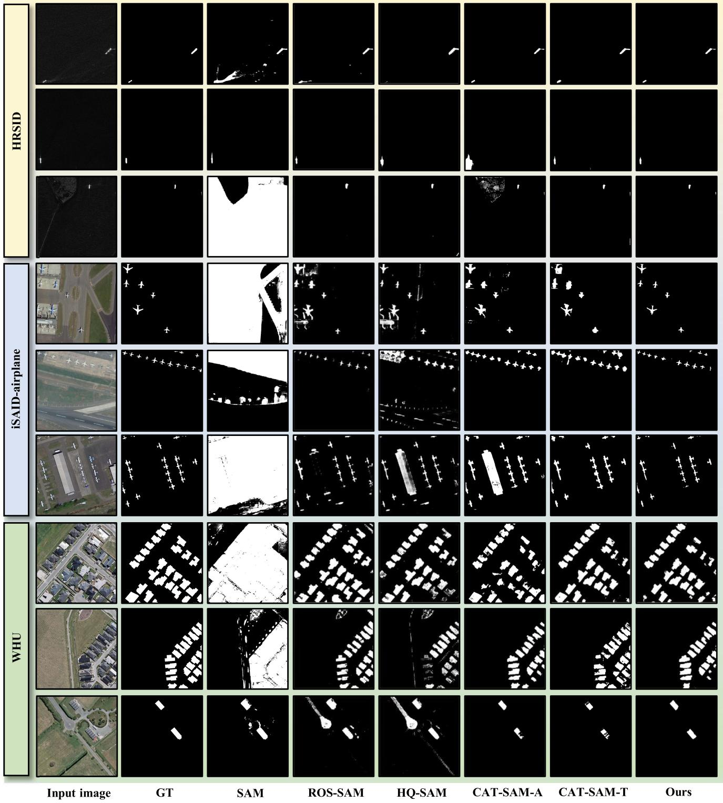  
Fig. 5. Qualitative comparison of different methods on the HRSID, iSAID, and WHU datasets.

distinguish between foreground and background, but it does not accurately display the target edge information. Our method effectively mitigates foreground–background confusion under single-point prompts and successfully segments the target airplane.

c) WHU: Segmenting buildings in aerial imagery is challenging due to their complex, irregular shapes and high spatial density. In the original SAM, single-point prompts often lead to confusion between foreground and background. Although

ROS-SAM and HQ-SAM can segment specific buildings, they still segment unimportant backgrounds. For CAT-SAM, while the models can correctly segment buildings, the quality of the masks is not high due to the influence of noise. The CPP we propose can effectively reduce the impact of noise, thereby obtaining high-quality masks and further improving the accuracy and robustness of the segmentation results.

2) Visualization of FAM: To provide a more vivid demonstration of the direct influence of the proposed FAM on the

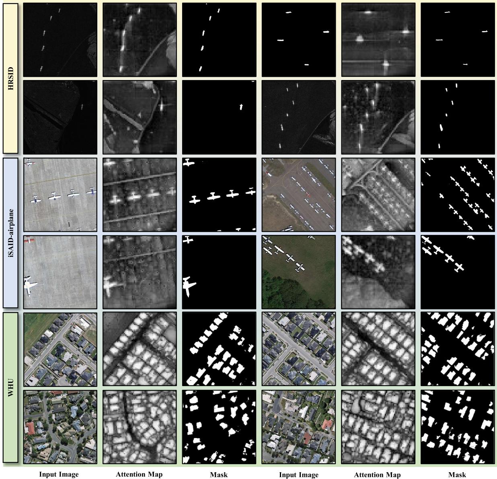  
Fig. 6. Visualizations of FAM.

segmentation mask, we present visualizations of several representative FAMs alongside their corresponding segmentation masks in Fig. 6. These examples illustrate how the FAM accurately highlights the target areas we aim to segment across various datasets. In the attention maps, regions with lighter shades of white indicate a higher likelihood of being the target area, while darker regions correspond to background or irrelevant areas with low attention weights. This visual representation shows that the FAM effectively identifies the objects that require segmentation. By integrating these attention maps into the mask decoder, we guide the model to focus more intently on the foreground targets. Under point prompts, the original SAM often struggles to accurately determine the exact extent of the prompted object. This approach not only enhances the model’s ability to recognize target objects but also improves its capacity to differentiate between these objects and the background. Consequently, the model achieves more accurate segmentation of the target objects, effectively extracting the desired information from complex

TABLE VII ANALYSIS OF THE IMPACT OF DIFFERENT REFERENCE IMAGES ON REFATT-SAM PERFORMANCE   

<table><tr><td colspan="3">HRSID</td><td colspan="3">iSAID-airplane</td><td colspan="3">WHU</td></tr><tr><td>Ref. Img</td><td>IoU</td><td>F1</td><td>Ref. Img</td><td>IoU</td><td>F1</td><td>Ref. Img</td><td>IoU</td><td>F1</td></tr><tr><td>image_7</td><td>68.62</td><td>80.92</td><td>image_155</td><td>60.76</td><td>74.71</td><td>2432</td><td>56.96</td><td>70.63</td></tr><tr><td>image_0</td><td>68.32</td><td>80.73</td><td>image_1</td><td>60.36</td><td>73.63</td><td>4</td><td>54.16</td><td>69.58</td></tr><tr><td>image_999</td><td>68.53</td><td>80.86</td><td>image_251</td><td>60.21</td><td>73.75</td><td>258</td><td>55.48</td><td>69.02</td></tr></table>

backgrounds. This method is particularly valuable for tasks that involve analyzing RSIs with intricate details and complex backgrounds, thereby significantly enhancing the precision of the segmentation process.

# F. Analysis and Discussion

1) Impact of Different Reference Images: As shown in Table VII, we investigate the impact of different reference images on the experimental results. The findings indicate that

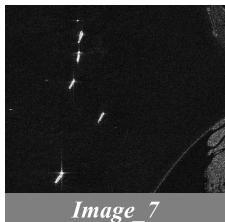

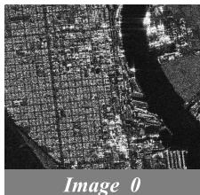

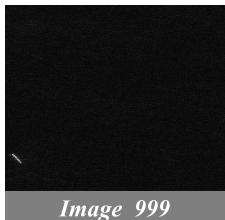

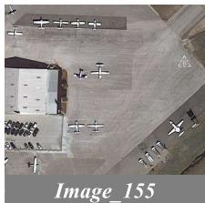

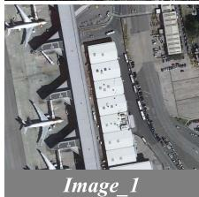

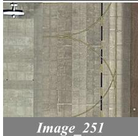

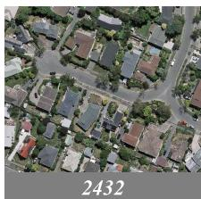

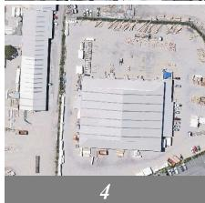

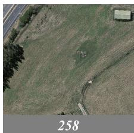  
Fig. 7. Different reference images.

in the one-shot learning scenario, the more targets contained in the reference image, the higher the IoU and F1-score achieved. The specific reference images are shown in Fig. 7.

In the HRSID dataset, we selected image 7, image 0, and image 999 for experimentation. Among them, image 0 is most representative of the challenges in SAR image segmentation; its difficulty is so pronounced that even the human eye struggles to distinguish ships, rendering it challenging to serve as a reference image for acquiring robust target features. Consequently, its segmentation performance predictably lags behind the other two images. On the other hand, image 7 and image 999 contain multiple and single targets, respectively. Given that image 7 encompasses a greater amount of target feature information, it outperforms the other two images in segmentation performance. For the iSAID-airplane dataset, image 155 contains multiple airplane targets, image 1 contains a large airplane, and image 251 contains a small airplane. The results show that image 155, with multiple targets, achieves the best performance. For the WHU dataset, image 2432, image 4, and image 258 are selected to test the model under different target quantity, size, and complexity settings. Image 2432 achieved the best performance due to its richer target information.

2) Complexity Analysis: Although our method improves segmentation performance, the introduction of the Fourier transform and reference image feature extraction also increases the computational complexity of the model. Therefore, we analyze the learnable parameters and GPU memory usage across different fine-tuning strategies. As shown in Table VIII, our method maintains a moderate number of learnable parameters. However, the additional Fourier and feature extraction operations increase GPU memory consumption, resulting in longer inference times. Thus, accelerating inference speed is an aspect our method needs to improve, and we will explore

TABLE VIII COMPARISON OF COMPLEXITY AMONG DIFFERENT FINE-TUNING METH-ODS. MEMORY REFERS TO THE GPU MEMORY OCCUPIED BY THE MODEL DURING THE INFERENCE STAGE   

<table><tr><td>Method</td><td>Fine-tuning Type</td><td>Learnable Params</td><td>Memory</td></tr><tr><td>SAM [6]</td><td>-</td><td>-</td><td>7.6G</td></tr><tr><td>MedSAM [61]</td><td>Full</td><td>312.34M</td><td>7.6G</td></tr><tr><td>RSAM [10]</td><td>Adapter</td><td>4.18M</td><td>8.7G</td></tr><tr><td>HQ-SAM [19]</td><td rowspan="2">Token</td><td>1.33M</td><td>7.5G</td></tr><tr><td>CAT-SAM-T [7]</td><td>3.33M</td><td>8.9G</td></tr><tr><td>ROS-SAM [11]</td><td>LoRA&amp;Token</td><td>51.66M</td><td>8.0G</td></tr><tr><td>CAT-SAM-A [7]</td><td rowspan="2">Adapter&amp;Token</td><td>1.83M</td><td>8.4G</td></tr><tr><td>RefAtt-SAM(Ours)</td><td>3.85M</td><td>9.3G</td></tr></table>

methods to reduce the model’s memory usage and inference time while preserving accuracy in the further work.

# V. CONCLUSION

In this article, we proposed RefAtt-SAM. By introducing HF-Adapter and RS-Token, RefAtt-SAM significantly enhances the adaptability and segmentation performance of the SAM in the field of RSIs. Moreover, RefAtt-SAM employs an FAM and TFE mechanism to effectively address the ambiguity issues caused by single-point prompts and significantly improve segmentation accuracy. Experimental results demonstrate that RefAtt-SAM achieves excellent performance on three publicly available RSI datasets (WHU, HRSID, and iSAID-airplane), outperforming existing few-shot learning methods. This indicates that RefAtt-SAM has high efficiency and adaptability in handling RSI segmentation tasks, especially in scenarios where labeled data are scarce, enabling rapid adaptation and high-quality segmentation with only a few samples.

# REFERENCES

[1] I. Kotaridis and M. Lazaridou, “Remote sensing image segmentation advances: A meta-analysis,” ISPRS J. Photogramm. Remote Sens., vol. 173, pp. 309–322, Mar.2021.   
[2] X. Yuan, J. Shi, and L. Gu, “A review of deep learning methods for semantic segmentation of remote sensing imagery,” Expert Syst. Appl., vol. 169, May2021, Art. no. 114417.   
[3] Y. Chen, H. Jiang, C. Li, X. Jia, and P. Ghamisi, “Deep feature extraction and classification of hyperspectral images based on convolutional neural networks,” IEEE Trans. Geosci. Remote Sens., vol. 54, no. 10, pp. 6232–6251, Oct.2016.   
[4] F. I. Diakogiannis, F. Waldner, P. Caccetta, and C. Wu, “ResUNet—A: A deep learning framework for semantic segmentation of remotely sensed data,” ISPRS J. Photogramm. Remote Sens., vol. 162, pp. 94–114, Apr.2020.   
[5] J. Chen, B. Liu, A. Yu, X. Cao, and G. Si, “Semantic segmentation of remote sensing images with deep information enhancement,” IEEE Geosci. Remote Sens. Lett., vol. 22, pp. 1–5, 2025.   
[6] A. Kirillov et al., “Segment anything,” in Proc. IEEE/CVF Int. Conf. Comput. Vis., Oct. 2023, pp. 4015–4026.   
[7] A. Xiao et al., “CAT-SAM: Conditional tuning for few-shot adaptation of segment anything model,” in Proc. Eur. Conf. Comput. Vis., 2024, pp. 189–206.   
[8] R. Zhang et al., “Personalize segment anything model with one shot,” 2023, arXiv:2305.03048.   
[9] L. Ayzenberg, R. Giryes, and H. Greenspan, “ProtoSAM: Oneshot medical image segmentation with foundational models,” 2024, arXiv:2407.07042.   
[10] J. Zhang, Y. Li, X. Yang, R. Jiang, and L. Zhang, “RSAM-SEG: A SAMbased model with prior knowledge integration for remote sensing image semantic segmentation,” Remote Sens., vol. 17, no. 4, p. 590, Feb.2025.

[11] Z. Shan, Y. Liu, L. Zhou, C. Yan, H. Wang, and X. Xie, “ROS-SAM: high-quality interactive segmentation for remote sensing moving object,” in Proc. IEEE/CVF Conf. Comput. Vis. Pattern Recognit. (CVPR), Jun. 2025, pp. 3625–3635.   
[12] X. Zhou et al., “MeSAM: Multiscale enhanced segment anything model for optical remote sensing images,” IEEE Trans. Geosci. Remote Sens., vol. 62, 2024, Art. no. 5623515.   
[13] C. Zhang et al., “A survey on segment anything model (SAM): Vision foundation model meets prompt engineering,” 2023, arXiv:2306.06211.   
[14] T. Chen et al., “SAM fails to segment anything?—SAM-adapter: Adapting SAM in underperformed scenes: Camouflage, shadow, medical image segmentation, and more,” 2023, arXiv:2304.09148.   
[15] J. Jiang, S. Lei, H.-C. Li, and Y. Sun, “MLAgg-UNet: Advancing medical image segmentation with efficient transformer and mambainspired multi-scale sequence,” IEEE J. Biomed. Health Informat., early access, Aug.7, 2025, doi: 10.1109/JBHI.2025.3596648.   
[16] M. Jia et al., “Visual prompt tuning,” in Proc. Eur. Conf. Comput. Vis., Oct. 2022, pp. 709–727.   
[17] B. Lester, R. Al-Rfou, and N. Constant, “The power of scale for parameter-efficient prompt tuning,” 2021, arXiv:2104.08691.   
[18] N. Liu, X. Xu, Y. Su, H. Zhang, and H.-C. Li, “PointSAM: Pointlysupervised segment anything model for remote sensing images,” IEEE Trans. Geosci. Remote Sens., vol. 63, 2025, Art. no. 5608515.   
[19] K. Lei et al., “Segment anything in high quality,” in Proc. Adv. Neural Inf. Process. Syst., 2023, pp. 29914–29934.   
[20] L. Cao, Y. Guo, Y. Yuan, and Q. Jin, “Prototype as query for few shot semantic segmentation,” Complex Intell. Syst., vol. 10, no. 5, pp. 7265–7278, Oct.2024.   
[21] C. Lang, G. Cheng, B. Tu, and J. Han, “Learning what not to segment: A new perspective on few-shot segmentation,” in Proc. IEEE/CVF Conf. Comput. Vis. Pattern Recognit., Jun. 2022, pp. 8047–8057.   
[22] L. Yang, W. Zhuo, L. Qi, Y. Shi, and Y. Gao, “Mining latent classes for few-shot segmentation,” in Proc. IEEE/CVF Int. Conf. Comput. Vis. (ICCV), Oct. 2021, pp. 8721–8730.   
[23] Z. Tian, H. Zhao, M. Shu, Z. Yang, R. Li, and J. Jia, “Prior guided feature enrichment network for few-shot segmentation,” IEEE Trans. Pattern Anal. Mach. Intell., vol. 44, no. 2, pp. 1050–1065, Feb.2022.   
[24] H. Bi et al., “AgMTR: Agent mining transformer for few-shot segmentation in remote sensing,” Int. J. Comput. Vis., vol. 133, no. 4, pp. 1780–1807, Apr.2025.   
[25] H. Tang et al., “Layer-wise feature metric of semantic-pixel matching for few-shot learning,” 2024, arXiv:2411.06363.   
[26] G. Zhang, G. Kang, Y. Yang, and Y. Wei, “Few-shot segmentation via cycle-consistent transformer,” in Proc. NIPS, vol. 34, 2021, pp. 21984–21996.   
[27] A. Zhang, G. Gao, J. Jiao, C. Harold Liu, and Y. Wei, “Bridge the points: Graph-based few-shot segment anything semantically,” 2024, arXiv:2410.06964.   
[28] C.-B. Feng et al., “Learning few-shot semantic segmentation with error-filtered segment anything model,” Vis. Comput., vol. 41, no. 10, pp. 7351–7365, 2025.   
[29] G. Cheng et al., “Change detection methods for remote sensing in the last decade: A comprehensive review,” Remote Sens., vol. 16, no. 13, p. 2355, Jun.2024.   
[30] L. Bruzzone and D. F. Prieto, “Automatic analysis of the difference image for unsupervised change detection,” IEEE Trans. Geosci. Remote Sens., vol. 38, no. 3, pp. 1171–1182, May2000.   
[31] M. Liu, Z. Chai, H. Deng, and R. Liu, “A CNN-transformer network with multiscale context aggregation for fine-grained cropland change detection,” IEEE J. Sel. Topics Appl. Earth Observ. Remote Sens., vol. 15, pp. 4297–4306, 2022.   
[32] N. Buch, S. A. Velastin, and J. Orwell, “A review of computer vision techniques for the analysis of urban traffic,” IEEE Trans. Intell. Transp. Syst., vol. 12, no. 3, pp. 920–939, Sep.2011.   
[33] Y. Liu, C. Pang, Z. Zhan, X. Zhang, and X. Yang, “Building change detection for remote sensing images using a dual-task constrained deep Siamese convolutional network model,” IEEE Geosci. Remote Sens. Lett., vol. 18, no. 5, pp. 811–815, May2021.   
[34] H. Bi et al., “RingMoE: Mixture-of-modality-experts multi-modal foundation models for universal remote sensing image interpretation,” IEEE Trans. Pattern Anal. Mach. Intell., early access, Dec.12, 2025, doi: 10.1109/TPAMI.2025.3643453.   
[35] H. Bi et al., “Not just learning from others but relying on yourself: A new perspective on few-shot segmentation in remote sensing,” IEEE Trans. Geosci. Remote Sens., vol. 61, 2023, Art. no. 5623621.

[36] D. Brunner, L. Bruzzone, and G. Lemoine, “Change detection for earthquake damage assessment in built-up areas using very high resolution optical and SAR imagery,” in Proc. IEEE Int. Geosci. Remote Sens. Symp. (IGARSS), Jul. 2010, pp. 3210–3213.   
[37] M. Gong, J. Zhao, J. Liu, Q. Miao, and L. Jiao, “Change detection in synthetic aperture radar images based on deep neural networks,” IEEE Trans. Neural Netw. Learn. Syst., vol. 27, no. 1, pp. 125–138, Jan.2016.   
[38] M. D. Hossain and D. Chen, “Segmentation for object-based image analysis (OBIA): A review of algorithms and challenges from remote sensing perspective,” ISPRS J. Photogramm. Remote Sens., vol. 150, pp. 115–134, Apr.2019.   
[39] Y. Wang, H. Lv, R. Deng, and S. Zhuang, “A comprehensive survey of optical remote sensing image segmentation methods,” Can. J. Remote Sens., vol. 46, no. 5, pp. 501–531, Sep.2020.   
[40] X. Zhang et al., “ICENET: A semantic segmentation deep network for river ice by fusing positional and channel-wise attentive features,” Remote Sens., vol. 12, no. 2, p. 221, Jan.2020.   
[41] O. L. F. de Carvalho et al., “Panoptic segmentation meets remote sensing,” Remote Sens., vol. 14, no. 4, p. 965, Feb.2022.   
[42] S. Lei, X. Xiao, T. Zhang, H.-C. Li, Z. Shi, and Q. Zhu, “Exploring fine-grained image-text alignment for referring remote sensing image segmentation,” IEEE Trans. Geosci. Remote Sens., vol. 63, 2025, Art. no. 5604611.   
[43] Z. Gharibbafghi, J. Tian, and P. Reinartz, “Modified superpixel segmentation for digital surface model refinement and building extraction from satellite stereo imagery,” Remote Sens., vol. 10, no. 11, p. 1824, Nov.2018.   
[44] H. Su, S. Wei, M. Yan, C. Wang, J. Shi, and X. Zhang, “Object detection and instance segmentation in remote sensing imagery based on precise mask R-CNN,” in Proc. IEEE Int. Geosci. Remote Sens. Symp., Jun. 2019, pp. 1454–1457.   
[45] D. Wang et al., “SAMRS: Scaling-up remote sensing segmentation dataset with segment anything model,” in Proc. Adv. Neural Inf. Process. Syst., 2023, pp. 8815–8827.   
[46] Z. Yan et al., “RingMo-SAM: A foundation model for segment anything in multimodal remote-sensing images,” IEEE Trans. Geosci. Remote Sens., vol. 61, 2023, Art. no. 5625716.   
[47] Y. Su et al., “Patch-as-Decodable-token: Towards unified multi-modal vision tasks in MLLMs,” 2025, arXiv:2510.01954.   
[48] J. Wang, T. Li, Y. Yang, S. Chen, and W. Zhai, “DiagLLM: Multimodal reasoning with large language model for explainable bearing fault diagnosis,” Sci. China Inf. Sci., vol. 68, no. 6, Jun.2025, Art. no. 160103.   
[49] G. Mialon et al., “Augmented language models: A survey,” 2023, arXiv:2302.07842.   
[50] J. Zhang, J. Huang, S. Jin, and S. Lu, “Vision-language models for vision tasks: A survey,” IEEE Trans. Pattern Anal. Mach. Intell., vol. 46, no. 8, pp. 5625–5644, Aug.2024.   
[51] H. Ma, S. Lei, H.-C. Li, and T. Celik, “FER-VMamba: A robust facial expression recognition framework with global compact attention and hierarchical feature interaction,” Inf. Fusion, vol. 124, Dec.2025, Art. no. 103371.   
[52] R. Ibn Sultan, C. Li, H. Zhu, P. Khanduri, M. Brocanelli, and D. Zhu, “GeoSAM: Fine-tuning SAM with multi-modal prompts for mobility infrastructure segmentation,” 2023, arXiv:2311.11319.   
[53] H. Bi et al., “Prompt-and-transfer: Dynamic class-aware enhancement for few-shot segmentation,” IEEE Trans. Pattern Anal. Mach. Intell., vol. 47, no. 1, pp. 131–148, Jan.2024.   
[54] A. Dosovitskiy et al., “An image is worth $1 6 \times 1 6$ words: Transformers for image recognition at scale,” 2020, arXiv:2010.11929.   
[55] K. He, X. Chen, S. Xie, Y. Li, P. Dollar, and R. Girshick, “Masked ´ autoencoders are scalable vision learners,” in Proc. IEEE/CVF Conf. Comput. Vis. Pattern Recognit. (CVPR), Jun. 2022, pp. 15979–15988.   
[56] T. Chen et al., “SAM-adapter: Adapting segment anything in underperformed scenes,” in Proc. IEEE/CVF Int. Conf. Comput. Vis. Workshops (ICCVW), Oct. 2023, pp. 3367–3375.   
[57] S. Wei, X. Zeng, Q. Qu, M. Wang, H. Su, and J. Shi, “HRSID: A high-resolution SAR images dataset for ship detection and instance segmentation,” IEEE Access, vol. 8, pp. 120234–120254, 2020.   
[58] S. W. Zamir et al., “ISAID: A large-scale dataset for instance segmentation in aerial images,” in Proc. IEEE Conf. Comput. Vis. Pattern Recognit. Workshops, Jun. 2019, pp. 28–37.   
[59] S. Ji, S. Wei, and M. Lu, “Fully convolutional networks for multisource building extraction from an open aerial and satellite imagery data set,” IEEE Trans. Geosci. Remote Sens., vol. 57, no. 1, pp. 574–586, Jan.2019.   
[60] J. Ma, Y. He, F. Li, L. Han, C. You, and B. Wang, “Segment anything in medical images,” Nature Commun., vol. 15, no. 1, p. 654, Jan.2024.