# SAM-Assisted Remote Sensing Imagery Semantic Segmentation With Object and Boundary Constraints

Xianping Ma , Qianqian $\mathrm { W u } ^ { \mathbb { \oplus } }$ , Graduate Student Member, IEEE, Xingyu Zhao, Xiaokang Zhang , Senior Member, IEEE, Man-On $\mathrm { P u n } ^ { \mathbb { P } }$ n , Senior Member, IEEE, and Bo Huang 

Abstract— Semantic segmentation of remote sensing imagery plays a pivotal role in extracting precise information for diverse downstream applications. Recent development of the segment anything model (SAM), an advanced general-purpose segmentation model, has revolutionized this field, presenting new avenues for accurate and efficient segmentation. However, SAM is limited to generating segmentation results without class information. Meanwhile, the segmentation map predicted by current methods generally exhibits excessive fragmentation and inaccuracy of boundary. This article introduces a streamlined framework designed to leverage the raw output of SAM by exploiting two novel concepts called SAM-generated object (SGO) and SAM-generated boundary (SGB). More specifically, we propose a novel object consistency loss and further introduce a boundary preservation loss in this work. Considering the content characteristics of SGO, we introduce the concept of object consistency to leverage segmented regions lacking semantic information. By imposing constraints on the consistency of predicted values within objects, the object consistency loss aims to enhance semantic segmentation performance. Furthermore, the boundary preservation loss capitalizes on the distinctive features of SGB by directing the model’s attention to the boundary information of the object. Experimental results on two well-known datasets, ISPRS Vaihingen and LoveDA Urban, demonstrate the effectiveness and broad applicability of the proposed method. The source code for this work is accessible at https://github.com/sstary/ SSRS. 

Index Terms— Boundary preservation loss, object consistency loss, remote sensing, segment anything model (SAM), semantic segmentation. 

# I. INTRODUCTION

SEMANTIC segmentation of remote sensing imageryentails assigning semantic labels to individual pixels 

Manuscript received 31 May 2024; revised 1 July 2024; accepted 9 August 2024. Date of publication 14 August 2024; date of current version 26 August 2024. This work was supported in part by the National Natural Science Foundation of China under Grant 42371374 and Grant 41801323, in part by Guangdong Provincial Key Laboratory of Future Networks of Intelligence under Grant 2022B1212010001, and in part by Guangdong Basic and Applied Basic Research Foundation under Grant 2024A1515010454. (Corresponding authors: Man-On Pun; Xiaokang Zhang.) 

Xianping Ma, Qianqian Wu, Xingyu Zhao, and Man-On Pun are with the School of Science and Engineering, The Chinese University of Hong Kong, Shenzhen 518172, China (e-mail: xianpingma@link.cuhk. edu.cn; qianqianwu@link.cuhk.edu.cn; xzhao911@usc.edu; SimonPun@ cuhk.edu.cn). 

Xiaokang Zhang is with the School of Information Science and Engineering, Wuhan University of Science and Technology, Wuhan 430081, China (e-mail: natezhangxk@gmail.com). 

Bo Huang is with the Department of Geography, The University of Hong Kong, Hong Kong, SAR 999077, China (e-mail: hbcuhk@gmail.com). Digital Object Identifier 10.1109/TGRS.2024.3443420 

within images captured by various remote sensing sensors. This process is fundamental for diverse downstream geoscience applications, including environmental monitoring [1], [2], [3], land cover mapping [4], [5], [6], and disaster management [7], [8], [9], [10]. The primary objective is to accurately partition the image into distinct regions representing different semantic classes, facilitating automated analysis and interpretation of remote sensing data. The advent of deep learning techniques [11], [12], [13], [14], [15] has ushered in numerous high-performance, problem-specific methods in this field. According to the type of network, these methods can be primarily categorized into convolutional neural network (CNN) [16], [17], [18], [19], [20], transformer-based approaches [21], [22], [23], [24] and hybrid architecture [25], [26], [27], [28], [29] for remote sensing applications. Generally, CNN extracts local features by convolution operations and gradually combines them into global features with the characteristics of parameter sharing and local awareness. In contrast, a transformer based on the self-attention mechanism is not limited by sequence length and can handle long-distance dependencies. The transformer architecture has derived large remote sensing models such as HSI-BERT [30] and SpectralGPT [31]. Considering the diversity and complexity of remote sensing images, these models can be applied to different remote sensing tasks with specifical designation. 

Recently, a notable foundation model called segment anything model (SAM) [32] designed for image segmentation has gained considerable attention from the computer vision community. It integrates both CNN and transformer architecture to process images. Trained on an extensive dataset of 11 million natural images and over one billion masks, SAM distinguishes itself by enabling zero-shot segmentation of new visual objects without prior exposure to them. As the first foundation model for general image segmentation, SAM and its original paper have garnered over 1000 citations within six months, according to the Google scholar website. However, two conspicuous limitations hinder the application of SAM to remote sensing image semantic segmentation tasks. First, the generated segmentation masks lack semantic labels. Second, due to the disparities between natural images and remote sensing images, SAM’s effectiveness in remote sensing tasks is compromised [33]. 

Researchers have explored various methods from different perspectives to address these limitations and enhance SAM’s performance in remote sensing image semantic segmentation 

TABLE I SAM-BASED METHODS IN REMOTE SENSING TASKS

<table><tr><td>Method</td><td>Task</td><td>Strategy</td><td>Network</td></tr><tr><td>SAMRS [34]</td><td>Scaling-up dataset</td><td>Prompt learning</td><td>SAM, Mask2Former</td></tr><tr><td>[35]</td><td>Enhancing dataset</td><td>Direct use SAM</td><td>SAM</td></tr><tr><td>[33]</td><td>Binary segmentation</td><td>Prompt learning</td><td>SAM, U-Net</td></tr><tr><td>RSPrompter [36]</td><td>Binary segmentation</td><td>Prompt learning</td><td>SAM, Prompter</td></tr><tr><td>Text2Seg [37]</td><td>Binary segmentation</td><td>Prompt learning</td><td>SAM, other foundation models</td></tr><tr><td>[38]</td><td>Binary segmentation</td><td>Prompt learning</td><td>SAM, Domain decoder</td></tr><tr><td>[39]</td><td>Binary segmentation</td><td>Direct use SAM</td><td>SAM</td></tr><tr><td>[40]</td><td>Binary segmentation</td><td>Zero and one-shot, Finetuning</td><td>SAM</td></tr><tr><td>Few-shot SLVM [41]</td><td>Binary segmentation</td><td>Few-shot, Prompt learning, Finetuning</td><td>SAM</td></tr><tr><td>GeoSAM [42]</td><td>Binary segmentation</td><td>Prompt learning, Finetuning</td><td>SAM</td></tr><tr><td>SAM-CD [43]</td><td>Change detection</td><td>Adapting SAM</td><td>FastSAM, Adaptor, Decoder</td></tr><tr><td>CS-WSCDNet [44]</td><td>Change detection</td><td>Prompt learning</td><td>SAM, ResNet50</td></tr><tr><td>SAM-MCD [45]</td><td>Change detection</td><td>Direct use SAM</td><td>SAM</td></tr><tr><td>CocoaNet [46]</td><td>Weakly supervised semantic segmentation</td><td>Direct Use SAM, Joint Optimization</td><td>SAM, Transformer</td></tr><tr><td>RingMo-SAM [47]</td><td>Semantic segmentation</td><td>Prompt learning, Finetuning</td><td>SAM, Category decoder</td></tr><tr><td>Ours</td><td>Semantic Segmentation</td><td>Direct use SAM</td><td>SAM, General Semantic segmentation network</td></tr></table>

tasks, as organized in Table I. These approaches include using SAM directly, adapting or finetuning SAM, and leveraging prompt learning techniques. It is observed that these methods focus on binary classification tasks including binary segmentation [33], [36], [37], [38], [39], [40], [41], [42] and change detection [43], [44], [45], since the mask generated by SAM has no semantic information and cannot be directly applied to semantic segmentation tasks with multiple categories. On the other hand, these methods often necessitate the artificial design of complex fine-tuning mechanisms [42], [47] or prompt learning strategies [34], [36], [44]. Hereby, they need to modify and add the modules composed of CNN or transformer, or they require specific prompts and fine-tuning strategies tailored to different datasets. Unfortunately, these factors increase the difficulty of adapting SAM into the semantic segmentation of remote sensing, necessitating additional modules or fine-tuning. 

To cope with the aforementioned challenges, we develop a simple yet effective framework to utilize SAM from the perspectives of both objects and boundaries. Our observations reveal that SAM encounters challenges in accurately segmenting remote sensing images due to disparities between remote sensing images and natural images. Nevertheless, SAM exhibits proficiency in recognizing objects, as evident in Fig. 1(c). These objects are actually natural ground objects, or part of a natural ground object. It shows that SAM-generated object (SGO) can provide detailed object information for recognizing natural ground objects. To fully leverage its potential while minimizing modifications to the general semantic segmentation model, we propose a novel loss function, namely object consistency loss to aid in model training. Furthermore, we introduce the boundary preservation loss [48] to encourage the semantic segmentation model to consider better segment boundaries based on the detailed SAM-generated boundary (SGB) information. As both loss functions take the semantic segmentation output from the general semantic segmentation model as inputs, there is no need for additional segmentation heads at the tail of the decoder. By harnessing a simple and direct utilization of SGO and SGB, the foundational visual knowledge embedded 

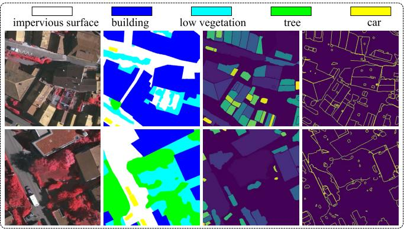

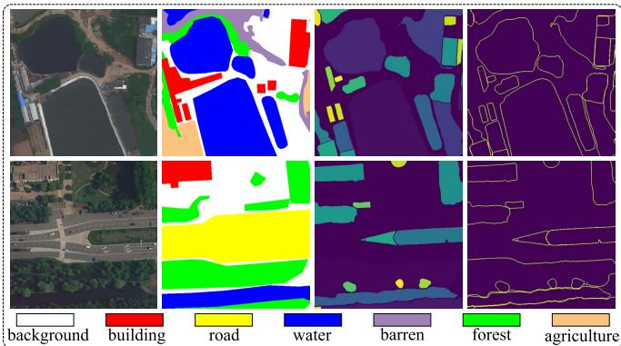

(d)

Fig. 1. Visual examples. (a) Images. (b) Ground truth. (c) SGO. (d) SGB. The first two rows show samples of size $5 1 2 \times 5 1 2$ from ISPRS Vaihingen. The last two rows show samples of size $5 1 2 \times 5 1 2$ from LoveDA Urban. It can be observed that SGO and SGB provide a wealth of detailed information about ground objects from both object and boundary perspectives.

in SAM contributes to enhancing the semantic segmentation performance of remote sensing images. Notably, our approach stands out by not necessitating specific designs for the semantic segmentation model, training strategy, or pseudolabel generation, in contrast to other existing SAM-based methods employed in remote sensing. This approach holds the potential for direct implementation across various tasks and semantic segmentation models involving the combination of SAM and remote sensing. The contributions of this work can be summarized as follows. 

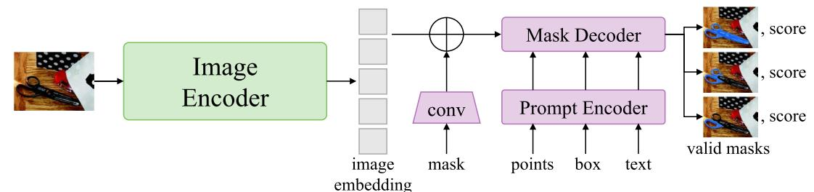

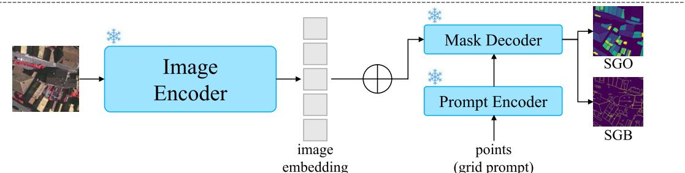

(b)

Fig. 2. Comparison of frameworks between SAM and the proposed approach. (a) Schematic of the SAM framework [32]. (b) Schematic of the proposed SAM-based pre-processing approach. All parameters of SAM are frozen, and SGO and SGB are generated with grid prompt. It is the only mode that automatically segment the entire image by creating multiple point prompts using a regular grid.

1) A streamlined framework is proposed to efficiently leverage two novel concepts called SGO and SGB for remote sensing image semantic segmentation, which emphasizes the value and effectiveness of the raw output of SAM. 

2) We propose a novel object consistency loss by restraining the consistency of pixels within an object and further introduce the boundary preservation loss to assist with model optimization. 

3) Extensive experiments on two well-known, publicly available remote sensing datasets, ISPRS Vaihingen and LoveDA Urban, and four representative semantic segmentation models confirm that the proposed approach can be widely adapted to semantic segmentation tasks of different datasets and different general models. 

To the best of our knowledge, this work is the first to introduce object and boundary constraints into semantic segmentation tasks to refine the segmentation results by directly utilizing the raw output of SAM without the need for additional class prompts. We believe that it has the potential to significantly expand the application of SGO and SGB, unlocking the full capabilities of foundation models like SAM in remote sensing image semantic segmentation tasks. The remainder of this article is organized as follows. Section II first reviews the related works of SAM in different fields. After that, Section III presents the proposed method in detail, whereas Section IV provides experimental results and discussions. Finally, the conclusion is given in Section V. 

# II. RELATED WORKS

# A. Segment Anything Model

The SAM [49], introduced by Meta AI, is a large vision transformer [14]-based model trained on a substantial visual corpus. It is a foundation model aiming to address specific 

downstream image segmentation tasks. One of the challenges in applying deep neural networks to real-world semantic segmentation applications is the need for large amounts of well-annotated training data. SAM effectively addresses this issue by enabling zero-shot generalization to unseen images and objects based on user-provided prompts. The framework of SAM has three main components, namely an image encoder, a prompt encoder, and a mask decoder, as shown in Fig. 2(a). The image encoder utilizes a vision transformer-based approach for extracting image features. The prompt encoder incorporates user interactions for segmentation tasks. Different types of prompts are supported, including mask, points, box, and text prompts. The mask decoder comprises transformer layers with dynamic mask prediction heads and an intersection-over-union (IoU) score regression head. It maps the encoder embedding, prompt embeddings, and an output token to a mask. For user convenience, SAM offers a set of application programming interfaces (APIs) with which segmentation masks can be obtained in just a few lines of code. Different segmentation mode options, e.g., fully automatic, bounding box, and point mode, are supported for different prompts in APIs. Specifically, the fully automatic mode is a special point mode that makes segmentation predictions for the entire image by creating multiple point prompts using a regular grid. 

Currently, SAM has made significant strides in diverse fields. In the realm of medical image processing, Zhang et al. [50] introduced a straightforward image enhancement method by combining SAM-generated masks with raw images. Additionally, nnSAM [51] integrated the encoder of UNet with the pre-trained SAM encoder, harnessing the feature extraction capabilities of this foundational vision model. Furthermore, Jiang and Yang [52], Huang et al. [53], Qi et al. [54], and Zhang et al. [55] explored SAM’s capacity to generate pseudo-labels. Through these distinct technical approaches, 

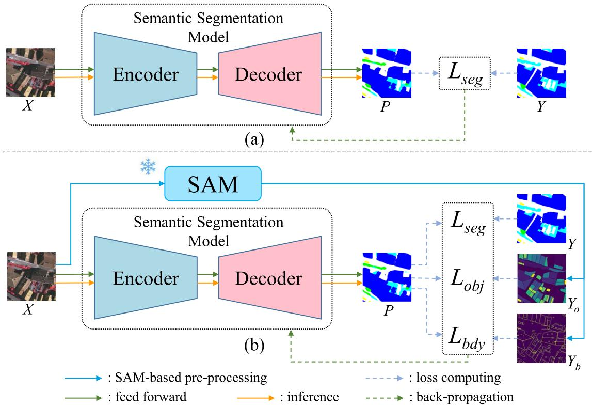

Fig. 3. (a) Schematic of the general semantic segmentation model. (b) Schematic of the proposed method. In the proposed method, the image $X$ is fed into the semantic segmentation model that generates the segmentation output $P$ before the segmentation loss $L _ { \mathrm { s e g } }$ is computed by segmentation output and ground truth $Y _ { b }$ , which will also be used for model optimization together with $Y$ , which is used for backpropagation to update the model. Meanwhile, two additional loss functions $L _ { \mathrm { s e g } }$ . $\check { L } _ { \mathrm { o b j } }$ and $L _ { \mathrm { b d y } }$ are computed by SGO $Y _ { o }$ and SGB

these methods have propelled the application and development of SAM across various domains. 

# B. SAM in Remote Sensing

The fundamental distinction between natural images and remote sensing images lies in their acquisition and context, encompassing factors such as acquisition methods, spectral and spatial resolutions, object scale and coverage, and content complexity [26], [56], [57]. To introduce SAM into remote sensing, SAMRS [34] presented a prompt known as rotated bounding box (R-Box) to guide SAM segmentation, subsequently generating a comprehensive remote sensing segmentation dataset. This groundbreaking work has paved the way for the integration of large-scale models and the utilization of big data in the field of remote sensing. On a parallel track, Text2Seg [37] devised a framework employing multiple foundational models to guide semantic segmentation of remote sensing images through text prompts. However, prompt learning techniques explored in [34], [36], [37], [38], and [42] necessitate careful selection based on the specific dataset characteristics, limiting the general applicability of SAM. Meanwhile, few-shot or zero-shot methods [40], [41] demonstrated promising adaptability for remote sensing tasks, though their sensitivity to additional fine-tuning techniques remains a notable consideration. More importantly, the absence of semantic information confines existing methods to binary classification tasks [42], [43], which undoubtedly limits the progression of SAM in remote sensing imagery semantic 

segmentation. In particular, CocoaNet [46] and RingMo-SAM [47] were both crafted for semantic segmentation, while their complex network and training strategy limit their broad applicability to other remote sensing tasks. 

In light of the aforementioned discussions, it is imperative to design an accessible and user-friendly framework for leveraging SAM in semantic segmentation tasks with multiple classes. In this work, we propose an alternative framework distinct from the aforementioned methods, employing SGO and SGB to leverage the knowledge contained in SAM in a simple and general way. 

# C. Object-Based Methods in Remote Sensing

The semantic segmentation of remote sensing imagery generally revolves two primary approaches: pixel-based and object-based methods [58], which leverage distinct scales for feature learning and final category prediction. There have been many works explored in integrating object-based concepts into various remote sensing tasks [59], [59], [60], [61], [62], [63]. In particular, OCNN [59] proposed the first object-based CNN framework to perform land use classification in the complicated scenarios. SDNF [64] and ESCNet [65] constructed semantic segmentation networks based on superpixels. The former introduced a superpixel-enhanced region module to mitigate noise and strengthen ground object edges, while the latter proposed an adaptive superpixel merging module, optimizing the model toward objects through handling high-dimensional features. OBIC-GCN [66] delved into 

relationships between objects leveraging graph convolutional networks [67]. However, a notable issue with these methods is that they predominantly focus on extracting object-based features. This approach necessitates the creation of specialized learnable modules to assist in achieving accurate semantic segmentation, thereby elevating the complexity and potential instability of the implementation process [68]. In contrast, the proposed approach integrates seamlessly with existing semantic segmentation models, allowing for straightforward optimization. This method efficiently leverages the raw output of SAM, which contains detailed object information, enhancing overall model performance. 

# III. METHODOLOGY

The schematic of the proposed framework is depicted in Fig. 3. Fig. 3(a) showcases the conventional approach to semantic segmentation, where the input image is fed into the semantic segmentation model to generate segmentation output. This output is then utilized to calculate the segmentation loss, followed by model updates through back-propagation. In contrast, the proposed method, as shown in Fig. 3(b), incorporates an extra stage that employs the SAM. Specifically, we directly create SGO and SGB using the SAM as provided by Meta AI [32]. These outputs play a crucial role in computing the object consistency loss and boundary preservation loss, respectively, thereby contributing to the model’s training. In this section, we will provide detailed explanations of SAMbased pre-processing, network training, and the associated loss functions. 

# A. SAM-Based Pre-Processing

The schematic of the proposed SAM-based pre-processing approach is presented as Fig. 2(b). SAM provides a grid prompt technique to automatically process images. Given the input remote sensing image denoted by $X \in \bar { \mathbb { R } ^ { H \times W \times 3 } }$ , SAM can generate segmentation masks across the entire image at all plausible locations in the grid prompt setting [50]. In this study, we refer to the segmentation mask as the object, considering each segmentation mask as an individual enclosed region that can be regarded as an object. The generated objects are then stored in a list where we set a threshold of $K$ to limit the maximum number of objects in $X$ . Meanwhile, we also establish a threshold S to limit the number of pixels that a single object can contain, effectively filtering out very small segmentation masks. Consequently, an SGO denoted by $Y _ { o } ~ \in ~ \mathbb { R } ^ { H \times W }$ can be obtained, where the value of each pixel falls within the range of $[ 0 , K ]$ . Pixels not segmented as objects, as well as boundaries, are assigned a value of zero, while the objects in $Y _ { o }$ are indexed by an identifier denoted as $i$ , where $i \in [ 1 , K ]$ . The data organization of SGO is presented in Fig. 4(a). Concurrently, a boundary prior map is derived from SGO. This process involves outlining the exterior boundaries of each object within the list and merging these boundaries to produce a comprehensive boundary prior map, namely SGB, denoted by $Y _ { b } \in \mathbb { R } ^ { H \times W }$ . Unless specified otherwise, the identifier for the boundary pixels in $Y _ { b }$ is set to 255, while others are set to 0 in the sequel as shown in 

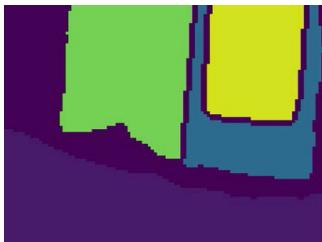

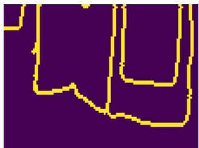

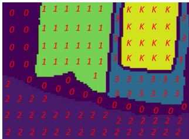

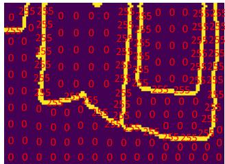

Fig. 4. (a) SGO and its diagram with pixel values where the pixels inside the same object have the same value, and the maximum index is the threshold $K$ . (b) SGB and its diagram with pixel values. The boundary pixels are set to 255, while others are set to 0.

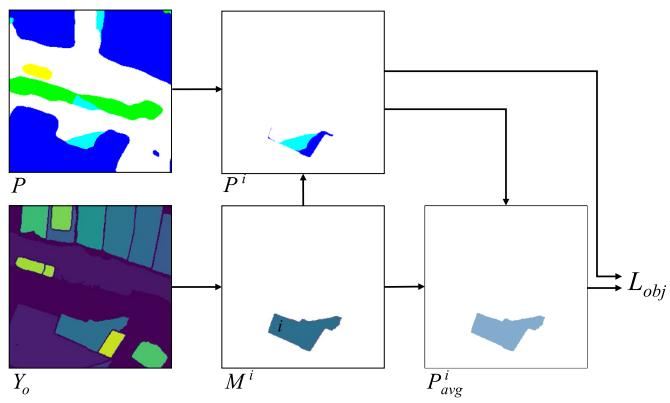

Fig. 5. Flowchart for computing object consistency loss.

Fig. 4(b). Visual examples of SGO and SGB are illustrated in Fig. 1(c) and (d). 

# B. Object Consistency Loss

The object consistency loss is designed to maintain pixel consistency within the objects in a given input image. Given the input $X$ , the output of the semantic segmentation model is denoted as $P$ . To compute the object consistency loss, we iterate through all the objects in $Y _ { o }$ . The data flow is presented in Fig. 5. For each object, we first extract its mask $M ^ { i }$ from that $Y _ { o }$ satisfies 

$$
M ^ {i} = \left\{ \begin{array}{l l} 1, & \text {i f p i x e l v a l u e i n Y _ {o} e q u a l s i} \\ 0, & \text {o t h e r w i s e .} \end{array} \right. \tag {1}
$$

$M ^ { i }$ can represent the entire region of the i th object. After that the object prediction is then obtained by 

$$
P ^ {i} = P \odot M ^ {i} \tag {2}
$$

where $\odot$ stands for the Hadamard product. The object prediction $P ^ { i }$ denotes the model prediction filtered based on the 

mask $M ^ { i }$ of the ith object. Next, we can calculate the object average prediction of the ith object as 

$$
P _ {\text {a v g}} ^ {i} = \frac {\mathcal {G} (P ^ {i})}{N ^ {i} + 1} \odot M ^ {i} \tag {3}
$$

where $\mathcal { G }$ calculates the sum of all pixels in the spatial dimension and reshapes to its original shape, while $N ^ { i }$ is the number of points in the ith object. An extra one is added to avoid the denominator being zero. $P _ { \mathrm { a v g } } ^ { i }$ represents the expected mean value of all the pixels in the ith object. Thus, we can compute the object consistency loss $L _ { \mathrm { o b j } }$ for all objects as 

$$
L _ {\mathrm {o b j}} = \sum_ {i = 1} ^ {K} \mathcal {M S E} \left(P ^ {i}, P _ {\text {a v g}} ^ {i}\right) \tag {4}
$$

where $\mathcal { M } \mathcal { S } \mathcal { E } ( \cdot )$ is the mean-squared error function. As (4) shows, the goal ofobject prediction $P ^ { i }$ $L _ { \mathrm { o b j } }$ is to reduce the difference betweend the expected mean prediction $P _ { \mathrm { a v g } } ^ { i } { \mathrm { . } }$ object predicted by the model. Since an object corresponds to a natural ground object, or part of a natural ground object, this variance is expected to be as small as possible. In this work, we define the variance as the consistency of pixels within the object. Clearly, the proposed $L _ { \mathrm { o b j } }$ can directly leverages the regions generated by SAM, fully utilizing the detailed segmentation mask information in SGO. 

# C. Boundary Preservation Loss

Previous studies [48], [69], [70] have demonstrated that incorporating edge constraints can effectively enhance the performance of semantic segmentation models in remote sensing tasks. Our observations indicate that SGO inherently contains highly detailed boundary information, as depicted in Fig. 1(d). To leverage this boundary information, we set the boundary to 0 in $Y _ { o }$ and generate SGB, denoted as $Y _ { b }$ . In this work, the boundary metric $( \mathrm { B F _ { 1 } } )$ [48], capable of directly computing boundary preservation loss from the segmentation output $P$ of the semantic model, is employed to evaluate the precision of boundary detection. The boundary preservation loss $L _ { \mathrm { b d y } }$ is given by 

$$
L _ {\mathrm {b d y}} = 1 - \mathrm {B F} _ {1} \tag {5}
$$

where $\mathrm { B F _ { 1 } }$ is defined as 

$$
\mathrm {B F} _ {1} = 2 \times \frac {p _ {b} r _ {b}}{p _ {b} + r _ {b}} \tag {6}
$$

with $p _ { b }$ and $r _ { b }$ being the precision and recall of the boundary that can comprehensively evaluate the accuracy of the boundary detection results from $P$ and $Y _ { b }$ [48]. 

# D. Network Training

The classical encoder–decoder networks, e.g., UNetformer [25], are widely used in semantic segmentation methods. In this work, we use them as the semantic segmentation model in the proposed framework. Given the input image $X$ , the semantic segmentation model produces the predicted segmentation output denoted by P ∈ RH×W×C, $\textbf {  { P } } \in \mathbb { R } ^ { H \times W \times C }$ where $C$ is the number of categories of ground objects. The 

learning objective is to minimize the following cross-entropybased segmentation loss with respect to the parameters of the semantic segmentation model: 

$$
L _ {\mathrm {s e g}} = - \sum_ {\mathcal {H}, \mathcal {W}} \sum_ {c \in C} Y ^ {(\mathcal {H}, \mathcal {W}, c)} \log (P ^ {(\mathcal {H}, \mathcal {W}, c)}) \tag {7}
$$

where Y stands for the ground truth. 

Given that SGO and SGB are solely utilized for computing loss functions, the proposed framework requires no additional modifications or adjustments to the network and training strategies. Thus, the learning objective for the proposed method is to minimize the following composite loss function: 

$$
L _ {\text {t o t a l}} = L _ {\text {s e g}} + \lambda_ {o} L _ {\text {o b j}} + \lambda_ {b} L _ {\text {b d y}} \tag {8}
$$

where $\lambda _ { o }$ and $\lambda _ { b }$ are two weighting coefficients to balance the three losses. Finally, the overall objective function employed in training the semantic segmentation model is given by (8), which sums the semantic segmentation loss $L _ { \mathrm { s e g } }$ , the object consistency loss $L _ { \mathrm { o b j } }$ , and the boundary preservation loss $L _ { \mathrm { b d y } }$ . 

# IV. EXPERIMENTS AND DISCUSSION

# A. Datasets

1) ISPRS Vaihingen: The ISPRS Vaihingen dataset comprises 16 true orthophotos with very high-resolution, averaging $2 5 0 0 \times 2 0 0 0$ pixels. Each orthophoto encompasses three channels, namely near-infrared, red, and green (NIRRG) of $9 \mathrm { \ c m }$ ground sampling distance. This dataset includes five foreground classes, namely impervious surface, building, low vegetation, tree, car, and one background class (clutter). The 16 orthophotos are divided into a training set of 12 patches and a test set of four patches. The training set comprises orthophotos of index numbers 1, 3, 23, 26, 7, 11, 13, 28, 17, 32, 34, 37, while the test set 5, 21, 15, 30. It is equivalent to 960 training samples and 240 test samples, both with the size of $2 5 6 \times 2 5 6$ . 

2) LoveDA Urban: The LoveDA dataset contains two scenes, namely Urban and Rural. Considering the diverse distribution of ground objects, we selected the LoveDA Urban scene for our experiments. The LoveDA Urban comprises 1833 high-resolution optical remote sensing images, each with the size of $1 0 2 4 \times 1 0 2 4$ pixels. The images provide three channels, namely red, green, and blue (RGB), with a ground sampling distance of $3 0 ~ \mathrm { c m }$ . The dataset encompasses seven landcover categories, including background, building, road, water, barren, forest, and agriculture [71]. These images were collected from three cities in China (Nanjing, Changzhou, and Wuhan). The 1833 images are divided into two parts, with 1156 images for training and 677 images for testing. Specifically, the training set contains images indexed from 1366 to 2521, while the test set spans images from 3514 to 4190. It is equivalent to 18 496 training samples and 10 832 test samples, both with the size of $2 5 6 \times 2 5 6$ . 

Table II presents the comparison of two datasets. The two datasets consist of a large number of high-resolution images covering extensive areas, representing complex town and urban environments with a mix of various land cover classes. Therefore, these datasets are particularly valuable for evaluating the 

TABLE II COMPARISON OF TWO DATASETS

<table><tr><td></td><td>ISPRS Vailingen</td><td>LoveDA Urban</td></tr><tr><td>Spatial resolution</td><td>9 cm</td><td>30 cm</td></tr><tr><td>Data volume</td><td>1200</td><td>29328</td></tr><tr><td>Geographical type</td><td>Town</td><td>Urban</td></tr><tr><td>Classification system</td><td>Five foreground categories, and background</td><td>Six foreground categories, and background</td></tr><tr><td>Proportion of background</td><td>Only 1%</td><td>Around 40%</td></tr></table>

performance of algorithms and models in different environments. Meanwhile, they differ in sampling resolution, ground object categories, and label accuracy. The main difference is the background class, which contains all ground objects that are not labeled as the foreground categories. The proportion of background shows that ISPRS Vaihingen dataset has a finer classification system, whereas the LoveDA Urban dataset employs a coarser classification system. Consequently, the ISPRS Vaihingen and LoveDA Urban datasets exhibit different segmentation scales, both in terms of spatial resolution and classification system. Conducting experiments on both datasets provides substantial evidence regarding the effectiveness and the broad applicability of the proposed framework. 

Throughout the training and testing processes, a sliding window is employed for dynamically assembling training batches, enabling the processing of large images without presplitting. The sliding window size is set to $2 5 6 \times 2 5 6$ , with a stride of 256 during training and an adjusted stride of 32 during testing. The use of a smaller stride in testing effectively mitigates border effects by averaging the prediction outcomes within overlapping regions [72], [73]. 

# B. Evaluation Metrics

To assess the segmentation performance of the proposed framework, the mean F1-score (mF1) and the mean intersection over union (mIoU) are employed in our experiments. These widely used statistical indices allow for fair comparisons between the performance of our method and state-of-the-art baseline methods. In particular, we compute mF1 and mIoU of the five foreground classes for the ISPRS Vaihingen. The class labeled as Clutter or Background is treated as a cluttered and sparse class, and thus, performance statistics are not calculated for either class [16], [27]. In the case of LoveDA Urban, all seven categories are considered in our experiments. F1 and IoU metrics are computed for each class identified by the index c using the following formulas: 

$$
F 1 = 2 \times \frac {p _ {c} r _ {c}}{p _ {c} + r _ {c}} \tag {9}
$$

$$
\mathrm {I o U} = \frac {\mathrm {T P} _ {c}}{\mathrm {T P} _ {c} + \mathrm {F P} _ {c} + \mathrm {F N} _ {c}} \tag {10}
$$

where $\mathrm { T P } _ { c }$ , $\mathrm { F P } _ { c }$ , and $\mathrm { F N } _ { c }$ are true positives, false positives, and false negatives for the cth class, respectively. Furthermore, $p _ { c }$ and $r _ { c }$ are given by 

$$
p _ {c} = \frac {\mathrm {T P} _ {c}}{\mathrm {T P} _ {c} + \mathrm {F P} _ {c}} \tag {11}
$$

$$
r _ {c} = \frac {\mathrm {T P} _ {c}}{\mathrm {T P} _ {c} + \mathrm {F N} _ {c}}. \tag {12}
$$

Upon computing F1 and IoU for the main classes according to the definitions above, we derive their mean values, denoted as mF1 and mIoU, respectively. 

# C. Implementation Details

The experiments were conducted using PyTorch on a single NVIDIA GeForce RTX 4090 GPU equipped with 24 GB RAM. To generate SGO and SGB, we utilize the interface offered by Meta AI, which involves three pertinent hyperparameters, namely “crop_nms_thresh,” “box_nms_thresh,” and “pred_iou_thresh” whose definitions can be found in Meta AI documentation.1 In our experiments, these values were configured to 0.5, 0.5, and 0.96, respectively. The threshold $K$ and S are both set to 50. Note that higher “pred_iou_thresh” value and lower threshold $K$ tend to generate more dependable raw output, but also result in a lower number of generated objects and boundaries. Depending on the characteristics of SGO and SGB, overly detailed SGO and SGB may have a detrimental impact on the model. Excessively fine SGO could fragment natural ground objects into numerous small parts, compromising overall consistency. Similarly, an abundance of boundary information in SGB might lead to the generation of unrealistic objects. More details are presented in Section IV-E1. 

For ISPRS Vaihingen, the image size input to SAM is $5 1 2 \times 5 1 2$ , and the results will be merged to the original size after pre-processing. For LoveDA Urban, the image size input to SAM is $1 0 2 4 \times 1 0 2 4$ that remains the same as the original size. Stochastic gradient descent (SGD) was employed as the optimization algorithm for training all models. Furthermore, the experiments employed a learning rate of 0.01, a momentum of 0.9, a decaying coefficient of 0.0005, and a batch size of 10. The values of $\lambda _ { o }$ and $\lambda _ { b }$ were chosen based on our sensitivity analysis, as shown in Section IV-E2. Simple data augmentations, such as random rotation and flipping, were utilized for all experiments. 

# D. Performance Comparison

We benchmarked the performance of the proposed framework on four representative semantic segmentation models for remote sensing images, namely ABCNet [74], CMTFNet [27], UNetformer [25], and FTUNetformer [25]. Specifically, these four methods employ the most common backbones recently, the CNN-based ResNet [12] and the self-attention-based [13] Swin Transformer [75]. This choice allows us to validate our approach across different classical networks. The quantitative results are listed in Tables III and IV. 

1) Performance Comparison on the Vaihingen Dataset: As indicated in Table III, our proposed framework demonstrates significant improvements in terms of both mF1 and mIoU metrics as compared to the four baseline methods. These results affirm the effectiveness of our approach in robustly capturing object and boundary representations. Notably, the incorporation of SGO and SGB information substantially 

1Meta AI: https://github.com/facebookresearch/segment-anything/tree/ main/segment_anything 

TABLE III EXPERIMENTAL RESULTS ON THE ISPRS VAIHINGEN DATASET. WE PRESENT THE OA OF FIVE FOREGROUND CLASSES AND THREE OVERALL PERFORMANCE METRICS. THE ACCURACY OF EACH CATEGORY IS PRESENTED IN THE F1/IOU FORM. BOLD VALUES ARE THE BEST

<table><tr><td>Method</td><td>Backbone</td><td>impervious surface</td><td>building</td><td>low vegetation</td><td>tree</td><td>car</td><td>mF1</td><td>mIoU</td></tr><tr><td>ABCNet [74]</td><td>ResNet-18</td><td>89.78/81.45</td><td>94.30/89.21</td><td>78.49/64.59</td><td>90.08/81.95</td><td>74.05/58.80</td><td>85.34</td><td>75.20</td></tr><tr><td>ABCNet+SAM</td><td>ResNet-18</td><td>92.02/85.21</td><td>95.97/92.25</td><td>79.90/66.53</td><td>90.06/81.92</td><td>78.52/64.64</td><td>87.29</td><td>78.11</td></tr><tr><td>CMTFNet [27]</td><td>ResNet-50</td><td>92.53/86.09</td><td>96.95/94.09</td><td>79.98/66.64</td><td>90.22/82.19</td><td>89.87/81.60</td><td>89.91</td><td>82.12</td></tr><tr><td>CMTFNet+SAM</td><td>ResNet-50</td><td>92.98/86.88</td><td>97.05/94.26</td><td>80.58/67.48</td><td>91.19/83.81</td><td>90.98/83.44</td><td>90.56</td><td>83.18</td></tr><tr><td>UNetformer [25]</td><td>ResNet-18</td><td>92.33/85.76</td><td>96.25/92.78</td><td>80.47/67.33</td><td>90.85/83.22</td><td>89.35/80.75</td><td>89.85</td><td>81.97</td></tr><tr><td>UNetformer+SAM</td><td>ResNet-18</td><td>92.79/86.54</td><td>96.74/93.69</td><td>80.85/67.86</td><td>91.17/83.77</td><td>90.43/82.53</td><td>90.40</td><td>82.88</td></tr><tr><td>FTUNetformer [25]</td><td>SwinTrans-base</td><td>93.41/87.64</td><td>96.92/94.02</td><td>81.53/68.82</td><td>90.91/83.33</td><td>88.46/79.31</td><td>90.24</td><td>82.62</td></tr><tr><td>FTUNetformer+SAM</td><td>SwinTrans-base</td><td>93.73/88.20</td><td>97.19/94.53</td><td>81.77/69.16</td><td>91.62/84.53</td><td>91.09/83.64</td><td>91.08</td><td>84.01</td></tr></table>

TABLE IV EXPERIMENTAL RESULTS ON THE LOVEDA URBAN DATASET. WE PRESENT THE OA OF FIVE FOREGROUND CLASSES AND THREE OVERALL PERFORMANCE METRICS. THE ACCURACY OF EACH CATEGORY IS PRESENTED IN THE F1/IOU FORM. BOLD VALUES ARE THE BEST

<table><tr><td>Method</td><td>Backbone</td><td>background</td><td>building</td><td>road</td><td>water</td><td>barren</td><td>forest</td><td>agriculture</td><td>mF1</td><td>mIoU</td></tr><tr><td>ABCNet [74]</td><td>ResNet-18</td><td>52.02/35.15</td><td>63.36/46.37</td><td>65.42/48.61</td><td>61.42/44.31</td><td>44.27/28.43</td><td>54.63/37.58</td><td>19.98/11.10</td><td>57.30</td><td>40.58</td></tr><tr><td>ABCNet+SAM</td><td>ResNet-18</td><td>50.23/33.54</td><td>68.25/51.80</td><td>66.10/49.36</td><td>75.74/60.95</td><td>36.09/22.01</td><td>55.43/38.34</td><td>22.59/12.74</td><td>59.28</td><td>43.53</td></tr><tr><td>CMTFNet [27]</td><td>ResNet-50</td><td>56.09/38.98</td><td>74.18/58.96</td><td>67.11/50.50</td><td>70.30/54.27</td><td>47.00/30.72</td><td>54.45/37.41</td><td>41.92/25.65</td><td>62.95</td><td>46.68</td></tr><tr><td>CMTFNet+SAM</td><td>ResNet-50</td><td>55.86/38.76</td><td>75.79/61.02</td><td>76.05/61.36</td><td>72.14/56.42</td><td>37.28/22.91</td><td>55.97/38.86</td><td>43.24/27.58</td><td>63.43</td><td>48.09</td></tr><tr><td>UNetformer [25]</td><td>ResNet-18</td><td>54.66/37.61</td><td>69.09/52.78</td><td>68.33/51.89</td><td>77.66/63.47</td><td>56.98/39.84</td><td>51.01/34.23</td><td>20.54/11.44</td><td>65.34</td><td>49.12</td></tr><tr><td>UNetformer+SAM</td><td>ResNet-18</td><td>55.43/38.34</td><td>75.91/61.17</td><td>73.61/58.24</td><td>80.55/67.43</td><td>43.19/27.55</td><td>57.05/39.91</td><td>43.64/27.91</td><td>65.74</td><td>50.55</td></tr><tr><td>FTUNetformer [25]</td><td>SwinTrans-base</td><td>55.38/38.30</td><td>75.46/61.21</td><td>75.29/60.38</td><td>75.81/61.04</td><td>40.83/25.65</td><td>54.10/37.08</td><td>40.32/25.25</td><td>64.95</td><td>49.71</td></tr><tr><td>FTUNetformer+SAM</td><td>SwinTrans-base</td><td>56.40/39.27</td><td>77.23/62.91</td><td>74.74/59.67</td><td>77.30/63.00</td><td>44.44/28.57</td><td>53.30/36.33</td><td>44.17/28.34</td><td>66.02</td><td>50.68</td></tr></table>

enhances semantic segmentation performance in remote sensing images. For illustration purposes, we focus on the third set of experiments in which UNetformer $+$ SAM demonstrated superior performance over UNetformer in all five classes, namely impervious surface, building, low vegetation, tree, and car. In particular, on the ISPRS Vaihingen dataset, UNetformer + SAM achieved performance improvement of $1 . 0 8 \%$ and $1 . 7 8 \%$ in F1 and IoU, respectively, on the Car class as compared to UNetformer. Furthermore, the classification accuracy for building was enhanced by $0 . 4 9 \%$ and $0 . 9 1 \%$ in F1 and IoU, respectively, compared to UNetformer. These improvements can be attributed to the inherent characteristics of car and building classes, which typically exhibit simpler and more standardized shapes compared to other ground object categories. For instance, a car is often presented as a fixed-size rectangular shape under consistent sampling conditions, while a building typically manifests as a changing-size rectangle. As a result, SGO and SGB provide more reliable criteria for these specific categories, facilitating more accurate segmentation. 

In contrast, impervious surface, low vegetation, and tree often feature intricate boundaries and varying sizes. Despite their complexity, SGO and SGB still offer valuable supplementary information for these specific categories. For instance, the classification accuracy for impervious surface was improved by $0 . 4 6 \%$ and $0 . 7 8 \%$ in F1 and IoU, respectively. Meanwhile, both low vegetation and tree showed comparable improvements in F1 and IoU metrics, reflecting their similar characteristics. In terms of overall performance, UNetformer $^ +$ SAM achieved an mF1 score of $9 0 . 4 0 \%$ and a mIoU of $8 2 . 8 8 \%$ , representing an increase of $0 . 5 5 \%$ and $0 . 9 1 \%$ compared to UNetformer, respectively. 

Other comparative experiments in Table III further substantiated our observations above. Specifically, FTUNetformer $+$ SAM that adopts Swin Transformer as its backbone also demonstrated significant enhancements, exhibiting a notable $2 . 6 3 \%$ and $4 . 3 3 \%$ improvement in F1 and IoU metrics, respectively, for the Car class compared to FTUNetformer. Moreover, we observed a slight increase in classification accuracy for the building, with improvements of $0 . 2 7 \% - 0 . 5 1 \%$ in F1 and IoU, respectively. In particular, the tree category exhibits a notable improvement, while the improvement in the low vegetation category is somewhat diminished, primarily due to their significant similarity. The overall performance corresponds to an mF1 score of $9 1 . 0 8 \%$ and an mIoU of $8 4 . 0 1 \%$ , marking respective increases of $0 . 8 4 \%$ and $1 . 3 9 \%$ compared to the FTUNetformer. These outcomes affirm that our proposed framework, with the aid of SGO and SGB, achieved superior generalization performance across various models. 

Fig. 6 presents a visual comparison between the results produced by the baseline methods and our approach. Throughout all subfigures, purple boxes highlight areas of interest. First, our method excelled in precisely segmenting entire objects, notably evident in the clear delineation of building. Second, our approach significantly refined object boundaries, as seen with low vegetation and building, aligning more closely with the actual ground-truth boundaries. Furthermore, our method successfully addressed the segmentation of challenging categories, such as tree, building, and impervious surface. These improvements primarily stem from the object region and boundary details contained in the SGO and SGB. Leveraging the well-designed framework founded on object- and boundary-based loss functions allows for the 

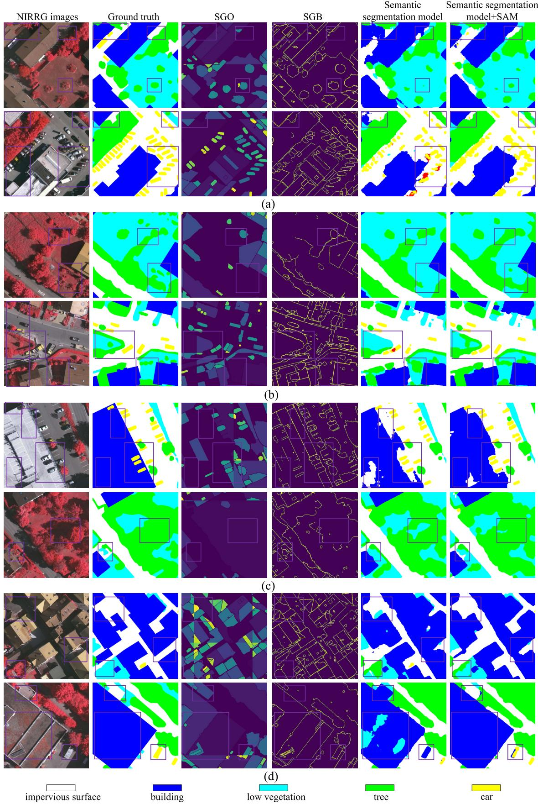

Fig. 6. Qualitative performance comparisons on the ISPRS Vaihaigen with the size of $5 1 2 \times 5 1 2$ . (a) ABCNet. (b) CMTFNet. (c) UNetformer. (d) FTUNetformer. We showcase two samples for each model. Some purple boxes are added to highlight the differences.

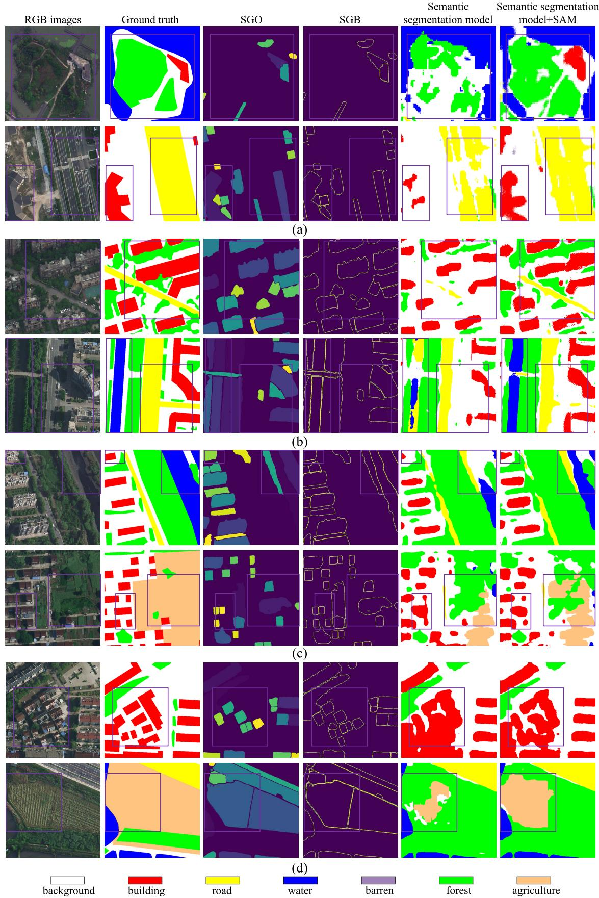

Fig. 7. Qualitative performance comparisons on the LoveDA Urban with the size of $5 1 2 \times 5 1 2 .$ . (a) ABCNet. (b) CMTFNet. (c) UNetformer. (d) FTUNetformer. We showcase two samples for each model. Some purple boxes are added to highlight the differences.

comprehensive exploitation of this detailed information, leading to the observed improvements in segmentation accuracy. 

2) Performance Comparison on the LoveDA Urban: Experiments conducted on the LoveDA Urban dataset yielded results similar to those observed in the ISPRS Vaihingen dataset despite variations in sampling resolution and ground object categories between the two datasets. Given the modest benchmark performance of ABCNet and CMTFNet, our approach yielded notably superior enhancements in overall performance. Observing the results of UNetformer and UNetformer $^ +$ SAM as shown in Table IV, the classification accuracies for building, water, and agriculture were $7 5 . 9 1 \% / 6 1 . 1 7 \%$ , $8 0 . 5 5 \% / 6 7 . 4 3 \%$ , and $4 3 . 6 4 \% / 2 7 . 9 1 \%$ , respectively, which amounts to an increase of $6 . 8 2 \% / 8 . 3 9 \%$ , $2 . 8 9 \% / 3 . 9 6 \%$ , and $2 3 . 1 \% / 1 6 . 4 7 \%$ in F1 and IoU, respectively, as compared to UNetformer. Meanwhile, our findings with FTUNetformer $^ +$ SAM consistently confirmed advantages for these classes characterized by regular shapes and uncomplicated borders. The corresponding mF1 and mIoU values were $6 5 . 7 4 \%$ and $5 0 . 5 5 \%$ , respectively, marking increases of $0 . 4 \%$ and $1 . 4 3 \%$ over UNetformer, while the increases for mF1 and mIoU on FTUNetformer were $1 . 0 7 \%$ and $0 . 9 7 \%$ . 

However, upon evaluating this dataset, we observed fluctuating performance changes when comparing the results of the four baselines. For instance, UNetformer $^ +$ SAM exhibited improved performance for road and forest, whereas FTUNetformer + SAM demonstrated the opposite trend. Conversely, the performance for barren decreased in UNetformer $^ +$ SAM but improved in FTUNetformer $^ +$ SAM. The primary reason for this discrepancy is that these three categories have intricate boundaries and varying sizes. Notably, the proportion of barren is very small, leading to volatility in its results during the experiments [71]. While the semantic segmentation model aims to enhance overall performance, it cannot guarantee consistent improvement in every single category. Nevertheless, the overall performance improvement of our framework demonstrates the instructive nature of this approach for subsequent remote sensing works with different models. 

Fig. 7 presents visualization examples from the LoveDA Urban, with purple boxes highlighting areas of interest in all subfigures. First, the model demonstrated enhanced accuracy in identifying building, evident across all methods. Furthermore, a more complete identification of water and agriculture objects was apparent. These observations closely align with the improvements indicated by the mF1 and mIoU metrics, as presented in Table IV. 

# E. Sensitivity Analysis

1) SAM-Based Pre-Processing: There are three key hyperparameters associated with SAM-based pre-processing: “pred_iou_thresh,” $K$ , and S. Specifically, “pred_iou_thresh” directly impacts the generation of SGO and SGB. Figs. 8 and 9 present visual examples of SGO and SGB when “pred_iou_thresh” is set to four values. It is easy to observe that when “pred_iou_thresh” is set to 0.50, the ground object information represented by SGO and SGB exceeds the ground truth. Conversely, when “pred_iou_thresh” is set to 0.99, 

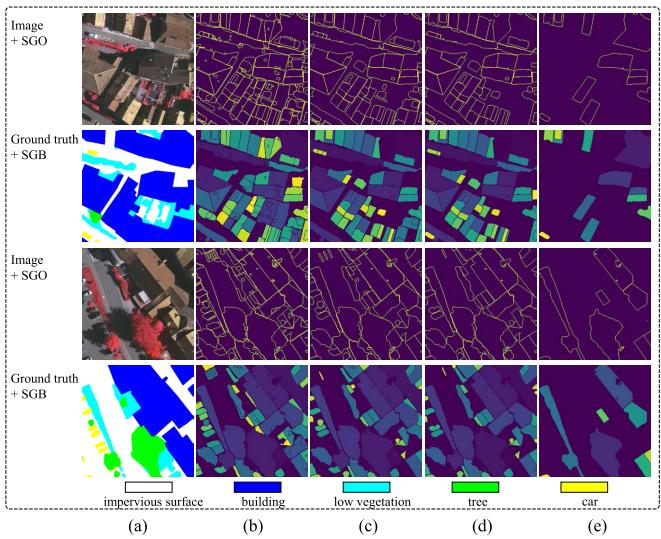

Fig. 8. (a) Image and corresponding ground truth on the ISPRS Vaihingen dataset. Visual examples of SGO and SGB when “pred_iou_thresh” is set to (b) 0.50, (c) 0.95, (d) 0.96, and (e) 0.99.

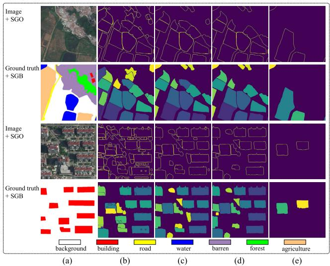

Fig. 9. (a) Image and corresponding ground truth on the LoveDA Urban dataset. Visual examples of SGO and SGB when “pred_iou_thresh” is set to (b) 0.50, (c) 0.95, (d) 0.96, and (e) 0.99.

essential feature information is missing. When it is set to 0.95 and 0.96, there is little difference in ground object information. Therefore, 0.96 is chosen in our experiments, as it provides more reliable SGO and SGB while retaining sufficient information. Figs. 8(d) and 9(d) demonstrate that the “pred_iou_thresh” value of 0.96 is well-suited for remote sensing images across various scales. After that, we set up a wide range of $K$ and S. With “pred_iou_thresh” set to 0.96, the SAM-based pre-processing output of a single image is generally contains fewer than 50 objects. Setting $K$ to 50 can filter out objects with low confidence, while setting S to 50 can filter out some very small objects. 

Our semantic segmentation experiments on different datasets further validate the stability and broad applicability of our framework under the same hyperparameters. Most importantly, these hyperparameters can be easily adjusted to match the required information density of various application 

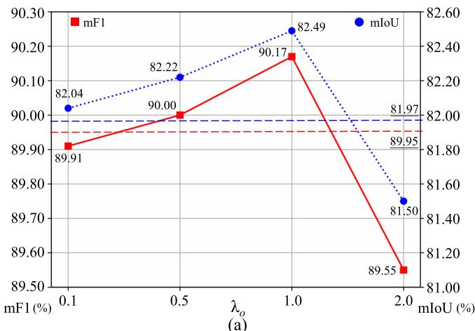

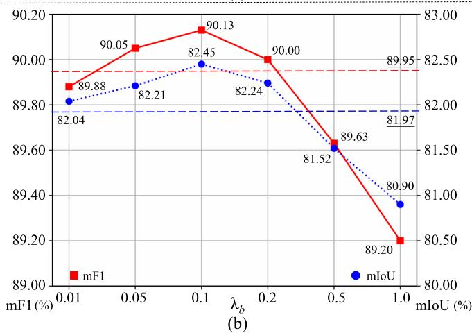

Fig. 10. Sensitivity analysis of (a) $\lambda _ { o }$ and (b) $\lambda _ { b }$ on the ISPRS Vaihingen dataset. The performance of the baseline is depicted using dashed lines to highlight the variation of performance.

scenarios by comparing the similarity between SGO/SGB and ground truth. 

2) Losses Balance: The analysis about losses balance focuses on the sensitivity of two hyperparameters, $\lambda _ { o }$ and $\lambda _ { b }$ . $\lambda _ { o }$ is designed to adjust the influence stemming from object consistency, whereas $\lambda _ { b }$ adjusts the contribution originating from boundary information. These hyperparameters hold significance in balancing the object consistency loss and boundary preservation loss. Considering that there is no strong correlation between these hyperparameters, separate sensitivity experiments were conducted using UNetformer. 

Fig. 10(a) illustrates the model performance in terms of mF1 and mIoU across varying $\lambda _ { o }$ values. A smaller $\lambda _ { o }$ diminishes the influence of object information, while a larger value can overly emphasize its significance. Notably, setting $\lambda _ { o } \ge 2 . 0$ resulted in a noticeable degradation in performance. Conversely, within the range $\lambda _ { o } ~ \in ~ [ 0 . 1 , 1 . 0 ] .$ , performance exhibited lower sensitivity to changes in $\lambda _ { o }$ . Hereby, our experiments employed $\lambda _ { o } ~ = ~ 1 . 0$ , unless specified otherwise. Additionally, in Fig. 7(b), the model’s performance is depicted concerning varying $\lambda _ { b } \in [ 0 . 0 1 , 1 . 0 ]$ . A smaller $\lambda _ { b }$ value made the contribution from the boundary information insignificant in learning the model. The best performance was observed when $\lambda _ { b }$ reached 0.1, as illustrated in Fig. 10(b). However, further increments in $\lambda _ { b }$ resulted in performance 

degradation. Ultimately, our experiments set $\lambda _ { o }$ and $\lambda _ { b }$ to 1.0 and 0.1, respectively, aligning them within a similar order of magnitude. 

# F. Ablation Study

To emphasize the distinct roles of the two loss functions in the proposed framework, we conducted ablation experiments using UNetformer on two datasets, as detailed in Tables V and VI. The results underscore that the independent use of these two loss functions enhanced the overall performance of the semantic segmentation model, validating the value and efficacy of SAM’s raw output. When examining the results on impervious surface and building of the ISPRS Vaihingen dataset, it is evident that only the boundary preservation loss exhibited comparable improvement as compared to the combined loss. This suggests that SAM-based pre-processing results can be fully explored using only the boundary preservation loss in specific tasks, such as building detection. However, in semantic segmentation tasks, where various ground objects possess highly complex boundaries, leveraging both SGO and SGB to their fullest extent becomes necessary. Furthermore, the results of these two loss functions on different categories, as listed in Tables V and VI, highlight the disparate behaviors exhibited across various categories. Combining the object and boundary preservation loss functions, we proposed a versatile and streamlined framework for directly leveraging SGO and SGB, showcasing robust generalization capabilities in remote sensing image semantic segmentation tasks. 

# G. Model Complexity Analysis

We evaluate the computational complexity of the proposed framework using various metrics: floating point operation count (FLOPs), model parameter, memory footprint, training speed (s), and inference speed (s). FLOPs accesses the model’s complexity, while model parameters and memory footprint evaluate the scale of the network and memory requirements, respectively. Finally, training speed and inference speed quantifies and time cost in training and inference stage, respectively. Ideally, an efficient model maintains lower values in FLOPs, model parameters, memory footprint, training speed, and inference speed. 

Table VII shows the complexity analysis results of all comparing semantic segmentation models considered in this work. Inspection of Table VII shows that our approach introduces no extra model complexity or inference time. In our framework, it is necessary to generate SGO and SGB before their utilization in loss calculation, hereby negating the requirement for additional task-specific modules. However, it is observed that our approach lengthens the training time since the gradient backpropagation takes longer to compute with two additional loss functions. On the other hand, during inference stage as presented in Fig. 3(b), the proposed approach operates identically to the original model, ensuring zero impact on inference speed. Considering the enhancements observed in other aspects, we believe that the marginal rise in training time is a justifiable trade-off. These outcomes highlight the remarkable scalability and wide application 

TABLE V ABLATION STUDIES ON THE ISPRS VAIHINGEN DATASET. THE ACCURACY OF EACH CATEGORY IS PRESENTED IN THE F1/IOU FORM. BOLD VALUES ARE THE BEST

<table><tr><td>Method</td><td>impervious surface</td><td>building</td><td>low vegetation</td><td>tree</td><td>car</td><td>mF1</td><td>mIoU</td></tr><tr><td>Lseg</td><td>92.33/85.76</td><td>96.25/92.78</td><td>80.47/67.33</td><td>90.85/83.22</td><td>89.35/80.75</td><td>89.85</td><td>81.97</td></tr><tr><td>Lseg + Lobj</td><td>92.55/86.14</td><td>96.48/93.20</td><td>80.76/67.73</td><td>91.14/83.72</td><td>89.91/81.67</td><td>90.17</td><td>82.49</td></tr><tr><td>Lseg + Lbdy</td><td>92.79/86.54</td><td>96.79/93.78</td><td>80.66/67.59</td><td>90.94/83.38</td><td>89.49/80.99</td><td>90.13</td><td>82.45</td></tr><tr><td>Lseg + Lobj + Lbdy</td><td>92.79/86.54</td><td>96.74/93.69</td><td>80.85/67.86</td><td>91.17/83.77</td><td>90.43/82.53</td><td>90.40</td><td>82.88</td></tr></table>

TABLE VI ABLATION STUDIES ON THE LOVEDA URBAN DATASET. THE ACCURACY OF EACH CATEGORY IS PRESENTED IN THE F1/IOU FORM. BOLD VALUES ARE THE BEST

<table><tr><td>Method</td><td>background</td><td>building</td><td>road</td><td>water</td><td>barren</td><td>forest</td><td>agriculture</td><td>mF1</td><td>mIoU</td></tr><tr><td>Lseg</td><td>54.66/37.61</td><td>69.09/52.78</td><td>68.33/51.89</td><td>77.66/63.47</td><td>56.98/39.84</td><td>51.01/34.23</td><td>20.54/11.44</td><td>65.34</td><td>49.12</td></tr><tr><td>Lseg + Lobj</td><td>53.04/36.08</td><td>72.54/56.91</td><td>71.68/55.86</td><td>75.62/60.79</td><td>54.76/37.70</td><td>61.00/43.89</td><td>23.50/13.32</td><td>65.53</td><td>49.47</td></tr><tr><td>Lseg + Lbdy</td><td>55.49/38.39</td><td>72.73/57.15</td><td>73.30/57.86</td><td>79.33/65.74</td><td>48.54/32.05</td><td>54.54/37.49</td><td>41.13/25.89</td><td>65.88</td><td>50.24</td></tr><tr><td>Lseg + Lobj + Lbdy</td><td>55.43/38.34</td><td>75.91/61.17</td><td>73.61/58.24</td><td>80.55/67.43</td><td>43.19/27.55</td><td>57.05/39.91</td><td>43.64/27.91</td><td>65.74</td><td>50.55</td></tr></table>

TABLE VII COMPUTATIONAL COMPLEXITY ANALYSIS MEASURED BY TWO $2 5 6 \times 2 5 6$ IMAGES ON A SINGLE NVIDIA GEFORCE RTX 4090 GPU. MIOU VALUES ARE THE RESULTS ON THE ISPRS VAIHINGEN DATASET. BOLD VALUES ARE THE BEST

<table><tr><td>Model</td><td>FLOPs (G)</td><td>Parameter (M)</td><td>Memory (MB)</td><td>Training Speed (10-3s)</td><td>Inference Speed (10-3s)</td><td>MIoU(%)</td></tr><tr><td>ABCNet [74]</td><td>7.81</td><td>13.67</td><td>2480</td><td>15.51</td><td>3.08</td><td>75.20</td></tr><tr><td>ABCNet+SAM</td><td>7.81</td><td>13.67</td><td>2480</td><td>51.08</td><td>3.08</td><td>78.11</td></tr><tr><td>CMTFNet [27]</td><td>17.14</td><td>30.07</td><td>3240</td><td>26.48</td><td>4.94</td><td>82.12</td></tr><tr><td>CMTFNet+SAM</td><td>17.14</td><td>30.07</td><td>3240</td><td>58.41</td><td>4.94</td><td>83.18</td></tr><tr><td>UNetformer [25]</td><td>5.87</td><td>11.69</td><td>2490</td><td>17.67</td><td>3.50</td><td>81.97</td></tr><tr><td>UNetformer+SAM</td><td>5.87</td><td>11.69</td><td>2490</td><td>52.70</td><td>3.50</td><td>82.88</td></tr><tr><td>FTUNetformer [25]</td><td>50.84</td><td>96.14</td><td>5176</td><td>39.50</td><td>10.20</td><td>82.62</td></tr><tr><td>FTUNetformer+SAM</td><td>50.84</td><td>96.14</td><td>5176</td><td>75.62</td><td>10.20</td><td>84.01</td></tr></table>

TABLE VIII COMPUTATIONAL COMPLEXITY COMPARISON OF TWO DIFFERENT STRATEGIES FOR UTILIZING SAM, MEASURED BY TWO $2 5 6 \times 2 5 6$ IMAGES ON A SINGLE NVIDIA GEFORCE RTX 4090 GPU. BOLD VALUES ARE THE BEST

<table><tr><td>Strategy</td><td>FLOPs (G)</td><td>Parameter (M)</td><td>Memory (MB)</td><td>Training Speed (10-3s)</td><td>Inference Speed (10-3s)</td></tr><tr><td>Baseline</td><td>5.87</td><td>11.69</td><td>2490</td><td>17.67</td><td>3.50</td></tr><tr><td>+ SAM Encoder</td><td>5473.17</td><td>652.98</td><td>6920</td><td>462.50</td><td>433.65</td></tr><tr><td>Ours</td><td>5.87</td><td>11.69</td><td>2490</td><td>52.70</td><td>3.50</td></tr></table>

of our framework across current semantic segmentation models. 

To further highlight the simplicity of our framework, we compared model complexity under two strategies, as shown in Table VIII. $\mathbf { \partial } ^ { \bullet } { + } S { \mathbf { A M } }$ Encoder” represents the strategy that SAM is used as an auxiliary encoder [51]. Specifically, input images are also fed into SAM, and the resulting high-level features are fused with features generated by the main encoder. The matrices clearly demonstrate the significant hardware demands of employing the foundation model as an auxiliary encoder. Therefore, we consider that the framework presented in this work, which directly utilizes the output of visual foundation model, is more suitable for a variety of environments. 

# V. CONCLUSION

This work proposed a simple and versatile framework designed to fully exploit the raw output of SAM in conjunction 

with general remote sensing imagery semantic segmentation models. Acknowledging the distinctions between remote sensing images and natural images, as well as the characteristics of SGO and SGB, we developed an auxiliary optimization strategy by exploiting two loss functions, object consistency loss, and boundary preservation loss. This strategy facilitates improvements in fundamental semantic segmentation tasks with different network structures without requiring additional modules. Notably, our introduction of object consistency loss, motivated by the consistency of objects, represents the initial loss function capable of directly utilizing SGO without semantic information. Our validation on two publicly available datasets and four comprehensive semantic segmentation models highlights the robust performance of our framework. 

Finally, it is worth emphasizing that this work has initiated a preliminary exploration of SAM’s raw output. Considering our primary objective of offering a straightforward and 

versatile framework, this work only provided a set of robust pre-processing hyperparameters without further optimizing the utilization of SGO and SGB. Indeed, remote sensing images of varied resolutions exhibit differences in ground object type and sparsity. This variation can potentially refine the accuracy of SGO and SGB, presenting an interesting direction for further research. In addition, our future work will also focus on extending our framework to unsupervised semantic segmentation of remote sensing images. 

# REFERENCES

[1] Q. Yuan et al., “Deep learning in environmental remote sensing: Achievements and challenges,” Remote Sens. Environ., vol. 241, May 2020, Art. no. 111716. 

[2] Y. Cao and X. Huang, “A coarse-to-fine weakly supervised learning method for green plastic cover segmentation using high-resolution remote sensing images,” ISPRS J. Photogramm. Remote Sens., vol. 188, pp. 157–176, Jun. 2022. 

[3] Z. Li, Q. Zhu, J. Yang, J. Lv, and Q. Guan, “A cross-domain objectsemantic matching framework for imbalanced high spatial resolution imagery water-body extraction,” IEEE Trans. Geosci. Remote Sens., vol. 62, 2024, Art. no. 5629015. 

[4] Q. Zhu et al., “Land-use/land-cover change detection based on a Siamese global learning framework for high spatial resolution remote sensing imagery,” ISPRS J. Photogramm. Remote Sens., vol. 184, pp. 63–78, Feb. 2022. 

[5] R. Li, S. Zheng, C. Duan, L. Wang, and C. Zhang, “Land cover classification from remote sensing images based on multi-scale fully convolutional network,” Geo-Spatial Inf. Sci., vol. 25, no. 2, pp. 278–294, Apr. 2022. 

[6] R. Xu, C. Wang, J. Zhang, S. Xu, W. Meng, and X. Zhang, “RSSFormer: Foreground saliency enhancement for remote sensing land-cover segmentation,” IEEE Trans. Image Process., vol. 32, pp. 1052–1064, 2023. 

[7] A. Gupta, S. Watson, and H. Yin, “Deep learning-based aerial image segmentation with open data for disaster impact assessment,” Neurocomputing, vol. 439, pp. 22–33, Jun. 2021. 

[8] S. Khan et al., “DeepSmoke: Deep learning model for smoke detection and segmentation in outdoor environments,” Expert Syst. Appl., vol. 182, Nov. 2021, Art. no. 115125. 

[9] D. Huang, Y. Tang, and R. Qin, “An evaluation of PlanetScope images for 3D reconstruction and change detection—Experimental validations with case studies,” GISci. Remote Sens., vol. 59, no. 1, pp. 744–761, Dec. 2022. 

[10] W. Bo, J. Liu, X. Fan, T. Tjahjadi, Q. Ye, and L. Fu, “BASNet: Burned area segmentation network for real-time detection of damage maps in remote sensing images,” IEEE Trans. Geosci. Remote Sens., vol. 60, 2022, Art. no. 5627913. 

[11] O. Ronneberger, P. Fischer, and T. Brox, “U-Net: Convolutional networks for biomedical image segmentation,” in Proc. 18th Int. Conf. Med. Image Comput. Comput.-Assist. Intervent., vol. 9351, Munich, Germany. Springer, Oct. 2015, pp. 234–241. 

[12] K. He, X. Zhang, S. Ren, and J. Sun, “Deep residual learning for image recognition,” in Proc. IEEE Conf. Comput. Vis. Pattern Recognit., Jun. 2016, pp. 770–778. 

[13] A. Vaswani et al., “Attention is all you need,” in Proc. Adv. Neural Inf. Process. Syst., vol. 30, 2017, pp. 1–11. 

[14] A. Dosovitskiy et al., “An image is worth $1 6 \times 1 6$ words: Transformers for image recognition at scale,” 2020, arXiv:2010.11929. 

[15] X. Ma, X. Zhang, and M.-O. Pun, “RS3Mamba: Visual state space model for remote sensing image semantic segmentation,” IEEE Geosci. Remote Sens. Lett., vol. 21, pp. 1–5, 2024. 

[16] F. I. Diakogiannis, F. Waldner, P. Caccetta, and C. Wu, “ResUNet-A: A deep learning framework for semantic segmentation of remotely sensed data,” ISPRS J. Photogramm. Remote Sens., vol. 162, pp. 94–114, Apr. 2020. 

[17] C. Hazirbas, L. Ma, C. Domokos, and D. Cremers, “FuseNet: Incorporating depth into semantic segmentation via fusion-based CNN architecture,” in Proc. Asian Conf. Comput. Vis., 2016, pp. 213–228. 

[18] D. Hong, J. Yao, D. Meng, Z. Xu, and J. Chanussot, “Multimodal GANs: Toward crossmodal hyperspectral–multispectral image segmentation,” IEEE Trans. Geosci. Remote Sens., vol. 59, no. 6, pp. 5103–5113, Jun. 2021. 

[19] Q. Zhu et al., “A global context-aware and batch-independent network for road extraction from VHR satellite imagery,” ISPRS J. Photogramm. Remote Sens., vol. 175, pp. 353–365, May 2021. 

[20] D. Hong et al., “Cross-city matters: A multimodal remote sensing benchmark dataset for cross-city semantic segmentation using high-resolution domain adaptation networks,” Remote Sens. Environ., vol. 299, Dec. 2023, Art. no. 113856. 

[21] L. Wang, R. Li, C. Duan, C. Zhang, X. Meng, and S. Fang, “A novel transformer based semantic segmentation scheme for fine-resolution remote sensing images,” IEEE Geosci. Remote Sens. Lett., vol. 19, pp. 1–5, 2022. 

[22] Z. Xu, W. Zhang, T. Zhang, Z. Yang, and J. Li, “Efficient transformer for remote sensing image segmentation,” Remote Sens., vol. 13, no. 18, p. 3585, Sep. 2021. 

[23] S. K. Roy, A. Deria, D. Hong, B. Rasti, A. Plaza, and J. Chanussot, “Multimodal fusion transformer for remote sensing image classification,” IEEE Trans. Geosci. Remote Sens., vol. 61, 2023, Art. no. 5515620. 

[24] A. Yang, M. Li, Y. Ding, D. Hong, Y. Lv, and Y. He, “GTFN: GCN and transformer fusion network with spatial–spectral features for hyperspectral image classification,” IEEE Trans. Geosci. Remote Sens., vol. 61, 2023, Art. no. 6600115. 

[25] L. Wang et al., “UNetFormer: A UNet-like transformer for efficient semantic segmentation of remote sensing urban scene imagery,” ISPRS J. Photogramm. Remote Sens., vol. 190, pp. 196–214, Aug. 2022. 

[26] X. Ma, X. Zhang, Z. Wang, and M.-O. Pun, “Unsupervised domain adaptation augmented by mutually boosted attention for semantic segmentation of VHR remote sensing images,” IEEE Trans. Geosci. Remote Sens., vol. 61, 2023, Art. no. 5400515. 

[27] H. Wu, P. Huang, M. Zhang, W. Tang, and X. Yu, “CMTFNet: CNN and multiscale transformer fusion network for remote-sensing image semantic segmentation,” IEEE Trans. Geosci. Remote Sens., vol. 61, 2023, Art. no. 2004612. 

[28] X. Ma, X. Zhang, M.-O. Pun, and M. Liu, “A multilevel multimodal fusion transformer for remote sensing semantic segmentation,” IEEE Trans. Geosci. Remote Sens., vol. 62, 2024, Art. no. 5403215. 

[29] X. Ma, X. Zhang, X. Ding, M.-O. Pun, and S. Ma, “Frequency decomposition-driven unsupervised domain adaptation for remote sensing image semantic segmentation,” 2024, arXiv:2404.04531. 

[30] J. He, L. Zhao, H. Yang, M. Zhang, and W. Li, “HSI-BERT: Hyperspectral image classification using the bidirectional encoder representation from transformers,” IEEE Trans. Geosci. Remote Sens., vol. 58, no. 1, pp. 165–178, Jan. 2020. 

[31] D. Hong et al., “SpectralGPT: Spectral remote sensing foundation model,” IEEE Trans. Pattern Anal. Mach. Intell., vol. 46, no. 8, pp. 5227–5244, Aug. 2024. 

[32] A. Kirillov et al., “Segment anything,” in Proc. IEEE/CVF Int. Conf. Comput. Vis., Oct. 2023, pp. 4015–4026. 

[33] S. Ren et al., “Segment anything, from space?” in Proc. IEEE/CVF Winter Conf. Appl. Comput. Vis. (WACV), Jan. 2024, pp. 8355–8365. 

[34] D. Wang et al., “SAMRS: Scaling-up remote sensing segmentation dataset with segment anything model,” in Proc. Adv. Neural Inf. Process. Syst., vol. 36. Curran Associates, 2023, pp. 8815–8827. 

[35] C. Zhang et al., “Enhancing USDA NASS cropland data layer with segment anything model,” in Proc. 11th Int. Conf. Agro-Geoinformat. (Agro-Geoinformatics), Jul. 2023, pp. 1–5. 

[36] K. Chen et al., “RSPrompter: Learning to prompt for remote sensing instance segmentation based on visual foundation model,” IEEE Trans. Geosci. Remote Sens., vol. 62, 2024, Art. no. 4701117. 

[37] J. Zhang, Z. Zhou, G. Mai, L. Mu, M. Hu, and S. Li, “Text2Seg: Remote sensing image semantic segmentation via text-guided visual foundation models,” 2023, arXiv:2304.10597. 

[38] S. Julka and M. Granitzer, “Knowledge distillation with segment anything (SAM) model for planetary geological mapping,” in Proc. Int. Conf. Mach. Learn., Optim., Data Sci. Cham, Switzerland: Springer, 2023, pp. 68–77. 

[39] L. Stearns, C. van der Veen, and S. Shankar, “Segment anything in glaciology: An initial study implementing the segment anything model (SAM),” Center Remote Sens. Integr. Syst., Univ. Kansas, Lawrence, KS, USA, 2023, doi: 10.21203/rs.3.rs-3011246/v1. 

[40] L. P. Osco et al., “The segment anything model (SAM) for remote sensing applications: From zero to one shot,” Int. J. Appl. Earth Observ. Geoinf., vol. 124, Nov. 2023, Art. no. 103540. 

[41] X. Qi, Y. Wu, Y. Mao, W. Zhang, and Y. Zhang, “Self-guided few-shot semantic segmentation for remote sensing imagery based on large vision models,” 2023, arXiv:2311.13200. 

[42] R. I. Sultan, C. Li, H. Zhu, P. Khanduri, M. Brocanelli, and D. Zhu, “GeoSAM: Fine-tuning SAM with sparse and dense visual prompting for automated segmentation of mobility infrastructure,” 2023, arXiv:2311.11319. 

[43] L. Ding, K. Zhu, D. Peng, H. Tang, K. Yang, and L. Bruzzone, “Adapting segment anything model for change detection in VHR remote sensing images,” IEEE Trans. Geosci. Remote Sens., vol. 62, 2024, Art. no. 5611711. 

[44] L. Wang, M. Zhang, and W. Shi, “CS-WSCDNet: Class activation mapping and segment anything model-based framework for weakly supervised change detection,” IEEE Trans. Geosci. Remote Sens., vol. 61, 2023, Art. no. 5624812. 

[45] H. Chen, J. Song, and N. Yokoya, “Change detection between optical remote sensing imagery and map data via segment anything model (SAM),” 2024, arXiv:2401.09019. 

[46] J. Zhang, Q. Zhang, Y. Gong, J. Zhang, L. Chen, and D. Zeng, “Weakly supervised semantic segmentation with consistency-constrained multiclass attention for remote sensing scenes,” IEEE Trans. Geosci. Remote Sens., vol. 62, 2024, Art. no. 5621118. 

[47] Z. Yan et al., “RingMo-SAM: A foundation model for segment anything in multimodal remote-sensing images,” IEEE Trans. Geosci. Remote Sens., vol. 61, 2023, Art. no. 5625716. 

[48] B. Alexey and B. Evgeny, “Boundary loss for remote sensing imagery semantic segmentation,” in Proc. Int. Symp. Neural Netw. Cham, Switzerland: Springer, 2019, pp. 388–401. 

[49] I. M. Gerke, “Use of the stair vision library within the ISPRS 2D semantic labeling benchmark (Vaihingen),” Dept. Earth Observ. Sci., Univ. Twente, Enschede, The Netherlands, 2014, doi: 10.13140/2.1.5015.9683. 

[50] Y. Zhang, T. Zhou, S. Wang, P. Liang, and D. Z. Chen, “Input augmentation with SAM: Boosting medical image segmentation with segmentation foundation model,” 2023, arXiv:2304.11332. 

[51] Y. Li, B. Jing, Z. Li, J. Wang, and Y. Zhang, “NnSAM: Plug-andplay segment anything model improves nnUNet performance,” 2023, arXiv:2309.16967. 

[52] P.-T. Jiang and Y. Yang, “Segment anything is a good pseudolabel generator for weakly supervised semantic segmentation,” 2023, arXiv:2305.01275. 

[53] Z. Huang et al., “Push the boundary of SAM: A pseudo-label correction framework for medical segmentation,” 2023, arXiv:2308.00883. 

[54] Z. Qi et al., “Multi-view remote sensing image segmentation with SAM priors,” 2024, arXiv:2405.14171. 

[55] S. Zhang, Q. Wang, J. Liu, and H. Xiong, “ALPS: An auto-labeling and pre-training scheme for remote sensing segmentation with segment anything model,” 2024, arXiv:2406.10855. 

[56] J. Li, X. Huang, and J. Gong, “Deep neural network for remote-sensing image interpretation: Status and perspectives,” Nat. Sci. Rev., vol. 6, no. 6, pp. 1082–1086, Nov. 2019. 

[57] Z. Zheng, Y. Zhong, J. Wang, and A. Ma, “Foreground-aware relation network for geospatial object segmentation in high spatial resolution remote sensing imagery,” in Proc. IEEE/CVF Conf. Comput. Vis. Pattern Recognit. (CVPR), Jun. 2020, pp. 4096–4105. 

[58] D. C. Duro, S. E. Franklin, and M. G. Dubé, “A comparison of pixel-based and object-based image analysis with selected machine learning algorithms for the classification of agricultural landscapes using SPOT-5 HRG imagery,” Remote Sens. Environ., vol. 118, pp. 259–272, Mar. 2012. 

[59] C. Zhang et al., “An object-based convolutional neural network (OCNN) for urban land use classification,” Remote Sens. Environ., vol. 216, pp. 57–70, Oct. 2018. 

[60] V. S. Martins, A. L. Kaleita, B. K. Gelder, H. L. F. da Silveira, and C. A. Abe, “Exploring multiscale object-based convolutional neural network (multi-OCNN) for remote sensing image classification at high spatial resolution,” ISPRS J. Photogramm. Remote Sens., vol. 168, pp. 56–73, Oct. 2020. 

[61] X. Zhang, W. Yu, M.-O. Pun, and M. Liu, “Style transformationbased change detection using adversarial learning with object boundary constraints,” in Proc. IEEE Int. Geosci. Remote Sens. Symp., Jul. 2021, pp. 3117–3120. 

[62] H. Li, Y. Tian, C. Zhang, S. Zhang, and P. M. Atkinson, “Temporal sequence object-based CNN (TS-OCNN) for crop classification from fine resolution remote sensing image time-series,” Crop J., vol. 10, no. 5, pp. 1507–1516, Oct. 2022. 

[63] C. D. Rittenhouse, E. H. Berlin, N. Mikle, S. Qiu, D. Riordan, and Z. Zhu, “An object-based approach to map young forest and shrubland vegetation based on multi-source remote sensing data,” Remote Sens., vol. 14, no. 5, p. 1091, Feb. 2022. 

[64] L. Mi and Z. Chen, “Superpixel-enhanced deep neural forest for remote sensing image semantic segmentation,” ISPRS J. Photogramm. Remote Sens., vol. 159, pp. 140–152, Jan. 2020. 

[65] H. Zhang, M. Lin, G. Yang, and L. Zhang, “ESCNet: An end-to-end superpixel-enhanced change detection network for very-high-resolution remote sensing images,” IEEE Trans. Neural Netw. Learn. Syst., vol. 34, no. 1, pp. 28–42, Jan. 2023. 

[66] X. Zhang, X. Tan, G. Chen, K. Zhu, P. Liao, and T. Wang, “Objectbased classification framework of remote sensing images with graph convolutional networks,” IEEE Geosci. Remote Sens. Lett., vol. 19, pp. 1–5, 2022. 

[67] M. Henaff, J. Bruna, and Y. LeCun, “Deep convolutional networks on graph-structured data,” 2015, arXiv:1506.05163. 

[68] X. Pan, C. Zhang, J. Xu, and J. Zhao, “Simplified object-based deep neural network for very high resolution remote sensing image classification,” ISPRS J. Photogramm. Remote Sens., vol. 181, pp. 218–237, Nov. 2021. 

[69] D. Marmanis, K. Schindler, J. D. Wegner, S. Galliani, M. Datcu, and U. Stilla, “Classification with an edge: Improving semantic image segmentation with boundary detection,” ISPRS J. Photogramm. Remote Sens., vol. 135, pp. 158–172, Jan. 2018. 

[70] S. Liu, W. Ding, C. Liu, Y. Liu, Y. Wang, and H. Li, “ERN: Edge loss reinforced semantic segmentation network for remote sensing images,” Remote Sens., vol. 10, no. 9, p. 1339, Aug. 2018. 

[71] J. Wang, Z. Zheng, A. Ma, X. Lu, and Y. Zhong, “LoveDA: A remote sensing land-cover dataset for domain adaptive semantic segmentation,” in Proc. Neural Inf. Process. Syst. Track Datasets Benchmarks, vol. 1, 2021, pp. 1–17. 

[72] N. Audebert, B. Le Saux, and S. Lefèvre, “Beyond RGB: Very high resolution urban remote sensing with multimodal deep networks,” ISPRS J. Photogramm. Remote Sens., vol. 140, pp. 20–32, Jun. 2018. 

[73] X. Ma, X. Zhang, and M.-O. Pun, “A crossmodal multiscale fusion network for semantic segmentation of remote sensing data,” IEEE J. Sel. Topics Appl. Earth Observ. Remote Sens., vol. 15, pp. 3463–3474, 2022. 

[74] R. Li, S. Zheng, C. Zhang, C. Duan, L. Wang, and P. M. Atkinson, “ABCNet: Attentive bilateral contextual network for efficient semantic segmentation of fine-resolution remotely sensed imagery,” ISPRS J. Photogramm. Remote Sens., vol. 181, pp. 84–98, Nov. 2021. 

[75] Z. Liu et al., “Swin transformer: Hierarchical vision transformer using shifted windows,” in Proc. IEEE/CVF Int. Conf. Comput. Vis. (ICCV), Oct. 2021, pp. 10012–10022. 

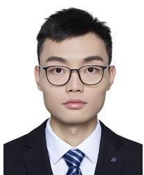

Xianping Ma received the bachelor’s degree in geographical information science from Wuhan University, Wuhan, China, in 2019. He is currently pursuing the Ph.D. degree with The Chinese University of Hong Kong, Shenzhen, China. 

His research interests include remote sensing image processing, deep learning, multimodal learning, and unsupervised domain adaptation. 

Dr. Ma was a Reviewer for the ISPRS Journal of Photogrammetry and Remote Sensing and IEEE TRANSACTIONS ON GEOSCIENCE AND REMOTE SENSING. 

Qianqian Wu (Graduate Student Member, IEEE) received the B.Sc. degree in physical geography and resources environment and the M.S. degree in cartography and geographical information engineering from China University of Geosciences, Wuhan, China, in 2019 and 2022, respectively. She is currently pursuing the Ph.D. degree in computer and information engineering with The Chinese University of Hong Kong, Shenzhen, China. 

Her research interests include data fusion, deep learning, and remote sensing image processing. 

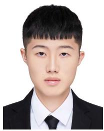

Xingyu Zhao received the bachelor’s degree in digital media from Dalian University of Technology, Dalian, China, in 2022, and the master’s degree in computer science from the University of Southern California, Los Angeles, CA, USA, in 2024. 

He is currently a Machine Learning Engineer with Tencent, Shenzhen, China. His research interests include large language model, deep learning, and multimodel learning. 

Man-On Pun (Senior Member, IEEE) received the B.Eng. degree in electronic engineering from The Chinese University of Hong Kong (CUHK), Hong Kong, in 1996, the M.Eng. degree in computer science from the University of Tsukuba, Tsukuba, Japan, in 1999, and the Ph.D. degree in electrical engineering from the University of Southern California (USC), Los Angeles, CA, USA, in 2006. 

He was a Post-Doctoral Research Associate with Princeton University, Princeton, NJ, USA, from 2006 to 2008. He held research positions with 

Huawei, NJ, USA, Mitsubishi Electric Research Labs (MERL), Boston, MA, USA, and Sony, Tokyo, Japan. He is currently an Associate Professor with the School of Science and Engineering, The Chinese University of Hong Kong (CUHKSZ), Shenzhen, China. His research interests include AI Internet of Things (AIoT) and applications of machine learning in communications and satellite remote sensing. 

Xiaokang Zhang (Senior Member, IEEE) received the Ph.D. degree in photogrammetry and remote sensing from the School of Remote Sensing and Information Engineering, Wuhan University, Wuhan, China, in 2018. 

From 2019 to 2022, he was a Post-Doctoral Research Associate with The Hong Kong Polytechnic University, Hong Kong, and The Chinese University of Hong Kong, Shenzhen, China. Since 2023, he has been a specially appointed Professor with the School of Information Science and Engi-

neering, Wuhan University of Science and Technology, Wuhan. He has authored or co-authored more than 40 scientific publications in international journals and conferences. His research interests include remote sensing image analysis, computer vision and machine learning. 

Dr. Zhang is currently a reviewer for more than 30 renowned international journals, such as the Remote Sensing of Environment, the ISPRS Journal of Photogrammetry and Remote Sensing, IEEE TRANSACTIONS ON NEURAL NETWORKS AND LEARNING SYSTEMS, and IEEE TRANSACTIONS ON GEOSCIENCE AND REMOTE SENSING. 

Bo Huang received the Ph.D. degree in remote sensing and mapping from the Institute of Remote Sensing Applications, Chinese Academy of Sciences, Beijing, China, in 1997. 

He is currently a Chair Professor with the Department of Geography, The University of Hong Kong, Hong Kong, SAR, China. His research interests include most aspects of GIScience, specifically the design and development of models and algorithms for unified satellite image fusion, spatiotemporal statistics and multiobjective spatial optimization, 

and their applications in environmental monitoring and sustainable spatial planning. 

Dr. Huang serves as an Associate Editor of International Journal of Geographical Information Science (Taylor & Francis) and was the Editorin-Chief of Comprehensive GIS (Elsevier), a three-volume GIS sourcebook. 