# Adjacent-Scale Multimodal Fusion Networks for Semantic Segmentation of Remote Sensing Data

Xianping Ma , Xichen Xu, Xiaokang Zhang , Senior Member, IEEE, and Man-On Pun , Senior Member, IEEE

Abstract—Semantic segmentation is a fundamental task in remote sensing image analysis. The accurate delineation of objects within such imagery serves as the cornerstone for a wide range of applications. To address this issue, edge detection, cross-modal data, large intraclass variability, and limited interclass variance must be considered. Traditional convolutional-neural-networkbased models are notably constrained by their local receptive fields, Nowadays, transformer-based methods show great potential to learn features globally, while they ignore positional cues easily and are still unable to cope with multimodal data. Therefore, this work proposes an adjacent-scale multimodal fusion network (ASMFNet) for semantic segmentation of remote sensing data. ASMFNet stands out not only for its innovative interaction mechanism across adjacent-scale features, effectively capturing contextual cues while maintaining low computational complexity but also for its remarkable cross-modal capability. It seamlessly integrates different modalities, enriching feature representation. Its hierarchical scale attention (HSA) module bolsters the association between ground objects and their surrounding scenes through learning discriminative features at higher level abstractions, thereby linking the broad structural information. Adaptive modality fusion module is equipped by HSA with valuable insights into the interrelationships between cross-model data, and it assigns spatial weights at the pixel level and seamlessly integrates them into channel features to enhance fusion representation through an evaluation of modality importance via feature concatenation and filtering. Extensive experiments on representative remote sensing semantic segmentation datasets, including the ISPRS Vaihingen and Potsdam datasets, confirm the impressive performance of the proposed ASMFNet.

Index Terms—Adjacent-scale, multimodal fusion, remote sensing, semantic segmentation.

Received 7 July 2024; revised 8 October 2024; accepted 23 October 2024. Date of publication 28 October 2024; date of current version 15 November 2024. This work was supported in part by the National Natural Science Foundation of China under Grant 42371374 and Grant 41801323, in part by the Guangdong Provincial Key Laboratory of Future Networks of Intelligence under Grant 2022B1212010001, and in part by the Guangdong Basic and Applied Basic Research Foundation under Grant 2024A1515010454. (Xianping Ma and Xichen Xu contributed equally to this work.) (Corresponding authors: Man-On Pun; Xiaokang Zhang.)

Xianping Ma, Xichen Xu, and Man-On Pun are with the School of Science and Engineering, The Chinese University of Hong Kong, Shenzhen 518172, China (e-mail: xianpingma@link.cuhk.edu.cn; xichen.personal@gmail.com; Simon-Pun@cuhk.edu.cn).

Xiaokang Zhang is with the School of Information Science and Engineering, Wuhan University of Science and Technology, Wuhan 430081, China (e-mail: natezhangxk@gmail.com).

The source code for this work is accessible at https://github.com/sstary/SSRS. Digital Object Identifier 10.1109/JSTARS.2024.3486906

# I. INTRODUCTION

EMANTIC segmentation of remote sensing data has been widely applied in various fields, such as urban mapping [1], [2], natural hazard monitoring [3], [4], and environmental protection [5], [6]. The goal of remote sensing semantic segmentation is to accurately identify the categories of ground objects at the pixel level [7], [8], [9]. However, the performance of semantic segmentation models is usually constrained by the intraclass variability and interclass similarities of ground objects in high-resolution remote sensing images. Furthermore, ground objects may exhibit large variations of scales in remote sensing images acquired from different locations. Recent advances in multimodal remote sensing data present a new way to solve the problem, which is effective in characterizing ground objects as compared to conventional unimodal data [10], [11]. In particular, combining multimodal data can better characterize these scale variations by exploiting complementary information. However, inappropriate integration of multiple modalities, such as addition or concatenation, may incur performance degradation due to their heterogeneous statistical properties [12], [13], [14]. Thus, more effective cross-modal fusion approaches are required to cope with these challenges in semantic segmentation for remote sensing.

To fully harness the information within and between modalities, convolutional neural network (CNN)-based approaches are commonly considered in the literature [15], [16]. For example, ResNet-a [17] addressed segmentation by simply stacking multimodal information and constructing multitasks. Yang et al. [18] introduced a novel multipath encoder for simultaneous extraction and fusion of multimodal data. However, these CNN-based fusion methods are ineffective in modeling global context information [19]. To cope with this challenge, the transformer architecture has been adopted as the backbone for image classification as it can achieve fine-grained interaction and model long-range dependencies across modalities [20], [21], [22]. More recently, STGCNet [23] established a self-attention-based feature decomposition module to eliminate redundant information from common features. However, the transformer was also limited by suffering from expensive computational complexity. To overcome these drawbacks, the Swin transformer [24] was developed with reduced computational complexity and excellent performance in semantic segmentation [25], [26], [27], [28]. For instance, features from the auxiliary Swin-transformer-based branch are embedded into the main CNN-based branch to achieve better performance in [26] while STransFuse [25] exploits

coarse-to-fine feature correlation between the Swin Transformer and CNN branches. Despite the fact that these methods achieve obvious improvements, these transformer-based methods focus on unimodal data and cannot be straightforwardly generalized to multimodal segmentation. Thus, it remains an open question on effectively utilizing the Swin transformer for semantic segmentation of multimodal remote sensing data.

In recent years, multiscale contextual information has been proven crucial for semantic segmentation tasks [29]. For instance, the atrous spatial pyramid pooling [30] samples features by employing convolution kernels of multiple sizes in parallel, utilizing different receptive fields to acquire more comprehensive information. DFCN [31] exploited rich feature representation and semantic information by dense connections. CMFNet [32] is designed to effectively utilize the global information by exploiting features from all scales simultaneously. However, they can lead to a steep increase in computation dimensions and introduce redundant information. Inspired by AFNet [33], which argued that the information of adjacent scales is the most closely related, this work explores the multimodal fusion task from the perspective of adjacent scales.

In this work, a Swin-transformer-based adjacent-scale multimodal fusion network (ASMFNet) is proposed by effectively exploiting cross-scale dependencies of multimodal features. Specifically, a novel hierarchical scale attention (HSA) module is developed to integrate adjacent-level contexts in a coarse-tofine manner. Furthermore, the adaptive modality fusion (AMF) module infers the weights assigned to different locations within representations, and then, integrates them into channel features to enhance fusion representation. This fine-grained assessment allows for the optimized balancing of representations from different modalities. The main contributions of this work are as follows.

1) A novel HSA module is proposed to bridge the gap between local object details and broader scene context. It first extracts hierarchical features across adjacent scales, and highlights relevant contextual cues, enabling ASMFNet to better understand the spatial relationships between objects and their environment.   
2) A novel AMF module is developed by recalibrating the complementary information between different modalities. It can effectively infer the weights of different locations in representations while balancing representations between different modalities.   
3) Endowed with the HSA and AMF modules, ASMFNet is proposed for multimodal semantic segmentation of remote sensing data. Its unique function lies in the ability to harness global context, accommodate scale variations, and seamlessly integrate multimodal data. To the best of our knowledge, this is the first work to apply adjacentscale fusion using Swin transformer-based segmentation networks.

The rest of this article is organized as follows. Section II first reviews the related works on multimodal semantic segmentation, whereas Section III elaborates on the proposed ASMFNet. After that, extensive experimental results are presented and analyzed in Section IV. Finally, Section V concludes this article.

# II. RELATED WORK

# A. Multimodal Data Fusion

Generally speaking, multimodality refers to heterogeneous information in different data forms [34]. In remote sensing, data acquired by different types of sensors with varying resolutions are considered multimodalities, such as LiDAR, Vis, and HSI. As compared to unimodality, multimodalities can provide more useful information for decision making by capturing complementary information from heterogeneous multimodal data. However, it has been observed in [34] that existing deep learning methods often overlook the fact that multimodal data are not of equal relevance for the semantic context. As a result, the naive approach of simply stacking all multimodal data may introduce redundancy [12].

In recent years, deep learning techniques have been successfully applied in multimodal fusion [35], [36]. According to where the fusion occurs in the model, data fusion can be divided into two approaches, namely, the early fusion of features and the late fusion of predictions. Audebert et al. [37] investigated the impact of both approaches on remote sensing data by adopting the FuseNet [38]. Recently, Peng et al. [31] utilized dual-path densely convolutional networks in which encoders extract the semantic features of modalities before gradually fusing them together for up-sampling. Furthermore, attention-based methods have been reported in the literature [11]. However, balancing the complexity of network structures with the efficiency of fusion modules remains a challenging problem.

# B. Transformer-Based Segmentation Models

The conventional transformer is known to suffer from high computing complexity and weak capability for detail perception [39], [40], [41]. To cope with these obstacles, Swin transformer [24] has been proposed using shifted window-based transformer blocks to obtain local and global features. Zhang et al. [42] reported a hybrid architecture of CNN and Swin transformer to extract more comprehensive features. DC-Swin [43] introduced a decoding module to enhance the communication between multiple-scale information produced by Swin transformer, whereas STransFuse [25] and ST-UNet [26] established parallel CNN and Swin transformer branches to effectively merge fine details from CNN with global relationships from Swin transformer. NGST-Net [44] introduced an N-Gram strategy to learn the spectral feature relationships between window sequences. In contrast to the aforementioned methods, this work deploys a pure Swin transformer network and activates the interaction between adjacent-scale features to compensate for multimodal fusion.

# C. Multiscale Fusion

Multiscale fusion modules [30] are devised to generate a feature map endowed with robust semantic and positional information by integrating low- and high-resolution features or using receptive fields with various sizes. On this basis, DenseNet [45]

enhances semantic features while overcoming gradient explosion by concatenating the outputs from each stage, whereas HRNet [46] utilizes a multibranch network to perform multiple rounds of multiscale fusion by continuously adding and incorporating subnetworks of different resolutions to enrich high-level semantic information with detailed representations. However, as semantic information on different scales varies greatly, such simple concatenation-based fusion methods may inevitably entail performance degradation [47]. CMFNet [32] capitalizes on cross-attention in its multiscale fusion by exploiting long-term relationships between all scales simultaneously. Nevertheless, it fuses all scales simultaneously without considering the interaction between features from adjacent scales. Compared with these methods, the interaction of adjacent scales has been increasingly recognized in recent years [48]. In CIMFNet [49], nonlocal attention was proposed to extract correlations between adjacent layers in the optical-image (OI) branch while ignoring the depth information. Finally, in contrast to all methods discussed previously, the proposed ASMFNet addresses multimodal fusion by exploiting adjacent-scale features.

# III. METHODOLOGY

# A. Framework

The overall framework of the proposed ASMFNet is depicted in Fig. 1. ASMFNet is an end-to-end network adopting Swin transformer as the backbone to leverage its inherent advantages of hierarchical representations with local- and cross-window multihead attention mechanisms. The E-Stage and D-Stage are applied with “E” and “D” standing for the encoder and the decoder, respectively. Note that ASMFNet is specifically designed to improve the model performance in detecting low-level details and capturing contextual information in remote sensing imaging data. More specifically, the ASMFNet utilizes the HSA module to enhance the discriminative structural features of ground objects through efficient cross-scale fusion at adjacent stages. Furthermore, the AMF module is proposed to integrate information from different modalities in a shared representation space.

# B. Preliminaries

Let optical and DSM images be represented by $R \in$ $\mathbb { R } ^ { C _ { R } \times H \times W }$ and $D \in \mathbb { R } ^ { C \times H \times W }$ , where $H$ and $W$ denote the height and width of images, respectively, and $C$ stands for the channel dimensions. Then, $R _ { 0 }$ is obtained through partitioning $R$ into distinct patches with positional embeddings, and then, passed through several consecutive STE-stages whose output takes the form of Ii ∈ R2iC× 2 $I _ { i } \in \mathbb { R } ^ { 2 ^ { i } C \times \frac { H } { 2 ^ { i + 2 } } \times \frac { W } { 2 ^ { i + 2 } } }$ , where $i$ indexes the layer and $C = 9 6$ . Similarly, the DSM encoder will derive $D _ { i }$ with the same dimensions as $R _ { i }$ .

During this process, features produced by two adjacent stages in each modality will be fused by their corresponding HSA modules in which the semantic features of adjacent scales are exploited to enhance extracted features. Finally, upon receiving the output from the HSA module in each modality denoted by $\mathrm { H S A } ( R _ { i } )$ and $\mathrm { H S A } ( D _ { i } ) \in \mathbb { R } ^ { 2 ^ { i - 1 } C \times \frac { H } { 2 ^ { i + 1 } } \times \frac { W } { 2 ^ { i + 1 } } }$ , the proposed

AMF module will combine the channel and spatial information from different modalities by utilizing learnable weighting parameters for cross-modal fusion.

# C. Adjacent-Scale Feature Extraction and Fusion

The literature has reported that high-level semantic features can guide the segmentation model to use low-level semantic features more effectively [51], [52]. Motivated by this observation, the HSA module is proposed to establish the interactions between different semantic objects. The HSA module in the OI-encoder can be divided into two submodules, as follows.

1) Multilevel Feature Interaction: This submodule aims to link the high-level and low-level features. As shown in Fig. 2, in each encoder, the output from the ith stage $R _ { i }$ will first pass through a $1 \times 1$ convolutional layer, then be concatenated with the outputs of adjacent stages that have undergone upsampling and are mapped through a $3 \times 3$ convolutional layer. Functionally, it bridges higher level semantic information into low-level features, facilitating accurate localization and capturing fine details. Finally, the intermediate output $R _ { \mathrm { c a t } }$ , which has the same dimensions as $R _ { i }$ , is employed with the channel-wise weights provided by the next submodule.

2) Channel-Wise Attention: The objective of this submodule is to utilize advanced features to assess the indispensability of various channels for the concatenated features $R _ { c a t }$ ∈ R2iC× 2i $\in \mathbb { R } ^ { 2 ^ { i } C \times \frac { H } { 2 ^ { i + 2 } } \times \frac { W } { 2 ^ { i + 2 } } }$ . More specifically, a global average pooling (GAP) layer is utilized to flatten the adjacent higher feature $R _ { i + 1 }$ as shown in Fig. 2. After that, it will be processed by a $1 \times 1$ convolution layer and Softmax activation function to obtain the channel-attention distribution. As a result, $R _ { i } ^ { h }$ can be derived with various levels of feature representation. Mathematically, these operations can be expressed as

$$
\begin{array}{l} R _ {i} ^ {h} = \operatorname {C o n v} \left(\operatorname {C o n c a t} \left(R _ {i}, U p \left(R _ {i + 1}\right)\right)\right) \\ \times \left(\operatorname {S o f t m a x} \left(\operatorname {C o n v} \left(\operatorname {G A P} \left(R _ {i + 1}\right)\right)\right) \right. \tag {1} \\ \end{array}
$$

where $\mathrm { G A P ( \cdot ) }$ , Concat(·), Up(·), and Softmax(·) stand for the GAP layer, concatenation, upsampling, and the Softmax function, respectively. Similarly, $D _ { i } ^ { h }$ can be derived in the same manner.

# D. Adaptive Modality Fusion

The AMF module is developed to fuse features from different modalities. It primarily consists of two components, i.e., the spatial-wise feature enhancement and the channel-wise feature fusion, as shown in Fig. 3. More specifically, the spatial correlation is first calculated using the multimodal features $R _ { i } ^ { h }$ and $D _ { i } ^ { h }$ derived from the HSA module. Simultaneously, the ECA module [50] is employed to augment the expression of salient channels in multimodal features. Since the noisy DSM signal usually may not be able to completely match with the OI data during the spatial correlation calculation, the channel-wise feature fusion is designed to suppress the disruption of inadequate DSM signal on OI data through a squeeze operation. This

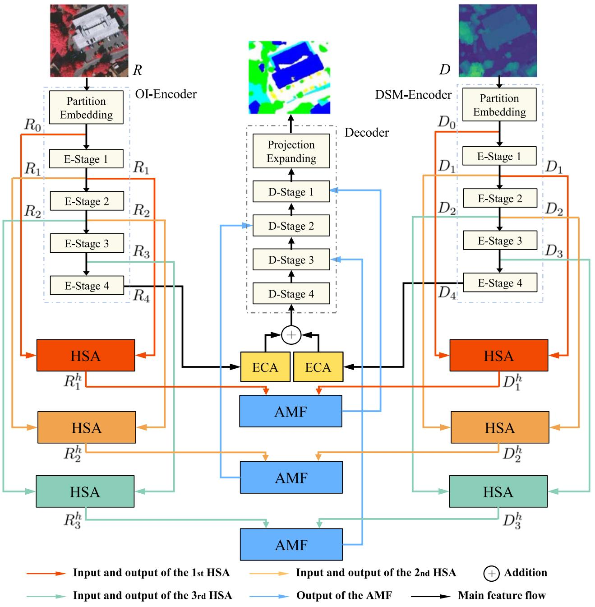  
Fig. 1. Architecture of the proposed ASMFNet. It consists of multiencoders for OI and DSM feature extraction and HSA modules for adjacent scale fusion in each modality. Besides, a decoder adopts swin transformer [24] as the backbone and uses multihead attention layers. Finally, the multimodality fusion module consists of AMF and efficient channel attention (ECA) [50] layers for fusing enhanced OI and DSM features from each encoder stage.

process derives its weight matrix based on the features from adjacent stages.

In the spatial-wise feature enhancement process, the output in the previous sub-module is processed by GAP to gather spatial information, resulting in the integrated information from the OI data following its alignment and fusion with the DSM signal. Then, it is fed into a novel adaptive fusion process as shown in Fig. 4. We denote $A _ { i } ^ { s }$ from the ‘adaptive fusion” process as the spatial correlation. The detailed operation of the “adaptive fusion” process will be elaborated in the next paragraph. Meanwhile, $R _ { i } ^ { h }$ and $D _ { i } ^ { h }$ are individually fed into two ECA modules before the resulting outputs are added together to generate $A _ { i } ^ { c }$ ,

i.e., the channel correlation. Finally, $A _ { i } ^ { c }$ and $A _ { i } ^ { s }$ are individually processed by a fully connected (FC) layer before the resulting output is added together to generate cross-modal features $M F _ { i }$ . Mathematically, the operations above can be written as

$$
\begin{array}{l} \mathrm {M F} _ {i} = \mathrm {F C} (\mathrm {A F} (R _ {i} ^ {h}, D _ {i} ^ {h}, \operatorname {C o n v} (\mathrm {F E} (R _ {i} ^ {h}, D _ {i} ^ {h}))) \\ + \operatorname {F C} \left(\operatorname {E C A} \left(R _ {i} ^ {h}, D _ {i} ^ {h}\right)\right), \quad i = 1, 2, 3 \tag {2} \\ \end{array}
$$

where $\operatorname { F C } ( \cdot )$ consists of the FC layer, ReLU, and Sigmoid function. Furthermore, FE(·) and $\operatorname { A F } ( \cdot )$ represent the feature enhancement operation and adaptive fusion, respectively. ECA(·) is the ECA module operation.

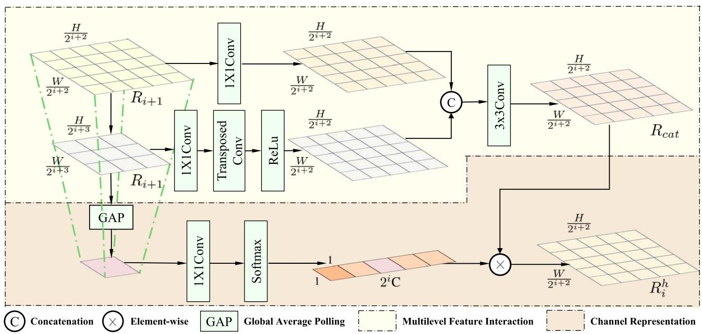  
Fig. 2. Illustration of the proposed HSA module.

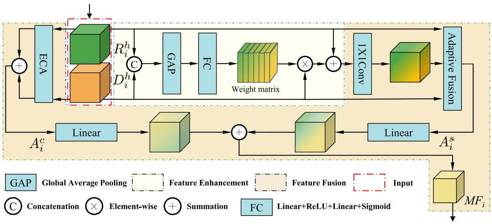  
Fig. 3. Illustration of the AMF module.

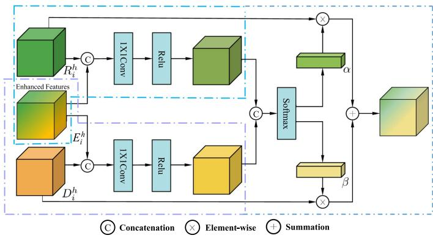  
Fig. 4. Illustration of the adaptive fusion process inside AMF.

The adaptive fusion process is designed to evaluate the significance of different modalities at the pixel level, as shown in Fig. 4. More specifically, the spatial-wise enhanced information $E _ { i } ^ { h }$ is first concatenated with $R _ { i } ^ { h }$ and $D _ { i } ^ { h }$ separately before $1 \times 1$ convolution layers and a ReLU function is applied to adjust channel numbers. The resulting outputs are concatenated before a softmax operation to generate weighting coefficients $\alpha$ and $\beta$ . Finally, the output of the “adaptive fusion” process denoted by $A _ { i } ^ { s }$ is computed as the weighted sum of various modalities in spatial correlation. Mathematically, the output of the $A _ { i } ^ { s }$ can be written as follows:

$$
A _ {i} ^ {s} = \alpha \times R _ {i} ^ {h} + \beta \times D _ {i} ^ {h} \tag {3}
$$

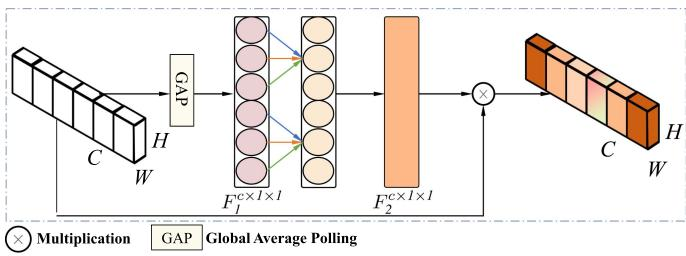  
Fig. 5. Illustration of the ECA module.

where

$$
\begin{array}{l} \alpha = \frac {\operatorname {C o n v} \left(\operatorname {C o n c a t} \left(R _ {i} ^ {h} , E _ {i} ^ {h}\right)\right))}{\operatorname {C o n v} \left(\operatorname {C o n c a t} \left(R _ {i} ^ {h} , E _ {i} ^ {h}\right)\right) + \operatorname {C o n v} \left(\operatorname {C o n c a t} \left(D _ {i} ^ {h} , E _ {i} ^ {h}\right)\right))} \\ \beta = \frac {\operatorname {C o n v} \left(\operatorname {C o n c a t} \left(D _ {i} ^ {h} , E _ {i} ^ {h}\right)\right)}{\operatorname {C o n v} \left(\operatorname {C o n c a t} \left(R _ {i} ^ {h} , E _ {i} ^ {h}\right)\right) + \operatorname {C o n v} \left(\operatorname {C o n c a t} \left(D _ {i} ^ {h} , E _ {i} ^ {h}\right)\right)} \tag {4} \\ \end{array}
$$

where ReLu is omitted to make the formula more concise. In this fusion module, the learnable latent weighting coefficients $\alpha$ and $\beta$ provide the process with strong adaptability.

It has been observed that cross-channel interaction can substantially enhance the model’s performance. This work adopts the ECA module depicted in Fig. 5. The GAP first processes the input data and converts it to $F _ { 1 } \in \mathbb { R } ^ { C \times 1 \times 1 }$ before being fed into the convolution kernel. Note that the size of the convolution kernel in the ECA module denotes the scope of channel interaction and is typically ascertained through nonlinear mapping of the channel dimension. The output from the convolution kernel is passed through a Sigmoid function and converted into a vector $F _ { 2 } \in \mathbb { R } ^ { C \times 1 \times 1 }$ whose entries are in a range of [0,1]. Finally, $F _ { 2 }$ is element-wise multiplied with the input, generating the final weighted features.

# E. Decoder

This work employs the decoder architecture of Swin-UNet [53] to reconstruct the image, which serves as the baseline method for our work. In the decoder, each patch is treated as a token and undergoes five stages. The first stage consists of a single Swin transformer block (STB), while the middle three stages comprise pairs of STBs and a patch-expanding layer. Within each block, tokens are partitioned into several windows of fixed size and the similarity between patches within and across windows is computed separately. The patch-expanding layer plays a crucial role in up-sampling the feature map to a higher resolution while reducing the number of channels. The outputs from all four stages are concatenated with intermediate results from the encoder to enhance feature representation.

# F. Loss Function

Since the final output images have a resolution identical to the original input images, a pixel-by-pixel comparison is performed with the ground truth label. The standard multiclass cross-entropy function is applied during training to minimize the training loss.

# IV. EXPERIMENTS AND DISCUSSION

# A. Dataset

To validate the effectiveness of the proposed ASMFNet, extensive experiments have been conducted on the Vaihingen and Potsdam datasets published by the International Society for Photogrammetry and Remote Sensing (ISPRS). The Vaihingen dataset was collected from a small village in Germany characterized by dense buildings and forests. It comprises 33 remote sensing images derived from top-level orthophotos and the corresponding digital surface model features. All images have three bands, namely near-infrared, red, and green channels. In total, 12 labeled images were manually selected for training in our experiment, while four were for testing.

In contrast, the Potsdam dataset was collected from a historic city with expansive buildings and narrow streets. It consists of 38 remote sensing images with a size of $6 0 0 0 \times 6 0 0 0$ pixels, of which 24 are labeled. Unlike the Vaihingen dataset, it has four bands, namely near-infrared, red, green, and blue channels. In our experiment, 18 labeled images were used for training and six for testing.

It should be noted that both datasets contain six categories including five foreground classes, namely Building (Bui.), tree (Tre.), Low vegetation (Low.), Car, Roads (Roa.), and one background class. In our experiments, each image was cropped to a size of $2 2 4 \times 2 2 4$ pixels with a 32-pixel stride for training testing.

# B. Experimental Setting

All experiments are implemented with Pytorch on a single NVIDIA RTX2080TI with 12GB RAM. In addition, the optimizer is set to stochastic gradient descent with a 0.001 initial learning rate for decoders and 0.0005 for encoders. Moreover, the batch size is 10. To evaluate the segmentation performance, the following performance metrics are employed, including the overall accuracy (OA), mean F1-Score, and mean intersection ratio (mIoU), which are given as follows:

$$
\mathrm {O A} = \frac {\mathrm {T P}}{\mathrm {T P} + \mathrm {T F} + \mathrm {F P} + \mathrm {F N}} \tag {5}
$$

$$
F 1 _ {c} = \frac {2 \times \text {P r e c i s i o n} _ {c} \times \text {R e c a l l} _ {c}}{\text {P r e c i s i o n} _ {c} + \text {R e c a l l} _ {c}} \tag {6}
$$

$$
\operatorname {R e c a l l} _ {c} = \frac {\mathrm {T P} _ {c}}{\mathrm {T P} _ {c} + F N _ {c}} \tag {7}
$$

$$
\mathrm {P r e c i s i o n} _ {c} = \frac {\mathrm {T P} _ {c}}{\mathrm {T P} _ {c} + \mathrm {F P} _ {c}} \tag {8}
$$

$$
\mathrm {I o U} _ {c} = \frac {\mathrm {T P} _ {c}}{\mathrm {T P} _ {c} + \mathrm {F P} _ {c} + \mathrm {F N} _ {c}} \tag {9}
$$

where TP, FP, TN, and FN represent the true positives, false positives, true negatives, and false negatives of the cth class, respectively. mF1 and mIoU are derived from the mean $F 1 _ { c }$ and $\mathrm { I o U } _ { c }$ of five foreground classes.

To avoid introducing heterogeneity between different encoders and to simplify the design, the same encoder in ASMFNet is applied to process both OI and DSM data. We compare the

TABLE I EXPERIMENTAL RESULTS ON THE VAIHINGEN DATASET   

<table><tr><td>Modality</td><td>Method</td><td>Bui.</td><td>Tre.</td><td>Low.</td><td>Car</td><td>Roa.</td><td>OA</td><td>F1</td><td>mIoU</td></tr><tr><td rowspan="2">Unimodal</td><td>PSPNet [54]</td><td>96.70</td><td>92.18</td><td>71.93</td><td>86.16</td><td>90.78</td><td>90.52</td><td>88.53</td><td>79.85</td></tr><tr><td>Swin-UNet [53]</td><td>95.39</td><td>91.79</td><td>77.18</td><td>70.01</td><td>90.42</td><td>89.91</td><td>85.85</td><td>76.03</td></tr><tr><td rowspan="7">Multimodal</td><td>ACNet [55]</td><td>96.64</td><td>92.12</td><td>78.15</td><td>79.87</td><td>91.23</td><td>90.92</td><td>88.25</td><td>79.96</td></tr><tr><td>FuseNet [38]</td><td>93.42</td><td>93.13</td><td>71.72</td><td>70.66</td><td>84.56</td><td>89.95</td><td>85.03</td><td>73.43</td></tr><tr><td>ESANet [56]</td><td>98.04</td><td>92.77</td><td>77.74</td><td>83.62</td><td>90.07</td><td>90.98</td><td>87.89</td><td>80.18</td></tr><tr><td>RFNet [57]</td><td>95.44</td><td>92.37</td><td>76.51</td><td>75.98</td><td>91.65</td><td>90.51</td><td>87.72</td><td>78.73</td></tr><tr><td>CMFNet [32]</td><td>95.99</td><td>90.41</td><td>80.03</td><td>85.58</td><td>91.53</td><td>91.05</td><td>89.16</td><td>80.24</td></tr><tr><td>MFTransNet [58]</td><td>97.73</td><td>90.43</td><td>80.72</td><td>88.37</td><td>91.25</td><td>91.25</td><td>88.76</td><td>80.12</td></tr><tr><td>FTransUNet [11]</td><td>97.14</td><td>90.99</td><td>80.60</td><td>89.53</td><td>91.47</td><td>91.53</td><td>89.32</td><td>80.34</td></tr><tr><td colspan="2">ASMFNet</td><td>95.92</td><td>91.32</td><td>83.21</td><td>81.21</td><td>91.84</td><td>91.46</td><td>88.99</td><td>80.47</td></tr></table>

Bold values are the best.

TABLE II EXPERIMENTAL RESULTS ON THE POTSDAM DATASET   

<table><tr><td>Modality</td><td>Method</td><td>Bui.</td><td>Tre.</td><td>Low.</td><td>Car</td><td>Roa.</td><td>OA</td><td>F1</td><td>mIoU</td></tr><tr><td rowspan="2">Unimodal</td><td>PSPNet [54]</td><td>97.38</td><td>87.05</td><td>87.35</td><td>95.80</td><td>91.71</td><td>90.36</td><td>91.75</td><td>85.02</td></tr><tr><td>Swin-UNet [53]</td><td>97.45</td><td>86.77</td><td>87.92</td><td>94.23</td><td>90.10</td><td>90.17</td><td>91.33</td><td>84.28</td></tr><tr><td rowspan="7">Multimodal</td><td>ACNet [55]</td><td>97.63</td><td>85.43</td><td>87.62</td><td>95.69</td><td>92.83</td><td>90.75</td><td>91.71</td><td>85.02</td></tr><tr><td>FuseNet [38]</td><td>97.53</td><td>87.77</td><td>87.05</td><td>96.56</td><td>91.00</td><td>90.61</td><td>91.71</td><td>85.01</td></tr><tr><td>ESANet [56]</td><td>97.70</td><td>87.24</td><td>87.13</td><td>94.73</td><td>92.21</td><td>90.67</td><td>91.63</td><td>84.88</td></tr><tr><td>RFNet [57]</td><td>97.69</td><td>85.89</td><td>88.57</td><td>95.76</td><td>92.23</td><td>90.56</td><td>91.71</td><td>85.03</td></tr><tr><td>CMFNet [32]</td><td>97.32</td><td>86.31</td><td>86.02</td><td>94.98</td><td>91.52</td><td>90.11</td><td>91.07</td><td>84.47</td></tr><tr><td>MFTransNet [58]</td><td>97.84</td><td>87.83</td><td>86.07</td><td>94.74</td><td>91.61</td><td>90.31</td><td>91.42</td><td>84.76</td></tr><tr><td>FTransUNet [11]</td><td>98.37</td><td>87.65</td><td>87.52</td><td>96.30</td><td>92.76</td><td>91.26</td><td>91.89</td><td>85.22</td></tr><tr><td colspan="2">ASMIFNet</td><td>97.95</td><td>87.99</td><td>88.03</td><td>95.38</td><td>93.55</td><td>91.17</td><td>92.06</td><td>85.34</td></tr></table>

Bold values are the best.

performance of the proposed ASMFNet on the ISPRS Vaihingen and Potsdam datasets against nine existing segmentation models, namely PSPNet [54], Swin-UNet [53], ACNet [55], FuseNet [38], ESANet [56], RFNet [57], CMFNet [32], MF-TransNet [58], and FTransUNet [11]. It is worth noting that PSPNet and Swin-UNet are unimodal methods focusing on only OI data, whereas other methods are multimodal methods. The present of the single-modal method is to demonstrate the performance of some classical methods in order to make our method easier to evaluate.

# C. Performance Comparison

1) Performance Analysis: Careful inspection of the experimental results presented in Tables I and II reveals that multimodal fusion models are generally more effective than unimodal models, which hints that unimodal PSPNet and Swin-UNet were less effective in extracting comprehensive features. Interestingly, it was observed that PSPNet performed well on small objects such as “Cars” by exploiting its synchronized parallel convolution kernels and aggregation of contextual information from different scales [59]. Among the multimodal models, FuseNet and STFuse ignored the heterogeneity among modalities. As a result, their performance in the evaluation metrics was poor. Furthermore, ACNet and RFNet overlooked the long-distance dependencies and spatial correlations between pixels, which incurred performance degradation. In addition, ESANet performed well on “Buildings” while failing on complex landscapes such as “Roads.” This observation suggests that ESANet cannot effectively handle edge semantic information as boundary information is crucial for classifying “Roads” and “Low vegetation.” The proposed ASMFNet achieved improved classification accuracy for almost all classes compared with the

baseline Swin-UNet. In particular, Table I shows that the proposed ASMFNet attained the highest classification accuracy for “Low vegetation” and “Roads.” For instance, ASMFNet demonstrated substantial performance improvement of $2 . 4 9 \%$ and $2 . 6 1 \%$ over the second and third-best models, i.e., MFTransNet and FTransUNet, for “Low vegetation.” Similar observation was obtained from Table II derived from the ISPRS Potsdam dataset. More specifically, ASMFNet achieved the best performance on two classes, namely “Trees,” and “Roads.” Inspection of Tables I and II suggests that ASMFNet attained impressive performance in OA, F1, and mIoU.

Fig. 6 visually illustrates the results derived with the Vaihingen dataset using the nine models under consideration. In particular, the rectangular area highlights the differences between models under consideration. Careful observation suggests that ASMFNet effectively distinguished complex boundaries between “Low vegetation” and other classes while demonstrating improved classification performance for continuously distributed objects, such as “Buildings” and “Low vegetation.” Fig. 7 shows the results derived with the ISPRS Potsdam dataset. It is observed that our method achieves more complete object segmentation, demonstrating that the adjacent-scale enhanced multimodal fusion strategy equips ASMFNet with a superior ability to assess object integrity. It ultimately improved the overall performance of our method.

2) Modality Analysis: To evaluate the necessity and role of multimodal information, we present the results of four methods. The first and the second are the single-modal approach, Swin-UNet, which serves as our baseline. However, the first experiment inputs only single-modal information, while the second experiment inputs stacked multimodal information. Extending Swin-UNet to the multimodal task results in the STFuse model. It uses dual-branch encoders to extract features from

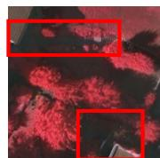  
(a)

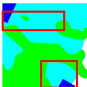

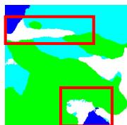

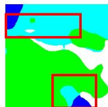

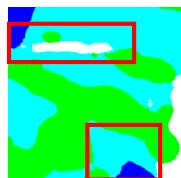

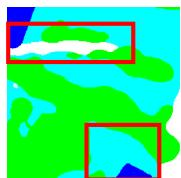  
(f)

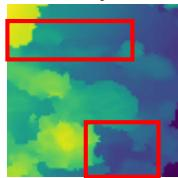

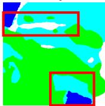

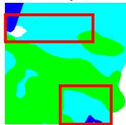  
(i1)

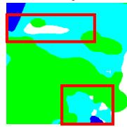  
(i)

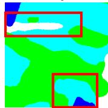

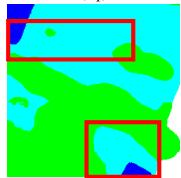

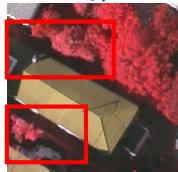  
(a2)

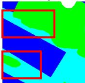

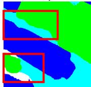  
(c2)

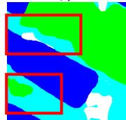  
(d2)

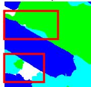  
(e2)

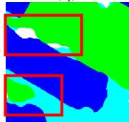  
(f2)

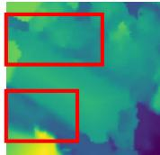  
（g2)  
building

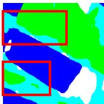  
  
  
tree

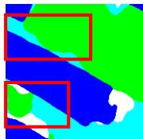  
  
low vegetation

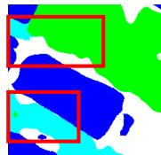  
(2)

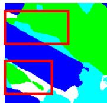  
(k2)   
impervious surface

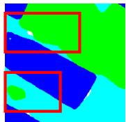  
(12)   
  
clutter   
Fig. 6. Qualitative visual results on the Vaihingen dataset: (a) OI images, (b) ground truth, and (g) DSM. Other images are enlarged visualization trained by (c) PSPNet, (d) Swin-UNet, (e) ACNet, (f) FuseNet, (h) ESANet, (i) RFNet, (j) CMFNet, (k) STFuse, and (l) proposed ASMFNet. The subscripts [1,2] represent the serial number of the samples displayed.

TABLE III MODALITY ANALYSIS ON THE VAIHINGEN DATASET AND POTSDAM DATASET   

<table><tr><td>Dataset</td><td>Method</td><td>Bui.</td><td>Tre.</td><td>Low.</td><td>Car</td><td>Roa.</td><td>OA</td><td>F1</td><td>mIoU</td></tr><tr><td rowspan="4">Vaihingen</td><td>Swin-UNet (OI)</td><td>95.39</td><td>91.79</td><td>77.18</td><td>70.01</td><td>90.42</td><td>89.91</td><td>85.85</td><td>76.03</td></tr><tr><td>Swin-UNet (OI+DSM)</td><td>95.33</td><td>87.46</td><td>80.55</td><td>78.91</td><td>91.23</td><td>90.21</td><td>87.02</td><td>77.93</td></tr><tr><td>STFuse</td><td>94.97</td><td>90.88</td><td>80.42</td><td>78.03</td><td>91.84</td><td>90.69</td><td>87.93</td><td>79.00</td></tr><tr><td>ASMFNet</td><td>95.92</td><td>91.32</td><td>83.21</td><td>81.21</td><td>91.84</td><td>91.46</td><td>88.99</td><td>80.47</td></tr><tr><td rowspan="4">Potsdam</td><td>Swin-UNet (OI)</td><td>97.45</td><td>86.77</td><td>87.92</td><td>94.23</td><td>90.10</td><td>90.17</td><td>91.33</td><td>84.28</td></tr><tr><td>Swin-UNet (OI+DSM)</td><td>97.53</td><td>85.96</td><td>87.51</td><td>94.65</td><td>91.87</td><td>90.31</td><td>91.36</td><td>84.43</td></tr><tr><td>STFuse</td><td>97.44</td><td>90.48</td><td>85.41</td><td>95.37</td><td>91.43</td><td>90.62</td><td>91.16</td><td>84.02</td></tr><tr><td>ASMFNet</td><td>97.95</td><td>87.99</td><td>88.03</td><td>95.38</td><td>93.55</td><td>91.17</td><td>92.06</td><td>85.34</td></tr></table>

Bold values are the best

different modalities, with the simplest element-wise addition for information fusion, making it the baseline for multimodal fusion. The structure of Swin-UNet and STFuse are presented in Fig. 8. The proposed ASMFNet improves the fusion strategy on the basis of STFuse.

Table III shows the results of modality analysis. By comparing the results of Swin-UNet and STFuse, it is clear that the effectiveness of multimodal methods also depends on the chosen fusion techniques. On the Vaihingen dataset, STFuse showed significant improvement, whereas on Potsdam, its performance was similar to that of Swin-UNet. The results show that the inherent heterogeneity of multimodal information would cause simple fusion strategies to fail to effectively utilize the complementary effects of multimodal information. However, the proposed ASMFNet achieved notable improvements in both

datasets, proving that the proposed fusion strategy effectively addresses this challenge.

3) Multiscale Strategy Analysis: This section compares the performance of different multiscale fusion strategies depicted in Fig. 9. The first strategy connects three consecutive stages (CS), whereas the second strategy utilizes dense connection (DC) to connect the next stage with all previous stages. Moreover, the third strategy adopts the adjacent scale-based fusion proposed in this work.

Table IV shows the experimental results derived with different multiscale fusion strategies using the STFuse model. It is evidenced from Table IV that multiscale fusion indeed helped improve the segmentation performance. Furthermore, the proposed adjacent-scale fusion outperformed the DC and CS multiscale fusion strategies regarding OA, F1,

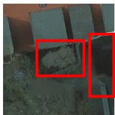  
(a）

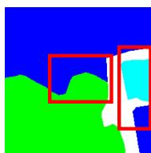

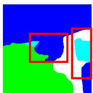

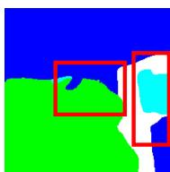

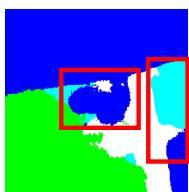

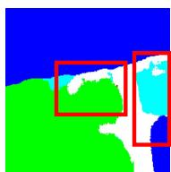  
(f1)

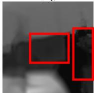

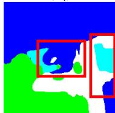

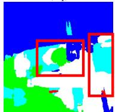

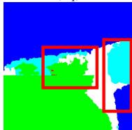

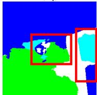

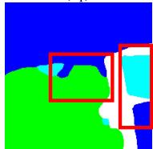  
(11)

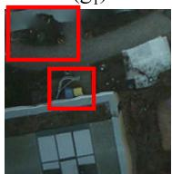

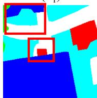

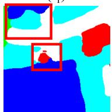

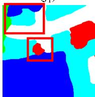

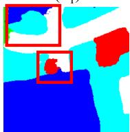

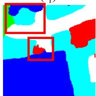

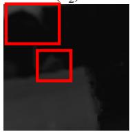  
  
building

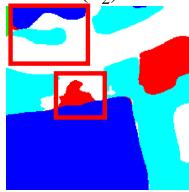

  
  
tree

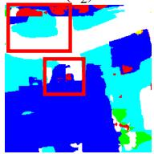  
  
low vegetation

  
(2)   
car

  
  
impervious surface

  
  
clutter   
Fig. 7. Qualitative visual results on the potsdam dataset: (a) OI images, (b) ground truth, and (g) DSM. Other images are enlarged visualization trained by (c) PSPNet, (d) Swin-UNet, (e) ACNet, (f) FuseNet, (h) ESANet, (i) RFNet, (j) CMFNet, (k) STFuse, and (l) proposed ASMFNet. The subscripts [1,2] represent the serial number of the samples displayed.

TABLE IV EXPERIMENTAL RESULTS UNDER DIFFERENT SCALES ON THE VAIHINGEN DATASET   

<table><tr><td>Method</td><td>Bui.</td><td>Tre.</td><td>Low.</td><td>Car</td><td>Roa.</td><td>OA</td><td>F1</td><td>mIoU</td></tr><tr><td>No multi-scale fusion</td><td>95.34</td><td>90.49</td><td>82.58</td><td>80.02</td><td>90.94</td><td>90.86</td><td>88.06</td><td>79.77</td></tr><tr><td>Dense-connection (DC) fusion</td><td>95.77</td><td>90.67</td><td>81.33</td><td>68.78</td><td>91.62</td><td>90.72</td><td>86.79</td><td>77.47</td></tr><tr><td>Consecutive-stage (CS) fusion</td><td>96.25</td><td>92.75</td><td>77.20</td><td>65.67</td><td>91.46</td><td>90.67</td><td>86.87</td><td>77.42</td></tr><tr><td>adjacent-scale fusion</td><td>95.92</td><td>91.32</td><td>83.21</td><td>81.21</td><td>91.84</td><td>91.46</td><td>88.99</td><td>80.47</td></tr></table>

Bold values are the best.

and mIoU. In particular, the proposed adjacent-scale fusion strategy significantly obtained the highest accuracy for “Cars” and “Low vegetation.” Finally, Fig. 10 visually shows some examples of the experimental results, which confirmed the results in Table IV.

4) Interpretability of Representation Learning: Next, we will explore some insights into the improvement provided by the adjacent-scale fusion strategy. It is well known that detailed structural information is lost during the downsampling process in Swin-UNet. Fig. 11 shows the spectrogram of OI and DSM data derived from the output of each stage of the proposed ASMFNet and the baseline STFuse by exploiting 2-D discrete Fourier transform. As observed from Fig. 11, the spectrogram generated by the baseline STFuse is overall dimly lit with only a few bright blocks, whereas that derived from the proposed ASMFNet is more vivid with more glowing blocks showing in the high-frequency regions, i.e., the regions far away from

the spectrogram center. Recall that high-frequency components commonly characterize the edge information. In other words, Fig. 11 confirmed that the proposed ASMFNet preserved a considerable proportion of the high-frequency features even after multiple down-sampling operations. This observation supported the exceptional performance of the proposed ASMFNet on “Low vegetation” and “Roads” as it retained rich texture and bordering information to identify object boundaries, and subsequently, distinguish ground objects by paying more attention to the interaction between their local contextual cues.

# D. Ablation Study

Ablation studies are performed in this section to verify the performance improvement provided by each proposed module with a focus on the proposed adjacent-scale fusion strategy, the designed HSA module and the AMF module. Inspection

  
Fig. 8. Illustration of (a) Swin-UNet and (b) STFuse.

  
Fig. 9. Illustration of three multiscale fusion strategies: (a) CS, (b) DC, and (c) proposed adjacent-scale HSA module.

  
Fig. 10. Comparison of features generated after fusion at different scale levels. (a) Original images, (b) ground truths, (c) AMF-STFuse, (d) consecutive-stage fusion (CS), (e) dense-connection (DC) fusion, and (f) proposed adjacent-scale fusion. The subscripts $\{ 1 , 2 , 3 , 4 \}$ denote the serial number of the samples displayed.

  
Fig. 11. Spectrogram of OI and DSM in the proposed ASMFNet and the baseline STFuse.

TABLE V ABLATION STUDY ON THE VAIHINGEN DATASET   

<table><tr><td>AS</td><td>HSA</td><td>AMF</td><td>Accuracy</td></tr><tr><td></td><td></td><td></td><td>90.69</td></tr><tr><td></td><td></td><td>✓</td><td>90.86</td></tr><tr><td>✓</td><td></td><td>✓</td><td>91.17</td></tr><tr><td>✓</td><td>✓</td><td></td><td>91.28</td></tr><tr><td>✓</td><td>✓</td><td>✓</td><td>91.46</td></tr><tr><td colspan="4">Bold values are the best.</td></tr></table>

TABLE VI ABLATION STUDY ON THE VAIHINGEN DATASET   

<table><tr><td>Network Depth</td><td>STB Number in each stage</td><td>OA</td><td>F1</td><td>mIoU</td></tr><tr><td>3</td><td>[2,2,6]</td><td>90.64</td><td>87.53</td><td>78.16</td></tr><tr><td>3</td><td>[1,1,3,1]</td><td>91.28</td><td>88.48</td><td>79.89</td></tr><tr><td>4</td><td>[2,2,6,2]</td><td>91.46</td><td>88.99</td><td>80.47</td></tr></table>

Bold values are the best.

of Table V confirmed the effectiveness of each proposed module. In particular, the joint utilization of AS, HSA, and AMF offered nonnegligible improvement. More specifically, the HSA weighs the feature map with higher-order semantic information, whereas the AMF enables the network to learn the multimodal data fused by the HSA adaptively.

# E. Model Scale Analysis

In this section, we investigate the impact caused by different numbers of STBs and model depths. In the proposed ASMFNet, the default network depth was set to four, with $\{ 2 , 2 , 6 , 2 \}$ STBs per layer. For comparison purposes, we change the number of blocks to $\{ 1 , 1 , 3 , 1 \}$ . Furthermore, considering the influence of different stages, the network depth becomes 3. Table VI illustrates the experimental results on the Vaihingen Dataset. It can be deduced that as the depth of the Swin Transformer

TABLE VIICOMPUTATIONAL COMPLEXITY ANALYSIS MEASURED BY A $2 2 4 \times 2 2 4$ IMAGE ON A SINGLE NVIDIA RTX 2080 GPU  

<table><tr><td>Method</td><td>Multimodal</td><td>FLOPs (G)</td><td>Parameter (M)</td><td>Memory (MB)</td><td>Speed (FPS)</td><td>MIoU(%)</td></tr><tr><td>PSPNet [54]</td><td>N</td><td>51.23</td><td>46.72</td><td>3012</td><td>68.24</td><td>79.5</td></tr><tr><td>Swin-UNet [53]</td><td>N</td><td>16.54</td><td>34.68</td><td>1297</td><td>38.64</td><td>76.03</td></tr><tr><td>ACNet [55]</td><td>Y</td><td>12.96</td><td>62.37</td><td>2269</td><td>18.64</td><td>79.96</td></tr><tr><td>FuseNet [38]</td><td>Y</td><td>60.44</td><td>42.08</td><td>2168</td><td>20.72</td><td>73.43</td></tr><tr><td>ESANet [56]</td><td>Y</td><td>8.21</td><td>34.03</td><td>1856</td><td>12.24</td><td>80.18</td></tr><tr><td>RFNet [57]</td><td>Y</td><td>5.42</td><td>14.60</td><td>1508</td><td>18.24</td><td>78.73</td></tr><tr><td>CMFNet [32]</td><td>Y</td><td>80.67</td><td>112.44</td><td>3974</td><td>9.82</td><td>80.24</td></tr><tr><td>MFTransUNet [58]</td><td>Y</td><td>9.52</td><td>41.36</td><td>1488</td><td>16.68</td><td>80.12</td></tr><tr><td>FTransUNet [11]</td><td>Y</td><td>47.28</td><td>152.34</td><td>3364</td><td>11.66</td><td>80.34</td></tr><tr><td>ASMFNet</td><td>Y</td><td>26.38</td><td>83.50</td><td>1894</td><td>26.86</td><td>80.47</td></tr></table>

Bold values are the best.

decreased, the network generally became shallow and failed to extract features for effective segmentation performance.

# F. Model Complexity Analysis

We assess the computational complexity of the proposed ASMFNet using four evaluation metrics: floating point operations (FLOPs), model parameter count, memory footprint and frames per second (FPS). FLOPs measure the model’s complexity, while the parameter count and memory footprint gauge its memory requirements. On the other hand, FPS evaluates the execution speed. Ideally, an efficient model should have lower values for the first three metrics and a higher FPS value.

Table VII presents the complexity analysis results for all methods compared in this study. As shown, the proposed ASMFNet demonstrated lower FLOPs, parameter count, and memory usage, along with higher FPS, compared to hybrid architectures, such as CMFNet and FTransUNet. This efficiency is primarily due to the focus on reducing the complexity of both the encoder and the fusion module. Specifically, ASMFNet employs the Swin Transformer for feature extraction and CNN-based structure for feature fusion. Furthermore, despite the slight increase in model complexity, ASMFNet achieved a significant improvement in segmentation performance compared to other networks.

# G. Discussion

This work introduces a multimodal fusion approach to semantic segmentation by exploiting adjacent-scale features. The innovative interaction mechanism enhanced contextual understanding while maintaining efficiency, which is crucial for remote sensing applications. The extensive experiments in Section IV demonstrated that the combination of HSA and AMF could significantly fuse multimodal features, leading to more informed decision-making in various datasets. Since its primary focus is on exploring adjacent scales, this technique can be easily adapted to other tasks and model architectures. However, its efficiency and performance are also tied to the extraction of multiscale features. In future work, we aim to apply it to tasks such as change detection [60] and visual question answering [61]. Furthermore, it is interesting to investigate the integration of global modeling capabilities with high computational performance [62], [63] and the fusion strategy.

# V. CONCLUSION

In this work, we are dedicated to utilizing supplementary information and contextual cues within and across modalities to improve the segmentation capabilities of various ground objects. Therefore, a multiscale multimodal fusion network called ASMFNet has been proposed for the semantic segmentation of remote sensing data. The proposed ASMFNet takes advantage of adjacency scale information fusion in sharp contrast to existing multiscale fusion strategies. It has been confirmed that merging features of adjacent scales preserve the high-frequency details in data. In addition, an HSA module is devised to implement the enhanced information exchange in adjacent fusion while an AMF module is developed to balance pixel-level representations between different modalities. Extensive experiments have demonstrated the effectiveness of the proposed ASMFNet. Finally, the proposed ASMFNet has exemplified a practical design to leverage the hybrid CNN and transformer structure in semantic segmentation.

# REFERENCES

[1] N. Zang, Y. Cao, Y. Wang, B. Huang, L. Zhang, and P. T. Mathiopoulos, “Land-use mapping for high-spatial resolution remote sensing image via deep learning: A review,” IEEE J. Sel. Topics Appl. Earth Observ. Remote Sens., vol. 14, pp. 5372–5391, 2021.   
[2] H. Chen, J. Song, C. Wu, B. Du, and N. Yokoya, “Exchange means change: An unsupervised single-temporal change detection framework based on intra-and inter-image patch exchange,” ISPRS J. Photogrammetry Remote Sens., vol. 206, pp. 87–105, 2023.   
[3] C. Ye et al., “Landslide detection of hyperspectral remote sensing data based on deep learning with constrains,” IEEE J. Sel. Topics Appl. Earth Observ. Remote Sens., vol. 12, no. 12, pp. 5047–5060, Dec. 2019.   
[4] X. Zhang, W. Yu, M.-O. Pun, and W. Shi, “Cross-domain landslide mapping from large-scale remote sensing images using prototype-guided domain-aware progressive representation learning,” ISPRS J. Photogrammetry Remote Sens., vol. 197, pp. 1–17, 2023.   
[5] Q. Yuan et al., “Deep learning in environmental remote sensing: Achievements and challenges,” Remote Sens. Environ., vol. 241, 2020, Art. no. 111716.   
[6] K. A. Hassan, E. O. Elgendi, A. S. Shehata, and M. I. Elmasry, “Energy saving and environment protection solution for the submarine pipelines based on deep learning technology,” Energy Rep., vol. 8, pp. 1261–1274, 2022.   
[7] P. Guan and E. Y. Lam, “Cross-domain contrastive learning for hyperspectral image classification,” IEEE Trans. Geosci. Remote Sens., vol. 60, pp. 1–13, May 2022.   
[8] R. Hang, P. Yang, F. Zhou, and Q. Liu, “Multiscale progressive segmentation network for high-resolution remote sensing imagery,” IEEE Trans. Geosci. Remote Sens., vol. 60, pp. 1–12, Sep. 2022.

[9] X. Ma, Q. Wu, X. Zhao, X. Zhang, M.-O. Pun, and B. Huang, “Samassisted remote sensing imagery semantic segmentation with object and boundary constraints,” IEEE Trans. Geosci. Remote Sens., vol. 62, pp. 1–16, Aug. 2024.   
[10] R. Hang, Z. Li, P. Ghamisi, D. Hong, G. Xia, and Q. Liu, “Classification of hyperspectral and LiDAR data using coupled CNNs,” IEEE Trans. Geosci. Remote Sens., vol. 58, no. 7, pp. 4939–4950, Jul. 2020.   
[11] X. Ma, X. Zhang, M.-O. Pun, and M. Liu, “A multilevel multimodal fusion transformer for remote sensing semantic segmentation,” IEEE Trans. Geosci. Remote Sens., vol. 62, pp. 1–15, Mar. 2024.   
[12] X. Lu, X. Li, and L. Mou, “Semi-supervised multitask learning for scene recognition,” IEEE Trans. Cybern., vol. 45, no. 9, pp. 1967–1976, Sep. 2015.   
[13] X. Zhang, M.-O. Pun, and M. Liu, “Semi-supervised multi-temporal deep representation fusion network for landslide mapping from aerial orthophotos,” Remote Sens., vol. 13, no. 4, 2021, Art. no. 548.   
[14] H. Chen, C. Lan, J. Song, C. Broni-Bediako, J. Xia, and N. Yokoya, “ObjFormer: Learning land-cover changes from paired OSM data and optical high-resolution imagery via object-guided transformer,” IEEE Trans. Geosci. Remote Sens., vol. 62, pp. 1–22, Jun. 2024.   
[15] L. Mou, Y. Hua, and X. X. Zhu, “Relation matters: Relational contextaware fully convolutional network for semantic segmentation of highresolution aerial images,” IEEE Trans. Geosci. Remote Sens., vol. 58, no. 11, pp. 7557–7569, Nov. 2020.   
[16] X. Zheng, X. Wu, L. Huan, W. He, and H. Zhang, “A gather-to-guide network for remote sensing semantic segmentation of RGB and auxiliary image,” IEEE Trans. Geosci. Remote Sens., vol. 60, pp. 1–15, Aug. 2022.   
[17] F. Diakogiannis, F. Waldner, P. Caccetta, and C. Wu, “ResUNet-a: A deep learning framework for semantic segmentation of remotely sensed data,” ISPRS J. Photogrammetry Remote Sens., vol. 162, pp. 94–114, 2020.   
[18] X. Yang et al., “An attention-fused network for semantic segmentation of very-high-resolution remote sensing imagery,” ISPRS J. Photogrammetry Remote Sens., vol. 177, pp. 238–262, Aug. 2021.   
[19] X. Wang, R. Girshick, A. Gupta, and K. He, “Non-local neural networks,” in Proc. IEEE Conf. Comput. Vis. Pattern Recognit., 2018, pp. 7794–7803.   
[20] Q. He, X. Sun, W. Diao, Z. Yan, D. Yin, and K. Fu, “Transformer-induced graph reasoning for multimodal semantic segmentation in remote sensing,” ISPRS J. Photogrammetry Remote Sens., vol. 193, pp. 90–103, 2022.   
[21] P. Lv, W. Wu, Y. Zhong, and L. Zhang, “Review of vision transformer models for remote sensing image scene classification,” in Proc. IEEE Int. Geosci. Remote Sens. Symp., 2022, pp. 2231–2234.   
[22] X. Ma, X. Zhang, Z. Wang, and M.-O. Pun, “Unsupervised domain adaptation augmented by mutually boosted attention for semantic segmentation of VHR remote sensing images,” IEEE Trans. Geosci. Remote Sens., vol. 61, pp. 1–15, Jan. 2023.   
[23] M. Ma et al., “A multimodal hyper-fusion transformer for remote sensing image classification,” Inf. Fusion, vol. 96, pp. 66–79, 2023.   
[24] Z. Liu et al., “Swin transformer: Hierarchical vision transformer using shifted windows,” in Proc. IEEE/CVF Int. Conf. Comput. Vis., 2021, pp. 9992–10002.   
[25] L. Gao et al., “STransFuse: Fusing swin transformer and convolutional neural network for remote sensing image semantic segmentation,” IEEE J. Sel. Topics Appl. Earth Observ. Remote Sens., vol. 14, pp. 10990–11003, Oct. 2021.   
[26] X. He, Y. Zhou, J. Zhao, D. Zhang, R. Yao, and Y. Xue, “Swin transformer embedding UNet for remote sensing image semantic segmentation,” IEEE Trans. Geosci. Remote Sens., vol. 60, pp. 1–15, Jan. 2022.   
[27] C. Zhang, L. Wang, S. Cheng, and Y. Li, “SwinSUNet: Pure transformer network for remote sensing image change detection,” IEEE Trans. Geosci. Remote Sens., vol. 60, pp. 1–13, Mar. 2022.   
[28] S. Hao, B. Wu, K. Zhao, Y. Ye, and W. Wang, “Two-stream Swin transformer with differentiable Sobel operator for remote sensing image classification,” Remote Sens., vol. 14, no. 6, 2022, Art. no. 1507.   
[29] T.-Y. Lin, P. Dollár, R. Girshick, K. He, B. Hariharan, and S. Belongie, “Feature pyramid networks for object detection,” in Proc. IEEE Conf. Comput. Vis. Pattern Recognit., 2017, pp. 936–944.   
[30] L.-C. Chen, G. Papandreou, I. Kokkinos, K. Murphy, and A. Yuille, “DeepLab: Semantic image segmentation with deep convolutional nets, atrous convolution, and fully connected CRFs,” IEEE Trans. Pattern Anal. Mach. Intell., vol. 40, no. 4, pp. 834–848, Apr. 2018.   
[31] C. Peng, Y. Li, L. Jiao, Y. Chen, and R. Shang, “Densely based multi-scale and multi-modal fully convolutional networks for high-resolution remotesensing image semantic segmentation,” IEEE J. Sel. Topics Appl. Earth Observ. Remote Sens., vol. 12, no. 8, pp. 2612–2626, Aug. 2019.

[32] X. Ma, X. Zhang, and M.-O. Pun, “A crossmodal multiscale fusion network for semantic segmentation of remote sensing data,” IEEE J. Sel. Topics Appl. Earth Observ. Remote Sens., vol. 15, pp. 3463–3474, Apr. 2022.   
[33] R. Liu, L. Mi, and Z. Chen, “AFNet: Adaptive fusion network for remote sensing image semantic segmentation,” IEEE Trans. Geosci. Remote Sens., vol. 59, no. 9, pp. 7871–7886, Sep. 2021.   
[34] Y. Peng and J. Qi, “CM-GANs: Cross-modal generative adversarial networks for common representation learning,” ACM Trans. Multimedia Comput., Commun., Appl., vol. 15, no. 1, pp. 1–24, 2019.   
[35] Z. Cao et al., “End-to-end DSM fusion networks for semantic segmentation in high-resolution aerial images,” IEEE Geosci. Remote Sens. Lett., vol. 16, no. 11, pp. 1766–1770, Nov. 2019.   
[36] B. Tu, Q. Ren, J. Li, Z. Cao, Y. Chen, and A. Plaza, “NCGLF2: Network combining global and local features for fusion of multisource remote sensing data,” Inf. Fusion, vol. 104, 2024, Art. no. 102192.   
[37] N. Audebert, B. L. Saux, and S. Lefèvre, “Beyond RGB: Very high resolution urban remote sensing with multimodal deep networks,” ISPRS J. Photogrammetry Remote Sens., vol. 140, pp. 20–32, 2018.   
[38] C. Hazirbas, L. Ma, C. Domokos, and D. Cremers, “FuseNet: Incorporating depth into semantic segmentation via fusion-based CNN architecture,” in Proc. Asian Conf. Comput. Vis., 2016, pp. 213–228.   
[39] J. Chen et al., “TransUNet: Rethinking the U-Net architecture design for medical image segmentation through the lens of transformers,” Med. Image Anal., 2024, Art. no. 103280.   
[40] P. Lv, W. Wu, Y. Zhong, F. Du, and L. Zhang, “SCViT: A spatial-channel feature preserving vision transformer for remote sensing image scene classification,” IEEE Trans. Geosci. Remote Sens., vol. 60, pp. 1–12, Mar. 2022.   
[41] P. Lv, M. Li, and Y. Zhong, “A semi-supervised pyramid cross-temporal attention transformer for change detection in high-resolution remote sensing images,” IEEE Geosci. Remote Sens. Lett., vol. 21, pp. 1–5, May 2024.   
[42] C. Zhang, W. Jiang, Y. Zhang, W. Wang, Q. Zhao, and C. Wang, “Transformer and CNN hybrid deep neural network for semantic segmentation of very-high-resolution remote sensing imagery,” IEEE Trans. Geosci. Remote Sens., vol. 60, pp. 1–20, Jan. 2022.   
[43] L. Wang, R. Li, C. Duan, C. Zhang, X. Meng, and S. Fang, “A novel transformer based semantic segmentation scheme for fine-resolution remote sensing images,” IEEE Geosci. Remote Sens. Lett., vol. 19, pp. 1–5, Jan. 2022.   
[44] Z. Feng, X. Zhang, B. Zhou, M. Ren, and X. Chen, “NGST-Net: A Ngram based Swin transformer network for improving multispectral and hyperspectral image fusion,” Int. J. Digit. Earth, vol. 17, no. 1, 2024, Art. no. 2359574.   
[45] G. Huang, Z. Liu, L. V. D. Maaten, and K. Q. Weinberger, “Densely connected convolutional networks,” in Proc. IEEE Conf. Comput. Vis. Pattern Recognit., 2017, pp. 2261–2269.   
[46] J. Wang et al., “Deep high-resolution representation learning for visual recognition,” IEEE Trans. Pattern Anal. Mach. Intell., vol. 43, no. 10, pp. 3349–3364, Oct. 2021.   
[47] C. Guo, B. Fan, Q. Zhang, S. Xiang, and C. Pan, “AugFPN: Improving multi-scale feature learning for object detection,” in Proc. IEEE/CVF Conf. Comput. Vis. Pattern Recognit., 2020, pp. 12592–12601.   
[48] Y. Pang, X. Zhao, L. Zhang, and H. Lu, “Multi-scale interactive network for salient object detection,” in Proc. IEEE/CVF Conf. Comput. Vis. Pattern Recognit., 2020, pp. 9410–9419.   
[49] W. Zhou, J. Jin, J. Lei, and L. Yu, “CIMFNet: Cross-layer interaction and multiscale fusion network for semantic segmentation of high-resolution remote sensing images,” IEEE J. Sel. Topics Signal Process., vol. 16, no. 4, pp. 666–676, Jun. 2022.   
[50] Q. Wang, B. Wu, P. Zhu, P. Li, W. Zuo, and Q. Hu, “ECA-Net: Efficient channel attention for deep convolutional neural networks,” in Proc. IEEE/CVF Conf. Comput. Vis. Pattern Recognit., 2020, pp. 11531–11539.   
[51] Z. Qin et al., “ThunderNet: Towards real-time generic object detection on mobile devices,” in Proc. IEEE/CVF Int. Conf. Comput. Vis., 2019, pp. 6717–6726.   
[52] L. Ding, H. Tang, and L. Bruzzone, “LANet: Local attention embedding to improve the semantic segmentation of remote sensing images,” IEEE Trans. Geosci. Remote Sens., vol. 59, no. 1, pp. 426–435, Jan. 2021.   
[53] H. Cao et al., “Swin-UNet: Unet-like pure transformer for medical image segmentation,” in Proc. Eur. Conf. Comput. Vis.. Springer, 2022, pp. 205–218.   
[54] H. Zhao, J. Shi, X. Qi, X. Wang, and J. Jia, “Pyramid scene parsing network,” in Proc. IEEE Conf. Comput. Vis. Pattern Recognit., 2017, pp. 6230–6239.

[55] X. Hu, K. Yang, L. Fei, and K. Wang, “ACNET: Attention based network to exploit complementary features for RGBD semantic segmentation,” in Proc. IEEE Int. Conf. Image Process., 2019, pp. 1440–1444.   
[56] D. Seichter, M. Köhler, B. Lewandowski, T. Wengefeld, and H.-M. Gross, “Efficient RGB-D semantic segmentation for indoor scene analysis,” in Proc. IEEE Int. Conf. Robot. Automat., 2021, pp. 13525–13531.   
[57] L. Sun, K. Yang, X. Hu, W. Hu, and K. Wang, “Real-time fusion network for RGB-D semantic segmentation incorporating unexpected obstacle detection for road-driving images,” IEEE Robot. Automat. Lett., vol. 5, no. 4, pp. 5558–5565, Oct. 2020.   
[58] S. He, H. Yang, X. Zhang, and X. Li, “MFTransNet: A multi-modal fusion with CNN-transformer network for semantic segmentation of HSR remote sensing images,” Mathematics, vol. 11, no. 3, 2023, Art. no. 722.   
[59] J. Nie, L. Huang, C. Zheng, X. Lv, and R. Wang, “Cross-scale graph interaction network for semantic segmentation of remote sensing images,” ACM Trans. Multimedia Comput., Commun. Appl., vol. 19, no. 6, pp. 1–18, 2023.   
[60] S. Dong, L. Wang, B. Du, and X. Meng, “ChangeCLIP: Remote sensing change detection with multimodal vision-language representation learning,” ISPRS J. Photogrammetry Remote Sens., vol. 208, pp. 53–69, 2024.   
[61] T. Siebert, K. N. Clasen, M. Ravanbakhsh, and B. Demir, “Multi-modal fusion transformer for visual question answering in remote sensing,” in Image and Signal Processing for Remote Sensing XXVIII, vol. 12267. Bellingham, WA, USA: SPIE, 2022, pp. 162–170.   
[62] Q. Zhu et al., “Samba: Semantic segmentation of remotely sensed images with state space model,” Heliyon, vol. 10, 2024, Art. no. e38495.   
[63] X. Ma, X. Zhang, and M.-O. Pun, “RS3Mamba: Visual state space model for remote sensing image semantic segmentation,” IEEE Geosci. Remote Sens. Lett., vol. 21, pp. 1–5, Jun. 2024.

Xianping Ma received the bachelor’s degree in geographical information science from Wuhan University, Wuhan, China, in 2019. He is currently working toward the Ph.D. degree in computer and information engineering with The Chinese University of Hong Kong, Shenzhen, China.

His research interests include remote sensing image processing, deep learning, multimodal learning, and unsupervised domain adaptation.

Dr. Ma is currently a Reviewer for more than ten renowned international journals.

Xichen Xu received the bachelor’s degree in intelligent manufacturing engineering from the South China University of Technology, Guangzhou, China, in 2023. He is currently working toward the master’s degree in electronic information with Shanghai Jiao Tong University, Shanghai, China.

His research interests include deep learning, multimodal learning, and generative artificial intelligence.

Xiaokang Zhang (Senior Member, IEEE) received the Ph.D. degree in photogrammetry and remote sensing from Wuhan University, Wuhan, China, in 2018.

He is currently a specially-appointed Professor with the School of Information Science and Engineering, Wuhan University of Science and Technology, Wuhan. He has authored or coauthored more than 40 scientific publications in international journals and conferences. His research interests include remote sensing image analysis, computer vision, and machine learning.

Man-On Pun (Senior Member, IEEE) received the B.Eng. degree in electronic engineering from the Chinese University of Hong Kong (CUHK), Hong Kong, China, in 1996, the M.Eng. degree in computer science from the University of Tsukuba, Tsukuba, Japan, in 1999, and the Ph.D. degree in electrical engineering from the University of Southern California (USC) in Los Angeles, Los Angeles, CA, USA, in 2006.

He was a Postdoctoral Research Associate with Princeton University, Princeton, NJ, USA, from 2006 to 2008. He is currently an Associate Professor with

the School of Science and Engineering, CUHK, Shenzhen (CUHKSZ). Prior to joining the CUHKSZ in 2015, he held research positions with Huawei (USA), Bridgewater, NJ, USA; Mitsubishi Electric Research Labs (MERL), Boston, MA, USA; and Sony, Tokyo, Japan.