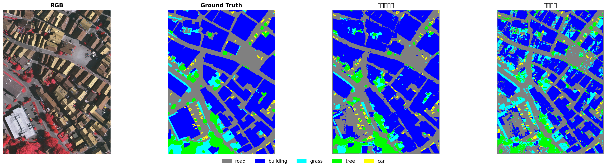
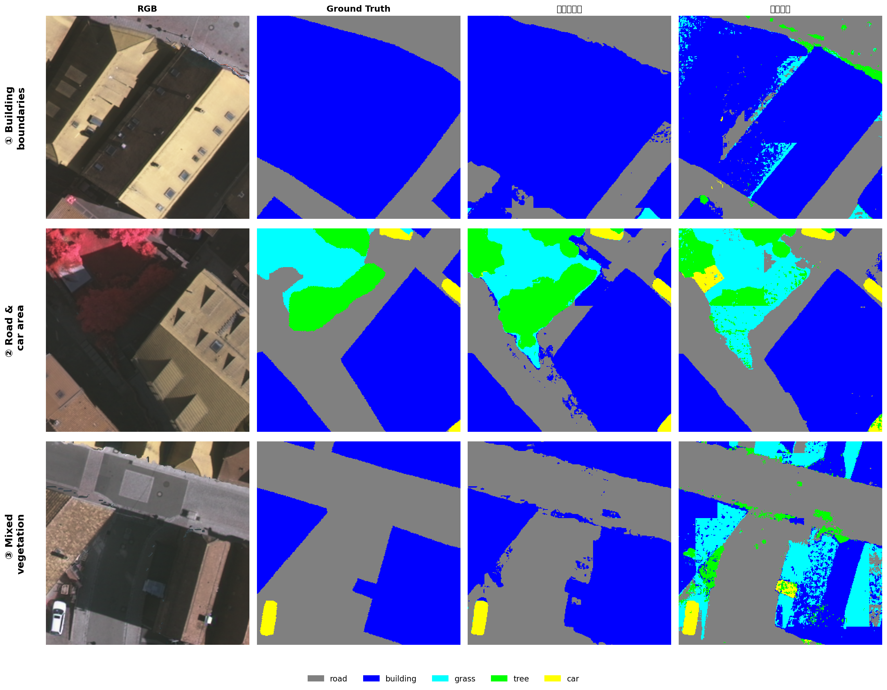

## 本周工作

这周主要跑了两条 SAM3 的实验，都在 256x256 滑动窗口协议下从零实现并评估
第一条是 SAM3 零样本基线。做法基本沿用 SegEarth-OV-3 的 dual-head 融合：对每个 256x256 窗口先跑 set_image，然后对五个类别逐个过，每个类把实例头的 mask logits 和语义头的 semantic logits 取 max，再乘上 presence score。所有窗口通过 overlap 平均拼成整张图的预测，最后 argmax 一把得到多类分割结果

第二条是逐类二值推理，每个类别单独做二分类，实例头的 mask 直接 OR，语义头 sigmoid 后用 top-K% 阈值做硬二值化，两个结果合并得到该类二值 mask。K 值在四张校准 tile 上逐类扫，从 3% 到 50%，挑 IoU 最大的那个。最后在测试集上同时报了二值指标和多类argmax 指标

## 实验结果

### 零样本基线

零样本基线在 Vaihingen 四张测试 tile 上拿了 OA=77.84%，mIoU=60.46%。

分类别看：
- building 最强，IoU 71.6%，SAM3 对建筑结构天生就认得准
- road 和 tree 还可以，分别是 64.3% 和 67.8%
- grass只有 37.9%，基本分不清草地和树,遥感图里低矮植被的纹理跟树太像，SAM3 在自然图像上学的那套特征搞不定
- car 有 60.8%，比预期好不少。小物体在 256x256 窗口里反而被放得够大，能看清楚

### 逐类二值路线

这条路线的多类 mIoU 是 49.76%，比零样本基线差了 10.7 个点。逐类二值指标不太行，road binary IoU 才 45.7%，car 只有 28.0%

- road 最优 K=40%，说明 SAM3 对 road 的语义头激活特别窄，得把阈值放得很松才能盖住整条路
- building K=10%，语义头对建筑激活又准又集中
- car K=3%，语义头对车基本不激活，全靠实例头撑场面

唯一一个比零样本好的地方是 building 的多类 IoU：75.7% vs 71.6%。building 的实例 mask 质量确实高，硬二值化的 OR 恰好把清晰边界保留下来了。但其他四个类全面落后，最惨的是 grass，只有 23.7%, 硬阈值策略下每个类各自为战，低置信度的 grass 像素直接变背景了

这条路线的核心问题是：硬二值化做得太早了。在每个窗口里就把连续概率拍成 0 或 1，信息一丢就回不来了。零样本基线的 max + presence score 全程浮点，argmax 到最后才离散化。这 10.7 个点的差距，就是信息保持策略的区别

### 数据一览

| 方法 | OA | mIoU | road | building | grass | tree | car |
|------|-----|------|------|----------|-------|------|-----|
| 零样本基线 | 77.84% | 60.46% | 64.3 | 71.6 | 37.9 | 67.8 | 60.8 |
| 逐类二值 | 68.19% | 49.76% | 53.7 | 75.7 | 23.7 | 48.3 | 47.4 |

除了 building 之外，零样本基线全面碾压逐类二值。grass 差距最大，差了 14.2 个点

## 可视化对比

### 全图

零样本基线的预测偏保守但覆盖面还行，road 和 building 大方向是对的，边界有点模糊和断裂。grass 大量被当成 tree，整张图的植被区基本一片绿

逐类二值的 building 几乎完美, 但代价是 road 网络完全碎了，grass 大面积消失，整张图看起来只剩建筑了。这是硬阈值欠召回的直接视觉证据

### 细节放大

三个放大区分别看了建筑边界、道路交叉口+车、混合植被。

区域1 建筑边界：零样本的建筑边缘锯齿感明显，建筑之间的小路缝没识别出来。逐类二值的 building 分割很干净，但旁边的路全丢了

区域2 道路交叉口+小汽车：零样本识别了主路但交叉口处标了些假建筑。逐类二值只剩建筑，路几乎消失

区域3 草地+树木混合：零样本把大片草地错分成树，看着像一整片树冠。逐类二值几乎检不到草地，树木覆盖也不完整。两条路线在植被区分上都挺吃力的，但零样本至少保留了完整覆盖

## 个人思路

这两条基线跑完，对 SAM3 在遥感场景下的表现有了几个基本判断：

1. 零样本 SAM3 对建筑和道路感知能力还不错，但对植被纹理不行。grass 37.9% 的 IoU 说明自然图像预训练学到的特征对"草 vs 树"这个遥感特有问题几乎无迁移价值。这也是后面微调实验的出发点：不是从零训一个语义分割器，而是教会一个已经能看见东西的模型理解遥感里的视觉概念

2. 逐类二值路线 10.7pp 的代价验证了,对这种概率模型来说，保留信息比早早做决策重要。在窗口内二值化丢了太多软信息。不过 building 的例外也说明这个结论不是绝对的,当某类的实例 mask 质量够高时，硬二值化可以是一个有效的后处理

3. 下一步打算用 SAM3 预训练权重做微调。零样本 60.46% 说明 backbone 的感知底子是有的，如果能用少量可训练参数把领域知识注入进去，mIoU可以还有提升
