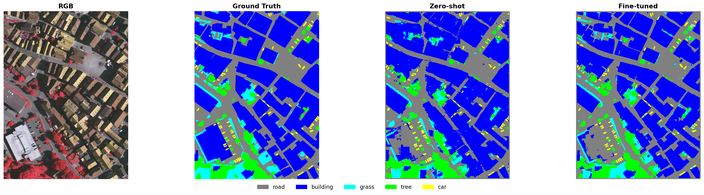
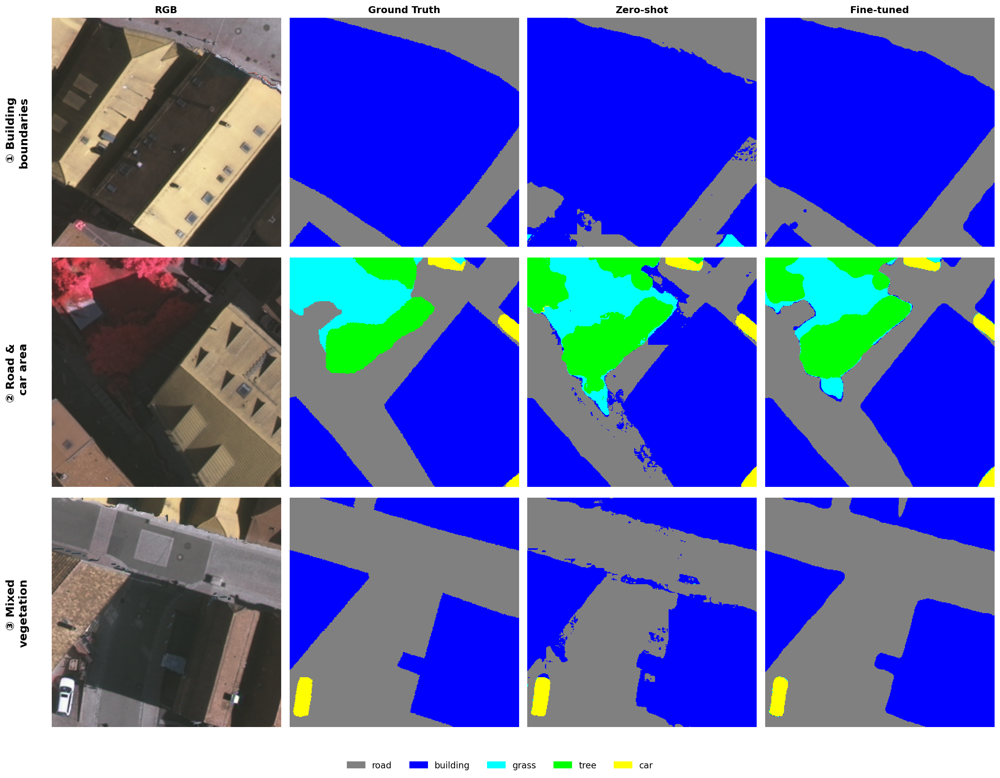

## 本周工作

这周从零样本基线出发，开始做微调训练。冻结住 SAM3 的主干网络不动，只加少量可训练参数提升训练效果

具体做法是冻结主干网络，外面加两个小的可训练组件。一个是适配层，对网络内部特征做压缩再展开的变换，总共 450 万参数，不到整个网络的 0.5%，主干网络本身完全不更新。另一个是解码器，借用了 MFNet 的设计，在四个分辨率上把图像特征和高程特征逐层融合后输出分割结果

训练用 Vaihingen 的 12 张图切 256x256 小块，每个 batch 从各张图均匀采样。损失函数是加权交叉熵加加权交并比，AdamW 优化器，学习率 1e-4，余弦衰减跑 20 轮

## 实验结果

微调后在 Vaihingen 测试集上拿到 OA=86.45%，mIoU=73.10%，比零样本基线的 60.46% 高了 12.6 个百分点。

| 方法 | OA | mIoU | road | building | grass | tree | car |
|------|-----|------|------|----------|-------|------|-----|
| 零样本基线 | 77.84% | 60.46% | 64.3 | 71.6 | 37.9 | 67.8 | 60.8 |
| 微调模型 | 86.45% | 73.10% | 74.6 | 85.8 | 60.2 | 76.0 | 68.9 |
| MFNet Frozen SAM1 | 88.01% | 75.11% | — | — | — | — | — |

分类别看：

- 草地从 37.9% 涨到 60.2%，提了 22.3 个点，涨最猛。高程信息帮了大忙，草地和树在图上纹理太像，纯靠颜色基本分不清，但高度差能搞定
- 建筑从 71.6% 涨到 85.8%，底子本来就最好，适配层对边界定位也帮了一把
- 道路从 64.3% 涨到 74.6%，适配层学的特征偏移对线状结构的连续性有效果
- 车辆只从 60.8% 微涨到 68.9%，五类最差。训练数据里车只占 1.1%，样本太少

和 MFNet Frozen SAM1 差了 2.0 个点 mIoU。两套方案路子一样，都是冻结主干网只训解码器，区别是 MFNet 用 SAM1 ViT-H，我们用 SAM3 ViTDet。这 2 个点就是主干网络架构差异的代价。SAM3 的主干网为检测任务设计的，做语义分割时特征尺度适配不如 SAM1 老架构来得自然。

DSM 的对比也做了。加了高程后 mIoU 从纯 RGB 的 68.7% 提到 73.1%，多了 4.4 个点。建筑边界更干净，草和树分得更开。建筑比地面高，树比草高，高程给了图像拿不到的立体线索。

## 可视化对比

零样本覆盖范围还行，但草地几乎全域错分成树，道路边界糊，建筑形状不规整。微调后草地区域从绿色海洋里分出来了，道路网变连续了，建筑轮廓规整不少。但树丛边缘还是容易过度扩散，部分小建筑被融进了周围地面。

第一块是建筑边界。零样本的建筑边缘锯齿明显，楼间细缝道路完全缺失。微调后轮廓规整，边界平滑很多。

第二块是道路交叉口。零样本认出了主干道，但交叉口处多冒了一个假建筑。微调后道路连贯，交叉口没断裂，高程信息在这里发挥了作用

第三块是草树交错的植被区。零样本几乎全是树。微调后草和树能分开了，但树木还是容易往草里过度扩散。草地 IoU 从 37.9% 涨到 60.2%，进步很大，但还是有将近 40% 的草地像素被错分，这是后面要针对的.

## 个人思路

这周验证了一个挺重要的判断：冻结主干网加少量可训练参数，能拿到 70% 以上的 mIoU，不需要动主干网本身。450 万参数换 12.6 个点的提升，说明 SAM3 的特征空间里已经存了足够丰富的信息，缺的只是把领域知识引进去的适配

但 73.10% 也暴露了这条路的天花板。所有改进都在主干网外面，适配层只能扰动特征表达，动不了网络内部的计算方式。SAM3 在自然图像上学到的那些空间关系，比如"车总是在路上"，在遥感俯瞰视角下可能完全不对，但冻结了主干网就没法修正这些内部假设.

和 MFNet Frozen 的 2 个点差距是主干网络决定的，纯冻结路线补不回来。下一步打算把高程信息直接灌进网络内部参与计算.
