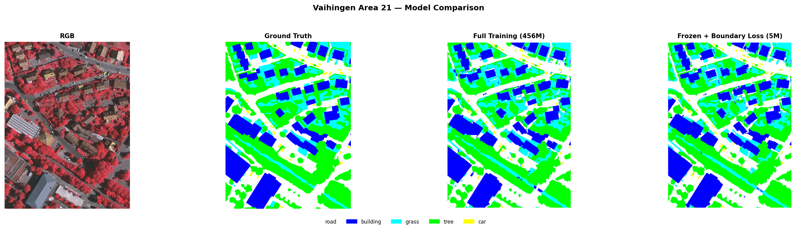
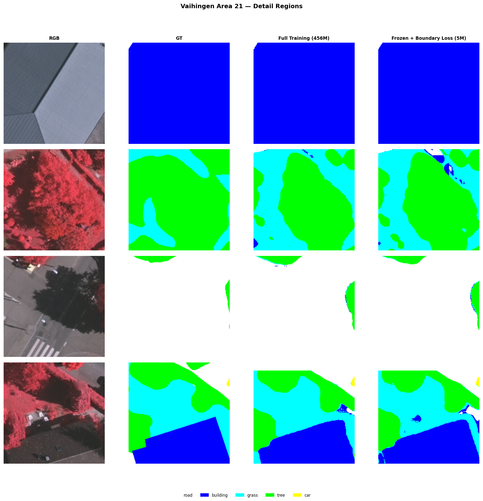
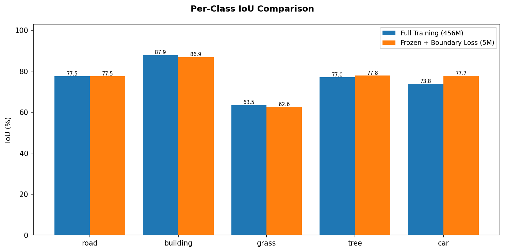

## 本周工作

这两周试了两条路线，都走不通。

上期冻结主干拿到了 73.10%，用的只有 450 万参数的适配层。那既然加这么少参数就能做到这个数，把主干也放开训一把，应该能更好吧？带着这个想法，做了逐步解冻主干的实验，从 8 层到 16 层到全放开，看参数量涨上去效果跟不跟。结果全翻了。

同一条时间线上还试了边界辅助损失：给冻结方案加个专门盯着边界的损失项。分割模型在物体边界容易糊，加边界监督理论上能帮忙。但实际跑下来也只是原地踏步。

两条路都不是说没跑到最好就放弃了——是真真切切跑了好几组对比，确实不行。

## 实验结果

### 解冻主干网络

三期实验，解冻层数逐步加大：

| 实验 | 可训参数 | OA | mIoU | 备注 |
|------|----------|-----|------|------|
| 冻结基线 | 5M | 86.45% | 73.10% | 上期结果 |
| 解冻最后 8 层 | 116M | 86.39% | 72.48% | 第 2 轮就过拟合 |
| 解冻最后 16 层 | 227M | 86.02% | 72.58% | 比 8 层还差 |
| 全量 32 层 | 456M | 86.37% | 72.87% | 换 SGD 也没救 |

第一组解了最后 8 层，参数从 5M 跳到 116M，涨了二十多倍。结果 mIoU 从 73.10% 跌到 72.48%，第二个 epoch 验证指标就到顶了，后面全是过拟合。训练集嗷嗷涨，验证集纹丝不动。

第二组解了 16 层，227M 参数，跑出来 72.58%，更差。多解冻一半层数，效果反而倒退了。

第三组干脆全放开，456M 参数全量训练。怕是不是优化器的问题，AdamW 对大规模参数不够友好，换成了 SGD 加动量加 warmup，跑出来 72.87%。有回升，但依然没超过冻结基线。

456M 参数 vs 5M 参数，mIoU 反而从 73.10% 掉到了 72.87%。多了 90 倍的参数量，效果还亏了 0.23 个点。

不是参数不够多，是数据不够多。Vaihingen 就 12 张训练图，切成小块也就那么些样本。SAM3 的预训练特征在这个量级的数据面前是唯一的护城河，一洗就没了。

### 边界辅助损失

问题出发点是冻结方案的结果里，建筑和道路的边缘模糊，草和树的过渡带混淆严重。想着在损失函数里加一个边界项，让模型在物体边缘多下点功夫。

最好跑出来 OA=86.34%，mIoU=73.36%。

跟冻结基线的 73.10% 比，涨了 0.26 个点。基本等于没涨。

| 方法 | OA | mIoU |
|------|-----|------|
| 冻结基线 | 86.45% | 73.10% |
| 加边界损失 | 86.34% | 73.36% |

差距在误差范围内。边界损失确实在边缘上有一些局部改善，但反映到整体 mIoU 上微乎其微。主干被冻住以后，损失函数再怎么设计，能推动的就那层皮——适配层和解码器。边界信息的流动到不了网络内部，辅助损失再精细，作用空间极其有限。

## 推理图对比

从左到右是原图、真实标注、全量训练结果、加边界损失结果。全量训练虽然参数多了 90 倍，但大尺度上的分类和冻结基线差别不大。两类结果在道路连续性和建筑轮廓上都还行，但树丛边缘都有过度扩散的通病。全量训练在细节处的错误模式跟冻结方案很接近，说明主干网络过拟合不是被某个损失函数修正了，而是整体在训练集上学到了虚假关联。

四组细节分别看建筑边界、草树混合植被、道路交叉口、多类别混合区域。

第一块是建筑边界。全量训练的建筑边缘比冻结方案略锐利，但也更碎——一些小型建筑被切成了几块。边界损失的建筑轮廓反而更规整，说明边界监督确实在局部起了作用。

第二块是草树交错的植被区。两者表现几乎没区别。草和树在纹理上的混淆用边界损失解决不了——这不是边界模糊的问题，是特征空间里两种类别就分不开。

第三块是道路交叉口。全量训练的道路更连续，但在道路和树的交界处多了一些树斑。边界损失的预测比较保守，道路宽度比 GT 略窄。

第四块是多类别混合区域。五个类别都出现了，是语义分割最头疼的场景。两者都把部分树错分成草、把部分草错分成树。边界损失在这个区域的改善肉眼几乎不可见。

逐类 IoU 柱状图更直观。两类方法在五个类别上的得分几乎重合，建筑和草地的差距在 1 个点以内，道路和车的得分一模一样。边界损失的全部贡献都淹没在了 0.2-0.3 个点的波动范围里。

## 个人思路

这两周等于白干了，两条路都没走出来。但也不是完全没有价值——至少把路子排掉了。

解冻主干的教训很结实：不能动主干网络。在 ISPRS 这种小数据集上，SAM3 的预训练知识是唯一的护城河，参数越多反而越容易过拟合。456M 参数跑不过 5M 参数，这个对比太直观了，不用再纠结"是不是再调调学习率就好了"或者"是不是解冻比例不够好"。这条路没必要再碰。

边界辅助损失给了另一个教训：辅助损失加在冻结主干外面，效果约等于零。不是边界信息本身没用，是信息流不通。主干网络完全不动，适配层能做的只是把已有特征掰一掰，掰不到边界的细粒度信号。如果未来要重新试边界优化，前提一定是主干网络内部有通道能让边界信号传进去——纯粹在解码器出口加个损失项，之前试过了，没戏。

回头看上期的判断是对的：冻结主干加轻量适配，能在 ISPRS 上拿到 70% 以上的 mIoU。动主干网或者在外面加花哨的损失函数，都不如老老实实把适配层做好。

下一个方向基本明确了：不动主干网络，但让高程信息直接进入网络内部参与特征计算，而不是只在外面当做另一个输入拼起来。如果能在每个中间层让高程和图像充分交互，应该能补上冻结方案的短板——尤其是植被区草地和树的混淆，以及建筑边界的精细度。这两块是目前 73% 天花板的主要损耗。
